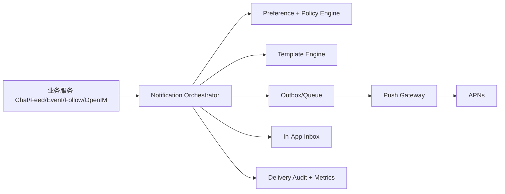

# Raver 统一 APNs Push Service 落地实施方案（总体 + 详细）

> 文档目标：在现有 `notification-center` 基础上，落地一套可商用、可扩展、可交接的统一通知能力层（Push Service）。
>
> 适用范围：iOS APNs、站内通知（in_app）、OpenIM 事件桥接、聊天/社区/订阅类提醒。
>
> 最后更新：2026-04-23（Asia/Kuala_Lumpur）

---

## 1. 背景与结论

### 1.1 背景

Raver 当前代码库已经具备统一通知中心雏形，包含：

- 统一发布与治理：`server/src/services/notification-center/notification-center.service.ts`
- APNs 发送通道：`server/src/services/notification-center/notification-apns.handler.ts`
- 设备 token 注册接口：`/v1/notification-center/push-tokens`
- 聊天/社区事件接入：
  - `server/src/routes/bff.routes.ts`
  - `server/src/routes/openim.routes.ts`
- iOS APNs token 上报链路：
  - `mobile/ios/RaverMVP/RaverMVP/RaverMVPApp.swift`
  - `mobile/ios/RaverMVP/RaverMVP/Core/AppState.swift`
  - `mobile/ios/RaverMVP/RaverMVP/Core/LiveSocialService.swift`

### 1.2 结论

采用“统一通知能力层 / Push Service”方案，不允许各业务模块直连 APNs。业务模块仅产出通知事件，由通知中心统一完成：

- 用户偏好判断
- 设备 token 路由
- 去重、频控、免打扰
- Payload 组装
- APNs 发送与失败重试
- 投递审计与监控

---

## 2. 当前能力盘点（基线）

### 2.1 已具备能力（可直接复用）

1. 统一事件模型和发布入口
- `notificationCenterService.publish()` 已支持 category/channels/targets/payload/dedupe。

2. 通知治理能力
- 管理配置：类别开关、渠道开关、灰度、频控、quiet hours。
- 模板能力：`notification_templates` 与 admin 接口。

3. 数据层基础
- `device_push_tokens`
- `notification_events`
- `notification_inbox`
- `notification_deliveries`
- `notification_subscriptions`
- `notification_admin_configs`

4. APNs 基础能力
- Token-based auth（JWT ES256）
- HTTP/2 发送
- APNs 错误原因解析
- 无效 token 失活（BadDeviceToken / Unregistered / DeviceTokenNotForTopic）

5. 业务事件接入
- 社区互动：点赞、评论、关注、小队邀请。
- 聊天消息：BFF 直接消息、小队群消息、OpenIM webhook 桥接。

### 2.2 当前关键缺口（必须补齐）

1. 设备平台标识不一致（P0）
- iOS 上报 `platform = "ios_apns"`。
- APNs 查询条件目前只匹配 `ios/apns`。
- 风险：token 入库但 APNs 通道筛不出来，导致“看似成功上报，实际不投递”。

2. 登出后 token 失活未闭环（P0）
- 客户端存在 `deactivateDevicePushToken()`，但当前登出链路未调用。
- 风险：同设备切换账号后出现串推。

3. 通知读模型双轨并存（P1）
- `/v1/notifications`（旧聚合模型）与 `/v1/notification-center/inbox`（新中心）并存。
- 风险：前台体验与通知中心治理口径不一致，扩展成本上升。

4. APNs 仍为请求内同步投递（P1）
- 当前 `publish -> deliver` 同步执行。
- 风险：高并发时业务请求延迟放大，缺乏标准 outbox/worker 重试流水。

5. iOS 推送能力工程项待确认（P1）
- `project.yml` 中未显式看到 push entitlements 文件配置。
- 需要以 Xcode target capability 实际状态为准做联调核验。

---

## 3. 目标架构（落地后）

### 3.1 分层职责

1. 业务层
- 仅发送“通知事件”，不拼 APNs payload，不直接发 APNs。

2. Notification Orchestrator
- 统一策略决策：是否发、发给谁、走哪些渠道、是否合并。

3. Push Gateway
- 统一 APNs 通道管理：连接、鉴权、发送、错误处理、重试。

4. 观测与运营层
- 投递日志、失败告警、模板管理、灰度发布。

---

## 4. 分阶段实施计划（可执行）

## 4.1 Phase 0：打通与纠偏（优先级 P0）

目标：先确保“能稳发、不错发、不串推”。

### 任务清单

1. 统一 platform 标识
- 服务端 `registerDevicePushToken` 入库规范化：`ios_apns`/`apns`/`ios` -> `ios`。
- APNs 查询条件兼容历史值。
- 数据迁移脚本修正历史记录。

2. 补齐 token 失活闭环
- iOS `logout()` 调用 `/v1/notification-center/push-tokens` DELETE。
- 服务端审计失活动作。

3. APNs 联调最小闭环
- 使用 admin publish-test 对单用户发 `in_app + apns`。
- 通过投递明细接口核验 token 级和 user 级结果。

### 验收标准

- 同一 iOS 账号可稳定收到 APNs。
- 同设备切账号后，不再收到旧账号推送。
- APNs 失败原因可在后台直接定位（配置问题、token 问题、网关问题）。

---

## 4.2 Phase 1：统一通知读写面（优先级 P1）

目标：前台体验统一到 notification-center。

### 任务清单

1. BFF 兼容层收口
- 将 `/v1/notifications*` 逐步转到 notification-center inbox。
- 保持客户端响应结构兼容，先不强制大改 UI。

2. iOS 读取口径统一
- `fetchNotifications`、`fetchNotificationUnreadCount` 对齐 notification-center。
- 已读动作统一走 inbox read 接口。

3. 未读聚合一致化
- Message Tab badge = OpenIM unread + notification-center unread。

### 验收标准

- 通知列表来源唯一。
- 已读、未读数、badge 三者一致。
- 旧接口可灰度下线，有清晰回退开关。

---

## 4.3 Phase 2：Push Gateway 商用化（优先级 P1）

目标：把 APNs 从请求链路解耦，增强稳定性。

### 任务清单

1. Outbox + Worker
- 新增 `notification_jobs`（或复用 `notification_events` 增加派发状态机）。
- publish 仅负责落库与入队。
- worker 异步发 APNs。

2. 重试策略
- 可恢复错误：指数退避 + 最大重试次数。
- 不可恢复错误：直接失败并标记原因。

3. 连接管理
- APNs client 连接池/复用，避免每条消息新建连接。

### 验收标准

- 高并发下业务接口 P95 不因 APNs 放大。
- 重试可追踪、可观测、可停止。
- 无效 token 自动收敛。

---

## 4.4 Phase 3：策略与编排增强（优先级 P2）

目标：减少骚扰，提高触达质量。

### 任务清单

1. 用户偏好扩展
- 分类开关、免打扰、时段策略、会话静音映射。

2. 模板全面化
- 各 category/channel 使用模板渲染。
- 变量白名单校验，避免模板污染。

3. 聚合与折叠
- 同类型高频事件窗口聚合。
- 去重键规范化（跨服务一致）。

### 验收标准

- 同用户短时高频事件不轰炸。
- 模板可在后台调整并可回滚。
- 关键策略命中可解释（日志可追）。

---

## 4.5 Phase 4：运营与可观测（优先级 P2）

目标：可运营、可告警、可值守。

### 任务清单

1. 核心指标
- Delivery success/fail rate
- Retry success rate
- Invalid token rate
- Inbox open rate

2. 告警规则
- APNs 失败率突增
- 队列积压
- 重试超阈值

3. 运行手册
- APNs 凭证轮换
- 灰度发布
- 紧急回滚

### 验收标准

- 故障 10 分钟内可定位分层。
- 值班同学可按 runbook 完成处置。

---

## 5. 数据与接口落地清单

### 5.1 数据模型建议（在现有表基础上演进）

1. `device_push_tokens`
- 增补建议：`timezone`、`push_permission_state`、`environment(sandbox/prod)`、`last_error_reason`。

2. `notification_events`
- 明确状态机：`queued -> dispatching -> sent/partial_failed/failed`。

3. `notification_deliveries`
- 记录渠道级与用户级结果，必要时补 token 级子表（可选）。

4. 可选新增 `notification_jobs`
- 专门承载异步 outbox 任务。

### 5.2 接口策略

1. 保留并强化
- `/v1/notification-center/push-tokens`（POST/DELETE）
- `/v1/notification-center/inbox*`
- `/v1/notification-center/admin/*`

2. 平滑迁移
- `/v1/notifications*` 先兼容映射，再逐步收口到 notification-center。

---

## 6. 测试与验收方案

### 6.1 联调环境

1. 配置 APNs 关键变量
- `NOTIFICATION_APNS_ENABLED=true`
- `NOTIFICATION_APNS_KEY_ID`
- `NOTIFICATION_APNS_TEAM_ID`
- `NOTIFICATION_APNS_BUNDLE_ID`
- `NOTIFICATION_APNS_PRIVATE_KEY_*`
- `NOTIFICATION_APNS_USE_SANDBOX=true/false`（按包与环境匹配）

2. 客户端准备
- 登录态上报 token。
- 确认推送权限已授权。

### 6.2 验证用例

1. 正常触达
- follow/like/comment/chat 各触发一次，校验 inbox 与 APNs 都到达。

2. 去重
- 相同 dedupeKey 重复 publish，校验第二次跳过。

3. 频控与免打扰
- 命中策略时 APNs 被抑制，但 in_app 保持策略内可控。

4. token 失效
- 模拟无效 token，校验自动失活。

5. 断路与重试
- 模拟 APNs 网关失败，校验 worker 重试和最终状态。

---

## 7. 风险与回滚

### 7.1 主要风险

1. APNs 配置与包标识不一致（topic/environment mismatch）。
2. 旧通知接口迁移时前端字段兼容问题。
3. 同步投递转异步后，业务方对“即时性”预期差异。

### 7.2 回滚策略

1. 渠道开关快速关闭 APNs（保留 in_app）。
2. BFF 保持旧响应结构 fallback。
3. Worker 可暂停，事件保留在队列待恢复。

---

## 8. 交接说明（确保任何人可接手）

### 8.1 接手必读顺序

1. 本文档：`docs/APNS_UNIFIED_PUSH_SERVICE_IMPLEMENTATION_PLAN.md`
2. 进度文档：`docs/APNS_UNIFIED_PUSH_SERVICE_PROGRESS_TRACKER.md`
3. APNs 真机实操手册：`docs/APNS_REAL_DEVICE_SETUP_AND_E2E_RUNBOOK.md`
4. 基础方案历史：`docs/NOTIFICATION_SYSTEM_V1_PLAN.md`
5. 关键代码入口：
- `server/src/services/notification-center/*`
- `server/src/routes/notification-center.routes.ts`
- `server/src/routes/bff.routes.ts`
- `server/src/routes/openim.routes.ts`
- `mobile/ios/RaverMVP/RaverMVP/Core/AppState.swift`

### 8.2 每次推进后必须更新

1. 更新进度 tracker 的状态与日志。
2. 写明“改了什么、为何改、如何验证、剩余风险”。
3. 记录下一步可直接执行的 TODO（避免接手阻塞）。

---

## 9. 当前建议的立即动作（Next 3）

1. 启动 Phase 1：实现 `/v1/notifications*` 到 `notification-center` 的兼容映射。
2. 完成 iOS 通知列表/未读/已读链路的统一口径联调与回归。
3. 设计 Phase 2 的 outbox + worker 最小骨架（含重试状态机）。
