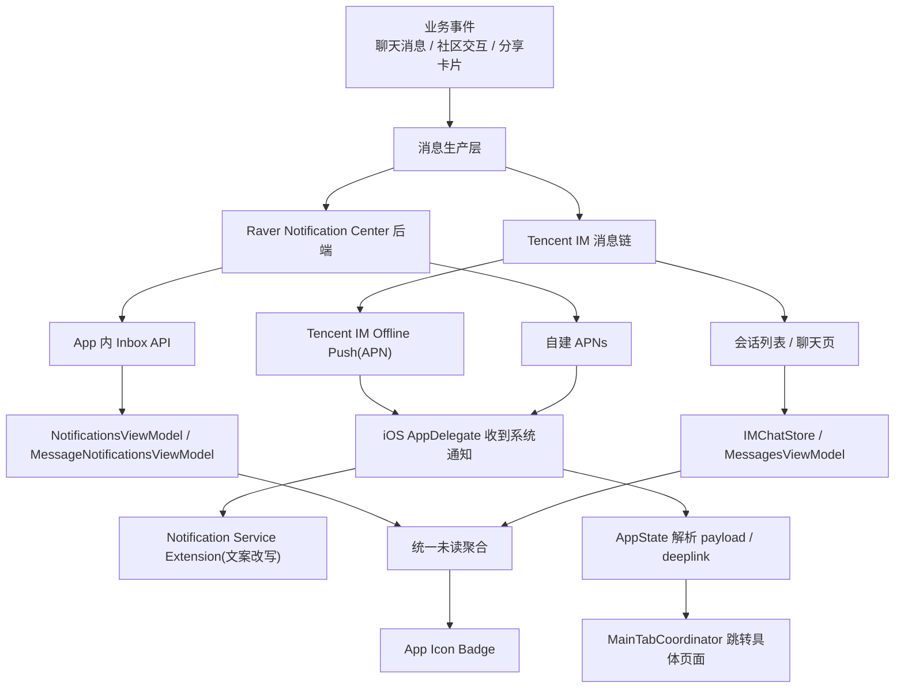

# iOS 通知中心全生命周期维护手册

> 适用工程：`/Users/blackie/Projects/raver`
>
> 适用端：iOS / `RaverMVP`
>
> 文档目标：
> - 把当前工程里“通知中心”相关能力收敛成一份长期维护文档
> - 明确区分 App 内通知、聊天未读/会话提醒、APN 系统推送、角标、通知点击跳转
> - 说明每类通知的完整生命周期、当前代码入口、数据源、状态变化与已知边界
>
> 关联文档：
> - [Raver 通知系统 V1（独立模块）](/Users/blackie/Projects/raver/docs/NOTIFICATION_SYSTEM_V1_PLAN.md)
> - [APNs 真机配置与端到端验证手册（Raver）](/Users/blackie/Projects/raver/docs/APNS_REAL_DEVICE_SETUP_AND_E2E_RUNBOOK.md)
> - [Raver 聊天 APN / 离线推送实施方案（Tencent IM First）](/Users/blackie/Projects/raver/docs/TENCENT_IM_APNS_IMPLEMENTATION_PLAN.md)

## 1. 结论先行

当前 iOS 工程里的“通知中心”不是单一模块，而是 4 个可维护的通知模块。后续如果要新增通知，建议先判断它应该进入哪一个模块，再补它的生命周期规则。

| 模块 | 作用 | 当前来源 | 典型通知 | 主要展示位置 | 当前统一收口 |
| --- | --- | --- | --- | --- | --- |
| `App 内通知 Inbox` | 承接站内通知列表与已读状态 | `notification-center` 后端接口 | 关注、点赞、评论、小队邀请 | 通知中心页、消息页通知分类页 | `NotificationsViewModel` / `MessageNotificationsViewModel` |
| `聊天会话提醒` | 承接聊天未读、会话预览、`@` 提醒 | Tencent IM / 兼容会话链 | 私聊未读、群未读、`@你`、`@所有人` | 会话列表、聊天页 | `IMChatStore` |
| `APN 系统推送` | 承接后台/锁屏通知展示与点击唤起 | Tencent IM Offline Push、自建 APNs | 聊天消息、Event card 分享、DJ card 分享、社区推送 | iOS 系统通知横幅、锁屏通知中心 | `AppDelegate + AppState + NotificationService` |
| `统一 Badge` | 承接 App 图标角标 | 聊天未读 + 社区未读聚合 | 总未读数 | App 图标 | `AppState` |

这 4 个模块共同构成当前 iOS 的通知中心能力。

## 2. 当前架构总览



## 3. 源码地图

### 3.1 推送注册 / APN 入口

- `/Users/blackie/Projects/raver/mobile/ios/RaverMVP/RaverMVP/RaverMVPApp.swift`
  - `didFinishLaunchingWithOptions`
  - `didRegisterForRemoteNotificationsWithDeviceToken`
  - `userNotificationCenter(_:willPresent:...)`
  - `userNotificationCenter(_:didReceive:...)`
  - `configureRemoteNotifications(_:)`

### 3.2 全局通知中心收口

- `/Users/blackie/Projects/raver/mobile/ios/RaverMVP/RaverMVP/Core/AppState.swift`
  - APN token 上报时机
  - Tencent IM APNs 配置
  - 统一未读聚合
  - 系统通知 payload 解析
  - deeplink 生成与派发

### 3.3 App 内通知 Inbox

- `/Users/blackie/Projects/raver/mobile/ios/RaverMVP/RaverMVP/Core/LiveSocialService.swift`
- `/Users/blackie/Projects/raver/mobile/ios/RaverMVP/RaverMVP/Features/Notifications/NotificationsViewModel.swift`
- `/Users/blackie/Projects/raver/mobile/ios/RaverMVP/RaverMVP/Features/Messages/MessageNotificationsViewModel.swift`

### 3.4 聊天未读 / 会话提醒

- `/Users/blackie/Projects/raver/mobile/ios/RaverMVP/RaverMVP/Core/IMChatStore.swift`
- `/Users/blackie/Projects/raver/mobile/ios/RaverMVP/RaverMVP/Features/Messages/MessagesViewModel.swift`
- `/Users/blackie/Projects/raver/mobile/ios/RaverMVP/RaverMVP/Core/Models.swift`

### 3.5 系统通知点击跳转

- `/Users/blackie/Projects/raver/mobile/ios/RaverMVP/RaverMVP/Core/AppState.swift`
- `/Users/blackie/Projects/raver/mobile/ios/RaverMVP/RaverMVP/Application/Coordinator/MainTabCoordinator.swift`

### 3.6 Notification Service Extension

- `/Users/blackie/Projects/raver/mobile/ios/RaverMVP/RaverNotificationService/NotificationService.swift`

## 4. 通知类型清单

这一节建议作为后续维护的“总表入口”。以后加新通知，优先在这里补一行。

### 4.0 通知模块总表

| 模块 | 子类型 | 当前是否已实现 | 数据源 | 跳转目标 | 是否参与 Badge | 后续新增时先改哪里 |
| --- | --- | --- | --- | --- | --- | --- |
| App 内通知 Inbox | `follow` | 是 | backend inbox | 个人资料 / 关注关系页 | 是 | `AppNotificationType` + inbox UI + unread 聚合 |
| App 内通知 Inbox | `like` | 是 | backend inbox | 被点赞目标页 | 是 | 同上 |
| App 内通知 Inbox | `comment` | 是 | backend inbox | 帖子详情 / 评论定位 | 是 | 同上 |
| App 内通知 Inbox | `squadInvite` | 是 | backend inbox | 小队页 / 邀请处理页 | 是 | 同上 |
| 聊天会话提醒 | 私聊未读 | 是 | Tencent IM | 私聊会话页 | 是 | `Conversation` / `IMChatStore` |
| 聊天会话提醒 | 群聊未读 | 是 | Tencent IM | 群会话页 | 是 | `Conversation` / `IMChatStore` |
| 聊天会话提醒 | `@你` | 是 | Tencent IM mention | 群会话页 | 是 | `GroupMentionAlertType` / 会话 preview |
| 聊天会话提醒 | `@所有人` | 是 | Tencent IM mention | 群会话页 | 是 | 同上 |
| APN 系统推送 | 聊天文本消息 | 是 | Tencent IM Offline Push | 对应会话 | 间接参与 | `offlinePushInfo` + deeplink 解析 |
| APN 系统推送 | Event card 分享 | 是 | Tencent IM Offline Push | 对应会话 | 间接参与 | `buildCardOfflinePushInfo` |
| APN 系统推送 | DJ card 分享 | 是 | Tencent IM Offline Push | 对应会话 | 间接参与 | `buildCardOfflinePushInfo` |
| APN 系统推送 | 社区/通知中心推送 | 部分具备基础 | 自建 APNs | 业务目标页 | 视类型而定 | backend payload + `readSystemDeeplink` |
| 统一 Badge | 聊天未读聚合 | 是 | Tencent IM unread | 无直接跳转 | 自身就是 Badge | `AppState.recomputeUnreadMessagesCount` |
| 统一 Badge | 社区未读聚合 | 是 | backend unread count | 无直接跳转 | 自身就是 Badge | 同上 |

### 4.1 App 内通知类型

定义于 `/Users/blackie/Projects/raver/mobile/ios/RaverMVP/RaverMVP/Core/Models.swift:767`

| 类型 | 当前状态 | 数据模型 | 拉取接口 | 已读接口 | 典型展示 | 备注 |
| --- | --- | --- | --- | --- | --- | --- |
| `follow` | 已实现 | `AppNotification` | `fetchNotifications(limit:)` | `markNotificationRead` / `markNotificationsRead` | 通知中心、消息通知分类页 | 参与 unread 聚合 |
| `like` | 已实现 | `AppNotification` | 同上 | 同上 | 同上 | 参与 unread 聚合 |
| `comment` | 已实现 | `AppNotification` | 同上 | 同上 | 同上 | 参与 unread 聚合 |
| `squadInvite` | 已实现 | `AppNotification` | 同上 | 同上 | 同上 | 参与 unread 聚合 |

对应基础模型：
- `AppNotificationType`
- `AppNotification`
- `NotificationInbox`
- `NotificationUnreadCount`

### 4.2 聊天提醒类型

定义于 `/Users/blackie/Projects/raver/mobile/ios/RaverMVP/RaverMVP/Core/Models.swift:294`

| 类型 | 当前状态 | 关键字段 | 展示位置 | 清理时机 | 备注 |
| --- | --- | --- | --- | --- | --- |
| 私聊未读 | 已实现 | `Conversation.unreadCount` | 会话列表、角标 | 打开会话 / 标记已读 | 无 mention 前缀 |
| 群聊未读 | 已实现 | `Conversation.unreadCount` | 会话列表、角标 | 打开会话 / 标记已读 | 可与 mention 共存 |
| `@你` | 已实现 | `Conversation.unreadMentionType = .atMe` | 会话 preview、APN 文案 | 打开会话时清除 | 正文仍保持 `@DisplayName` |
| `@所有人` | 已实现 | `Conversation.unreadMentionType = .atAll` | 会话 preview、APN 文案 | 打开会话时清除 | 与 `@你` 可叠加 |
| `@你 + @所有人` | 已实现 | `.atAllAndMe` | 会话 preview、APN 文案 | 打开会话时清除 | 用于极端情况兜底 |

当前会话提醒核心字段：
- `Conversation.unreadCount`
- `Conversation.unreadMentionType`
- `Conversation.previewText`

### 4.3 APN 类型

当前 iOS 实际承接的 APN，按数据源分两类：

| 数据源 | 子类型 | 当前状态 | 发送侧入口 | 点击后目标 | 文案是否会被 NSE 改写 | 备注 |
| --- | --- | --- | --- | --- | --- | --- |
| Tencent IM Offline Push | 聊天文本消息 | 已实现 | `buildTextOfflinePushInfo(...)` | 对应会话 | mention 时会 | 当前主链 |
| Tencent IM Offline Push | Event card 分享 | 已实现 | `buildCardOfflinePushInfo(...)` | 对应会话 | 否 | 共享聊天 push 路由 |
| Tencent IM Offline Push | DJ card 分享 | 已实现 | `buildCardOfflinePushInfo(...)` | 对应会话 | 否 | 共享聊天 push 路由 |
| Tencent IM Offline Push | 群 `@你` | 已实现 | 文本消息 push ext | 对应群会话 | 是 | `[@你]` 由 NSE 注入 |
| Tencent IM Offline Push | 群 `@所有人` | 已实现 | 文本消息 push ext | 对应群会话 | 是 | `[@所有人]` 由 NSE 注入 |
| 自建 APNs | 社区/通知中心推送 | 基础能力已具备 | backend notification-center | 业务目标页 | 视 payload 而定 | 后续统一化主战场 |
| 自建 APNs | 收藏 Event 更新推送（当前等同关注） | 规划中 | event favorite / marked-event backend pipeline | Event 详情页 / 对应更新分区 | 建议参与 | `event_update` 统一 payload 协议 |

## 5. 全局生命周期：从“产生”到“消失”

这一节只讲抽象模型，不分通知类型。后续新增通知时，推荐先在这一节的每个阶段补“该类型的特殊要求”，再回到上面的模块表里补一行。

### 5.0 生命周期扩展表

| 生命周期阶段 | 当前通用规则 | 新增通知时必须补充的内容 |
| --- | --- | --- |
| 产生 | 从业务事件开始 | 这个通知由什么事件触发 |
| 编排 | 转成通知载荷或消息元数据 | 需要哪些字段，是否需要 ext/deeplink |
| 投递 | 进入 Inbox / 会话提醒 / APN / Badge 之一或多个 | 需要走哪些通道 |
| 展示 | 在具体 UI 层展示 | 文案、样式、是否有特殊前缀 |
| 交互 | 用户点击/标已读/进入页面 | 点击后跳哪里，是否要标已读 |
| 消退 | 未读清零、状态清理、badge 重算 | 何时算“已消费” |

### 5.1 产生

通知先由业务事件产生：
- 聊天发送消息
- 社区点赞/评论/关注
- 小队邀请
- 分享 Event / DJ card

### 5.2 编排

系统会把原始业务事件转成“通知载荷”：
- 聊天链：Tencent IM message + offlinePushInfo
- 社区链：Raver backend notification-center inbox item

### 5.3 投递

通知会进入至少一个通道：
- App 内 Inbox
- 会话列表未读/提醒
- APN 系统推送
- Badge 角标

### 5.4 展示

不同展示层有不同规则：
- App 内 Inbox：按列表展示，可读/未读
- 会话列表：按最后一条消息 + mention 前缀展示
- APN：按系统通知横幅展示
- Badge：只保留总数，不保留具体通知内容

### 5.5 交互

用户可通过以下方式消费通知：
- 进入通知中心列表
- 打开聊天页
- 点击系统通知
- 手动标记已读

### 5.6 消退

通知最终会在某个层级被清理：
- Inbox `isRead = true`
- 会话 `unreadCount = 0`
- `unreadMentionType = .none`
- badge 总数重算归零或减少

## 6. App 内通知生命周期

### 6.0 模块信息表

| 维度 | 当前实现 |
| --- | --- |
| 模块定位 | 站内通知列表与已读管理 |
| 主数据源 | `notification-center` 后端 |
| 主模型 | `AppNotification` / `NotificationInbox` / `NotificationUnreadCount` |
| 主展示层 | `NotificationsViewModel`、`MessageNotificationsViewModel` |
| 是否参与 Badge | 是 |
| 点击后是否走 deeplink | 取决于具体业务目标 |

### 6.1 数据源

接口定义在 `/Users/blackie/Projects/raver/mobile/ios/RaverMVP/RaverMVP/Core/LiveSocialService.swift`

当前入口：
- `fetchNotifications(limit:)`
- `fetchNotificationUnreadCount()`
- `markNotificationRead(notificationID:)`
- `markNotificationsRead(type:)`

### 6.2 拉取流程

1. 视图模型发起请求
2. 后端返回：
- `NotificationInbox`
- `NotificationUnreadCount`
3. 视图模型更新本地 `@Published`
4. 通过 `NotificationCenter.default.post(name: .raverCommunityUnreadDidChange, ...)` 通知全局未读聚合层

### 6.3 展示层

两套主要消费端：

1. 通知中心主列表
- `/Users/blackie/Projects/raver/mobile/ios/RaverMVP/RaverMVP/Features/Notifications/NotificationsViewModel.swift`

2. 消息页里的通知分类列表
- `/Users/blackie/Projects/raver/mobile/ios/RaverMVP/RaverMVP/Features/Messages/MessageNotificationsViewModel.swift`

### 6.4 已读流程

单条已读：
1. 本地先乐观更新 `isRead`
2. 本地先减 unread
3. 调 `markNotificationRead(notificationID:)`
4. 失败则回滚

分类全部已读：
1. 本地批量改 `isRead`
2. 本地重算 `NotificationUnreadCount`
3. 调 `markNotificationsRead(type:)`
4. 失败则回滚

### 6.5 与 badge 的关系

App 内通知本身不直接改角标。

真正改 badge 的是：
- `NotificationsViewModel` / `MessageNotificationsViewModel`
  通过 `.raverCommunityUnreadDidChange`
- `AppState`
  接收后写入 `cachedCommunityUnread`
  再和聊天未读合并重算

## 7. 聊天未读 / 会话提醒生命周期

### 7.0 模块信息表

| 维度 | 当前实现 |
| --- | --- |
| 模块定位 | 会话列表未读、preview、mention 提醒 |
| 主数据源 | Tencent IM / 会话兼容链 |
| 主模型 | `Conversation`、`GroupMentionAlertType` |
| 主展示层 | `IMChatStore`、`MessagesViewModel` |
| 是否参与 Badge | 是 |
| 点击后是否走 deeplink | 是，通常落到会话页 |

### 7.1 数据源

主入口：
- `/Users/blackie/Projects/raver/mobile/ios/RaverMVP/RaverMVP/Core/IMChatStore.swift`
- `/Users/blackie/Projects/raver/mobile/ios/RaverMVP/RaverMVP/Features/Messages/MessagesViewModel.swift`

模型：
- `/Users/blackie/Projects/raver/mobile/ios/RaverMVP/RaverMVP/Core/Models.swift:294`

### 7.2 关键状态

会话提醒最关键的 3 个字段：
- `lastMessage`
- `unreadCount`
- `unreadMentionType`

最终会在 `previewText` 里组合成会话列表文案。

例如：
- 普通群消息：`发送者: 文本`
- `@你`：`[@你] 发送者: 文本`
- `@所有人`：`[@所有人] 发送者: 文本`

### 7.3 未读累加

聊天未读来源于 Tencent IM 实时 unread 回调和本地会话同步。

全局聚合入口在：
- `AppState.tencentIMSession.onUnreadCountChange`
- `AppState.refreshUnreadMessages()`

### 7.4 已读清理

打开会话或激活会话时，会清理：
- `Conversation.unreadCount`
- `Conversation.unreadMentionType`

对应位置：
- `/Users/blackie/Projects/raver/mobile/ios/RaverMVP/RaverMVP/Core/IMChatStore.swift`
  - `activateConversation(_:)`
  - active conversation zero unread 流程

### 7.5 与 App 内通知的边界

聊天未读不是 `AppNotification`。

它属于：
- IM 会话层
- 会话列表层
- APN 聊天推送层

而不是通知中心 Inbox 的 `follow / like / comment / squadInvite` 模型。

## 8. APN 生命周期

### 8.0 模块信息表

| 维度 | 当前实现 |
| --- | --- |
| 模块定位 | 后台/锁屏通知展示与唤起入口 |
| 主数据源 | Tencent IM Offline Push + 自建 APNs |
| 主接收入口 | `RaverMVPApp.swift` |
| 主路由入口 | `AppState.handleSystemNotificationPayload` |
| 是否参与 Badge | 间接参与 |
| 是否依赖 NSE | mention 特殊文案依赖 |

## 8.1 注册阶段

主入口：`/Users/blackie/Projects/raver/mobile/ios/RaverMVP/RaverMVP/RaverMVPApp.swift`

流程：
1. `configureRemoteNotifications(_:)`
2. 请求系统权限
3. `application.registerForRemoteNotifications()`
4. `didRegisterForRemoteNotificationsWithDeviceToken`
5. 发出 `.raverDidRegisterPushToken`

## 8.2 token 消费阶段

主入口：`/Users/blackie/Projects/raver/mobile/ios/RaverMVP/RaverMVP/Core/AppState.swift`

流程：
1. `AppState` 监听 `.raverDidRegisterPushToken`
2. 保存 `latestPushToken`
3. 调 `tencentIMSession.updateAPNSToken(hexToken:)`
4. 如果已登录，再调 `uploadPushTokenIfPossible()`

`uploadPushTokenIfPossible()` 最终会调用：
- `registerDevicePushToken(...)`

登出时会调：
- `deactivateDevicePushToken(deviceID:platform:)`

## 8.3 Tencent IM APNs 配置阶段

主入口：
- `/Users/blackie/Projects/raver/mobile/ios/RaverMVP/RaverMVP/Core/AppState.swift:806`
- `/Users/blackie/Projects/raver/mobile/ios/RaverMVP/RaverMVP/Core/AppState.swift:2260`

配置依赖：
- `/Users/blackie/Projects/raver/mobile/ios/RaverMVP/RaverMVP/Core/AppConfig.swift`
- `/Users/blackie/Projects/raver/mobile/ios/RaverMVP/RaverMVP/Info.plist`
  - `TencentIMAPNSBusinessID`

如果 `businessID <= 0`，Tencent IM 官方离线推送无法真正配置成功。

## 8.4 发送阶段

### 聊天文本消息

发送侧会为群/会话消息构造：
- `offlinePushInfo.title`
- `offlinePushInfo.desc`
- `offlinePushInfo.ext`

入口：
- `/Users/blackie/Projects/raver/mobile/ios/RaverMVP/RaverMVP/Core/AppState.swift:1809`
- `/Users/blackie/Projects/raver/mobile/ios/RaverMVP/RaverMVP/Core/AppState.swift:2690`

### Event / DJ card 分享

发送侧也走：
- `buildCardOfflinePushInfo(...)`

入口：
- `/Users/blackie/Projects/raver/mobile/ios/RaverMVP/RaverMVP/Core/AppState.swift:1874`
- `/Users/blackie/Projects/raver/mobile/ios/RaverMVP/RaverMVP/Core/AppState.swift:1915`
- `/Users/blackie/Projects/raver/mobile/ios/RaverMVP/RaverMVP/Core/AppState.swift:2732`

### ext 里的统一路由负载

当前 `buildPushRoutingExt(...)` 会写入：
- `route`
- `conversationType`
- `conversationID`
- `sdkConversationID`
- `peerID`
- `groupID`
- `title`
- `preview`
- `mentionedUserIDs`
- `mentionAll`
- `recvOpt`
- `version`

这部分是“通知点击跳聊天”的核心桥接数据。

## 8.5 接收阶段

系统通知到达时，先走：
- `willPresent`
  - 前台展示 banner / sound / badge
- `didReceive response`
  - 用户点击通知

入口：
- `/Users/blackie/Projects/raver/mobile/ios/RaverMVP/RaverMVP/RaverMVPApp.swift:114`
- `/Users/blackie/Projects/raver/mobile/ios/RaverMVP/RaverMVP/RaverMVPApp.swift:124`

## 8.6 文案改写阶段

由 Notification Service Extension 负责。

入口：
- `/Users/blackie/Projects/raver/mobile/ios/RaverMVP/RaverNotificationService/NotificationService.swift`

当前只负责：
- 从 `ext/entity` 读取 mention 信息
- 根据当前登录用户 ID 生成前缀：
  - `[@你]`
  - `[@所有人]`
  - `[@你][@所有人]`

当前不负责：
- 跳转
- 业务页面路由
- inbox 已读状态变更

## 8.7 点击跳转阶段

主入口：
- `/Users/blackie/Projects/raver/mobile/ios/RaverMVP/RaverMVP/Core/AppState.swift:4159`
- `/Users/blackie/Projects/raver/mobile/ios/RaverMVP/RaverMVP/Application/Coordinator/MainTabCoordinator.swift:520`

当前流程：
1. App 收到通知点击
2. `AppState.handleSystemNotificationPayload(_:, source:)`
3. 优先直接读取：
  - `deeplink`
  - `deep_link`
  - `url`
  - `link`
  - `target_url`
4. 如果没有，则尝试解析：
  - `ext`
  - `entity`
  - `metadata.ext`
  - `metadata.entity`
5. 如果路由是 `chat`，则构造：
  - `raver://messages/conversation/<conversationID>`
6. `MainTabCoordinator` 再把 deeplink 映射成 `AppRoute`

### 当前已支持的页面路由

`MainTabCoordinator.mapAppRoute(from:)` 当前可落到：
- 会话页
- 社区帖子
- Event 详情
- DJ 详情
- Squad
- Profile

## 9. Badge 生命周期

### 9.0 模块信息表

| 维度 | 当前实现 |
| --- | --- |
| 模块定位 | App 图标角标统一聚合 |
| 主数据源 | 聊天 unread + 社区 unread |
| 主收口 | `AppState.recomputeUnreadMessagesCount(...)` |
| 展示位置 | App 图标 |
| 是否可直接点击 | 否 |
| 后续扩展方式 | 只在聚合层增加来源，不在子模块直接写 badge |

Badge 的唯一收口在：
- `/Users/blackie/Projects/raver/mobile/ios/RaverMVP/RaverMVP/Core/AppState.swift`

### 9.1 数据组成

`badge = chatsUnread + communityUnread`

其中：
- `chatsUnread`
  - 来自 Tencent IM unread
- `communityUnread`
  - 来自 `NotificationUnreadCount`

### 9.2 刷新时机

1. 登录成功
2. 注册成功
3. App 回前台
4. 点击系统通知
5. 社区通知 unread 变化
6. Tencent IM unread 回调

### 9.3 写入位置

`recomputeUnreadMessagesCount(...)` 会同时写：
- `unreadMessagesCount`
- `TencentIMAPNSBadgeBridge.shared.setUnifiedUnreadCount(next)`
- `UIApplication.shared.applicationIconBadgeNumber = next`

`resetUnreadCounts()` 会把这些值全部归零。

## 10. 当前实现中的“角色分工”

### 10.1 AppDelegate

负责：
- 申请权限
- 注册 APNs
- 接收系统通知点击
- 把系统事件转成 `NotificationCenter` 事件

不负责：
- 业务路由
- badge 计算
- 通知中心 UI

### 10.2 AppState

负责：
- token 上传
- Tencent IM APNs 配置
- unread 聚合
- badge 落地
- 系统通知 payload 解析
- deeplink 派发
- 与登录态绑定

### 10.3 Notification Service Extension

负责：
- APN 到达时的正文改写
- `@你` / `@所有人` 前缀注入

不负责：
- 打开页面
- 已读状态
- badge

### 10.4 ViewModel 层

负责：
- 拉取 App 内通知数据
- 乐观已读
- 发出 unread 变化事件

### 10.5 IMChatStore

负责：
- 会话快照
- 聊天未读
- 激活会话后清 unread / 清 mention

## 11. 当前已知边界与注意事项

### 11.1 “正文里的 @昵称” 和 “会话列表里的 [@你]” 是两回事

这是当前正确的产品语义：
- 消息正文保留真实输入：`@DisplayName`
- 会话列表 / APN 前缀显示：`[@你]`

不要把消息正文直接改成 `@你`。

### 11.2 Notification Service Extension 只能改展示，不能决定业务跳转

页面跳转的真实入口仍然是：
- AppDelegate 收到点击
- AppState 解析 payload
- MainTabCoordinator 做路由

### 11.3 Badge 是统一角标，不区分具体来源

当前 badge 只表达总未读，不表达：
- 哪条聊天未读
- 哪类通知未读
- 是否是 `@你`

### 11.4 App 内通知和聊天通知目前仍是两套模型

这不是 bug，是当前架构现状：
- AppNotification：站内通知中心
- Conversation / unreadMentionType：聊天会话提醒

未来若要统一成真正“通知中心中台”，需要后端和客户端共同抽象。

### 11.5 收藏 Event 更新推送建议作为“自建业务 APN + Inbox”能力建设

这类通知不建议复用 Tencent IM 离线推送链，也不建议混入聊天会话提醒。  
更合适的归属是：
- App 内通知 Inbox
- 自建 APNs
- 统一 Badge 聚合（是否纳入由产品决定）

理由：
- 它的业务语义是“你关注的 Event 有内容更新”
- 它没有会话对象，不适合挂到聊天列表
- 它需要直达 Event 详情页的具体 section

## 12. 收藏 Event 更新推送设计方案

这一类通知建议定义为：用户“收藏某个 Event”后，当该 Event 发布了新的 `info / news / lineup / timetable / ratings / sets` 更新时，向收藏者发出站内提醒与 APN。当前版本里，收藏集合等同于关注集合。

### 12.1 设计目标

| 目标 | 设计要求 | 备注 |
| --- | --- | --- |
| 低打扰 | 同一 Event 在短时间内多次小更新不要产生通知轰炸 | 需要聚合窗口 |
| 高可达 | 锁屏、后台、站内通知中心都能看到 | 建议同时走 Inbox + 自建 APNs |
| 可解释 | 用户能一眼看懂“哪个 Event 的什么内容更新了” | 文案必须包含 Event 名和更新类型 |
| 可跳转 | 点击后直达 Event 详情页对应分区 | 不应只进首页或泛详情 |
| 可配置 | 用户后续可按类型关闭部分提醒 | 设置体系要预留 |
| 可审计 | 后端能知道这条通知是由哪次 Event 更新产生的 | 需要 update batch / version ID |

### 12.2 推荐归属模块

| 模块 | 是否建议接入 | 原因 |
| --- | --- | --- |
| App 内通知 Inbox | 是 | 作为“你关注的 Event 有更新”的长期可回溯列表 |
| APN 系统推送 | 是 | 承接后台 / 锁屏即时触达 |
| 聊天会话提醒 | 否 | 与聊天语义无关，不应混入会话列表 |
| 统一 Badge | 建议是 | 如果产品希望“有新 Event 更新”也驱动角标，就纳入社区/通知中心未读聚合 |

### 12.3 推荐通知类型模型

建议把这类能力统一归到一个顶层业务类型 `event_update`，不要拆成 6 条完全独立的通知管线。  
具体更新类别作为子字段承载，这样后续扩展字段更稳定。

| 字段 | 类型 | 必填 | 说明 |
| --- | --- | --- | --- |
| `type` | string | 是 | 固定 `event_update` |
| `eventID` | string | 是 | Event 主键 |
| `eventName` | string | 是 | 展示标题 |
| `updateKinds` | string[] | 是 | 枚举值：`info/news/lineup/timetable/ratings/sets` |
| `primaryUpdateKind` | string | 是 | 本条通知的主展示类型 |
| `updateBatchID` | string | 是 | 同一轮更新的聚合批次 ID |
| `updateVersion` | int/string | 建议 | Event 更新版本号，便于去重 |
| `actorUserID` | string | 建议 | 谁发起了这次更新 |
| `actorDisplayName` | string | 建议 | 展示/审计辅助 |
| `summaryText` | string | 建议 | 服务端直接生成的短摘要 |
| `deeplink` | string | 是 | 例如 `raver://events/{eventID}?section=lineup` |
| `occurredAt` | ISO8601 | 是 | 本次更新发生时间 |

### 12.4 更新类型枚举建议

| `updateKind` | 用户可见文案建议 | 点击默认落点 | 是否建议高优先级 APN |
| --- | --- | --- | --- |
| `info` | 活动信息更新 | Event 概览 / Info 区 | 否 |
| `news` | 发布了新资讯 | Event News 区 | 否 |
| `lineup` | 阵容更新 | Event Lineup 区 | 是 |
| `timetable` | 时间表更新 | Event Timetable 区 | 是 |
| `ratings` | 评分更新 | Event Ratings 区 | 否 |
| `sets` | Set 信息更新 | Event Sets 区 | 否 |

建议把 `lineup` 和 `timetable` 视为更强的实时性提醒；其余类型默认按普通优先级处理。

### 12.5 触发规则建议

| 场景 | 是否触发 | 规则 |
| --- | --- | --- |
| Event 新增一条 news | 触发 | 收藏者（当前等同关注者）收到 `event_update(news)` |
| Event 文案微调多次保存 | 聚合后触发一次 | 落入同一 `updateBatchID` |
| lineup 一次导入 20 条 performer | 触发一次 | 不按 performer 条数逐条发 |
| timetable 多次短时间调整 | 聚合后触发一次 | 例如 10 分钟窗口 |
| ratings 仅后台重算无用户感知变化 | 可不触发 | 需要阈值或显著变化标准 |
| sets 补充外链/元数据 | 视产品策略 | 建议只在用户可感知新增时触发 |

### 12.6 聚合与去重策略

这是这类通知成败的关键，建议一开始就明确。

| 维度 | 建议 |
| --- | --- |
| 聚合主键 | `eventID + favoriteUserID + updateBatchID` |
| 聚合窗口 | 建议 5 到 15 分钟，默认 10 分钟 |
| 同批多类型更新 | 合成一条通知，`updateKinds = [...]` |
| 同类型重复保存 | 覆盖旧摘要，不新增第二条 |
| APN 是否每次重发 | 不建议；同批次只发 1 条 |
| Inbox 是否保留历史 | 建议保留按批次的历史 |

推荐展示规则：
- 单一类型：`Acme Festival updated lineup`
- 多类型：`Acme Festival updated lineup and timetable`
- 超过两类：`Acme Festival posted 3 updates`

### 12.7 投递通道建议

| 通道 | 是否建议 | 说明 |
| --- | --- | --- |
| App 内 Inbox | 是 | 用于长期可见与已读管理 |
| APN | 是 | 用于即时触达 |
| 角标 | 建议是 | 如果这类通知属于消息/通知中心主入口的一部分 |
| 邮件 / 短信 | 当前不建议 | 先不扩大战线 |

### 12.8 APN payload 协议建议

这类能力不建议走 Tencent IM Offline Push，因为它不是聊天消息。  
建议走自建 APNs，并与现有 `readSystemDeeplink(...)` 兼容。

| 字段 | 建议值 |
| --- | --- |
| 顶层业务类型 | `event_update` |
| deeplink | `raver://events/{eventID}?section={primaryUpdateKind}` |
| payload ext/entity | 建议也附上完整业务字段，便于 NSE 或客户端扩展 |
| title | `\(eventName)` |
| body | `Lineup updated` / `Timetable updated` / `3 new updates` |
| thread-id | `event-{eventID}`，便于系统通知分组 |
| collapse-id | `event-update-{eventID}` 或 `event-update-{eventID}-{batchID}` |

推荐 payload 业务体：

| 字段 | 示例 |
| --- | --- |
| `route` | `event_update` |
| `eventID` | `evt_123` |
| `eventName` | `Acme Festival` |
| `primaryUpdateKind` | `lineup` |
| `updateKinds` | `["lineup","timetable"]` |
| `updateBatchID` | `evt_123_20260504_01` |
| `deeplink` | `raver://events/evt_123?section=lineup` |

### 12.9 App 内通知中心展示建议

建议在 Inbox 中把 `event_update` 作为一个独立类型，而不是伪装成通用社区通知。

| 展示元素 | 建议 |
| --- | --- |
| 标题 | `Acme Festival` |
| 副标题 | `Lineup updated` / `Updated lineup and timetable` |
| 左侧图 | Event cover |
| 辅助标签 | `Lineup` / `Timetable` / `3 updates` |
| 时间 | `2m ago` |
| 点击行为 | 直达 Event 详情页对应 section |
| 已读规则 | 点击进入后标记已读 |

### 12.10 点击跳转设计

| 来源 | 建议跳转 |
| --- | --- |
| APN 点击 | Event 详情页，对应 `section` |
| Inbox 点击 | 同上 |
| 角标点击主入口 | 通知中心列表 |

deeplink 建议统一成：

- `raver://events/{eventID}?section=info`
- `raver://events/{eventID}?section=news`
- `raver://events/{eventID}?section=lineup`
- `raver://events/{eventID}?section=timetable`
- `raver://events/{eventID}?section=ratings`
- `raver://events/{eventID}?section=sets`

### 12.11 用户设置建议

虽然第一期可以先全量开启，但字段和产品结构要预留。

| 设置项 | 默认值建议 | 备注 |
| --- | --- | --- |
| 收藏 Event 更新总开关 | 开 | 总入口 |
| Info 更新 | 开 | 可后续单独关闭 |
| News 更新 | 开 | 可后续单独关闭 |
| Lineup 更新 | 开 | 高优先级 |
| Timetable 更新 | 开 | 高优先级 |
| Ratings 更新 | 关或开 | 看产品策略 |
| Sets 更新 | 关或开 | 看产品策略 |

### 12.12 已读与消退规则

| 层级 | 建议规则 |
| --- | --- |
| Inbox unread | 用户点进对应通知或进入 Event 指定 section 后清除 |
| APN 横幅 | 系统层自然消退 |
| 角标 | 依赖 unread 聚合减少 |
| 批次合并通知 | 同一 `updateBatchID` 只保留一条未读记录 |

### 12.13 服务端职责建议

这类能力的主复杂度在后端，不在 iOS。

| 服务端职责 | 必要性 | 说明 |
| --- | --- | --- |
| 识别 Event 更新类型 | 必须 | 哪一次保存属于 `info/news/lineup/...` |
| 判断目标用户集合 | 必须 | 只给收藏该 Event 的人发 |
| 聚合成批次 | 强烈建议 | 避免通知轰炸 |
| 生成 Inbox item | 必须 | App 内通知依赖它 |
| 发送自建 APNs | 必须 | 即时触达依赖它 |
| 生成 deeplink | 必须 | 点击跳转统一化 |
| 记录投递日志 | 强烈建议 | 排查漏推/重推 |

### 12.14 iOS 侧改造边界建议

| 层 | 建议改动 |
| --- | --- |
| `Models.swift` | 新增 `AppNotificationType.eventUpdate`，必要时新增结构化 payload |
| `NotificationsViewModel` / Inbox UI | 支持 `event_update` 的展示与点击 |
| `AppState.readSystemDeeplink(...)` | 支持 `event_update` 顶层 payload / deeplink |
| `MainTabCoordinator` | 增加 Event 详情 deeplink 路由与 section 参数解析 |
| Badge 聚合 | 决定是否把 `event_update unread` 纳入社区 unread |
| Notification 文档 | 新增该类型的 lifecycle 与测试矩阵 |

### 12.15 推荐分期

| 期次 | 范围 | 目的 |
| --- | --- | --- |
| Phase 1 | `lineup + timetable`，Inbox + APN + deeplink | 先验证高价值提醒链 |
| Phase 2 | 补 `news + info` | 丰富内容型通知 |
| Phase 3 | 评估 `ratings + sets` | 看真实用户价值与打扰成本 |
| Phase 4 | 用户通知设置分类型开关 | 提升可控性 |

### 12.16 推荐的第一版落地结论

如果按“先做对，再做全”的原则，我建议第一版这样定：

| 项目 | 建议 |
| --- | --- |
| 通知大类 | `event_update` |
| 第一批 updateKinds | `lineup`、`timetable` |
| 投递通道 | Inbox + 自建 APNs |
| deeplink | 直达 Event 对应 section |
| 聚合窗口 | 10 分钟 |
| Badge | 计入通知中心未读 |
| 是否做聊天链 | 否 |
| 是否第一期就做细粒度设置 | 否，先预留字段 |

### 12.17 当前确认版：`news first + 关注的活动容器`

本节覆盖上面那版更泛化的 Event update 草案。  
**从当前需求开始，真正要落地的第一阶段以这一节为准。**

#### 12.17.0 当前语义约束：收藏活动暂时等同于关注活动

当前工程里，Event 侧并没有独立的 `follow event / watch event` 关系模型；现有用户状态是“收藏 / 标记活动”。

因此第一阶段请统一按下面的口径实现：

- 产品展示层可以继续使用 `关注的活动` 这个容器命名
- 但用于通知分发的实际用户集合，**等同于“收藏了该活动的人”**
- 也就是：谁点亮了 Event 星标、进入了收藏活动列表，谁就会收到该 Event 的 `event_update(news)` 通知
- 后续如果单独引入真正的 Event Follow 关系，再把分发集合从“收藏集合”切换为“关注集合”

第一阶段联调与测试也应按这个约束执行：

- 想让某个账号收到某个 Event 的 news 更新通知
- 先让这个账号把该 Event 加入收藏
- 当前不要求存在单独的“关注 Event”动作或表结构

#### 12.17.0.1 当前真实触发源：Archive News 发帖

当前第一版不是监听独立的 CMS `News` 表，而是监听 Archive / Festival Viewer 发布的 Feed Post。

只有同时满足以下条件时，才会触发 `event_update(news)`：

1. 调用后端 `POST /v1/feed/posts`
2. `content` 中包含 `#RAVER_NEWS`
3. 帖子绑定了至少一个 `boundEventIDs`

当前第一版的实现边界：

- 只在**创建**时触发，不在更新时触发
- 若一条 news 绑定多个 Event，则分别向每个 Event 的收藏用户集合分发
- 用户只要收藏了其中一个 Event，就会收到该 Event 对应的那条 `event_update(news)` 通知
- 当前通知文案来源：
  - 标题：`{eventName} 发布了新资讯`
  - 正文：news 的标题
  - deeplink：`raver://news/{newsID}`

#### 12.17.1 当前明确不做的内容

- `info` 更新不通知
- `lineup`、`timetable`、`ratings`、`sets` 暂不进入第一阶段
- 不走 Tencent IM 聊天链
- 不把这类通知混进普通私聊/群聊会话

#### 12.17.2 当前第一阶段要做的能力

当后台有人发布了与某个 Event 关联的新 news 后，系统需要：

1. 找出所有收藏了这个 Event 的用户（当前等同于关注者集合）
2. 给这些用户各自写入一条 `event_update(news)` 通知
3. 在会话列表的固定入口 `关注的活动` 上体现新的摘要和未读数
4. 给这些用户发送一条自建 APN
5. 用户点击 APN 或容器流中的通知时，跳到该 Event 的 News 区或具体 `newsID`

#### 12.17.3 推荐产品结构

| 层级 | 作用 | 是否第一阶段必做 |
| --- | --- | --- |
| 会话列表固定入口 `关注的活动` | 聚合所有收藏 Event 的更新摘要和未读数 | 是 |
| `关注的活动` 容器详情页 | 展示逐条 event news 通知流 | 是 |
| 自建 APN | 后台 / 锁屏即时触达 | 是 |

这个入口虽然放在“会话列表”里，但它的本质不是 IM 会话，而是一个业务通知容器。

#### 12.17.4 第一阶段数据模型

| 字段 | 类型 | 必填 | 说明 |
| --- | --- | --- | --- |
| `type` | string | 是 | 固定 `event_update` |
| `primaryUpdateKind` | string | 是 | 固定 `news` |
| `eventID` | string | 是 | Event 主键 |
| `eventName` | string | 是 | Event 名称 |
| `newsID` | string | 是 | 具体 news 主键 |
| `newsTitle` | string | 是 | news 标题 |
| `newsSummary` | string | 建议 | APN / 容器摘要 |
| `newsCoverImageURL` | string | 可选 | 容器流封面 |
| `updateBatchID` | string | 是 | 本次投递批次 |
| `deeplink` | string | 是 | `raver://events/{eventID}?section=news&newsID={newsID}` |
| `occurredAt` | ISO8601 | 是 | 发生时间 |

#### 12.17.5 第一阶段触发规则

| 场景 | 是否触发 |
| --- | --- |
| Event 新增一条 news | 是 |
| Event 编辑已有 news | 否 |
| Event info 更新 | 否 |
| Event lineup 更新 | 否 |
| Event timetable 更新 | 否 |

#### 12.17.6 第一阶段去重原则

| 维度 | 建议 |
| --- | --- |
| 去重主键 | `eventID + favoriteUserID + newsID` |
| 同一篇 news 是否重发 | 否 |
| 是否做时间窗口聚合 | 第一阶段先不做 |
| 容器流是否保留历史 | 是，按 `newsID` 保留 |

#### 12.17.7 第一阶段 APN 协议

| 字段 | 建议值 |
| --- | --- |
| 业务类型 | `event_update` |
| title | `\(eventName)` |
| body | `Published a new article` 或 `newsTitle` |
| thread-id | `event-{eventID}` |
| collapse-id | `event-news-{eventID}-{newsID}` |
| deeplink | `raver://events/{eventID}?section=news&newsID={newsID}` |

#### 12.17.8 第一阶段 iOS 实现拆解

| 步骤 | 说明 |
| --- | --- |
| Step 1 | `AppState.readSystemDeeplink(...)` 支持 `event_update` |
| Step 2 | `MainTabCoordinator` 支持 `followed-events` 与 Event News deeplink |
| Step 3 | 会话列表插入固定入口 `关注的活动` |
| Step 4 | 新增 `关注的活动` 容器详情页 |
| Step 5 | Badge 聚合接入容器 unread |

#### 12.17.9 第一阶段服务端实现拆解

| 步骤 | 说明 |
| --- | --- |
| Step 1 | 识别“新增 Event news”事件 |
| Step 2 | 查出该 Event 的收藏者（当前作为关注者集合使用） |
| Step 3 | 为每个收藏者写入一条容器通知记录 |
| Step 4 | 发送自建 APN |
| Step 5 | 维护 `关注的活动` 容器摘要和未读数 |

#### 12.17.10 当前实施建议

如果按“先把链路打通”来排优先级，推荐顺序是：

1. 先定义后端 `event_update(news)` payload
2. 先打通 APN 点击到 Event News
3. 再补会话列表 `关注的活动` 入口
4. 再补容器详情流与已读

也就是说，**第一枪先把 `news` 的 APN 链路打通，然后再把容器体验补齐**，这是最稳的落地顺序。

#### 12.17.11 后端契约细化

建议后端先明确 4 类对象：`watch relation`、`event news publish event`、`event update notification item`、`event update unread aggregate`。

| 对象 | 用途 | 最低必要字段 |
| --- | --- | --- |
| `EventFavoriteRelation` | 记录谁收藏了哪个 Event（当前等同关注关系） | `userID`、`eventID`、`createdAt` |
| `EventNewsPublishedEvent` | 作为触发通知的业务事件 | `eventID`、`newsID`、`publisherUserID`、`publishedAt` |
| `EventUpdateNotificationItem` | 容器流里的逐条通知记录 | `id`、`userID`、`eventID`、`newsID`、`type=event_update`、`isRead`、`occurredAt` |
| `EventUpdateUnreadAggregate` | 会话列表入口摘要与未读数 | `userID`、`unreadCount`、`latestItemPreview`、`latestOccurredAt` |

建议 API/能力最少包括：

| 能力 | 方法建议 | 说明 |
| --- | --- | --- |
| 拉取容器摘要 | `GET /notification-center/followed-events/summary` | 会话列表入口使用 |
| 拉取容器流列表 | `GET /notification-center/followed-events/items` | 支持分页 |
| 单条已读 | `POST /notification-center/followed-events/{itemID}/read` | 点击具体 news 后调用 |
| 全部已读 | `POST /notification-center/followed-events/read-all` | 后续可选 |
| 发送 APN | internal job / queue | 不建议由客户端触发 |

#### 12.17.12 APN payload 最小协议

为了让 iOS 先打通点击链，建议第一阶段 payload 尽量小而稳。

```json
{
  "aps": {
    "alert": {
      "title": "Acme Festival",
      "body": "Published a new article"
    },
    "sound": "default"
  },
  "route": "event_update",
  "eventID": "evt_123",
  "eventName": "Acme Festival",
  "primaryUpdateKind": "news",
  "newsID": "news_001",
  "newsTitle": "Afterparty lineup announced",
  "newsSummary": "Three new artists joined the afterparty.",
  "deeplink": "raver://events/evt_123?section=news&newsID=news_001"
}
```

推荐额外保留：
- `notificationID`
- `occurredAt`
- `newsCoverImageURL`
- `collapseKey`

#### 12.17.13 iOS 数据流细化

第一阶段建议拆成两条独立但可复用的链：

| 链路 | 目标 | 依赖 |
| --- | --- | --- |
| APN 点击链 | 点通知后直达 Event news | payload + deeplink 路由 |
| 容器流链 | 在会话列表展示 `关注的活动` 以及容器详情流 | summary API + items API |

APN 点击链建议顺序：

1. `AppDelegate` 收到通知点击
2. `AppState.readSystemDeeplink(...)` 识别 `event_update`
3. 生成 `raver://events/{eventID}?section=news&newsID={newsID}`
4. `MainTabCoordinator` 路由到 Event 页面
5. Event 页面收到 `newsID` 后自动定位对应文章

容器流链建议顺序：

1. App 启动或消息列表出现时拉 `followed-events summary`
2. 会话列表插入固定入口 `关注的活动`
3. 点击后进入 `FollowedEventsInboxView`
4. 该页面分页拉 `followed-events items`
5. 点开某条后跳 Event news 并标记该条已读

#### 12.17.14 iOS 侧文件级改造建议

以下是建议的改造落点，不代表必须完全按这个文件组织，但这样最容易顺着现有工程往下做。

| 文件 | 建议改动 |
| --- | --- |
| `/Users/blackie/Projects/raver/mobile/ios/RaverMVP/RaverMVP/Core/Models.swift` | 新增 `FollowedEventNotificationItem`、`FollowedEventsSummary`、必要的 `AppNotificationType` 扩展 |
| `/Users/blackie/Projects/raver/mobile/ios/RaverMVP/RaverMVP/Core/LiveSocialService.swift` | 新增 summary/items/read API 封装 |
| `/Users/blackie/Projects/raver/mobile/ios/RaverMVP/RaverMVP/Core/AppState.swift` | 扩展 `readSystemDeeplink(...)`，识别 `event_update` |
| `/Users/blackie/Projects/raver/mobile/ios/RaverMVP/RaverMVP/Application/Coordinator/MainTabCoordinator.swift` | 新增 `raver://messages/followed-events` 和 Event news deeplink 路由 |
| `/Users/blackie/Projects/raver/mobile/ios/RaverMVP/RaverMVP/Features/Messages/MessagesHomeView.swift` | 会话列表插入固定入口 `关注的活动` |
| `/Users/blackie/Projects/raver/mobile/ios/RaverMVP/RaverMVP/Features/Notifications/` | 新增 `FollowedEventsInboxViewModel` 和容器详情页 |
| Event 详情页相关文件 | 支持 `section=news&newsID=...` 定位 |

#### 12.17.15 会话列表入口设计约束

`关注的活动` 入口建议满足这几个约束：

| 约束 | 目的 |
| --- | --- |
| 永远固定在会话列表某个稳定位置 | 不随普通聊天排序漂移 |
| 不占用真实 `Conversation` 模型 ID | 避免和 Tencent IM 会话冲突 |
| 有独立 unread 数 | 不污染聊天 unread 逻辑 |
| 摘要完全由业务 summary API 决定 | 不借聊天 preview 机制 |

建议把它建成一个 `MessagesHomeSpecialRow` 或等价模型，而不是伪造一条群聊。

#### 12.17.16 已读状态机建议

第一阶段不要把“进入容器页”直接等同于“全部已读”，否则体验会偏粗暴。

推荐规则：

| 操作 | 已读行为 |
| --- | --- |
| 只进入 `关注的活动` 容器页 | 不自动全清 |
| 点击某条通知进入对应 news | 该条已读 |
| 用户点“全部已读” | 全清 |
| APN 到达但没点开 | 仍未读 |

这样会让会话列表上的 `关注的活动` 未读数更可信。

#### 12.17.17 Badge 聚合策略建议

建议不要新开一套 badge 来源，而是把它并入现有“社区/通知中心 unread”维度。

| 做法 | 理由 |
| --- | --- |
| 并入现有通知 unread 聚合 | 角标语义保持“总通知未读” |
| 不单独给 `关注的活动` 一个 badge 频道 | 降低产品理解成本 |
| 入口行上显示自己的局部 unread 数 | 用户仍能区分来源 |

#### 12.17.18 第一阶段回归矩阵

| 场景 | 期望结果 |
| --- | --- |
| 新增一条与 Event 绑定的 news | 所有收藏者收到 APN |
| 用户前台在线 | 不一定弹系统横幅，但容器摘要应刷新 |
| 用户后台 | 收到系统 APN |
| 点 APN | 直达 Event news |
| 会话列表 | `关注的活动` 摘要和 unread 增加 |
| 进入容器页 | 能看到对应 item |
| 点容器 item | 打开对应 news 并清该条 unread |
| 再次发布同一篇 news 编辑 | 不应再重复新增一条 |

#### 12.17.19 推荐的最小可交付版本

如果你希望尽快把第一条链跑通，我建议 MVP 范围再缩一点：

1. 先不做容器页复杂 UI，只做最基础列表
2. 会话列表先插一个固定入口，展示标题和未读数即可
3. APN 点击先做到“进入 Event 页面并打开 News 区”
4. `newsID` 精确定位可以作为 1.1 版本补

这样能最快验证：
- 后端收藏者分发是否正确
- APN payload 是否稳定
- iOS 路由是否可用

#### 12.17.20 iOS 当前落地进度（2026-05-04）

已完成：

1. `event_update(news)` 的 APN deeplink 解析入口已经接入 iOS：
   - `AppState` 可从 push `ext` 解析 `event_update`
   - 支持优先读取后端下发的 `deeplink`
   - 当前可直达 `raver://news/{newsID}`，或在无 `newsID` 时回退到 `eventID`
2. `MainTabCoordinator` 已支持：
   - `messages/followed-events`
   - `news/{articleID}`
3. 会话列表固定入口 `关注的活动` 已加入：
   - 展示最新一条预览
   - 展示 unread badge
   - 点击进入关注活动容器页
4. 关注活动容器页第一版已在 iOS 侧落下：
   - 支持拉取 summary
   - 支持拉取 items
   - 支持单条已读
   - 点击 item 进入对应 `newsDetail`
5. `SocialService / LiveSocialService / MockSocialService` 已补：
   - `followed-events/summary`
   - `followed-events/items`
   - `followed-events/read`
6. `关注的活动` unread 已并入 iOS 现有总 badge 聚合
7. 若 `event_update(news)` 的 APN payload 带 `itemID/itemId`，iOS 在用户点开 APN 后会自动将该条关注活动通知标记已读，并刷新入口与 badge

待后端联调：

1. `event_update(news)` APN payload 正式出数
2. `followed-events/summary` 接口出数
3. `followed-events/items` 接口出数
4. `followed-events/read` 已读接口出数
5. 后端确认 `news` 首次发布的触发规则与去重策略
6. 后端在 `event_update(news)` payload 中补 `itemID`（推荐字段名：`itemID` 或 `itemId`），以便客户端在点击 APN 后精确标已读

当前边界：

1. 第一阶段只支持 `news`，不包含 `info / lineup / timetable / ratings / sets`
2. `关注的活动` 仍是业务通知容器，不是真 IM 会话
3. badge 聚合和跨设备更细的已读同步可以放到下一阶段

## 13. 新增一种通知时的维护清单

后续新增通知类型，按下面 checklist 做。

### 13.1 如果是站内通知中心类

- 在后端通知中心定义新类型
- 更新 iOS `AppNotificationType`
- 更新 inbox 列表 UI
- 更新 `NotificationUnreadCount` 如需单独分类
- 确认是否参与 badge 聚合
- 确认点击后 deeplink 路由

### 13.2 如果是聊天类 APN

- 明确消息是否需要 `offlinePushInfo`
- 在发送侧补 `title / desc / ext`
- 若需要“特殊提醒”，在 NSE 增加文案逻辑
- 确认 AppState 能从 payload 里还原 deeplink
- 确认 `MainTabCoordinator` 能路由到目标页面

### 13.3 如果是纯业务 APN

- 明确走 Tencent IM 还是自建 APNs
- 明确 payload 顶层 deeplink 字段名
- 明确是否需要 App Group / NSE 协助
- 明确点击后的页面归宿
- 明确是否需要在 App 内落一条 inbox item

## 14. 回归测试清单

### 14.1 App 内通知

- 拉取列表成功
- unread 数正确
- 单条已读成功
- 分类全部已读成功
- 已读后角标同步减少

### 14.2 聊天会话提醒

- 私聊未读计数正确
- 群未读计数正确
- `@你` 会话前缀正确
- `@所有人` 会话前缀正确
- 打开会话后 unread / mention 清零

### 14.3 APN

- 真机可拿到 device token
- token 可上传到后端
- Tencent IM `businessID` 生效
- 文本消息可收到推送
- Event card 分享可收到推送
- DJ card 分享可收到推送
- `@你` 文案可被 NSE 改写
- 点击通知能跳到目标页面

### 14.4 Badge

- 登录后 badge 刷新
- 退后台收到推送后 badge 增加
- 打开通知中心或会话后 badge 减少
- 登出后 badge 清零

## 15. 当前建议的维护原则

1. 所有通知新增能力，优先明确它属于哪一层：
- Inbox
- 会话提醒
- APN
- Badge

2. 不要把“展示文案”和“业务语义”混写在同一层。
- 例如：
  - `@昵称` 属于正文
  - `[@你]` 属于提醒前缀

3. 路由统一尽量走 deeplink。
- 这样 App 内点击、APN 点击、未来 Web fallback 都容易统一。

4. badge 只保留在 `AppState` 统一收口。
- 不要在子页面直接分散写 `applicationIconBadgeNumber`

5. 新通知上线必须补 3 类验证：
- 前台展示
- 后台 / 锁屏 APN
- 点击跳转

## 16. 进度追踪

### 当前已完成

- [x] APNs 权限申请与 token 注册链
- [x] token 上传到自家后端
- [x] Tencent IM APNs 配置入口
- [x] App 内通知 Inbox 拉取与已读
- [x] 聊天 unread 与 `@` 会话提醒
- [x] 统一 badge 聚合
- [x] Notification Service Extension 的 `@你` 文案改写
- [x] APN 点击后聊天 deeplink 解析

### 当前仍建议持续关注

- [ ] 继续统一更多非聊天业务 APN 到同一套路由协议
- [ ] 梳理服务端推送 payload 标准，减少多种字段并存
- [ ] 为通知中心建立更强的诊断日志与运营后台视图
- [ ] 视产品需要，决定是否把聊天提醒进一步并入统一通知中心模型

## 17. 建议的后续维护方式

后续每次改通知系统，更新这份文档时至少同步 4 项：

1. 新增了什么通知类型
2. 这类通知走哪条链路
3. payload / deeplink / unread / badge 有没有变化
4. 对应新增或修改了哪些源码入口

如果只改代码不改这份文档，通知系统会很快再次变成“多处散落、难以判断全貌”的状态。

## 18. 关注的 DJ（News First）

### 当前语义

- 产品展示层使用 `关注的DJ` 容器名
- 实际通知分发用户集合使用现有 DJ follow 关系
- 也就是：谁关注了某个 DJ，谁就会收到该 DJ 的 `dj_update(news)` 通知

### 当前真实触发源

当前第一版仍然监听 Archive / Festival Viewer 发布的 Feed Post。

只有同时满足以下条件时，才会触发 `dj_update(news)`：

1. 调用后端 `POST /v1/feed/posts`
2. `content` 中包含 `#RAVER_NEWS`
3. 帖子绑定了至少一个 `boundDjIDs`

当前实现边界：

- 只在创建时触发，不在更新时触发
- 若一条 news 绑定多个 DJ，则分别向每个 DJ 的关注用户集合分发
- 发布者本人如果同时关注了该 DJ，也会收到该条通知

### 第一阶段能力

当后台有人发布了与某个 DJ 关联的新 news 后，系统需要：

1. 找出所有关注了这个 DJ 的用户
2. 给这些用户各自写入一条 `dj_update(news)` 通知
3. 在会话列表的固定入口 `关注的DJ` 上体现新的摘要和未读数
4. 给这些用户发送一条自建 APN
5. 用户点击 APN 或容器流中的通知时，跳到具体 `newsID`

### 第一阶段数据模型

| 字段 | 类型 | 必填 | 说明 |
| --- | --- | --- | --- |
| `route` | string | 是 | 固定 `dj_update` |
| `primaryUpdateKind` | string | 是 | 固定 `news` |
| `djID` | string | 是 | DJ 主键 |
| `djName` | string | 是 | DJ 名称 |
| `newsID` | string | 是 | 具体 news 主键 |
| `newsTitle` | string | 是 | news 标题 |
| `newsSummary` | string | 建议 | APN / 容器摘要 |
| `newsCoverImageURL` | string | 可选 | 容器流封面 |
| `deeplink` | string | 是 | `raver://news/{newsID}` |
| `occurredAt` | ISO8601 | 是 | 发生时间 |

### 接口

| 能力 | 路径 | 说明 |
| --- | --- | --- |
| 拉取容器摘要 | `GET /notification-center/followed-djs/summary` | 会话列表入口使用 |
| 拉取容器流列表 | `GET /notification-center/followed-djs/items` | 支持分页 |
| 单条已读 | `POST /notification-center/followed-djs/read` | 点击具体 news 后调用 |

### 当前落地状态（2026-05-05）

- iOS 已支持 `dj_update(news)` APN deeplink 解析与点击副作用
- 会话列表已新增 `关注的DJ` 入口，并按正常会话时间顺序参与排序
- `关注的DJ` 容器详情页已支持 `summary / items / read`
- `关注的DJ` unread 已并入 iOS 现有总 badge 聚合
- 后端已在 `POST /v1/feed/posts` 创建成功后，对 `#RAVER_NEWS + boundDjIDs` 触发 `followed_dj_update`

## 19. 关注的音乐节 / Brand（News First）

### 当前语义

- 产品展示层使用 `关注的音乐节` 容器名
- 实际通知分发用户集合使用现有 brand follow / watched brand 偏好
- 也就是：谁把某个 music festival brand 加进了 `watchedBrandIds`，谁就会收到该品牌的 `brand_update(news)` 通知

### 当前真实触发源

当前第一版仍然监听 Archive / Festival Viewer 发布的 Feed Post。

只有同时满足以下条件时，才会触发 `brand_update(news)`：

1. 调用后端 `POST /v1/feed/posts`
2. `content` 中包含 `#RAVER_NEWS`
3. 帖子绑定了至少一个 `boundBrandIDs`

当前实现边界：

- 只在创建时触发，不在更新时触发
- 若一条 news 绑定多个 brand，则分别向每个 brand 的关注用户集合分发
- 发布者本人如果同时关注了该 brand，也会收到该条通知

### 第一阶段能力

当后台有人发布了与某个 music festival brand 关联的新 news 后，系统需要：

1. 找出所有关注了这个 brand 的用户
2. 给这些用户各自写入一条 `brand_update(news)` 通知
3. 在会话列表的固定入口 `关注的音乐节` 上体现新的摘要和未读数
4. 给这些用户发送一条自建 APN
5. 用户点击 APN 或容器流中的通知时，跳到具体 `newsID`

### 第一阶段数据模型

| 字段 | 类型 | 必填 | 说明 |
| --- | --- | --- | --- |
| `route` | string | 是 | 固定 `brand_update` |
| `primaryUpdateKind` | string | 是 | 固定 `news` |
| `brandID` | string | 是 | 品牌主键 |
| `brandName` | string | 是 | 音乐节品牌名称 |
| `newsID` | string | 是 | 具体 news 主键 |
| `newsTitle` | string | 是 | news 标题 |
| `newsSummary` | string | 建议 | APN / 容器摘要 |
| `newsCoverImageURL` | string | 可选 | 容器流封面 |
| `deeplink` | string | 是 | `raver://news/{newsID}` |
| `occurredAt` | ISO8601 | 是 | 发生时间 |

### 接口

| 能力 | 路径 | 说明 |
| --- | --- | --- |
| 拉取容器摘要 | `GET /notification-center/followed-brands/summary` | 会话列表入口使用 |
| 拉取容器流列表 | `GET /notification-center/followed-brands/items` | 支持分页 |
| 单条已读 | `POST /notification-center/followed-brands/read` | 点击具体 news 后调用 |

### 当前落地状态（2026-05-05）

- iOS 已支持 `brand_update(news)` APN deeplink 解析与点击副作用
- 会话列表已新增 `关注的音乐节` 入口，并按正常会话时间顺序参与排序
- `关注的音乐节` 容器详情页已支持 `summary / items / read`
- `关注的音乐节` unread 已并入 iOS 现有总 badge 聚合
- 后端已在 `POST /v1/feed/posts` 创建成功后，对 `#RAVER_NEWS + boundBrandIDs` 触发 `followed_brand_update`
