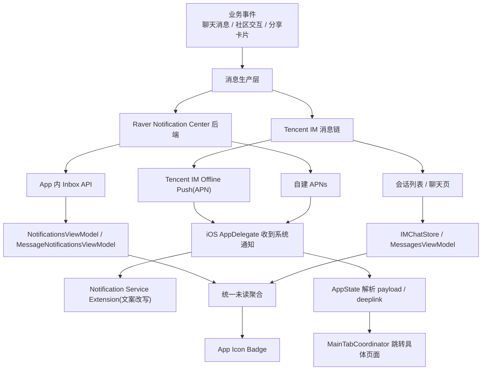

# iOS 通知中心全生命周期维护手册

> 适用工程：`/Users/blackie/Projects/raver`
>
> 适用端：iOS / `RaverMVP`
>
> 文档目标：
> - 把当前工程里“通知中心”相关能力收敛成一份长期维护文档
> - 明确区分 App 内通知、聊天未读/会话提醒、APN 系统推送、角标、通知点击跳转
> - 说明每类通知的完整生命周期、当前代码入口、数据源、状态变化与已知边界
>
> 关联文档：
> - [Raver 通知系统 V1（独立模块）](/Users/blackie/Projects/raver/docs/NOTIFICATION_SYSTEM_V1_PLAN.md)
> - [APNs 真机配置与端到端验证手册（Raver）](/Users/blackie/Projects/raver/docs/APNS_REAL_DEVICE_SETUP_AND_E2E_RUNBOOK.md)
> - [Raver 聊天 APN / 离线推送实施方案（Tencent IM First）](/Users/blackie/Projects/raver/docs/TENCENT_IM_APNS_IMPLEMENTATION_PLAN.md)

## 1. 结论先行

当前 iOS 工程里的“通知中心”不是单一模块，而是 4 个可维护的通知模块。后续如果要新增通知，建议先判断它应该进入哪一个模块，再补它的生命周期规则。

| 模块 | 作用 | 当前来源 | 典型通知 | 主要展示位置 | 当前统一收口 |
| --- | --- | --- | --- | --- | --- |
| `App 内通知 Inbox` | 承接站内通知列表与已读状态 | `notification-center` 后端接口 | 关注、点赞、评论、小队邀请 | 通知中心页、消息页通知分类页 | `NotificationsViewModel` / `MessageNotificationsViewModel` |
| `聊天会话提醒` | 承接聊天未读、会话预览、`@` 提醒 | Tencent IM / 兼容会话链 | 私聊未读、群未读、`@你`、`@所有人` | 会话列表、聊天页 | `IMChatStore` |
| `APN 系统推送` | 承接后台/锁屏通知展示与点击唤起 | Tencent IM Offline Push、自建 APNs | 聊天消息、Event card 分享、DJ card 分享、社区推送 | iOS 系统通知横幅、锁屏通知中心 | `AppDelegate + AppState + NotificationService` |
| `统一 Badge` | 承接 App 图标角标 | 聊天未读 + 社区未读聚合 | 总未读数 | App 图标 | `AppState` |

这 4 个模块共同构成当前 iOS 的通知中心能力。

## 2. 当前架构总览

## 3. 源码地图

### 3.1 推送注册 / APN 入口

- `/Users/blackie/Projects/raver/mobile/ios/RaverMVP/RaverMVP/RaverMVPApp.swift`
  - `didFinishLaunchingWithOptions`
  - `didRegisterForRemoteNotificationsWithDeviceToken`
  - `userNotificationCenter(_:willPresent:...)`
  - `userNotificationCenter(_:didReceive:...)`
  - `configureRemoteNotifications(_:)`

### 3.2 全局通知中心收口

- `/Users/blackie/Projects/raver/mobile/ios/RaverMVP/RaverMVP/Core/AppState.swift`
  - APN token 上报时机
  - Tencent IM APNs 配置
  - 统一未读聚合
  - 系统通知 payload 解析
  - deeplink 生成与派发

### 3.3 App 内通知 Inbox

- `/Users/blackie/Projects/raver/mobile/ios/RaverMVP/RaverMVP/Core/LiveSocialService.swift`
- `/Users/blackie/Projects/raver/mobile/ios/RaverMVP/RaverMVP/Features/Notifications/NotificationsViewModel.swift`
- `/Users/blackie/Projects/raver/mobile/ios/RaverMVP/RaverMVP/Features/Messages/MessageNotificationsViewModel.swift`

### 3.4 聊天未读 / 会话提醒

- `/Users/blackie/Projects/raver/mobile/ios/RaverMVP/RaverMVP/Core/IMChatStore.swift`
- `/Users/blackie/Projects/raver/mobile/ios/RaverMVP/RaverMVP/Features/Messages/MessagesViewModel.swift`
- `/Users/blackie/Projects/raver/mobile/ios/RaverMVP/RaverMVP/Core/Models.swift`

### 3.5 系统通知点击跳转

- `/Users/blackie/Projects/raver/mobile/ios/RaverMVP/RaverMVP/Core/AppState.swift`
- `/Users/blackie/Projects/raver/mobile/ios/RaverMVP/RaverMVP/Application/Coordinator/MainTabCoordinator.swift`

### 3.6 Notification Service Extension

- `/Users/blackie/Projects/raver/mobile/ios/RaverMVP/RaverNotificationService/NotificationService.swift`

## 4. 通知类型清单

这一节建议作为后续维护的“总表入口”。以后加新通知，优先在这里补一行。

### 4.0 通知模块总表

| 模块 | 子类型 | 当前是否已实现 | 数据源 | 跳转目标 | 是否参与 Badge | 后续新增时先改哪里 |
| --- | --- | --- | --- | --- | --- | --- |
| App 内通知 Inbox | `follow` | 是 | backend inbox | 个人资料 / 关注关系页 | 是 | `AppNotificationType` + inbox UI + unread 聚合 |
| App 内通知 Inbox | `like` | 是 | backend inbox | 被点赞目标页 | 是 | 同上 |
| App 内通知 Inbox | `comment` | 是 | backend inbox | 帖子详情 / 评论定位 | 是 | 同上 |
| App 内通知 Inbox | `squadInvite` | 是 | backend inbox | 小队页 / 邀请处理页 | 是 | 同上 |
| 聊天会话提醒 | 私聊未读 | 是 | Tencent IM | 私聊会话页 | 是 | `Conversation` / `IMChatStore` |
| 聊天会话提醒 | 群聊未读 | 是 | Tencent IM | 群会话页 | 是 | `Conversation` / `IMChatStore` |
| 聊天会话提醒 | `@你` | 是 | Tencent IM mention | 群会话页 | 是 | `GroupMentionAlertType` / 会话 preview |
| 聊天会话提醒 | `@所有人` | 是 | Tencent IM mention | 群会话页 | 是 | 同上 |
| APN 系统推送 | 聊天文本消息 | 是 | Tencent IM Offline Push | 对应会话 | 间接参与 | `offlinePushInfo` + deeplink 解析 |
| APN 系统推送 | Event card 分享 | 是 | Tencent IM Offline Push | 对应会话 | 间接参与 | `buildCardOfflinePushInfo` |
| APN 系统推送 | DJ card 分享 | 是 | Tencent IM Offline Push | 对应会话 | 间接参与 | `buildCardOfflinePushInfo` |
| APN 系统推送 | 社区/通知中心推送 | 部分具备基础 | 自建 APNs | 业务目标页 | 视类型而定 | backend payload + `readSystemDeeplink` |
| 统一 Badge | 聊天未读聚合 | 是 | Tencent IM unread | 无直接跳转 | 自身就是 Badge | `AppState.recomputeUnreadMessagesCount` |
| 统一 Badge | 社区未读聚合 | 是 | backend unread count | 无直接跳转 | 自身就是 Badge | 同上 |

### 4.1 App 内通知类型

定义于 `/Users/blackie/Projects/raver/mobile/ios/RaverMVP/RaverMVP/Core/Models.swift:767`

| 类型 | 当前状态 | 数据模型 | 拉取接口 | 已读接口 | 典型展示 | 备注 |
| --- | --- | --- | --- | --- | --- | --- |
| `follow` | 已实现 | `AppNotification` | `fetchNotifications(limit:)` | `markNotificationRead` / `markNotificationsRead` | 通知中心、消息通知分类页 | 参与 unread 聚合 |
| `like` | 已实现 | `AppNotification` | 同上 | 同上 | 同上 | 参与 unread 聚合 |
| `comment` | 已实现 | `AppNotification` | 同上 | 同上 | 同上 | 参与 unread 聚合 |
| `squadInvite` | 已实现 | `AppNotification` | 同上 | 同上 | 同上 | 参与 unread 聚合 |

对应基础模型：
- `AppNotificationType`
- `AppNotification`
- `NotificationInbox`
- `NotificationUnreadCount`

### 4.2 聊天提醒类型

定义于 `/Users/blackie/Projects/raver/mobile/ios/RaverMVP/RaverMVP/Core/Models.swift:294`

| 类型 | 当前状态 | 关键字段 | 展示位置 | 清理时机 | 备注 |
| --- | --- | --- | --- | --- | --- |
| 私聊未读 | 已实现 | `Conversation.unreadCount` | 会话列表、角标 | 打开会话 / 标记已读 | 无 mention 前缀 |
| 群聊未读 | 已实现 | `Conversation.unreadCount` | 会话列表、角标 | 打开会话 / 标记已读 | 可与 mention 共存 |
| `@你` | 已实现 | `Conversation.unreadMentionType = .atMe` | 会话 preview、APN 文案 | 打开会话时清除 | 正文仍保持 `@DisplayName` |
| `@所有人` | 已实现 | `Conversation.unreadMentionType = .atAll` | 会话 preview、APN 文案 | 打开会话时清除 | 与 `@你` 可叠加 |
| `@你 + @所有人` | 已实现 | `.atAllAndMe` | 会话 preview、APN 文案 | 打开会话时清除 | 用于极端情况兜底 |

当前会话提醒核心字段：
- `Conversation.unreadCount`
- `Conversation.unreadMentionType`
- `Conversation.previewText`

### 4.3 APN 类型

当前 iOS 实际承接的 APN，按数据源分两类：

| 数据源 | 子类型 | 当前状态 | 发送侧入口 | 点击后目标 | 文案是否会被 NSE 改写 | 备注 |
| --- | --- | --- | --- | --- | --- | --- |
| Tencent IM Offline Push | 聊天文本消息 | 已实现 | `buildTextOfflinePushInfo(...)` | 对应会话 | mention 时会 | 当前主链 |
| Tencent IM Offline Push | Event card 分享 | 已实现 | `buildCardOfflinePushInfo(...)` | 对应会话 | 否 | 共享聊天 push 路由 |
| Tencent IM Offline Push | DJ card 分享 | 已实现 | `buildCardOfflinePushInfo(...)` | 对应会话 | 否 | 共享聊天 push 路由 |
| Tencent IM Offline Push | 群 `@你` | 已实现 | 文本消息 push ext | 对应群会话 | 是 | `[@你]` 由 NSE 注入 |
| Tencent IM Offline Push | 群 `@所有人` | 已实现 | 文本消息 push ext | 对应群会话 | 是 | `[@所有人]` 由 NSE 注入 |
| 自建 APNs | 社区/通知中心推送 | 基础能力已具备 | backend notification-center | 业务目标页 | 视 payload 而定 | 后续统一化主战场 |

## 5. 全局生命周期：从“产生”到“消失”

这一节只讲抽象模型，不分通知类型。后续新增通知时，推荐先在这一节的每个阶段补“该类型的特殊要求”，再回到上面的模块表里补一行。

### 5.0 生命周期扩展表

| 生命周期阶段 | 当前通用规则 | 新增通知时必须补充的内容 |
| --- | --- | --- |
| 产生 | 从业务事件开始 | 这个通知由什么事件触发 |
| 编排 | 转成通知载荷或消息元数据 | 需要哪些字段，是否需要 ext/deeplink |
| 投递 | 进入 Inbox / 会话提醒 / APN / Badge 之一或多个 | 需要走哪些通道 |
| 展示 | 在具体 UI 层展示 | 文案、样式、是否有特殊前缀 |
| 交互 | 用户点击/标已读/进入页面 | 点击后跳哪里，是否要标已读 |
| 消退 | 未读清零、状态清理、badge 重算 | 何时算“已消费” |

### 5.1 产生

通知先由业务事件产生：
- 聊天发送消息
- 社区点赞/评论/关注
- 小队邀请
- 分享 Event / DJ card

### 5.2 编排

系统会把原始业务事件转成“通知载荷”：
- 聊天链：Tencent IM message + offlinePushInfo
- 社区链：Raver backend notification-center inbox item

### 5.3 投递

通知会进入至少一个通道：
- App 内 Inbox
- 会话列表未读/提醒
- APN 系统推送
- Badge 角标

### 5.4 展示

不同展示层有不同规则：
- App 内 Inbox：按列表展示，可读/未读
- 会话列表：按最后一条消息 + mention 前缀展示
- APN：按系统通知横幅展示
- Badge：只保留总数，不保留具体通知内容

### 5.5 交互

用户可通过以下方式消费通知：
- 进入通知中心列表
- 打开聊天页
- 点击系统通知
- 手动标记已读

### 5.6 消退

通知最终会在某个层级被清理：
- Inbox `isRead = true`
- 会话 `unreadCount = 0`
- `unreadMentionType = .none`
- badge 总数重算归零或减少

## 6. App 内通知生命周期

### 6.0 模块信息表

| 维度 | 当前实现 |
| --- | --- |
| 模块定位 | 站内通知列表与已读管理 |
| 主数据源 | `notification-center` 后端 |
| 主模型 | `AppNotification` / `NotificationInbox` / `NotificationUnreadCount` |
| 主展示层 | `NotificationsViewModel`、`MessageNotificationsViewModel` |
| 是否参与 Badge | 是 |
| 点击后是否走 deeplink | 取决于具体业务目标 |

### 6.1 数据源

接口定义在 `/Users/blackie/Projects/raver/mobile/ios/RaverMVP/RaverMVP/Core/LiveSocialService.swift`

当前入口：
- `fetchNotifications(limit:)`
- `fetchNotificationUnreadCount()`
- `markNotificationRead(notificationID:)`
- `markNotificationsRead(type:)`

### 6.2 拉取流程

1. 视图模型发起请求
2. 后端返回：
- `NotificationInbox`
- `NotificationUnreadCount`
3. 视图模型更新本地 `@Published`
4. 通过 `NotificationCenter.default.post(name: .raverCommunityUnreadDidChange, ...)` 通知全局未读聚合层

### 6.3 展示层

两套主要消费端：

1. 通知中心主列表
- `/Users/blackie/Projects/raver/mobile/ios/RaverMVP/RaverMVP/Features/Notifications/NotificationsViewModel.swift`

2. 消息页里的通知分类列表
- `/Users/blackie/Projects/raver/mobile/ios/RaverMVP/RaverMVP/Features/Messages/MessageNotificationsViewModel.swift`

### 6.4 已读流程

单条已读：
1. 本地先乐观更新 `isRead`
2. 本地先减 unread
3. 调 `markNotificationRead(notificationID:)`
4. 失败则回滚

分类全部已读：
1. 本地批量改 `isRead`
2. 本地重算 `NotificationUnreadCount`
3. 调 `markNotificationsRead(type:)`
4. 失败则回滚

### 6.5 与 badge 的关系

App 内通知本身不直接改角标。

真正改 badge 的是：
- `NotificationsViewModel` / `MessageNotificationsViewModel`
  通过 `.raverCommunityUnreadDidChange`
- `AppState`
  接收后写入 `cachedCommunityUnread`
  再和聊天未读合并重算

## 7. 聊天未读 / 会话提醒生命周期

### 7.0 模块信息表

| 维度 | 当前实现 |
| --- | --- |
| 模块定位 | 会话列表未读、preview、mention 提醒 |
| 主数据源 | Tencent IM / 会话兼容链 |
| 主模型 | `Conversation`、`GroupMentionAlertType` |
| 主展示层 | `IMChatStore`、`MessagesViewModel` |
| 是否参与 Badge | 是 |
| 点击后是否走 deeplink | 是，通常落到会话页 |

### 7.1 数据源

主入口：
- `/Users/blackie/Projects/raver/mobile/ios/RaverMVP/RaverMVP/Core/IMChatStore.swift`
- `/Users/blackie/Projects/raver/mobile/ios/RaverMVP/RaverMVP/Features/Messages/MessagesViewModel.swift`

模型：
- `/Users/blackie/Projects/raver/mobile/ios/RaverMVP/RaverMVP/Core/Models.swift:294`

### 7.2 关键状态

会话提醒最关键的 3 个字段：
- `lastMessage`
- `unreadCount`
- `unreadMentionType`

最终会在 `previewText` 里组合成会话列表文案。

例如：
- 普通群消息：`发送者: 文本`
- `@你`：`[@你] 发送者: 文本`
- `@所有人`：`[@所有人] 发送者: 文本`

### 7.3 未读累加

聊天未读来源于 Tencent IM 实时 unread 回调和本地会话同步。

全局聚合入口在：
- `AppState.tencentIMSession.onUnreadCountChange`
- `AppState.refreshUnreadMessages()`

### 7.4 已读清理

打开会话或激活会话时，会清理：
- `Conversation.unreadCount`
- `Conversation.unreadMentionType`

对应位置：
- `/Users/blackie/Projects/raver/mobile/ios/RaverMVP/RaverMVP/Core/IMChatStore.swift`
  - `activateConversation(_:)`
  - active conversation zero unread 流程

### 7.5 与 App 内通知的边界

聊天未读不是 `AppNotification`。

它属于：
- IM 会话层
- 会话列表层
- APN 聊天推送层

而不是通知中心 Inbox 的 `follow / like / comment / squadInvite` 模型。

## 8. APN 生命周期

### 8.0 模块信息表

| 维度 | 当前实现 |
| --- | --- |
| 模块定位 | 后台/锁屏通知展示与唤起入口 |
| 主数据源 | Tencent IM Offline Push + 自建 APNs |
| 主接收入口 | `RaverMVPApp.swift` |
| 主路由入口 | `AppState.handleSystemNotificationPayload` |
| 是否参与 Badge | 间接参与 |
| 是否依赖 NSE | mention 特殊文案依赖 |

## 8.1 注册阶段

主入口：`/Users/blackie/Projects/raver/mobile/ios/RaverMVP/RaverMVP/RaverMVPApp.swift`

流程：
1. `configureRemoteNotifications(_:)`
2. 请求系统权限
3. `application.registerForRemoteNotifications()`
4. `didRegisterForRemoteNotificationsWithDeviceToken`
5. 发出 `.raverDidRegisterPushToken`

## 8.2 token 消费阶段

主入口：`/Users/blackie/Projects/raver/mobile/ios/RaverMVP/RaverMVP/Core/AppState.swift`

流程：
1. `AppState` 监听 `.raverDidRegisterPushToken`
2. 保存 `latestPushToken`
3. 调 `tencentIMSession.updateAPNSToken(hexToken:)`
4. 如果已登录，再调 `uploadPushTokenIfPossible()`

`uploadPushTokenIfPossible()` 最终会调用：
- `registerDevicePushToken(...)`

登出时会调：
- `deactivateDevicePushToken(deviceID:platform:)`

## 8.3 Tencent IM APNs 配置阶段

主入口：
- `/Users/blackie/Projects/raver/mobile/ios/RaverMVP/RaverMVP/Core/AppState.swift:806`
- `/Users/blackie/Projects/raver/mobile/ios/RaverMVP/RaverMVP/Core/AppState.swift:2260`

配置依赖：
- `/Users/blackie/Projects/raver/mobile/ios/RaverMVP/RaverMVP/Core/AppConfig.swift`
- `/Users/blackie/Projects/raver/mobile/ios/RaverMVP/RaverMVP/Info.plist`
  - `TencentIMAPNSBusinessID`

如果 `businessID <= 0`，Tencent IM 官方离线推送无法真正配置成功。

## 8.4 发送阶段

### 聊天文本消息

发送侧会为群/会话消息构造：
- `offlinePushInfo.title`
- `offlinePushInfo.desc`
- `offlinePushInfo.ext`

入口：
- `/Users/blackie/Projects/raver/mobile/ios/RaverMVP/RaverMVP/Core/AppState.swift:1809`
- `/Users/blackie/Projects/raver/mobile/ios/RaverMVP/RaverMVP/Core/AppState.swift:2690`

### Event / DJ card 分享

发送侧也走：
- `buildCardOfflinePushInfo(...)`

入口：
- `/Users/blackie/Projects/raver/mobile/ios/RaverMVP/RaverMVP/Core/AppState.swift:1874`
- `/Users/blackie/Projects/raver/mobile/ios/RaverMVP/RaverMVP/Core/AppState.swift:1915`
- `/Users/blackie/Projects/raver/mobile/ios/RaverMVP/RaverMVP/Core/AppState.swift:2732`

### ext 里的统一路由负载

当前 `buildPushRoutingExt(...)` 会写入：
- `route`
- `conversationType`
- `conversationID`
- `sdkConversationID`
- `peerID`
- `groupID`
- `title`
- `preview`
- `mentionedUserIDs`
- `mentionAll`
- `recvOpt`
- `version`

这部分是“通知点击跳聊天”的核心桥接数据。

## 8.5 接收阶段

系统通知到达时，先走：
- `willPresent`
  - 前台展示 banner / sound / badge
- `didReceive response`
  - 用户点击通知

入口：
- `/Users/blackie/Projects/raver/mobile/ios/RaverMVP/RaverMVP/RaverMVPApp.swift:114`
- `/Users/blackie/Projects/raver/mobile/ios/RaverMVP/RaverMVP/RaverMVPApp.swift:124`

## 8.6 文案改写阶段

由 Notification Service Extension 负责。

入口：
- `/Users/blackie/Projects/raver/mobile/ios/RaverMVP/RaverNotificationService/NotificationService.swift`

当前只负责：
- 从 `ext/entity` 读取 mention 信息
- 根据当前登录用户 ID 生成前缀：
  - `[@你]`
  - `[@所有人]`
  - `[@你][@所有人]`

当前不负责：
- 跳转
- 业务页面路由
- inbox 已读状态变更

## 8.7 点击跳转阶段

主入口：
- `/Users/blackie/Projects/raver/mobile/ios/RaverMVP/RaverMVP/Core/AppState.swift:4159`
- `/Users/blackie/Projects/raver/mobile/ios/RaverMVP/RaverMVP/Application/Coordinator/MainTabCoordinator.swift:520`

当前流程：
1. App 收到通知点击
2. `AppState.handleSystemNotificationPayload(_:, source:)`
3. 优先直接读取：
  - `deeplink`
  - `deep_link`
  - `url`
  - `link`
  - `target_url`
4. 如果没有，则尝试解析：
  - `ext`
  - `entity`
  - `metadata.ext`
  - `metadata.entity`
5. 如果路由是 `chat`，则构造：
  - `raver://messages/conversation/<conversationID>`
6. `MainTabCoordinator` 再把 deeplink 映射成 `AppRoute`

### 当前已支持的页面路由

`MainTabCoordinator.mapAppRoute(from:)` 当前可落到：
- 会话页
- 社区帖子
- Event 详情
- DJ 详情
- Squad
- Profile

## 9. Badge 生命周期

### 9.0 模块信息表

| 维度 | 当前实现 |
| --- | --- |
| 模块定位 | App 图标角标统一聚合 |
| 主数据源 | 聊天 unread + 社区 unread |
| 主收口 | `AppState.recomputeUnreadMessagesCount(...)` |
| 展示位置 | App 图标 |
| 是否可直接点击 | 否 |
| 后续扩展方式 | 只在聚合层增加来源，不在子模块直接写 badge |

Badge 的唯一收口在：
- `/Users/blackie/Projects/raver/mobile/ios/RaverMVP/RaverMVP/Core/AppState.swift`

### 9.1 数据组成

`badge = chatsUnread + communityUnread`

其中：
- `chatsUnread`
  - 来自 Tencent IM unread
- `communityUnread`
  - 来自 `NotificationUnreadCount`

### 9.2 刷新时机

1. 登录成功
2. 注册成功
3. App 回前台
4. 点击系统通知
5. 社区通知 unread 变化
6. Tencent IM unread 回调

### 9.3 写入位置

`recomputeUnreadMessagesCount(...)` 会同时写：
- `unreadMessagesCount`
- `TencentIMAPNSBadgeBridge.shared.setUnifiedUnreadCount(next)`
- `UIApplication.shared.applicationIconBadgeNumber = next`

`resetUnreadCounts()` 会把这些值全部归零。

## 10. 当前实现中的“角色分工”

### 10.1 AppDelegate

负责：
- 申请权限
- 注册 APNs
- 接收系统通知点击
- 把系统事件转成 `NotificationCenter` 事件

不负责：
- 业务路由
- badge 计算
- 通知中心 UI

### 10.2 AppState

负责：
- token 上传
- Tencent IM APNs 配置
- unread 聚合
- badge 落地
- 系统通知 payload 解析
- deeplink 派发
- 与登录态绑定

### 10.3 Notification Service Extension

负责：
- APN 到达时的正文改写
- `@你` / `@所有人` 前缀注入

不负责：
- 打开页面
- 已读状态
- badge

### 10.4 ViewModel 层

负责：
- 拉取 App 内通知数据
- 乐观已读
- 发出 unread 变化事件

### 10.5 IMChatStore

负责：
- 会话快照
- 聊天未读
- 激活会话后清 unread / 清 mention

## 11. 当前已知边界与注意事项

### 11.1 “正文里的 @昵称” 和 “会话列表里的 [@你]” 是两回事

这是当前正确的产品语义：
- 消息正文保留真实输入：`@DisplayName`
- 会话列表 / APN 前缀显示：`[@你]`

不要把消息正文直接改成 `@你`。

### 11.2 Notification Service Extension 只能改展示，不能决定业务跳转

页面跳转的真实入口仍然是：
- AppDelegate 收到点击
- AppState 解析 payload
- MainTabCoordinator 做路由

### 11.3 Badge 是统一角标，不区分具体来源

当前 badge 只表达总未读，不表达：
- 哪条聊天未读
- 哪类通知未读
- 是否是 `@你`

### 11.4 App 内通知和聊天通知目前仍是两套模型

这不是 bug，是当前架构现状：
- AppNotification：站内通知中心
- Conversation / unreadMentionType：聊天会话提醒

未来若要统一成真正“通知中心中台”，需要后端和客户端共同抽象。

## 12. 新增一种通知时的维护清单

后续新增通知类型，按下面 checklist 做。

### 12.1 如果是站内通知中心类

- 在后端通知中心定义新类型
- 更新 iOS `AppNotificationType`
- 更新 inbox 列表 UI
- 更新 `NotificationUnreadCount` 如需单独分类
- 确认是否参与 badge 聚合
- 确认点击后 deeplink 路由

### 12.2 如果是聊天类 APN

- 明确消息是否需要 `offlinePushInfo`
- 在发送侧补 `title / desc / ext`
- 若需要“特殊提醒”，在 NSE 增加文案逻辑
- 确认 AppState 能从 payload 里还原 deeplink
- 确认 `MainTabCoordinator` 能路由到目标页面

### 12.3 如果是纯业务 APN

- 明确走 Tencent IM 还是自建 APNs
- 明确 payload 顶层 deeplink 字段名
- 明确是否需要 App Group / NSE 协助
- 明确点击后的页面归宿
- 明确是否需要在 App 内落一条 inbox item

## 13. 回归测试清单

### 13.1 App 内通知

- 拉取列表成功
- unread 数正确
- 单条已读成功
- 分类全部已读成功
- 已读后角标同步减少

### 13.2 聊天会话提醒

- 私聊未读计数正确
- 群未读计数正确
- `@你` 会话前缀正确
- `@所有人` 会话前缀正确
- 打开会话后 unread / mention 清零

### 13.3 APN

- 真机可拿到 device token
- token 可上传到后端
- Tencent IM `businessID` 生效
- 文本消息可收到推送
- Event card 分享可收到推送
- DJ card 分享可收到推送
- `@你` 文案可被 NSE 改写
- 点击通知能跳到目标页面

### 13.4 Badge

- 登录后 badge 刷新
- 退后台收到推送后 badge 增加
- 打开通知中心或会话后 badge 减少
- 登出后 badge 清零

## 14. 当前建议的维护原则

1. 所有通知新增能力，优先明确它属于哪一层：
- Inbox
- 会话提醒
- APN
- Badge

2. 不要把“展示文案”和“业务语义”混写在同一层。
- 例如：
  - `@昵称` 属于正文
  - `[@你]` 属于提醒前缀

3. 路由统一尽量走 deeplink。
- 这样 App 内点击、APN 点击、未来 Web fallback 都容易统一。

4. badge 只保留在 `AppState` 统一收口。
- 不要在子页面直接分散写 `applicationIconBadgeNumber`

5. 新通知上线必须补 3 类验证：
- 前台展示
- 后台 / 锁屏 APN
- 点击跳转

## 15. 进度追踪

### 当前已完成

- [x] APNs 权限申请与 token 注册链
- [x] token 上传到自家后端
- [x] Tencent IM APNs 配置入口
- [x] App 内通知 Inbox 拉取与已读
- [x] 聊天 unread 与 `@` 会话提醒
- [x] 统一 badge 聚合
- [x] Notification Service Extension 的 `@你` 文案改写
- [x] APN 点击后聊天 deeplink 解析

### 当前仍建议持续关注

- [ ] 继续统一更多非聊天业务 APN 到同一套路由协议
- [ ] 梳理服务端推送 payload 标准，减少多种字段并存
- [ ] 为通知中心建立更强的诊断日志与运营后台视图
- [ ] 视产品需要，决定是否把聊天提醒进一步并入统一通知中心模型

## 16. 建议的后续维护方式

后续每次改通知系统，更新这份文档时至少同步 4 项：

1. 新增了什么通知类型
2. 这类通知走哪条链路
3. payload / deeplink / unread / badge 有没有变化
4. 对应新增或修改了哪些源码入口

如果只改代码不改这份文档，通知系统会很快再次变成“多处散落、难以判断全貌”的状态。
