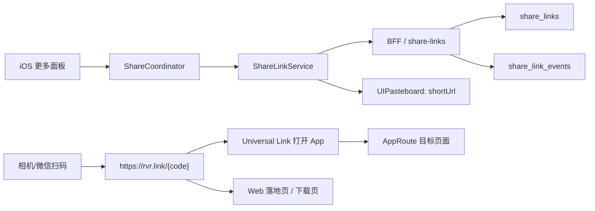

# iOS 分享短链与二维码系统设计方案

## 1. 目标

Raver 需要一套统一的分享链接系统，覆盖 iOS 端所有「更多 / 分享 / 更多操作」面板：

- 每个更多面板必须有「复制链接」。
- 复制出来的链接必须是可公开访问的 HTTPS 链接，不再复制 `raver://...` 私有 scheme。
- 同一套链接同时服务 App 内跳转、外部分享、二维码扫码、未安装 App 的落地页、数据统计和后续增长归因。
- 个人名片和群名片需要稳定短链与二维码，支持长期展示、更新头像/昵称后不换码。

核心结论：不要继续把业务页面各自拼接链接；建设一个 `ShareLinkService`，所有分享入口只传「分享对象」，由统一服务返回 `shortUrl`、`canonicalUrl`、`universalLink`、`deepLink`、`qrCodeUrl` 和预览元数据。

## 2. 当前项目现状

### 2.1 iOS 已有能力

- App 已注册 `raver` URL Scheme：`mobile/ios/RaverMVP/RaverMVP/Info.plist`。
- `AppCoordinatorView.onOpenURL` 会把外部 URL 写入 `systemDeepLinkEvent`。
- `MainTabCoordinator.mapAppRoute` 已能解析 `raver://event/{id}`、`raver://dj/{id}`、`raver://squad/{id}`、`raver://profile/{id}`、`raver://community/post/{id}` 等路线。
- `ShareActionPanel` 是多数分享面板的共用底部面板，天然适合作为统一「复制链接」入口的 UI 基座。

### 2.2 当前主要问题

- 多处复制链接是硬编码或局部拼接：
  - Post 当前复制 `https://raver.app/posts/{postId}`。
  - Label 可能复制厂牌官网，fallback 才是 `raver://label/{id}`。
  - Festival 可能复制第一条外部链接，fallback 是 `raver://discover/festivals/{id}`，而现有路由不一定能解析。
  - Ranking、ID、资讯等多处直接复制 `raver://...`。
- `raver://...` 不能作为成熟分享链接：微信、短信、浏览器、二维码扫描器、App 未安装场景都不稳定。
- 群二维码目前只是 `qrCodeUrl` 字段，偏「上传图片 URL」，不是由分享系统生成和管理。
- 个人名片没有独立的稳定分享对象和二维码生命周期。
- 缺少统一统计：谁复制、谁扫码、哪个渠道、转化到哪个页面。

## 3. 市场成熟方案选择

2026 年应采用「自有 HTTPS Universal Link + 短链重定向 + 动态二维码」作为默认方案。

### 3.1 不建议用 Firebase Dynamic Links

Firebase Dynamic Links 已在 2025-08-25 停止服务，新旧链接会停止工作，短链 API 和统计 API 也不再可用。因此新项目不能再依赖 Firebase Dynamic Links。

### 3.2 自建与第三方的取舍

推荐默认自建：

- Raver 已经有 Node/Express、Prisma、BFF、iOS deeplink 路由，建设成本可控。
- 内容分享、个人名片、群名片更需要长期稳定域名和业务权限控制。
- 链接和二维码属于核心社交资产，应尽量绑定自有域名。

可选第三方：

- 如果需要强安装归因、广告投放归因、Deferred Deep Link、跨渠道增长报表，可以后续接 Branch / AppsFlyer / Adjust。
- 第三方应作为 attribution adapter，而不是替代 Raver 自有 canonical link。

## 4. 链接协议

### 4.1 域名

建议准备两个域名：

- `https://raver.app`：内容落地页和 canonical URL。
- `https://rvr.link` 或 `https://rvrl.ink`：短链域名。

iOS Associated Domains：

- `applinks:raver.app`
- `applinks:rvr.link`

两者都提供 `/.well-known/apple-app-site-association`。

### 4.2 三层链接

每个分享对象同时有三种链接：

| 类型 | 示例 | 用途 |
|---|---|---|
| Canonical URL | `https://raver.app/u/blackie` | SEO、网页落地页、可读、长期稳定 |
| Short URL | `https://rvr.link/a8K3pQ` | 分享、二维码、短信、海报 |
| Deep Link | `raver://profile/{userId}` | App 内路由，不直接暴露给用户复制 |

复制链接和二维码统一使用 `shortUrl`。只有 App 内消息卡片 payload 可以带 `deepLink`。

### 4.3 路径规范

Canonical URL 建议：

- 个人名片：`https://raver.app/u/{usernameOrHandle}`
- 群名片：`https://raver.app/g/{squadHandleOrId}`
- 动态：`https://raver.app/p/{postId}`
- 活动：`https://raver.app/e/{eventSlugOrId}`
- DJ：`https://raver.app/dj/{djSlugOrId}`
- Set：`https://raver.app/set/{setSlugOrId}`
- 资讯：`https://raver.app/n/{newsId}`
- Label：`https://raver.app/label/{labelSlugOrId}`
- Festival：`https://raver.app/festival/{festivalSlugOrId}`
- 榜单：`https://raver.app/ranking/{boardId}?year=2025`
- 评分单元：`https://raver.app/rating/unit/{unitId}`
- 圈子 ID：`https://raver.app/id/{entryId}`

短链统一：

- `https://rvr.link/{code}`
- 可附统计参数：`?ch=copy_link&src=ios&campaign=profile_card`

短链 code 用 Base62，默认 7 位起步。公开长期链接建议固定 code；一次性邀请链接可以更长并带过期时间。

## 5. 后端设计

### 5.1 数据表

新增 `share_links`：

| 字段 | 类型 | 说明 |
|---|---|---|
| id | uuid | 主键 |
| code | string unique | 短链 code |
| targetType | enum/string | `user_card`、`squad_card`、`post` 等 |
| targetId | string | 业务对象 id |
| canonicalUrl | string | 长链接 |
| deepLink | string | App 私有路由 |
| fallbackUrl | string | 未安装 App 时网页落地页 |
| title | string | 分享标题快照 |
| subtitle | string? | 分享副标题 |
| imageUrl | string? | 预览图 |
| visibility | string | `public`、`members_only`、`private_invite` |
| status | string | `active`、`revoked`、`expired` |
| expiresAt | datetime? | 临时邀请可过期 |
| createdBy | string? | 创建人 |
| metadata | json | 渠道、UTM、版本 |
| scanCount/clickCount | int | 聚合计数，可选 |
| createdAt/updatedAt | datetime | 时间戳 |

新增 `share_link_events`：

| 字段 | 说明 |
|---|---|
| id | 主键 |
| linkId/code | 关联短链 |
| eventType | `create`、`copy`、`open`、`scan`、`redirect`、`app_open`、`install_click` |
| channel | `copy_link`、`qr_scan`、`wechat`、`im`、`system_share` |
| userId | 当前用户，可空 |
| anonymousId | Web cookie/device id |
| platform | iOS/Android/Web |
| userAgent/ipHash/referrer | 风控与统计 |
| createdAt | 时间 |

个人和群的永久名片可额外加业务字段：

- `users.profile_share_code String? @unique`
- `users.profile_share_qr_code_url String?`
- `squads.share_code String? @unique`
- `squads.qr_code_url String?`

如果不想污染业务表，也可以只从 `share_links` 查询永久 code。

### 5.2 API

BFF 新增：

- `POST /api/bff/share-links/resolve`
  - 入参：`targetType`、`targetId`、`channel`、`campaign`、`preferPermanent`
  - 返回：`shortUrl`、`canonicalUrl`、`deepLink`、`qrCodeUrl`、`title`、`subtitle`、`imageUrl`
- `GET /api/bff/share-links/:code`
  - 给 App 查询短链详情。
- `POST /api/bff/share-links/:code/events`
  - 记录 copy/open/scan/share。
- `GET /s/:code`
  - 短链打开入口，返回 302 或中间页。
- `GET /qr/:code.png`
  - 二维码图片入口，可 CDN 缓存。
- `POST /api/bff/squads/:id/share-card`
  - 创建/刷新群名片永久链接。
- `POST /api/bff/users/:id/share-card`
  - 创建/刷新个人名片永久链接。

### 5.3 短链打开策略

`GET https://rvr.link/{code}`：

1. 查询 `share_links`。
2. 记录 `open` 事件。
3. 如果链接失效，跳通用错误页。
4. 如果是普通浏览器且 App 已安装，Universal Link 由 iOS 直接拉起 App。
5. 如果没有拉起 App，展示 Web 落地页：
   - 内容预览卡。
   - 「打开 Raver」按钮。
   - 「下载 App」按钮。
   - 微信内提示「右上角在浏览器打开」或使用应用宝/App Store fallback。
6. 对私密群：
   - 不暴露完整成员/聊天内容。
   - 展示群名、头像、人数、入群申请按钮。
   - 加入动作必须登录并走权限校验。

### 5.4 AASA 文件

Web 需要提供：

- `https://raver.app/.well-known/apple-app-site-association`
- `https://rvr.link/.well-known/apple-app-site-association`

示意：

```json
{
  "applinks": {
    "details": [
      {
        "appIDs": ["TEAMID.com.raver.mvp"],
        "components": [
          { "/": "/u/*" },
          { "/": "/g/*" },
          { "/": "/p/*" },
          { "/": "/e/*" },
          { "/": "/dj/*" },
          { "/": "/set/*" },
          { "/": "/n/*" },
          { "/": "/label/*" },
          { "/": "/festival/*" },
          { "/": "/ranking/*" },
          { "/": "/rating/*" },
          { "/": "/id/*" },
          { "/": "/*" }
        ]
      }
    ]
  }
}
```

## 6. iOS 设计

### 6.1 新增核心类型

新增 `ShareTarget`：

```swift
enum ShareTargetType: String, Codable {
    case userCard
    case squadCard
    case post
    case event
    case dj
    case djSet
    case news
    case label
    case festival
    case rankingBoard
    case ratingUnit
    case ratingEvent
    case circleID
}

struct ShareTarget: Codable, Hashable {
    let type: ShareTargetType
    let id: String
    let title: String?
    let subtitle: String?
    let imageURL: String?
    let metadata: [String: String]
}

struct ShareLinkPayload: Codable, Hashable {
    let shortURL: String
    let canonicalURL: String
    let deepLink: String
    let qrCodeURL: String?
    let title: String
    let subtitle: String?
    let imageURL: String?
}
```

新增 `ShareLinkService`：

- live：请求 BFF。
- mock：本地生成 `https://rvr.link/mock-{type}-{id}`。
- 带内存缓存，避免同一面板反复请求。

新增 `UniversalLinkRouter`：

- 支持解析 `https://raver.app/...` 和 `https://rvr.link/{code}`。
- `rvr.link` 如果无法本地判断，调用 `GET /api/bff/share-links/:code` resolve 成 `deepLink` 或 `AppRoute`。
- 保留现有 `raver://...` 解析作为内部兼容。

### 6.2 统一「复制链接」按钮

所有 `ShareActionPanel` 的 `quickActions` 至少注入：

- 复制链接：复制 `ShareLinkPayload.shortURL`。
- 生成二维码 / 保存二维码：根据页面是否需要展示。
- 系统分享：分享 title + shortURL。

建议不要让页面自己写：

```swift
UIPasteboard.general.string = "raver://..."
```

页面只做：

```swift
shareCoordinator.copyLink(target: .post(id: post.id, ...))
```

### 6.3 UI 状态

复制链接要有三种状态：

- 正常：点按后 resolve 短链并复制。
- 加载中：按钮轻量 loading，避免重复点击。
- 失败：如果 BFF 不可用，复制 canonical URL；若 canonical 也不可用，再复制私有 deepLink 作为最后兜底，并提示「已复制 App 内链接」。

### 6.4 Universal Link 路由映射

iOS 端补齐：

| URL | AppRoute |
|---|---|
| `/u/{idOrHandle}` | `.userProfile(userID:)` |
| `/g/{idOrHandle}` | `.squadProfile(squadID:)` |
| `/p/{postId}` | `.postDetail(postID:)` |
| `/e/{eventIdOrSlug}` | `.eventDetail(eventID:)`，slug 需后端 resolve |
| `/dj/{djIdOrSlug}` | `.djDetail(djID:)` |
| `/set/{setIdOrSlug}` | Set 详情路由，当前需要补路由 |
| `/n/{newsId}` | `.newsDetail(articleID:)` |
| `/label/{labelIdOrSlug}` | `.labelDetail(labelID:)` |
| `/festival/{idOrSlug}` | Festival 详情路由，当前需要补路由 |
| `/ranking/{boardId}` | `.rankingBoardDetail` |
| `/rating/unit/{unitId}` | `.ratingUnitDetail(unitID:)` |
| `/id/{entryId}` | 圈子 ID 详情，当前需要补路由 |

## 7. 个人名片

### 7.1 名片内容

个人名片分享对象：`user_card`。

展示：

- 头像、昵称、用户名。
- bio / 城市。
- 关注数、粉丝数、好友数。
- 最近打卡或代表性音乐偏好。
- 「关注」「发消息」「查看主页」。

链接：

- canonical：`https://raver.app/u/{username}`
- short：`https://rvr.link/{profileShareCode}`
- deepLink：`raver://profile/{userId}`

### 7.2 二维码生命周期

- 每个用户默认一个永久个人名片 code。
- 用户改昵称/头像不换 code，二维码仍然有效。
- 用户改 username 后，旧 canonical 可以 301 到新 canonical，short code 不变。
- 用户注销或封禁：短链进入 `revoked`，落地页显示不可访问。

### 7.3 iOS 页面入口

- 我的主页右上角更多：`编辑资料`、`分享个人名片`、`复制链接`、`我的二维码`、`设置`。
- 他人主页右上角更多：`分享名片`、`复制链接`、`举报/拉黑`。
- 个人二维码页：大二维码 + 头像昵称 + 保存图片 + 系统分享。

## 8. 群名片

### 8.1 名片内容

群名片分享对象：`squad_card`。

展示：

- 群头像、群名、公开/私密状态。
- 人数、队长、简介。
- 最近活动或公告摘要。
- 加入按钮。

链接：

- canonical：`https://raver.app/g/{squadHandleOrId}`
- short：`https://rvr.link/{squadShareCode}`
- deepLink：`raver://squad/{squadId}`

### 8.2 公开群与私密群

公开群：

- 任何人可看名片和申请/加入。
- 二维码永久有效，管理员可重置。

私密群：

- 名片只展示最小信息。
- 加入需要申请或邀请码。
- 可以生成临时邀请短链：`visibility=private_invite`、`expiresAt`、`maxUses`。
- 群主/管理员可以重置二维码，旧 code 立即 `revoked`。

### 8.3 替换现有 `qrCodeUrl`

当前 `Squad.qrCodeUrl` 不应该继续作为手填 URL。改为：

- 群资料读取 `shareLink.qrCodeUrl`。
- 编辑页只保留「重置二维码」而不是输入二维码 URL。
- 兼容旧数据：如果旧 `qrCodeUrl` 存在，迁移时生成新短链二维码并回填。

## 9. 二维码生成

### 9.1 内容

二维码只编码短 HTTPS 链接：

```text
https://rvr.link/a8K3pQ
```

不要编码：

- `raver://...`
- JSON payload
- 过长 UTM 链接
- 外部官网 URL

### 9.2 生成位置

推荐后端生成 PNG/SVG 并上传 OSS/CDN：

- 便于长期展示、海报生成、缓存。
- iOS 离线时也可使用已缓存图片。
- 管理端可批量生成。

iOS 可作为兜底用 Core Image `CIQRCodeGenerator` 本地生成。

### 9.3 视觉规范

- 默认纠错等级：`Q`；有中心 Logo 时用 `H`。
- 二维码最小展示尺寸：220pt。
- 四周 quiet zone 至少 4 modules。
- 中心 Logo 不超过二维码面积 15%，且不能覆盖定位点。
- 深色前景 + 浅色背景，避免渐变和低对比。
- 保存图片尺寸：至少 1024 x 1024 PNG。

## 10. 分享面板覆盖清单

Phase 1 必须统一复制链接：

- 动态卡片、动态详情。
- 活动详情、活动列表卡片更多。
- DJ 详情、DJ 列表卡片更多。
- Set 详情、Set 列表卡片更多。
- 资讯详情。
- Label / Festival / Brand / 榜单。
- 圈子 ID / 评分事件 / 评分单元。
- 个人主页、他人主页。
- 小队主页、小队成员页、小队更多面板。
- 聊天内分享卡片长按菜单可复制原始短链。

每个入口行为一致：

1. 点击更多。
2. 面板出现「复制链接」。
3. 点击后复制 `shortUrl`。
4. Toast：`已复制链接`。
5. 后端记录 `copy` 事件。

## 11. 迁移路线

### Phase 0：协议与域名准备

- 确定正式域名和短链域名。
- 配置 AASA。
- iOS entitlements 增加 Associated Domains。
- Web 提供基础落地页。

### Phase 1：分享服务闭环

- 后端新增 `share_links`、`share_link_events`。
- BFF 新增 resolve/create/event API。
- iOS 新增 `ShareLinkService`、`ShareTarget`、`ShareCoordinator`。
- `ShareActionPanel` 支持注入统一复制链接动作。
- 替换所有 `UIPasteboard.general.string = "raver://..."`。

### Phase 2：个人名片与群名片

- 个人主页新增名片分享和二维码页。
- 小队主页新增群名片分享和二维码页。
- 群二维码从手填 URL 迁移为系统生成。
- 支持群二维码重置、私密群临时邀请码。

### Phase 3：统计与增长

- 短链打开、扫码、复制、App 打开事件入库。
- 管理端/埋点看板。
- 需要广告归因时接 Branch / AppsFlyer adapter。

### Phase 4：质量与风控

- 私密链接权限检查。
- 链接封禁、过期、重置。
- 防刷统计、IP hash、异常 UA 限流。
- 黑名单内容短链撤销。

## 12. 验收标准

### 12.1 链接正确性

- 所有更多面板都有「复制链接」。
- iOS 复制结果全部是 `https://...`，不是 `raver://...`。
- 已安装 App：点击短链直达目标页。
- 未安装 App：打开对应 Web 落地页。
- 微信/短信/浏览器/相机扫码均可打开。

### 12.2 个人名片

- 我的个人二维码可展示、保存、分享。
- 修改头像/昵称后二维码不变，落地页内容更新。
- 他人扫描后能打开用户主页。

### 12.3 群名片

- 群二维码系统生成，不需要手动填 URL。
- 公开群扫码可看群名片并加入。
- 私密群扫码只展示最小信息并进入申请流程。
- 管理员重置二维码后旧码失效。

### 12.4 回归测试

- `scripts/check-coordinator-deeplink-roundtrip.sh` 增加 HTTPS Universal Link 样例。
- iOS UI tests 覆盖复制链接按钮。
- 后端 API tests 覆盖 create/resolve/revoke/redirect。
- Web smoke 覆盖 AASA、短链 302、落地页 OG meta。

## 13. 立刻要改的代码点

优先级 P0：

- `mobile/ios/RaverMVP/RaverMVP/Shared/PostCardView.swift`
  - `PostSharePayload.shareURLString` 改为来自 `ShareLinkService`。
- `mobile/ios/RaverMVP/RaverMVP/Features/Feed/PostDetailView.swift`
  - 复制链接动作改为统一 share coordinator。
- `mobile/ios/RaverMVP/RaverMVP/Features/Discover/Learn/Views/LearnModuleView.swift`
  - Label/Festival 不再复制官网或 `raver://discover/festivals/...`，统一复制 Raver 短链。
- `mobile/ios/RaverMVP/RaverMVP/Features/Discover/News/Views/DiscoverNewsDetailView.swift`
  - 「复制链接」复制 Raver 短链；外部原文链接单独叫「复制原文链接」。
- `mobile/ios/RaverMVP/RaverMVP/Features/MainTabView.swift`
  - 圈子 ID / Rating 分享不再复制私有 scheme。
- `mobile/ios/RaverMVP/RaverMVP/Features/Squads/SquadProfileView.swift`
  - 群二维码显示系统生成二维码；新增复制群链接。
- `mobile/ios/RaverMVP/RaverMVP/Features/Profile/ProfileView.swift`
  - 增加个人名片分享入口。

优先级 P1：

- `server/prisma/schema.prisma`
  - 新增短链和事件表。
- `server/src/routes/bff.routes.ts`
  - 增加分享 BFF API。
- `web/src/app`
  - 增加 canonical 落地页和短链 redirect 页面。
- iOS entitlements
  - 增加 Associated Domains。

## 14. 推荐最终形态

用户看到的是一个简单动作：「复制链接」或「我的二维码」。

系统内部则统一成：



这样后面新增任何内容类型，只需要补一个 `ShareTargetType` 和 resolver，不再让页面自己拼 URL。
