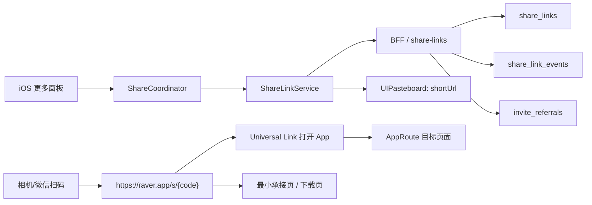

# iOS 分享短链与二维码系统设计方案

关联执行清单：`docs/IOS_SHARE_SHORT_LINK_QR_SYSTEM_EXECUTION_TRACKER.md`
关联开发日志：`docs/IOS_SHARE_SHORT_LINK_QR_SYSTEM_DEV_LOG.md`

## 1. 目标

Raver 需要一套统一的分享链接系统，当前只服务移动端，并且 Phase 1 只落 iOS 端：

- 每个更多面板必须有「复制链接」。
- 复制出来的链接必须是可公开访问的 HTTPS 链接，不再复制 `raver://...` 私有 scheme。
- 同一套链接同时服务 iOS App 内跳转、外部分享、二维码扫码、未安装 App 的最小承接页、数据统计和邀请增长。
- 个人名片和群名片需要稳定短链与二维码，支持长期展示、更新头像/昵称后不换码。
- 分享预览、邀请奖励、二维码资产管理、风控撤销能力都要纳入一期设计。

核心结论：不要继续把业务页面各自拼接链接；建设一个 `ShareLinkService`，所有分享入口只传「分享对象」，由统一服务返回 `shortUrl`、`canonicalUrl`、`universalLink`、`deepLink`、`qrCodeUrl`、`posterUrl` 和预览元数据。

补充边界：

- 这是一个 iOS 分享基础设施方案，不做独立 Web 产品。
- 但为了让 HTTPS 分享链接、Universal Link、社交预览、未安装兜底成立，仍然需要一层最小 H5/落地页承接能力。
- Android、完整 Web 站点、多语言、出海适配不纳入本期范围，只要求未来数据模型和路由规范可平滑扩展。

## 2. 当前项目现状

### 2.1 iOS 已有能力

- App 已注册 `raver` URL Scheme：`mobile/ios/RaverMVP/RaverMVP/Info.plist`。
- `AppCoordinatorView.onOpenURL` 会把外部 URL 写入 `systemDeepLinkEvent`。
- `MainTabCoordinator.mapAppRoute` 已能解析 `raver://event/{id}`、`raver://dj/{id}`、`raver://squad/{id}`、`raver://profile/{id}`、`raver://community/post/{id}` 等路线。
- `ShareActionPanel` 是多数分享面板的共用底部面板，天然适合作为统一「复制链接」入口的 UI 基座。

### 2.2 当前主要问题

- 截至 `2026-05-08`，主分享链路已经覆盖：
  - 个人主页、他人主页、小队主页
  - Post / Event / News
  - DJ / Set / Label / Festival / Ranking / Circle ID / Rating Event / Rating Unit
- 当前剩余问题已经从“能不能分享”切换到“怎么收尾得更完整”：
  - 真实生产域名的 HTTPS / AASA / Universal Link 还没有完成最终闭环验证。
  - 多个分享面板仍保留“微信分享接口待接入 / QQ 分享接口待接入 / Instagram 分享接口待接入”占位。
  - `MyCheckinsView`、`MyPublishesView` 等边角页面还没有完全并入统一短链 / 二维码 / 海报矩阵。
  - iOS UI tests 和发布前整链路回归仍未补齐。

## 3. 市场成熟方案选择

2026 年对 Raver 当前阶段最合适的方案是：「自有 HTTPS Universal Link + 主域路径短链 + 动态二维码 + 最小 H5 承接页 + iOS 统一分享服务」。

这是一个典型的商用成熟组合：

- 对用户：看到的是稳定链接、二维码、系统分享卡片。
- 对 iOS：拿到的是可统一解析的 Universal Link 和 Deep Link。
- 对增长：可以继续叠加邀请奖励、渠道归因、活动 campaign。
- 对产品：不需要先做完整 Web 站点，也能把分享链路跑通。

### 3.1 不建议用 Firebase Dynamic Links

Firebase Dynamic Links 已在 2025-08-25 停止服务，新旧链接会停止工作，短链 API 和统计 API 也不再可用。因此新项目不能再依赖 Firebase Dynamic Links。

### 3.2 自建与第三方的取舍

推荐默认自建：

- Raver 已经有 Node/Express、Prisma、BFF、iOS deeplink 路由，建设成本可控。
- 内容分享、个人名片、群名片、邀请奖励都更需要长期稳定域名和业务权限控制。
- 链接、二维码、邀请关系都属于核心社交资产，应尽量绑定自有域名和自有数据模型。
- 你当前只做 iOS，一期没有必要为了分享系统单独引入重型第三方增长平台。

可选第三方：

- 如果后续需要强安装归因、广告投放归因、Deferred Deep Link、跨渠道增长报表，可以再接 Branch / AppsFlyer / Adjust。
- 第三方应作为 attribution adapter，而不是替代 Raver 自有 canonical link。
- 本期先预留字段和事件，不把第三方 SDK 作为上线前置依赖。

## 4. 链接协议

### 4.1 域名

当前实际情况：你已经购买了 `ravehub.top`，但该域名暂时还未备案，当前不能把它当作这一期分享系统的正式生产入口。

因此域名策略改为分阶段：

- 第一阶段（立即可做，不能被备案阻塞）：继续使用当前可立即上线、可稳定提供 HTTPS 和 AASA 的域名作为正式分享域名。文档中先用 `https://raver.app` 表示 canonical 域名；短链优先使用同一主域下路径方案 `https://raver.app/s/{code}`，或一个同样已可用的海外短链域名。
- 第二阶段（`ravehub.top` 备案完成后）：再决定是否把 canonical 域名切到 `https://ravehub.top`，例如 `https://ravehub.top/u/{username}`。
- 无论是否切 canonical，已经发出去的短链和二维码都不应失效，所以短链 code 必须独立于具体业务路径，避免未来迁移时重做二维码。

当前建议：

- Canonical 域名：暂时仍以 `https://raver.app` 作为方案占位和第一期落地域名。
- Short URL：优先采用 `https://raver.app/s/{code}`，这样不用额外等新短链域名准备完成。
- `ravehub.top`：作为备案完成后的品牌域名迁移目标，不纳入当前 Phase 1 的强依赖。

iOS Associated Domains 在当前阶段只配置已真正可访问并已部署 AASA 的域名，例如：

- `applinks:raver.app`

只有当 `ravehub.top` 已备案、HTTPS 生效、AASA 可访问后，才追加：

- `applinks:ravehub.top`

不要提前把尚未可用的域名写进正式发布配置。

### 4.2 三层链接

每个分享对象同时有三种链接：

| 类型 | 示例 | 用途 |
|---|---|---|
| Canonical URL | `https://raver.app/u/blackie` | SEO、网页落地页、可读、长期稳定；备案完成后可迁移到 `https://ravehub.top/u/blackie` |
| Short URL | `https://raver.app/s/a8K3pQ` | 分享、二维码、短信、海报；第一期建议直接走主域路径短链 |
| Deep Link | `raver://profile/{userId}` | App 内路由，不直接暴露给用户复制 |

复制链接和二维码统一使用 `shortUrl`。只有 App 内消息卡片 payload 可以带 `deepLink`。

### 4.3 路径规范

Canonical URL 建议：

- 个人名片：`https://raver.app/u/{usernameOrHandle}`
- 群名片：`https://raver.app/g/{squadHandleOrId}`
- 动态：`https://raver.app/p/{postId}`
- 活动：`https://raver.app/e/{eventSlugOrId}`
- DJ：`https://raver.app/dj/{djSlugOrId}`
- Set：`https://raver.app/set/{setSlugOrId}`
- 资讯：`https://raver.app/n/{newsId}`
- Label：`https://raver.app/label/{labelSlugOrId}`
- Festival：`https://raver.app/festival/{festivalSlugOrId}`
- 榜单：`https://raver.app/ranking/{boardId}?year=2025`
- 评分单元：`https://raver.app/rating/unit/{unitId}`
- 圈子 ID：`https://raver.app/id/{entryId}`

短链统一：

- 第一阶段：`https://raver.app/s/{code}`
- 第二阶段如有需要，可新增独立短链域名或迁移到 `https://ravehub.top/s/{code}`，但旧短链必须继续可用
- 可附统计参数：`?ch=copy_link&src=ios&campaign=profile_card`

短链 code 用 Base62，默认 7 位起步。公开长期链接建议固定 code；一次性邀请链接可以更长并带过期时间。

### 4.4 本期对象边界与默认策略

按当前实现，分享对象分为两层：

- 核心公开分享对象：`user_card`、`squad_card`、`post`、`event`、`news`
- 受控邀请对象：`squad_invite`
- 已追加扩展对象：`dj`、`set`、`label`、`festival`、`ranking_board`、`circle_id`、`rating_event`、`rating_unit`

当前扩展对象采用统一短链系统，但允许 iOS 端通过 `targetSeed` 直接下发分享元数据，以避免被后端实体 resolver 完整度阻塞。

默认策略：

- 公开内容采用“一个对象一个永久公开短链”的策略。
- 个人名片和群名片默认拥有永久短链和永久二维码。
- 私密群邀请采用“临时邀请码短链”的策略，支持过期、限次、重置。
- 所有对外分享默认复制 `shortUrl`，而不是 `canonicalUrl`。
- 所有二维码默认编码 `shortUrl`，不编码 `deepLink`。

### 4.5 分享预览策略

分享预览能力一期必须有，采用常见商用做法：由后端统一生产预览元数据，iOS 只消费，不让页面自己拼。

预览字段统一为：

- `title`：分享主标题
- `subtitle`：副标题/摘要
- `imageUrl`：封面图
- `previewType`：`profile_card`、`squad_card`、`content_card`、`invite_card`
- `buttonLabel`：如“打开 Raver”“加入小队”

推荐规则：

- 用户名片：昵称 + 用户名 + 城市/bio 摘要 + 头像
- 群名片：群名 + 简介/人数 + 群头像
- 动态：作者名 + 正文摘要 + 首图
- 活动：活动名 + 时间地点摘要 + 封面
- 资讯：标题 + 摘要 + 头图
- 私密群邀请：群名 + 最小必要说明 + 群头像，不暴露敏感内容

所有 HTTPS 落地页都需要输出最小 OG Meta，这不是为了做 Web 产品，而是为了让 iMessage、微信、Slack、浏览器等场景看到可用预览。

## 5. 后端设计

### 5.1 数据表

新增 `share_links`：

| 字段 | 类型 | 说明 |
|---|---|---|
| id | uuid | 主键 |
| code | string unique | 短链 code |
| targetType | enum/string | `user_card`、`squad_card`、`post`、`event`、`news`、`squad_invite`、`dj`、`set`、`label`、`festival`、`ranking_board`、`circle_id`、`rating_event`、`rating_unit` |
| targetId | string | 业务对象 id |
| canonicalUrl | string | 长链接 |
| deepLink | string | App 私有路由 |
| fallbackUrl | string | 未安装 App 时最小承接页 |
| title | string | 分享标题快照 |
| subtitle | string? | 分享副标题 |
| imageUrl | string? | 预览图 |
| posterUrl | string? | 可分享海报图 |
| previewType | string | `profile_card`、`squad_card`、`content_card`、`invite_card` |
| visibility | string | `public`、`members_only`、`private_invite` |
| status | string | `active`、`revoked`、`expired` |
| expiresAt | datetime? | 临时邀请可过期 |
| maxUses | int? | 邀请码最大使用次数 |
| usedCount | int | 已使用次数 |
| createdBy | string? | 创建人 |
| rewardRuleId | string? | 邀请奖励规则快照或引用 |
| metadata | json | 渠道、UTM、版本、分享来源 |
| scanCount/clickCount | int | 聚合计数，可选 |
| createdAt/updatedAt | datetime | 时间戳 |

新增 `share_link_events`：

| 字段 | 说明 |
|---|---|
| id | 主键 |
| linkId/code | 关联短链 |
| eventType | `create`、`copy`、`open`、`scan`、`redirect`、`app_open`、`install_click`、`invite_accept`、`reward_grant`、`revoke` |
| channel | `copy_link`、`qr_scan`、`wechat`、`imessage`、`system_share`、`poster_save` |
| userId | 当前用户，可空 |
| anonymousId | 设备匿名 id，可空 |
| platform | iOS/WebLanding |
| userAgent/ipHash/referrer | 风控与统计 |
| createdAt | 时间 |

新增 `invite_referrals`：

| 字段 | 说明 |
|---|---|
| id | 主键 |
| linkId | 关联 `share_links` |
| inviterUserId | 邀请人 |
| inviteeUserId | 被邀请人，注册前可空 |
| squadId | 对应群，可空 |
| rewardStatus | `pending`、`granted`、`rejected` |
| rewardType | 积分、勋章、权益等 |
| rewardPayload | 奖励详情 |
| qualifiedAt/grantedAt | 达标/发奖时间 |
| metadata | 渠道、设备、风控信息 |

个人和群的永久名片可额外加业务字段：

- `users.profile_share_code String? @unique`
- `users.profile_share_qr_code_url String?`
- `squads.share_code String? @unique`
- `squads.qr_code_url String?`

如果不想污染业务表，也可以只从 `share_links` 查询永久 code。

### 5.2 API

BFF 新增：

- `POST /api/bff/share-links/resolve`
  - 入参：`targetType`、`targetId`、`channel`、`campaign`、`preferPermanent`
  - 扩展入参：`targetSeed`，用于前端直传 `canonicalUrl`、`deepLink`、`fallbackUrl`、`title`、`subtitle`、`imageUrl`、`previewType`、`visibility`
  - 返回：`code`、`shortUrl`、`canonicalUrl`、`deepLink`、`fallbackUrl`、`qrCodeUrl`、`posterUrl`、`title`、`subtitle`、`imageUrl`、`status`
- `GET /api/bff/share-links/:code`
  - 给 iOS 查询短链详情和预览信息。
- `POST /api/bff/share-links/:code/events`
  - 记录 copy/open/scan/share/invite_accept。
- `GET /s/:code`
  - 短链打开入口，返回 Universal Link 或最小承接页。
- `GET /qr/:code.png`
  - 二维码图片入口，可 CDN 缓存。
- `GET /poster/:code.png`
  - 分享海报图片入口，可 CDN 缓存。
- `POST /api/bff/squads/:id/share-card`
  - 创建/刷新群名片永久链接。
- `POST /api/bff/users/:id/share-card`
  - 创建/刷新个人名片永久链接。
- `POST /api/bff/squads/:id/invite-links`
  - 创建群邀请短链，支持失效时间、最大使用次数、奖励规则。
- `POST /api/bff/invite-links/:code/redeem`
  - 绑定邀请关系并进入奖励判定。

### 5.3 短链打开策略

`GET https://raver.app/s/{code}`：

当前第一期推荐直接挂在 canonical 主域下，即 `GET https://raver.app/s/:code`，这样不依赖新的独立短链域名。等 `ravehub.top` 可用后，再评估是否新增同构入口。

1. 查询 `share_links`。
2. 记录 `open` 事件。
3. 如果链接失效，跳通用错误页。
4. 如果是普通浏览器且 App 已安装，Universal Link 由 iOS 直接拉起 App。
5. 如果没有拉起 App，展示最小承接页：
   - 内容预览卡。
   - 「打开 Raver」按钮。
   - 「下载 App」按钮。
   - 输出 OG Meta，保证社交分享预览正常。
   - 不把它当成完整 Web 产品，只承担分享承接和预览职责。
6. 对私密群和邀请链接：
   - 不暴露完整成员/聊天内容。
   - 只展示群名、头像、人数区间、最小必要说明和加入按钮。
   - 加入动作必须登录并走权限校验。
   - 若邀请码过期、超次、已撤销，要给出明确状态页。

### 5.4 AASA 文件

分享基础设施需要提供：

- 当前上线域名：`https://raver.app/.well-known/apple-app-site-association`
- 若未来启用 `ravehub.top`，再补：`https://ravehub.top/.well-known/apple-app-site-association`

原则：只给已经真实启用、可返回正确 HTTPS 响应的域名部署 AASA。

示意：

```json
{
  "applinks": {
    "details": [
      {
        "appIDs": ["TEAMID.com.raver.mvp"],
        "components": [
          { "/": "/u/*" },
          { "/": "/g/*" },
          { "/": "/p/*" },
          { "/": "/e/*" },
          { "/": "/n/*" },
          { "/": "/s/*" },
          { "/": "/*" }
        ]
      }
    ]
  }
}
```

## 6. iOS 设计

### 6.1 新增核心类型

新增 `ShareTarget`：

```swift
enum ShareTargetType: String, Codable {
    case userCard = "user_card"
    case squadCard = "squad_card"
    case squadInvite = "squad_invite"
    case post = "post"
    case event = "event"
    case news = "news"
    case dj = "dj"
    case set = "set"
    case label = "label"
    case festival = "festival"
    case rankingBoard = "ranking_board"
    case circleID = "circle_id"
    case ratingEvent = "rating_event"
    case ratingUnit = "rating_unit"
}

struct ShareTarget: Codable, Hashable {
    let type: ShareTargetType
    let id: String
    let title: String?
    let subtitle: String?
    let imageURL: String?
    let metadata: [String: String]
    let canonicalURL: String?
    let deepLink: String?
    let fallbackURL: String?
    let previewType: String?
    let visibility: String?
}

struct ShareLinkPayload: Codable, Hashable {
    let code: String
    let shortURL: String
    let canonicalURL: String
    let deepLink: String
    let fallbackURL: String
    let qrCodeURL: String
    let posterURL: String?
    let title: String
    let subtitle: String?
    let imageURL: String?
    let previewType: String
    let status: String
}
```

新增 `ShareLinkService`：

- live：请求 BFF。
- mock：本地生成 `https://raver.app/s/mock-{type}-{id}`。
- 带内存缓存，避免同一面板反复请求。

新增 `UniversalLinkRouter`：

- 支持解析 `https://raver.app/...` 和 `https://raver.app/s/{code}`。
- `/s/{code}` 如果无法本地判断，调用 `GET /api/bff/share-links/:code` resolve 成 `deepLink` 或 `AppRoute`。
- 后续如果启用 `ravehub.top`，按同一套路由兼容新老域名。
- 保留现有 `raver://...` 解析作为内部兼容。

### 6.2 统一「复制链接」按钮

所有 `ShareActionPanel` 的 `quickActions` 至少注入：

- 复制链接：复制 `ShareLinkPayload.shortURL`。
- 系统分享：分享 title + shortURL。
- 查看二维码：进入二维码页。
- 保存二维码：保存高清二维码图片。
- 保存分享海报：如果该对象支持海报，则保存 `posterURL`。

邀请对象额外支持：

- 复制邀请链接
- 生成临时邀请码
- 重置邀请码

建议不要让页面自己写：

```swift
UIPasteboard.general.string = "raver://..."
```

页面只做：

```swift
shareCoordinator.copyLink(target: .post(id: post.id, ...))
```

### 6.3 UI 状态

复制链接要有三种状态：

- 正常：点按后 resolve 短链并复制。
- 加载中：按钮轻量 loading，避免重复点击。
- 失败：如果 BFF 不可用，复制 canonical URL；若 canonical 也不可用，再复制私有 deepLink 作为最后兜底，并提示「已复制 App 内链接」。

### 6.4 Universal Link 路由映射

iOS 端补齐：

| URL | AppRoute |
|---|---|
| `/u/{idOrHandle}` | `.userProfile(userID:)` |
| `/g/{idOrHandle}` | `.squadProfile(squadID:)` |
| `/p/{postId}` | `.postDetail(postID:)` |
| `/e/{eventIdOrSlug}` | `.eventDetail(eventID:)`，slug 需后端 resolve |
| `/dj/{djIdOrSlug}` | `.djDetail(djID:)` |
| `/set/{setIdOrSlug}` | `.setDetail(setID:)` |
| `/n/{newsId}` | `.newsDetail(articleID:)` |
| `/label/{labelIdOrSlug}` | `.labelDetail(labelID:)` |
| `/festival/{idOrSlug}` | `.festivalDetail(festivalID:)` |
| `/ranking/{boardId}` | `.rankingBoardDetail` |
| `/rating/unit/{unitId}` | `.ratingUnitDetail(unitID:)` |
| `/circle/rating-event/{eventId}` | `.ratingEventDetail(eventID:)` |
| `/id/{entryId}` 或 `/circle/id/{entryId}` | `.circleIDDetail(entryID:)` |

## 7. 个人名片

### 7.1 名片内容

个人名片分享对象：`user_card`。

展示：

- 头像、昵称、用户名。
- bio / 城市。
- 关注数、粉丝数、好友数。
- 最近打卡或代表性音乐偏好。
- 「关注」「发消息」「查看主页」。

链接：

- canonical：`https://raver.app/u/{username}`
- short：`https://raver.app/s/{profileShareCode}`
- deepLink：`raver://profile/{userId}`

### 7.2 二维码生命周期

- 每个用户默认一个永久个人名片 code。
- 用户改昵称/头像不换 code，二维码仍然有效。
- 用户改 username 后，旧 canonical 可以 301 到新 canonical，short code 不变。
- 用户注销或封禁：短链进入 `revoked`，落地页显示不可访问。

### 7.3 iOS 页面入口

- 我的主页右上角更多：`编辑资料`、`分享个人名片`、`复制链接`、`我的二维码`、`设置`。
- 他人主页右上角更多：`分享名片`、`复制链接`、`举报/拉黑`。
- 个人二维码页：大二维码 + 头像昵称 + 保存图片 + 系统分享。

## 8. 群名片

### 8.1 名片内容

群名片分享对象：`squad_card`。

展示：

- 群头像、群名、公开/私密状态。
- 人数、队长、简介。
- 最近活动或公告摘要。
- 加入按钮。

链接：

- canonical：`https://raver.app/g/{squadHandleOrId}`
- short：`https://raver.app/s/{squadShareCode}`
- deepLink：`raver://squad/{squadId}`

### 8.2 公开群与私密群

公开群：

- 任何人可看名片和申请/加入。
- 二维码永久有效，管理员可重置。

私密群：

- 名片只展示最小信息。
- 加入需要申请或邀请码。
- 可以生成临时邀请短链：`visibility=private_invite`、`expiresAt`、`maxUses`。
- 群主/管理员可以重置二维码，旧 code 立即 `revoked`。

### 8.3 替换现有 `qrCodeUrl`

当前 `Squad.qrCodeUrl` 不应该继续作为手填 URL。改为：

- 群资料读取 `shareLink.qrCodeUrl`。
- 编辑页只保留「重置二维码」而不是输入二维码 URL。
- 兼容旧数据：如果旧 `qrCodeUrl` 存在，迁移时生成新短链二维码并回填。

## 9. 二维码与分享资产

### 9.0 资产范围

本期分享系统不仅输出链接，还要统一管理以下资产：

- `shortUrl`
- `qrCodeUrl`
- `posterUrl`
- 预览图 `imageUrl`

其中：

- 二维码是通用资产，个人名片、群名片、邀请链接都要支持。
- 海报是增强资产，本期建议至少支持个人名片、群名片、群邀请三类。
- 海报模板由后端统一生成，iOS 只负责展示、保存、系统分享。

## 9. 二维码生成

### 9.1 内容

二维码只编码短 HTTPS 链接：

```text
https://raver.app/s/a8K3pQ
```

不要编码：

- `raver://...`
- JSON payload
- 过长 UTM 链接
- 外部官网 URL

### 9.2 生成位置

推荐后端生成 PNG/SVG 并上传 OSS/CDN：

- 便于长期展示、海报生成、缓存。
- iOS 离线时也可使用已缓存图片。
- 管理端可批量生成。

iOS 可作为兜底用 Core Image `CIQRCodeGenerator` 本地生成。

### 9.3 视觉规范

- 默认纠错等级：`Q`；有中心 Logo 时用 `H`。
- 二维码最小展示尺寸：220pt。
- 四周 quiet zone 至少 4 modules。
- 当前实现使用 App Icon 原图直接贴在二维码中心，不额外加圆角底板。
- 当前实现中心 Logo 约占二维码宽度 `18%`，并配合高纠错等级，不能覆盖定位点。
- 深色前景 + 浅色背景，避免渐变和低对比。
- 保存图片尺寸：至少 1024 x 1024 PNG。

## 10. 分享面板覆盖清单

Phase 1 只要求覆盖 iOS 端以下对象：

- 个人主页、他人主页
- 小队主页、小队成员页、小队更多面板
- 动态卡片、动态详情
- 活动详情、活动列表卡片更多
- 资讯详情
- DJ 详情、Set 详情
- Label / Festival / Ranking 详情
- Circle ID / Rating Event / Rating Unit 详情

当前仍未完全统一的边角分享面：

- `MyCheckinsView`
- `MyPublishesView`
- 少数历史遗留或仅站内消息使用的旧分享组件

每个已接入入口行为一致：

1. 点击更多。
2. 面板出现「复制链接」。
3. 面板按对象能力显示「系统分享」「查看二维码」「保存二维码」「保存海报」。
4. 点击后优先使用 `shortUrl`。
5. iOS 端显示统一 Toast。
6. 后端记录对应事件。

## 11. 迁移路线

### Phase 0：协议与域名准备

- 不等待 `ravehub.top` 备案，先确定第一期可立即上线的分享域名；当前建议直接使用 `raver.app`。
- 第一期短链采用主域路径方案：`/s/{code}`。
- 只为当前可用域名配置 AASA。
- iOS entitlements 只增加当前已启用域名的 Associated Domains。
- Web 提供基础落地页和 `/s/:code` 跳转入口。
- 备案完成后，再单独执行 `ravehub.top` 域名接入与迁移，不阻塞分享系统上线。

### Phase 1：分享服务闭环

- 后端新增 `share_links`、`share_link_events`、`invite_referrals`。
- BFF 新增 resolve/create/event/redeem API。
- iOS 新增 `ShareLinkService`、`ShareTarget`、`ShareCoordinator`、`ShareAssetViewModel`。
- `ShareActionPanel` 支持注入统一复制链接动作。
- 替换所有 `UIPasteboard.general.string = "raver://..."`。
- 落最小承接页、OG Meta、AASA 和 Universal Link 解析。

### Phase 2：个人名片、群名片与邀请

- 个人主页新增名片分享、二维码页、海报分享。
- 小队主页新增群名片分享、二维码页、海报分享。
- 群二维码从手填 URL 迁移为系统生成。
- 支持群永久短链、私密群临时邀请码、邀请码重置。
- 支持邀请关系绑定与奖励状态流转。

### Phase 3：统计与增长

- 短链打开、扫码、复制、App 打开、邀请接受、奖励发放事件入库。
- 提供基础查询接口和管理端可读数据。
- 需要广告归因时再接 Branch / AppsFlyer adapter。

### Phase 4：质量与风控

- 私密链接权限检查。
- 链接封禁、过期、重置。
- 防刷统计、IP hash、异常 UA 限流。
- 邀请作弊识别、重复领奖防护。
- 黑名单内容短链撤销。

### Phase 5：`ravehub.top` 备案完成后的域名迁移

- 为 `ravehub.top` 部署 HTTPS、AASA、落地页和 `/s/:code` 兼容入口。
- iOS Associated Domains 追加 `applinks:ravehub.top`。
- 评估是否把 canonical URL 从 `raver.app` 切换到 `ravehub.top`。
- 历史短链、历史二维码必须继续可用；如果对外切域名，旧域名至少保留长期 301/302 和 Universal Link 兼容。
- 如需品牌统一，可逐步让新生成链接使用 `ravehub.top`，但不要批量作废已发出的二维码。

## 12. 验收标准

### 12.1 链接正确性

- 所有已纳入 Phase 1 的 iOS 更多面板都有「复制链接」。
- iOS 复制结果全部是 `https://...`，不是 `raver://...`；在备案完成前，优先复制当前已上线域名，而不是 `ravehub.top`。
- 已安装 App：点击短链直达目标页。
- 未安装 App：打开最小承接页。
- 微信/短信/浏览器/相机扫码均可打开。

### 12.2 个人名片

- 我的个人二维码可展示、保存、分享。
- 修改头像/昵称后二维码不变，落地页内容更新。
- 他人扫描后能打开用户主页。

### 12.3 群名片

- 群二维码系统生成，不需要手动填 URL。
- 公开群扫码可看群名片并加入。
- 私密群扫码只展示最小信息并进入申请流程。
- 管理员重置二维码后旧码失效。

### 12.4 回归测试

- `scripts/check-coordinator-deeplink-roundtrip.sh` 增加 HTTPS Universal Link 样例。
- iOS UI tests 覆盖复制链接、系统分享、二维码页、海报保存。
- 后端 API tests 覆盖 create/resolve/revoke/redirect/invite redeem/reward grant。
- 最小承接页 smoke 覆盖 AASA、短链 302、OG meta、失效邀请码状态页。

## 13. 当前仍待完成的代码与验证项

优先级 P0：

- 真实域名 / HTTPS / AASA 落地，并完成模拟器与真机 Universal Link 验证。
- iOS UI tests 覆盖复制链接、二维码页、邀请入口、保存海报。
- 对已接入页面做一轮人工回归：个人主页、小队主页、Post、Event、News、DJ、Set、Label、Festival、Ranking、Circle ID、Rating。
- 第三方直分享 hook 接入：微信 / QQ / Instagram。

优先级 P1：

- `mobile/ios/RaverMVP/RaverMVP/Features/Profile/Views/Checkins/MyCheckinsView.swift`
  - 补统一短链 / 二维码 / 海报矩阵，而不只保留站内分享和举报。
- `mobile/ios/RaverMVP/RaverMVP/Features/Profile/Views/Publishes/MyPublishesView.swift`
  - 评估是否需要补管理列表态的分享入口。
- 奖励状态查询接口或后台视图
  - 让产品 / 运营可以直接查看 `pending / granted / rejected / revoked`。
- 历史未使用分享组件清理
  - 例如不再走主链路的旧 `PostInAppShareSheet` 可考虑后续清扫。

## 14. 推荐最终形态

用户看到的是几个简单动作：「复制链接」「系统分享」「我的二维码」「分享海报」「邀请好友」。

系统内部则统一成：



这样后面新增任何内容类型，只需要补一个 `ShareTargetType` 和 resolver，不再让页面自己拼 URL。
