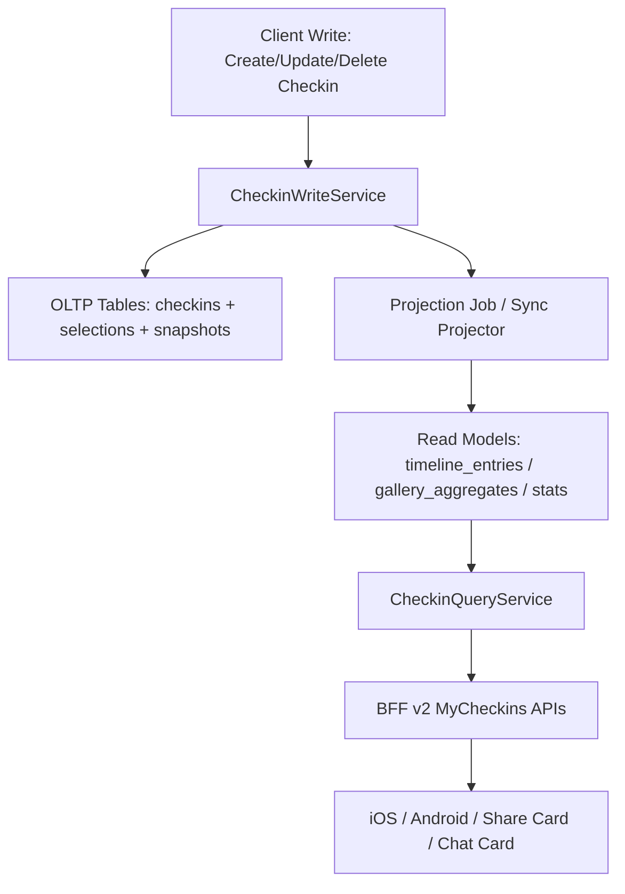

# MyCheckins 商用级架构改造总方案

- 文档版本：`v1.1`
- 创建日期：`2026-05-06`
- 当前状态：`执行中`
- 适用仓库：`/Users/blackie/Projects/raver`
- 适用范围：
  - iOS：`mobile/ios/RaverMVP/RaverMVP/Features/Profile/Views/Checkins/MyCheckinsView.swift`
  - App BFF：`server/src/routes/bff.web.routes.ts`
  - 数据库：`server/prisma/schema.prisma`
- 文档用途：
  - 作为“我的打卡”能力从现状实现迁移到商用级长期架构的唯一主指导文档
  - 作为产品、后端、iOS、Android、测试、运维在改造期间的共同参考基线
  - 作为改造过程中的进度台账、风险台账、验收台账、回滚台账

---

## 0. 文档使用规则

本文件不是一次性的方案说明，而是整个改造周期内持续维护的主文档。

执行规则：

1. 任何涉及“我的打卡”读链路、写链路、数据模型、接口契约、缓存策略、统计口径的改动，必须先更新本文件再实施。
2. 所有阶段性任务完成后，必须同步更新本文的进度表、验收状态和风险状态。
3. 若实现细节与本文不一致，应优先修正文档或在对应章节记录偏差，不允许口头漂移。
4. 本文中的“目标架构”是主线，任何短期补丁不得阻断长期路线。

---

## 0.1 已确认的定制化需求基线

本节记录已经由产品侧明确确认的个性化需求。本文后续所有架构、接口、数据模型、验收口径均以本节为准。

### 0.1.1 已确认决策

1. 本次方案采用“适当折中”的商用路线：
   - 不一味追求极致性能
   - 不以最短开发周期为目标
   - 重点追求长期可维护、读链路稳定、业务口径清晰
2. 历史打卡展示策略固定为：
   - 默认展示打卡当时的快照
   - 允许后台对历史快照做重建和修正
3. 可见性策略固定为：
   - 用户可切换“可见 / 不可见”
   - 一旦可见，对所有可见用户展示范围一致
   - 本次不做好友/关注者/分组等多层 audience 权限
4. 统计口径固定为：
   - `X events` = 活动打卡次数
   - `X artists` = 去重 DJ 数
   - `B2B / B3B` 在“演出次数”口径中算 1 次演出
   - `B2B / B3B` 在“艺人数”口径中按多个 DJ 计算
5. 同一用户对同一活动：
   - 不允许多次活动打卡
   - 允许编辑打卡日期
   - 允许编辑 DJ 选择
   - 允许取消打卡
6. Event attendance selection 长期支持：
   - 选 Day
   - 选 DJ
   - 支持 B2B / B3B
   - 支持后续编辑
   - 支持分享展示
   - 不支持手填未收录艺人
7. 后续能力必须预留：
   - 年度回顾
   - 分享海报
   - 推荐系统输入
   - 用户画像标签
   - 排行榜
   - 勋章
   - 成就
   - 聊天卡片已存在，后续应复用新读模型
8. 性能目标固定为：
   - 首屏最好在 1-2 秒内完成主要内容加载
   - 首屏只需要返回 3 个活动节点即可满足主展示需求
9. 兼容与端侧范围固定为：
   - 不考虑旧版本兼容包袱
   - 允许直接面向新版本实现
   - 当前只做 iOS，不做 Android 同步改造
10. 后台修复能力：
   - 本轮不是立即交付优先项
   - 但文档必须将其定义为未来阶段需要建设的运维/运营修复能力
11. 当前没有现实约束：
   - 可新增数据表
   - 可引入 outbox / worker
   - 可重构服务端
   - 可调整 BFF 契约

### 0.1.2 解释性约束

1. “首屏 3 个活动就可以”在本文中统一解释为：
   - overview 接口默认只返回 3 个活动型 timeline 节点
   - 后续更多内容通过 timeline 分页获取
2. “可见 / 不可见”统一解释为：
   - 本人始终可见自己的完整打卡
   - 对外若不可见，则他人主页不展示打卡内容
   - 对外若可见，则对所有外部查看者展示一致内容

### 0.1.3 本次明确非目标

1. 不做 Android 同步改造
2. 不做旧版本 App 长周期兼容
3. 不做复杂多层 audience 权限系统
4. 不做手填未收录艺人能力

---

## 1. 结论摘要

当前“我的打卡”页面存在明显的非商用级读扩散问题：页面打开时不仅拉取分页打卡列表，还会额外拉取大量活动打卡数据，并在客户端逐条补全 event 详情、DJ 详情和 DJ 搜索匹配，且大部分为串行执行。这种方案在用户规模和打卡规模增长后会持续退化，无法支撑成熟商用体验。

长期可维护、适合商用的方案，不应继续依赖“客户端读时拼装”。正确方向是：

1. 将“我的打卡”从通用 checkin 列表读取，升级为独立的 Timeline / Gallery / Stats 读模型。
2. 将展示所需的 event / DJ 基础字段在写入 checkin 时固化为快照，避免读时回表扩散。
3. 将时间轴聚合、艺人去重、统计口径、卡片展示结构下沉到服务端聚合层。
4. 建立专用的 `MyCheckins Read Model`、缓存层和增量刷新机制。
5. 让 iOS / Android 客户端只消费稳定的 ViewModel 契约，而不是自己在本地推导复杂业务语义。

本文推荐的最终落地架构是：

- 写模型：`Checkin` + `CheckinSnapshot`
- 读模型：`UserCheckinTimelineEntry` + `UserCheckinStats` + `UserCheckinGalleryAggregate`
- 服务层：`CheckinWriteService` + `CheckinProjectionService` + `CheckinQueryService`
- 接口层：专用 `/v2/me/checkins/*` 与 `/v2/users/:id/checkins/*`
- 缓存与投影：同步主写 + 异步投影刷新 + 可回补重建

结合当前已确认定制化需求，最终主路线进一步固定为：

1. 首屏采用“概览 + 3 个活动节点”的轻量模型，优先保证 1-2 秒主内容可见。
2. 历史打卡默认展示快照，但允许后台重建修正。
3. 活动打卡遵循“同一用户同一活动仅一条记录”的领域规则。
4. 当前只面向 iOS 新版本，不承担 Android 与旧版本兼容包袱。

---

## 2. 当前现状基线

### 2.1 当前客户端读链路

当前 iOS 页面入口：

- [MyCheckinsView.swift](/Users/blackie/Projects/raver/mobile/ios/RaverMVP/RaverMVP/Features/Profile/Views/Checkins/MyCheckinsView.swift:656)

页面加载流程：

1. 页面 `task` 触发 `viewModel.reload(service:)`
2. `reload` 调用 `loadMore(reset: true)`
3. 首次进入拉取一页 checkins：`limit=20`
4. 同时额外拉取一次 `type=event` 且 `limit=200` 的活动打卡
5. 合并数据后，对所有相关 `eventId` 逐个请求 `fetchEvent(id:)`
6. 对所有相关 `djId` 逐个请求 `fetchDJ(id:)`
7. 对只有名称没有 ID 的艺人逐个请求 `fetchDJs(search:)`
8. 待上述补全过程结束后，页面才进入成功态

对应代码：

- 分页 + 额外 event-only 拉取：
  - [MyCheckinsView.swift](/Users/blackie/Projects/raver/mobile/ios/RaverMVP/RaverMVP/Features/Profile/Views/Checkins/MyCheckinsView.swift:42)
  - [MyCheckinsView.swift](/Users/blackie/Projects/raver/mobile/ios/RaverMVP/RaverMVP/Features/Profile/Views/Checkins/MyCheckinsView.swift:56)
- 活动补全：
  - [MyCheckinsView.swift](/Users/blackie/Projects/raver/mobile/ios/RaverMVP/RaverMVP/Features/Profile/Views/Checkins/MyCheckinsView.swift:121)
- DJ 按 ID 补全：
  - [MyCheckinsView.swift](/Users/blackie/Projects/raver/mobile/ios/RaverMVP/RaverMVP/Features/Profile/Views/Checkins/MyCheckinsView.swift:167)
- DJ 按名称搜索补全：
  - [MyCheckinsView.swift](/Users/blackie/Projects/raver/mobile/ios/RaverMVP/RaverMVP/Features/Profile/Views/Checkins/MyCheckinsView.swift:189)

### 2.2 当前 BFF 接口现状

当前 iOS 通过通用接口读取：

- `/v1/checkins`
- `/v1/events/:id`
- `/v1/djs/:id`
- `/v1/djs?search=...`

对应实现：

- Checkin 列表读取：
  - [LiveWebFeatureService.swift](/Users/blackie/Projects/raver/mobile/ios/RaverMVP/RaverMVP/Core/LiveWebFeatureService.swift:527)
  - [bff.web.routes.ts](/Users/blackie/Projects/raver/server/src/routes/bff.web.routes.ts:7420)
- Event 详情：
  - [LiveWebFeatureService.swift](/Users/blackie/Projects/raver/mobile/ios/RaverMVP/RaverMVP/Core/LiveWebFeatureService.swift:50)
- DJ 详情：
  - [LiveWebFeatureService.swift](/Users/blackie/Projects/raver/mobile/ios/RaverMVP/RaverMVP/Core/LiveWebFeatureService.swift:214)
- DJ 搜索：
  - [LiveWebFeatureService.swift](/Users/blackie/Projects/raver/mobile/ios/RaverMVP/RaverMVP/Core/LiveWebFeatureService.swift:201)

当前 BFF 的问题不在单次 SQL 是否复杂，而在于：

1. 它只返回了通用 checkin 基础数据，并未返回页面最终所需的稳定读模型。
2. 页面还要继续发多轮二次请求。
3. 页面读路径把聚合逻辑放在客户端，导致多端重复、性能不可控、口径难统一。

### 2.3 当前数据库模型现状

当前 `Checkin` 模型非常轻：

- [schema.prisma](/Users/blackie/Projects/raver/server/prisma/schema.prisma:394)

当前字段：

- `userId`
- `eventId`
- `djId`
- `type`
- `note`
- `photoUrl`
- `rating`
- `attendedAt`
- `createdAt`

当前问题：

1. `note` 同时承担普通文案与 `event_checkin_v1:` 结构化载荷，语义混杂。
2. 页面展示依赖的 event 名称、封面、地址、DJ avatar、DJ country 等字段没有固化快照。
3. 没有 timeline / gallery / stats 的读模型表。
4. 没有 projection 版本、重建标记、数据新鲜度控制字段。

### 2.4 当前业务语义现状

“我的打卡”页面实际承载多个业务目标：

1. 个人打卡历史浏览
2. 时间轴展示
3. 活动画廊
4. DJ 画廊
5. 活动数 / 艺人数统计
6. 分享卡片
7. 与 event attendance selection 关联的结构化演出选择展示

当前这些目标混在同一条首屏链路里，导致页面复杂度和耗时被耦合放大。

---

## 3. 当前问题的根因分析

### 3.1 架构根因

当前实现的问题不是“代码写得不够快”，而是架构分层错误：

1. 将读模型职责放在客户端
2. 将聚合职责放在页面 ViewModel
3. 将展示字段依赖放在跨资源读时回查
4. 将结构化业务语义塞进弱约束 `note` 文本中

### 3.2 商用风险

如果继续沿用当前模式，随着数据增长会带来以下风险：

1. 首屏时间持续线性退化
2. 用户历史越丰富，体验越差
3. iOS / Android / Web 端各自实现同一套拼装逻辑，难以保持一致
4. 排查线上 bug 时无法快速定位问题是在 checkin、event、dj、搜索补全还是排序规则
5. 任何 event / DJ 字段调整都可能隐式影响历史 checkin 页面
6. 后续做消息卡片、分享卡片、统计榜单、年度回顾时复用困难

### 3.3 为什么不应该继续做“客户端小修小补”

仅做以下优化仍然不够：

1. 把串行改并发
2. 做本地缓存
3. 减少第一页请求量

这些只能缓解症状，不能消除根因。真正的问题是：

- 页面不应该知道如何从原始 checkin 推导出完整业务视图。

---

## 4. 改造目标

### 4.1 业务目标

1. 打卡很多的重度用户首屏仍能稳定快速打开
2. 时间轴、画廊、统计结果在多端保持一致
3. 后续支持年度总结、分享卡、消息卡片、推荐系统复用
4. 支持长期字段演进和历史数据兼容
5. 支持简单明确的“可见 / 不可见”对外展示控制

### 4.2 技术目标

1. 首屏读取只访问 1 个主接口即可获得可渲染结果
2. 页面不再依赖逐条 `fetchEvent` / `fetchDJ` / `searchDJ`
3. 结构化打卡选择从 `note` 中解耦
4. 引入可重建、可灰度、可观测的投影层
5. 构建 App 可复用的稳定 BFF 读模型契约
6. 为推荐系统、画像、排行榜、勋章、成就提供统一派生信号出口

### 4.3 性能目标

建议目标：

1. P50 首屏接口时延：`< 300ms`
2. P95 首屏接口时延：`< 1000ms`
3. iOS 首屏主要内容可见时间目标：`1-2s`
4. 首屏 overview 默认仅返回 `3` 个活动节点
5. 首屏网络请求数：`1` 个主读接口，允许 `0-2` 个非阻塞补充接口
6. 打开页面后的阻塞型串行子请求数：`0`

### 4.4 可维护性目标

1. 新增字段只需改写模型和投影器，不需要改多个客户端推导逻辑
2. 历史数据可离线重放重建
3. 投影错误可监控、可重试、可回补
4. 不同视图共享同一读模型来源
5. 可见性口径与统计口径必须由服务端统一收口

---

## 5. 目标架构总览

推荐采用“写模型 + 快照 + 读模型 + 投影”的四层架构。

### 5.1 分层图



### 5.2 四类模型

1. 事实模型 `Checkin`
2. 展示快照模型 `CheckinSnapshot`
3. 结构化选择模型 `CheckinSelection`
4. 读模型 `TimelineEntry / Stats / GalleryAggregate`
5. 派生信号模型 `DerivedSignals`

### 5.3 核心原则

1. 写入时尽量固化展示所需关键字段
2. 读取时尽量直接消费读模型
3. 复杂聚合只在服务端发生
4. 客户端只负责展示，不负责领域拼装
5. 统计口径与可见性规则不允许客户端自由推导

---

## 6. 领域模型重构方案

### 6.1 保留现有 `Checkin` 作为事实主表

`Checkin` 继续承担“用户在某时刻对 event 或 DJ 进行了打卡”这一事实记录。

建议新增字段：

| 字段 | 类型 | 说明 |
| --- | --- | --- |
| `updatedAt` | DateTime | 支持审计与投影增量 |
| `status` | String | `active / deleted / hidden / migrated` |
| `visibility` | String | `private / visible` |
| `source` | String | `ios / android / admin / import / migration` |
| `schemaVersion` | Int | checkin 写入结构版本 |
| `projectionVersion` | Int | 当前投影版本 |

说明：

- 事实表只保存最核心、最可信的数据。
- 不再把所有展示逻辑硬塞进事实表。
- “同一用户同一活动仅一条活动打卡”需要在写服务与数据库约束层双重保证。

### 6.2 新增 `CheckinSelection` 结构化表

将当前编码在 `note` 中的 `event_checkin_v1:` 内容迁出。

建议表：

#### `checkin_selections`

| 字段 | 类型 | 说明 |
| --- | --- | --- |
| `id` | UUID | 主键 |
| `checkinId` | UUID | 归属 checkin |
| `dayId` | String | 业务 day 标识 |
| `dayIndex` | Int | 第几天 |
| `sortOrder` | Int | 顺序 |
| `createdAt` | DateTime | 创建时间 |
| `updatedAt` | DateTime | 更新时间 |

#### `checkin_selection_djs`

| 字段 | 类型 | 说明 |
| --- | --- | --- |
| `id` | UUID | 主键 |
| `selectionId` | UUID | 归属某一天选择 |
| `djId` | String? | 若已绑定 DJ |
| `rawName` | String | 原始名称 |
| `displayName` | String | 展示名 |
| `avatarUrl` | String? | 写入时快照 |
| `country` | String? | 写入时快照 |
| `actType` | String? | `solo/b2b/b3b` |
| `performerIndex` | Int | 在 act 中的位置 |
| `sortOrder` | Int | 顺序 |
| `createdAt` | DateTime | 创建时间 |
| `updatedAt` | DateTime | 更新时间 |

收益：

1. 彻底摆脱 note 文本解析
2. 支持查询、索引、统计和修复
3. 支持未来更丰富的 attendance 结构
4. 显式约束“不支持手填未收录艺人”，降低脏数据与后续匹配成本

### 6.3 新增 `CheckinSnapshot`

建议表：`checkin_snapshots`

用途：固化在打卡发生时，页面展示所需的 event / dj 基础数据。

建议字段：

| 字段 | 类型 | 说明 |
| --- | --- | --- |
| `checkinId` | UUID | 与 checkin 一对一 |
| `userDisplayName` | String | 打卡用户展示名快照 |
| `eventName` | String? | 活动名快照 |
| `eventNameI18n` | Json? | 活动名双语快照 |
| `eventCoverUrl` | String? | 活动封面 |
| `eventCity` | String? | 城市 |
| `eventCountry` | String? | 国家 |
| `eventAddress` | String? | 统一地址文本 |
| `eventStartAt` | DateTime? | 活动开始时间 |
| `eventEndAt` | DateTime? | 活动结束时间 |
| `primaryDjName` | String? | 单 DJ 打卡主展示名 |
| `primaryDjNameI18n` | Json? | 双语 |
| `primaryDjAvatarUrl` | String? | 头像 |
| `primaryDjCountry` | String? | 国家 |
| `selectionSummary` | Json? | 结构化选择摘要 |
| `visibilityResolved` | String | 快照生成时的对外展示状态 |
| `snapshotVersion` | Int | 快照版本 |
| `generatedAt` | DateTime | 快照生成时间 |

设计原则：

1. 快照是展示友好数据，不是唯一真相
2. 历史页面优先展示快照，避免回表抖动
3. 如 event / dj 主数据 later change，可通过重建策略决定是否刷新快照
4. 快照必须能表达 B2B/B3B 的一次演出、多艺人统计语义

### 6.4 新增读模型表

#### `user_checkin_timeline_entries`

每条记录对应页面时间轴中的一个“可渲染节点”。

建议字段：

| 字段 | 类型 | 说明 |
| --- | --- | --- |
| `id` | UUID | 主键 |
| `userId` | UUID | 用户 |
| `timelineDate` | Date | 归属日 |
| `anchorAt` | DateTime | 时间轴排序锚点 |
| `nodeType` | String | `event / dj / mixed / manual_event` |
| `primaryCheckinId` | UUID | 主 checkin |
| `eventId` | UUID? | 活动 |
| `eventName` | String? | 展示名 |
| `eventCoverUrl` | String? | 封面 |
| `eventAddress` | String? | 地址 |
| `payload` | Json | 完整渲染载荷 |
| `statsDjCount` | Int | 节点内艺人数 |
| `statsPerformanceCount` | Int | 节点内演出次数，B2B/B3B 按 1 次演出计 |
| `statsSelectionCount` | Int | 节点内选择数 |
| `projectionVersion` | Int | 投影版本 |
| `updatedAt` | DateTime | 更新时间 |

#### `user_checkin_stats`

按用户维度保存统计摘要。

建议字段：

| 字段 | 类型 | 说明 |
| --- | --- | --- |
| `userId` | UUID | 主键 |
| `eventCount` | Int | 打卡活动数 |
| `artistCount` | Int | 去重艺人数 |
| `eventCheckinCount` | Int | 活动打卡次数 |
| `djCheckinCount` | Int | DJ 打卡次数 |
| `performanceCount` | Int | 演出次数，B2B/B3B 按 1 次计 |
| `latestCheckinAt` | DateTime? | 最新打卡 |
| `projectionVersion` | Int | 投影版本 |
| `updatedAt` | DateTime | 更新时间 |

#### `user_checkin_gallery_dj_aggregates`

按用户 + DJ 聚合，支撑 DJ 画廊。

#### `user_checkin_gallery_event_aggregates`

按用户 + Event 聚合，支撑 Event 画廊。

#### `user_checkin_derived_signals`

按用户沉淀下游复用信号，供年度回顾、推荐系统、用户画像、排行榜、勋章、成就使用。

---

## 7. 服务端职责拆分方案

### 7.1 `CheckinWriteService`

职责：

1. 创建 / 更新 / 删除 checkin
2. 写入 `checkin_selections`
3. 生成或更新 `checkin_snapshots`
4. 投递投影刷新任务
5. 保证幂等与事务一致性
6. 执行“同一用户同一活动仅一条活动打卡”的领域约束

### 7.2 `CheckinProjectionService`

职责：

1. 从事实表和快照表构建 timeline entries
2. 计算 user stats
3. 计算 gallery 聚合
4. 支持按 checkin、按 user、按全量重建
5. 记录投影版本与错误状态
6. 生成推荐系统、画像、排行榜、勋章、成就所需派生信号

### 7.3 `CheckinQueryService`

职责：

1. 直接读取 timeline / gallery / stats 读模型
2. 提供分页、筛选、排序
3. 提供一致化 DTO
4. 隔离客户端与底层真实存储结构
5. 统一执行可见性裁剪

### 7.4 `CheckinBackfillService`

职责：

1. 迁移历史 `note` -> `checkin_selections`
2. 批量补建 `checkin_snapshots`
3. 批量重建所有读模型
4. 失败重试与进度记录

---

## 8. API 重构方案

### 8.1 原则

1. 可以保留 `/v1/checkins` 仅作为迁移辅助，但本次不以旧版本兼容为目标
2. 新页面直接切到 `/v2/*`
3. `/v2` 直接返回可渲染 ViewModel

### 8.2 推荐新接口

#### 8.2.1 我的打卡首页

`GET /v2/me/checkins/overview`

返回：

```json
{
  "stats": {
    "eventCount": 12,
    "artistCount": 43,
    "latestCheckinAt": "2026-05-06T10:00:00Z"
  },
  "timeline": {
    "items": [],
    "pagination": {}
  },
  "gallerySummary": {
    "topEvents": [],
    "topArtists": []
  }
}
```

说明：

- 用于首屏快速渲染
- timeline 默认仅返回 `3` 个活动节点
- stats 与首屏列表一起给出

#### 8.2.2 时间轴分页

`GET /v2/me/checkins/timeline?page=1&limit=20`

返回每个节点所需的完整渲染载荷，不再需要客户端自己回查 event / dj。

#### 8.2.3 活动画廊

`GET /v2/me/checkins/gallery/events?page=1&limit=20`

#### 8.2.4 DJ 画廊

`GET /v2/me/checkins/gallery/djs?page=1&limit=20`

#### 8.2.5 统计摘要

`GET /v2/me/checkins/stats`

#### 8.2.6 公开用户打卡

面向他人主页：

- `GET /v2/users/:id/checkins/overview`
- `GET /v2/users/:id/checkins/timeline`
- `GET /v2/users/:id/checkins/gallery/events`
- `GET /v2/users/:id/checkins/gallery/djs`

### 8.3 写接口重构

推荐新增：

- `POST /v2/checkins`
- `PATCH /v2/checkins/:id`
- `DELETE /v2/checkins/:id`

新接口要求：

1. 接受结构化 selections 数组
2. 服务端直接生成 snapshot
3. 服务端触发 projection
4. 响应直接返回稳定 DTO

### 8.4 DTO 设计原则

1. `ViewModel DTO` 与数据库实体解耦
2. 任何客户端展示必需字段都不允许依赖二次查询
3. `payload` 中可以保留一定扩展空间，但核心字段必须显式化

---

## 9. 客户端改造方案

### 9.1 客户端目标状态

iOS 客户端不再自己做：

1. eventId -> event 逐条详情补全
2. djId -> dj 逐条详情补全
3. raw name -> search DJ 匹配
4. 复杂时间轴节点构建
5. 统计数本地推导

客户端只做：

1. 调用 overview / timeline / gallery / stats 接口
2. 展示 skeleton / empty / failure / success
3. 本地只做轻量排序和 UI 状态处理

### 9.2 iOS 推荐落地方式

新建模块：

- `MyCheckinsV2Repository`
- `MyCheckinsOverviewViewModel`
- `MyCheckinsTimelineViewModel`
- `MyCheckinsGalleryEventsViewModel`
- `MyCheckinsGalleryDJsViewModel`

页面分层：

1. 容器页：负责 mode 切换
2. 时间轴子页：只消费 `TimelineEntryDTO`
3. 画廊活动子页：只消费 `GalleryEventAggregateDTO`
4. 画廊 DJ 子页：只消费 `GalleryDjAggregateDTO`

### 9.3 数据缓存策略

客户端缓存只保留“读模型响应缓存”，不再缓存底层 event / dj 补全过程。

建议：

1. overview：短缓存 30-60 秒
2. timeline 首屏：内存缓存 + 落盘缓存
3. gallery：分页缓存
4. stats：随 overview 缓存

---

## 10. 写时快照策略

### 10.1 为什么必须做写时快照

不做快照就意味着：

1. 页面永远依赖 event / dj 当前状态
2. 历史打卡展示会被主数据修改拖动
3. 页面性能持续依赖跨表与跨接口读扩散

### 10.2 快照生成时机

在以下时机同步生成：

1. 创建 checkin
2. 更新 checkin
3. 删除 checkin 时标记相关投影失效

### 10.3 快照更新策略

建议采用“默认冻结，允许重建”的策略：

1. 历史打卡默认展示打卡时快照
2. 若运营需要修复展示，可触发重建
3. 重建需要可审计，不应默默漂移

---

## 11. 投影与一致性方案

### 11.1 一致性模型

推荐：

1. 写请求事务内写事实表 + 快照表
2. 同步触发轻量 projection enqueue
3. 读模型异步最终一致
4. 对用户自己刚写完后的页面，可返回最新写结果并局部前端乐观更新

### 11.2 投影触发方式

可选方案：

#### 方案 A：应用内异步队列

适合当前阶段快速落地。

#### 方案 B：数据库 outbox + worker

适合正式商用，推荐长期使用。

推荐长期方案：

1. `checkin_outbox_events`
2. worker 拉取并投影
3. 失败重试
4. 死信告警

### 11.3 投影粒度

按用户维度重建，而不是每次全量重建全库。

触发策略：

1. 某个 checkin 变更 -> 标记对应 user dirty
2. worker 合并一段时间内同 user 多次变更
3. 统一重建该用户的 timeline / stats / gallery

这样实现简单、正确性高，且足以覆盖当前规模。

---

## 12. 数据迁移方案

### 12.1 迁移目标

将现有线上历史数据迁移到新结构，且不影响旧功能可用。

### 12.2 迁移步骤

#### 阶段 1：扩表不切流

1. 新增 `updatedAt / status / schemaVersion / projectionVersion`
2. 新建 `checkin_selections`
3. 新建 `checkin_selection_djs`
4. 新建 `checkin_snapshots`
5. 新建各类读模型表
6. 新建 outbox 表

#### 阶段 2：历史解析回填

1. 扫描历史 `checkins`
2. 解析 `note` 中 `event_checkin_v1:` payload
3. 写入 `checkin_selections` 与 `checkin_selection_djs`
4. 对无法解析的记录打标签进入人工或脚本二次处理

#### 阶段 3：构建快照

1. 从当前 event / dj 数据生成历史快照
2. 记录快照版本与生成时间

#### 阶段 4：构建投影

1. 逐用户生成 timeline
2. 逐用户生成 stats
3. 逐用户生成 gallery

#### 阶段 5：灰度切流

1. 内部环境先切 iOS debug
2. 再切小流量用户
3. 验证性能、口径和分享卡一致性
4. 再切正式流量

### 12.3 兼容期策略

兼容期内：

1. `/v1/checkins` 仅作为短期迁移观察与回滚辅助
2. `note` 仍可读，但新写入优先结构化表
3. iOS 新版本直接以 `/v2` 为主，不以长期回退 `/v1` 为设计前提

---

## 13. 分阶段实施路径

### 13.1 Phase 0：观测与冻结

目标：

1. 停止继续在客户端叠加拼装逻辑
2. 补齐监控，量化当前问题

任务：

1. 给 iOS 页面埋点：
   - 首屏请求开始
   - 首屏接口完成
   - event hydration 完成
   - dj hydration 完成
   - 页面首次可交互
2. 给 BFF 埋点：
   - `/v1/checkins` QPS / P50 / P95
   - `/v1/events/:id` 来源于 MyCheckins 的调用量
   - `/v1/djs/:id` 来源于 MyCheckins 的调用量
   - `/v1/djs?search=` 来源于 MyCheckins 的调用量

交付标准：

1. 有现状基线数据
2. 能证明性能瓶颈分布

### 13.2 Phase 1：数据结构升级

目标：

1. 引入结构化 selections
2. 引入 snapshot

任务：

1. Prisma schema 设计与 migration
2. create / update checkin 改造
3. 历史 note parser 脚本

交付标准：

1. 新写入全部同时写结构化表
2. 历史数据解析成功率达到目标

### 13.3 Phase 2：服务端读模型

目标：

1. 产出 timeline / stats / gallery

任务：

1. `CheckinProjectionService`
2. `CheckinQueryService`
3. `/v2/me/checkins/*`
4. `/v2/users/:id/checkins/*`

交付标准：

1. 新接口具备完整首屏能力
2. 不需要客户端额外回查 event / dj

### 13.4 Phase 3：iOS 切换

目标：

1. iOS 全量切到 `/v2`

任务：

1. 新 repository
2. 新 view model
3. 新 DTO 渲染
4. 老 hydration 路径删除

交付标准：

1. 页面首屏请求数显著下降
2. 打卡大户也能稳定打开

### 13.5 Phase 4：Share / Chat Card / Signals 复用

目标：

1. 统一当前 iOS 生态内所有消费方，并为未来增长能力供数

任务：

1. 分享卡片从 overview / stats 直接读取
2. 聊天卡片从 read model 读取
3. 产出推荐系统、画像、排行榜、勋章、成就所需信号

### 13.6 Phase 5：清理旧链路

目标：

1. 清理 `/v1` 依赖
2. 移除 note 解析主路径

---

## 14. 可观测性与运维方案

### 14.1 核心指标

必须监控：

1. `/v2/me/checkins/overview` P50 / P95 / error rate
2. timeline query rows / payload size
3. projection backlog size
4. projection retry count
5. snapshot generation failure count
6. 历史回填进度

### 14.2 日志与追踪

每次投影任务必须记录：

1. userId
2. source event id / checkin id
3. projection version
4. rebuild duration
5. result count
6. error reason

### 14.3 运维工具

建议提供内部脚本或 admin endpoint：

1. 重新投影指定 user
2. 重新投影指定 checkin
3. 全量重建 dry-run
4. 查看某用户 timeline payload

说明：

这部分你刚才提到“暂时不急”，这里补充解释它的业务意义。所谓“后台修复能力”，指的是未来给运营、客服或技术支持准备的一组内部修复工具，用来处理以下场景：

1. 某用户历史打卡展示异常，需要重新生成 timeline
2. 某条打卡快照用了旧活动名或旧 DJ 信息，需要重建快照
3. 某 DJ 发生合并、去重或资料修复后，需要同步修正打卡展示
4. 某次迁移或投影失败后，需要对指定用户或指定记录做补建

本轮可以先不开发这些工具，但架构上必须预留。

---

## 15. 测试与验收方案

### 15.1 单元测试

覆盖：

1. note -> selections parser
2. snapshot generator
3. timeline projector
4. stats projector
5. gallery projector
6. 去重规则
7. act type 解析

### 15.2 集成测试

覆盖：

1. create checkin -> snapshot -> projection -> query
2. update checkin -> projection refresh
3. delete checkin -> projection refresh
4. mixed event + dj timeline case
5. b2b / b3b / raw name fallback case

### 15.3 回归测试

重点验证：

1. 我的打卡页面
2. 他人主页打卡页
3. 分享卡片
4. 聊天中的 my_checkins card
5. 活动打卡编辑能力

### 15.4 业务验收口径

验收标准不是“代码跑通”，而是：

1. 页面首屏更快
2. 统计口径稳定
3. 历史数据可兼容
4. iOS 与服务端口径一致
5. 运维可修复

---

## 16. 风险与应对

### 16.1 风险：历史 note 解析失败

应对：

1. 保留 fallback parser
2. 标注失败记录
3. 允许人工修复与重复回填

### 16.2 风险：快照与主数据不一致

应对：

1. 明确快照为展示冻结数据
2. 提供手动重建工具
3. 对高价值字段保留版本号

### 16.3 风险：投影最终一致带来短暂延迟

应对：

1. 客户端写后乐观更新
2. overview 支持直读最新写结果合并
3. worker 延迟目标控制在秒级

### 16.4 风险：迁移期间双写复杂

应对：

1. 先在服务端内部双写
2. 客户端无感切流
3. 建立双写校验对账脚本

---

## 17. 不推荐的方案

以下方案不建议作为长期主线：

1. 继续维持 `/v1/checkins` + 客户端补全
2. 只做客户端并发优化，不做读模型
3. 只做本地缓存，不改服务端契约
4. 把更多结构继续编码进 `note`
5. 让 event / dj 详情接口承载 timeline 聚合职责
6. 为了兼容旧版本而牺牲新架构清晰度

这些方案都不具备长期可维护性。

---

## 18. 推荐的技术落地顺序

如果从真实工程推进效率出发，推荐顺序如下：

1. 加埋点与现状量化
2. 设计 Prisma migration
3. 实现结构化 selections 与 snapshots
4. 补历史回填脚本
5. 实现 projection tables
6. 实现 `/v2/me/checkins/overview`
7. iOS 首屏切到 overview
8. 实现 timeline / gallery 子接口
9. iOS 全面切流
10. 分享卡 / 聊天卡 / 派生信号复用
11. 清理旧 hydration 逻辑

这是投入产出比最高、风险最低的路径。

---

## 19. 本仓库建议新增或改造的文件清单

### 19.1 服务端

建议新增：

- `server/src/services/checkins/checkin-write.service.ts`
- `server/src/services/checkins/checkin-projection.service.ts`
- `server/src/services/checkins/checkin-query.service.ts`
- `server/src/services/checkins/checkin-backfill.service.ts`
- `server/src/routes/checkins-v2.routes.ts`
- `server/src/scripts/checkin-backfill-run.ts`
- `server/src/scripts/checkin-reproject-user.ts`

建议改造：

- `server/prisma/schema.prisma`
- `server/src/routes/bff.web.routes.ts`

### 19.2 iOS

建议新增：

- `mobile/ios/RaverMVP/RaverMVP/Features/Profile/Views/Checkins/MyCheckinsV2Models.swift`
- `mobile/ios/RaverMVP/RaverMVP/Features/Profile/Views/Checkins/MyCheckinsV2Repository.swift`
- `mobile/ios/RaverMVP/RaverMVP/Features/Profile/Views/Checkins/MyCheckinsOverviewViewModel.swift`
- `mobile/ios/RaverMVP/RaverMVP/Features/Profile/Views/Checkins/MyCheckinsTimelineView.swift`
- `mobile/ios/RaverMVP/RaverMVP/Features/Profile/Views/Checkins/MyCheckinsGalleryEventsView.swift`
- `mobile/ios/RaverMVP/RaverMVP/Features/Profile/Views/Checkins/MyCheckinsGalleryDJsView.swift`

建议改造：

- `mobile/ios/RaverMVP/RaverMVP/Core/WebFeatureService.swift`
- `mobile/ios/RaverMVP/RaverMVP/Core/LiveWebFeatureService.swift`
- `mobile/ios/RaverMVP/RaverMVP/Features/Profile/Views/Checkins/MyCheckinsView.swift`

---

## 20. 进度台账

本节从现在开始作为整个改造过程中的主进度记录区。

### 20.0 主线推进图

本项目后续开发必须始终围绕一条主线推进：

> 先把 MyCheckins 从客户端拼装与多接口补查，迁移为服务端稳定 DTO 输出；再把服务端查询从写模型直读，收敛为可重建、可监控、可扩展的 read model；最后让分享、聊天卡片、年度回顾、推荐输入等扩展能力复用同一套数据底座。

任何新增想法如果不服务于这条主线，默认进入“后续扩展池”，不进入当前阶段开发。

#### 20.0.1 大步骤总览

- [ ] Step 0 口径冻结与现状观测
- [ ] Step 1 数据事实层升级
- [x] Step 2 服务端查询 DTO 升级
- [x] Step 3 iOS 主链路切换
- [x] Step 4 read model / projection 商用化
- [ ] Step 5 gallery / stats / signals 扩展
- [x] Step 6 旧链路清理与运营工具收口

#### 20.0.2 分层级实施清单

##### Step 0 口径冻结与现状观测

目标：先把“慢在哪里、算什么、展示什么”固定下来，避免边开发边改口径。

- [ ] S0.1 冻结 MyCheckins 当前旧逻辑，不再向 `/v1/checkins` 增加新业务语义
- [ ] S0.2 补 iOS 页面耗时埋点
- [ ] S0.3 补 BFF 接口耗时与调用量埋点
- [x] S0.4 确认统计口径：`X events` 为活动打卡次数，`X artists` 为去重 DJ 数
- [x] S0.5 确认可见性口径：`visible / private`
- [x] S0.6 确认同用户同活动只能第一次打卡，允许编辑与取消
- [x] S0.7 确认 DJ 身份口径：活动阵容、timetable、打卡 sheet、MyCheckins 统计/归类均只以唯一 `djId` 为身份依据，不再用名字或别名匹配补身份
- [x] S0.8 确认表演单位口径：一个 timetable/lineup card 是一个 `performance unit`，内部可包含 solo / B2B / B3B 的多个 performers，统计演出次数按 unit 计，艺人数按 performer `djId` 去重
- [x] S0.9 确认无唯一 `djId` DJ 口径：允许展示；Event lineup / timetable / MyCheckins 点击不跳详情，统一弹系统提示；打卡 sheet 可选择并保存展示快照；统计、归类、详情路由仍只认真实 `djId`

收口询问点：

- [ ] 是否暂时冻结新增产品规则，只围绕当前确认口径继续开发？

##### Step 1 数据事实层升级

目标：把用户打卡从“note 字符串 + 客户端解析”升级为结构化事实数据。

- [x] S1.1 Prisma schema 第一版完成
- [x] S1.2 `CheckinSnapshot` 模型完成
- [x] S1.3 `CheckinSelection / CheckinSelectionDJ` 模型完成
- [x] S1.4 `CheckinOutboxEvent` 模型完成
- [x] S1.5 migration SQL 初稿完成
- [x] S1.6 `/v2/checkins` create / patch / delete 写路径完成
- [x] S1.7 snapshot 创建与更新逻辑完成
- [x] S1.8 selections 结构化写入完成
- [x] S1.9 历史回填脚本初版完成
- [ ] S1.10 migration 在正式目标库执行前复核
- [ ] S1.11 历史回填在目标库执行并验收

收口询问点：

- [ ] 是否将 Phase 1 数据结构升级标记为正式收口？

##### Step 2 服务端查询 DTO 升级

目标：iOS 页面展示需要的数据由服务端一次性给出，客户端不再承担业务聚合职责。

- [x] S2.1 overview DTO 设计完成
- [x] S2.2 `/v2/me/checkins/overview` 首版完成
- [x] S2.3 `/v2/users/:id/checkins/overview` 首版完成
- [x] S2.4 timeline DTO 设计完成
- [x] S2.5 `/v2/me/checkins/timeline` 首版完成
- [x] S2.6 `/v2/users/:id/checkins/timeline` 首版完成
- [x] S2.7 gallery events DTO 与接口完成
- [x] S2.8 gallery DJs DTO 与接口完成
- [x] S2.9 stats 独立 DTO 与接口完成
- [x] S2.10 查询接口从写模型直读切到 read model

当前策略说明：

- overview / timeline / gallery / stats 已经具备稳定接口形态，并已切为 strict read model 查询。
- 在 read model 完成前，不再继续扩散 overview / timeline / gallery / stats 的返回字段，除非是 iOS 当前页面首屏必需字段。

收口询问点：

- [x] overview / timeline 先作为 v2 查询第一阶段收口，暂停继续加字段，转向 gallery / stats

##### Step 3 iOS 主链路切换

目标：让 iOS MyCheckins 页面从旧的多接口加载链路，切到 v2 查询链路。

- [x] S3.1 iOS overview DTO 增加完成
- [x] S3.2 `WebFeatureService` overview / timeline 方法增加完成
- [x] S3.3 `LiveWebFeatureService` overview / timeline 对接完成
- [x] S3.4 `MockWebFeatureService` overview / timeline 对接完成
- [x] S3.5 MyCheckins 首屏切到 overview
- [x] S3.6 MyCheckins “加载更多”切到 timeline
- [x] S3.7 首屏 timeline 只取 3 个 event 节点
- [x] S3.8 MyCheckins 活动画廊 UI 直接消费 v2 gallery events DTO
- [x] S3.9 MyCheckins DJ 画廊 UI 直接消费 v2 gallery DJs DTO
- [x] S3.10 MyCheckins 顶部统计优先使用 v2 stats / overview stats
- [x] S3.11 MyCheckins timeline UI 直接消费 v2 timeline DTO，移除临时 `WebCheckin` 桥接
- [x] S3.12 清理页面残余 event / DJ hydration 兜底逻辑
- [x] S3.13 iOS 手工验收首屏 1-2s 目标

收口询问点：

- [x] 接受当前“DTO 到旧 UI 模型桥接”作为临时阶段收口，先推进 gallery / stats 与服务端 read model

##### Step 4 read model / projection 商用化

目标：把当前直读查询升级为真正可重建、可监控、适合商用规模的投影系统。

- [x] S4.1 projection tables migration 执行确认
- [x] S4.2 checkin outbox 消费 worker 完成
- [x] S4.3 timeline projector 完成
- [x] S4.4 stats projector 完成
- [x] S4.5 gallery events projector 完成
- [x] S4.6 gallery DJs projector 完成
- [x] S4.7 单用户 reproject 工具完成
- [x] S4.8 snapshot 后台重建修正能力完成
- [x] S4.9 projectionVersion / freshness 监控完成
- [x] S4.10 overview / timeline / gallery / stats 查询切到 read model

收口询问点：

- [x] read model 切换完成后，冻结 v2 查询 DTO 一版作为商用稳定合同

##### Step 5 gallery / stats / signals 扩展

目标：围绕同一套 MyCheckins 数据底座，支持画廊、统计、分享和未来增长能力。

- [x] S5.1 活动画廊分页接口
- [x] S5.2 DJ 画廊分页接口
- [x] S5.3 stats 独立接口
- [ ] S5.4 分享海报数据输入预留
- [ ] S5.5 聊天卡片数据输入复用
- [ ] S5.6 年度回顾输入预留
- [ ] S5.7 推荐系统输入预留
- [ ] S5.8 用户画像标签输入预留
- [ ] S5.9 排行榜 / 勋章 / 成就输入预留

收口询问点：

- [x] gallery / stats 完成后，先停止扩展型功能，只做稳定性与性能验收；年度回顾、分享海报、推荐、画像、排行榜、勋章、成就继续停留在预留层，不进入当前主线实现

##### Step 6 旧链路清理与运营工具收口

目标：让系统进入可维护状态，减少双链路长期并存带来的风险。

- [x] S6.1 MyCheckins 页面停止依赖 `/v1/checkins` 主链路
- [x] S6.2 删除或降级旧客户端拼装逻辑
- [x] S6.3 删除不再需要的 event / DJ 补查路径
- [x] S6.4 补齐接口监控与错误告警
- [x] S6.5 补齐 projection backlog / retry 监控
- [x] S6.6 补齐 reproject / backfill 操作文档
- [x] S6.7 完成一次端到端回归验收
- [x] S6.8 取消打卡写路径收口：iOS delete 统一走 `/v2/checkins/:id`，旧 `/v1/checkins/:id` delete 兜底改为软删除并重建 projection，MyCheckins 监听打卡变更后强制刷新

收口询问点：

- [ ] 是否将 MyCheckins v2 改造标记为商用版本收口？当前代码与文档已具备收口条件，建议下一轮只做最终确认，不继续扩展新功能

#### 20.0.3 防扩散规则

为了保证开发过程不飘，后续所有新增需求按以下规则处理：

1. 当前阶段只做能推进主线的事项。
2. 新想法如果属于年度回顾、海报、推荐、画像、排行榜、勋章、成就，默认只做字段和接口预留，不实现完整功能。
3. 如果某个任务已经满足当前阶段验收口径，先问是否收口，再决定是否继续扩展。
4. 不因为发现旧逻辑可顺手优化，就扩大本阶段范围；除非它阻塞当前主线。
5. 每完成一个可验收节点，更新本节 checklist 与 `20.3 变更日志`。
6. 每次继续开发前，优先选择当前主线中最靠前的未完成小步骤。
7. MyCheckins v2 当前已进入收口阶段，除缺陷修复、监控告警、验收补充外，不再追加新产品能力。

#### 20.0.4 下一步推荐队列

按当前状态，下一步优先级如下：

1. S1.10 / S1.11：正式目标库历史回填 apply 与结果验收。
2. 最终收口确认：确认是否将 MyCheckins v2 改造标记为商用版本收口。
3. read model 查询已进入 strict 模式；后续只做缺陷修复、正式监控接入和发布验收，不继续扩展功能。

当前建议先收口的问题：

- [x] overview / timeline 首版接口和 iOS 切换作为一个小阶段收口
- [x] 下一轮聚焦 gallery / stats，不继续扩展其它展示玩法

当前主线锁定：

- [x] 本轮停止向 overview / timeline 继续扩字段
- [x] 本轮不展开年度回顾、分享海报、推荐、排行榜、勋章、成就等展示玩法
- [x] S2.7 / S2.8 / S2.9 已完成：gallery events、gallery DJs、stats 查询接口
- [x] S3.8 / S3.9 / S3.10 已完成：gallery / stats UI 接入 v2 数据源
- [x] S3.11 / S3.12 已完成：timeline UI 去除 `WebCheckin` 桥接与残余 hydration 兜底
- [x] S3.13 已完成：用户手工验收确认首屏稳定、整体正常
- [x] S4.1 已完成：本地目标库 `raver_dev` migration 执行确认、结构访问验证与 worker dry run 通过
- [x] S4.2-S4.6 已完成：outbox worker 与 timeline / stats / gallery events / gallery DJs projector 代码地基完成
- [x] S4.7 已完成：单用户 reproject 工具落地，默认 dry-run，显式 `--apply` 才写 projection 表
- [x] S4.8-S4.10 已完成：snapshot 重建、projection freshness 监控、read model 优先查询与 fallback 已落地
- [x] read model fallback 已移除，v2 查询 DTO 已冻结为当前商用稳定合同
- [x] 正式监控告警基础、回滚 Runbook 与最终回归已完成；下一步只做最终商用版本收口确认，不扩散到自动加载更多、年度回顾、海报、推荐、排行榜、勋章、成就等体验或增长功能

### 20.1 总进度

| 阶段 | 状态 | 负责人 | 开始日期 | 完成日期 | 备注 |
| --- | --- | --- | --- | --- | --- |
| Phase 0 观测与冻结 | 未开始 | 待分配 |  |  |  |
| Phase 1 数据结构升级 | 进行中 | Codex | 2026-05-06 |  | Prisma schema、`/v2/checkins` 写路径、migration 初稿已落地 |
| Phase 2 服务端读模型 | 已完成 | Codex | 2026-05-06 | 2026-05-06 | overview / timeline / gallery / stats 已切为 strict read model；projection rebuild、worker、freshness、snapshot 修正脚本已落地；本地数据层与 iOS 端到端验收已通过；v2 查询 DTO 已冻结 |
| Phase 3 iOS 切换 | 已完成 | Codex | 2026-05-06 | 2026-05-06 | MyCheckins 首屏 overview、timeline 分页、gallery / stats 与 timeline UI 已切到 v2 DTO；用户手工验收确认首屏稳定、整体正常；timeline / gallery 加载更多已改为滑动到底部自动触发 |
| Phase 4 分享/卡片/信号复用 | 未开始 | 待分配 |  |  |  |
| Phase 5 清理旧链路 | 已完成 | Codex | 2026-05-06 | 2026-05-06 | MyCheckins 展示主链路已停止依赖 `/v1/checkins`；监控状态接口、freshness 退出码与 Runbook 已补齐 |

#### Phase Checklist

- [ ] Phase 0 观测与冻结
- [ ] Phase 1 数据结构升级
- [x] Phase 2 服务端读模型
- [x] Phase 3 iOS 切换
- [ ] Phase 4 分享 / 卡片 / 信号复用
- [x] Phase 5 清理旧链路

### 20.2 任务清单

| 编号 | 任务 | 状态 | 负责人 | 备注 |
| --- | --- | --- | --- | --- |
| MC-001 | 现网 MyCheckins 链路埋点 | 未开始 |  |  |
| MC-002 | Prisma 新模型设计评审 | 已完成 | Codex | `schema.prisma` 第一版已完成并通过 `prisma validate` / `prisma generate` |
| MC-003 | checkin selections migration | 进行中 | Codex | migration SQL 初稿已生成，待执行与回填脚本接入 |
| MC-004 | snapshot 生成逻辑 | 进行中 | Codex | `/v2/checkins` create / patch / delete 已接入 snapshot 写入与更新 |
| MC-005 | projection 表与 worker | 已完成 | Codex | projection 表结构、用户级/批量 rebuild、outbox worker、freshness、状态接口与 Runbook 已落地；本地数据层与 iOS 端到端验收已通过 |
| MC-006 | overview 接口 | 已完成 | Codex | `/v2/me/checkins/overview` 与 `/v2/users/:id/checkins/overview` 已切 strict read model，projection 不可用时返回 `CHECKIN_PROJECTION_NOT_READY` |
| MC-007 | timeline 接口 | 已完成 | Codex | `/v2/me/checkins/timeline` 与 `/v2/users/:id/checkins/timeline` 已切 strict read model，projection 不可用时返回 `CHECKIN_PROJECTION_NOT_READY` |
| MC-008 | gallery / stats 接口 | 已完成 | Codex | `/v2/*/checkins/gallery/events`、`/v2/*/checkins/gallery/djs`、`/v2/*/checkins/stats` 已切 strict read model，projection 不可用时返回 `CHECKIN_PROJECTION_NOT_READY` |
| MC-009 | iOS overview 接入 | 已完成 | Codex | MyCheckins 首屏已接入 `/v2/*/checkins/overview`，并完成 overview DTO 到现有 UI 模型的桥接 |
| MC-010 | iOS 全量切流 | 已完成 | Codex | MyCheckins 首屏 overview、timeline 分页、gallery、stats 与 timeline UI 已切到 v2 DTO；用户手工验收确认首屏稳定、整体正常；timeline / gallery 加载更多已改为滑动到底部自动触发 |
| MC-011 | 历史数据回填 | 进行中 | Codex | 回填脚本初版已落地；projection 历史重建已在本地目标库 apply 并验收，selections 历史回填正式库执行仍保持待确认 |
| MC-012 | 监控与回滚工具 | 已完成 | Codex | 新增 projection health 共享服务、admin/operator 状态接口、freshness 退出码和 `MYCHECKINS_PROJECTION_RUNBOOK.md` |

#### Task Checklist

- [ ] MC-001 现网 MyCheckins 链路埋点
- [x] MC-002 Prisma 新模型设计评审
- [ ] MC-003 checkin selections migration
- [ ] MC-004 snapshot 生成逻辑
- [x] MC-005 projection 表与 worker
- [x] MC-006 overview 接口
- [x] MC-007 timeline 接口
- [x] MC-008 gallery / stats 接口
- [x] MC-009 iOS overview 接入
- [x] MC-010 iOS 全量切流
- [ ] MC-011 历史数据回填
- [x] MC-012 监控与回滚工具

#### 当前已收口事项

- [x] `server/prisma/schema.prisma` 第一版数据结构已完成并通过 `prisma validate` / `prisma generate`
- [x] `/v2/checkins` create / patch / delete 写路径已落地
- [x] `server/prisma/migrations/20260506195019_add_mycheckins_v2_foundation/migration.sql` 初稿已生成
- [x] `server/prisma/backfill-checkin-selections-snapshots.ts` 回填脚本初版已落地
- [x] `/v2/me/checkins/overview` 与 `/v2/users/:id/checkins/overview` 首版已落地
- [x] `/v2/me/checkins/timeline` 与 `/v2/users/:id/checkins/timeline` 首版已落地
- [x] `/v2/me/checkins/gallery/events` 与 `/v2/users/:id/checkins/gallery/events` 首版已落地
- [x] `/v2/me/checkins/gallery/djs` 与 `/v2/users/:id/checkins/gallery/djs` 首版已落地
- [x] `/v2/me/checkins/stats` 与 `/v2/users/:id/checkins/stats` 首版已落地
- [x] iOS MyCheckins 首屏已切到 `overview`
- [x] iOS MyCheckins “加载更多”已切到 `timeline`
- [x] iOS MyCheckins timeline / gallery 分页已由手动按钮改为滑动到底部自动触发
- [x] iOS MyCheckins 活动画廊已切到 v2 gallery events 独立分页接口
- [x] iOS MyCheckins DJ 画廊已切到 v2 gallery DJs 独立分页接口
- [x] iOS MyCheckins 顶部统计与分享统计优先使用 v2 stats / overview stats
- [x] iOS MyCheckins timeline UI 已直接消费 v2 timeline DTO，移除临时 `WebCheckin` 桥接
- [x] iOS MyCheckins 页面残余 event / DJ hydration 兜底逻辑已清理
- [x] iOS MyCheckins 首屏 1-2s 目标已由用户手工验收确认，首屏稳定、整体正常
- [x] Phase 3 iOS 切换已收口；加载更多体验已改为滑动到底部自动触发
- [x] MyCheckins gallery DJ 分页合并改为保留已有顺序、只追加新增 DJ，避免点击加载更多后整体视图重排
- [x] MyCheckins 页面从 DJ 详情返回时不再重复执行非强制首屏 reload，避免 gallery DJ 回退后重置为首屏 6 个头像
- [x] B2B / B3B DJ 身份补齐升级到 projection v3：投影重建只按唯一 `djId` 补齐 performer `avatarUrl / country`，不再按名称或别名匹配；缺少 `djId` 的历史 performer 不参与 DJ 归类与艺人数统计
- [x] Event lineup / timetable / checkin sheet 已统一以 `WebEventLineupSlot` 作为 performance unit，服务端返回 `lineupSlots[].djs` 作为唯一 id performer 列表
- [x] iOS event 打卡写入已切到 `/v2/checkins` 结构化 selections：B2B / B3B 会展开为多个 performer 写入同一 `actGroupId`；有唯一 `djId` 的 performer 写真实 ID，无 ID performer 仅保存展示快照且不参与统计/归类/详情路由
- [x] 无 ID DJ 补充入口已接入：所有展示态无 ID DJ 点击统一弹出“关闭 / 去补充”系统提示，`去补充` 跳转到 DJ 导入页并预填当前 DJ 名称
- [x] projection tables migration 结构已在 schema 与 migration 初稿中确认：timeline / stats / gallery events / gallery DJs / derived signals / outbox 表均已具备
- [x] projection tables migration 已在本地目标库 `raver_dev` 执行确认，`prisma migrate status` 显示 schema up to date
- [x] projection / outbox 表结构已通过 Prisma Client count 访问验证
- [x] `rebuildUserCheckinProjection(userId)` 用户级 projection rebuild service 已落地，可重复重建 timeline / stats / gallery events / gallery DJs projection
- [x] `runCheckinProjectionWorkerOnce` outbox worker 已落地，会按 pending outbox 聚合 userId、重建 projection、成功标记 processed、失败 retry/dead
- [x] `/v2/checkins` 创建 / 编辑 / 删除写路径已接入写后同步刷新：接口返回前重建当前用户 projection，并把对应 pending outbox 标记为 processed，避免用户编辑后立刻进入 MyCheckins 出现 `Projection not ready`
- [x] `checkins:projection:run` 手动运维脚本已加入 `server/package.json`
- [x] `pnpm checkins:projection:run` dry run 已通过，当前 pending outbox 为 0 时返回 `scanned=0 usersRebuilt=0 processed=0 failed=0`
- [x] `checkins:reproject:user` 单用户 reproject 运维脚本已加入 `server/package.json`，默认 dry-run，使用 `--apply` 后才写入 projection 表
- [x] `checkins:reproject:dirty` 批量 dirty 用户 reproject 运维脚本已加入 `server/package.json`，默认 dry-run
- [x] `checkins:snapshots:rebuild` snapshot 后台重建修正脚本已加入 `server/package.json`，默认 dry-run
- [x] `checkins:projection:freshness` projection freshness / backlog / retry 监控脚本已加入 `server/package.json`
- [x] overview / timeline / gallery / stats v2 查询已切为 strict read model；projection 缺失或不新鲜时返回 `CHECKIN_PROJECTION_NOT_READY`
- [x] 本地 `uploadtester` 已执行单用户 projection apply 验证：`all=13`、`timeline=13`、`gallery events=13`、`gallery DJs=90`
- [x] 全量历史 checkin projection apply 与结果验收通过：`dirtyCheckins=0`、`pendingOutbox=0`、`deadOutbox=0`、`projectedUsers=6`
- [x] iOS 端到端验收通过：首屏、顶部统计、timeline 手动加载更多、活动画廊分页、DJ 画廊分页、private 可见性均正常
- [x] MyCheckins 页面展示主链路已停止依赖 `/v1/checkins`，overview / timeline / gallery / stats 均走 `/v2/*/checkins/*`
- [x] `/v1/checkins` 旧方法仅作为其他通用 checkin 入口/写入口遗留存在，不再作为 MyCheckins 展示主链路
- [x] iOS `deleteCheckin(id:)` 已从 `/v1/checkins/:id` 改为 `/v2/checkins/:id`，取消打卡会触发 v2 soft delete、outbox、同步 projection rebuild
- [x] iOS create / update / delete checkin 成功后统一发布 `.raverCheckinsDidMutate`，MyCheckins 本人页面监听后会 invalidate 已加载状态并强制重拉 overview / timeline / gallery
- [x] 服务端 `/v1/checkins/:id` delete 旧入口已降级为兼容兜底：不再 hard delete，而是写 `status=deleted`、`projectionVersion=0` 并 best-effort 重建用户 projection
- [x] `server/src/services/checkin-projection-status.ts` 已新增，统一 freshness script 与 admin 状态接口的健康判断
- [x] `/v2/admin/checkins/projection/status` 已新增，仅 admin/operator 可访问
- [x] `docs/MYCHECKINS_PROJECTION_RUNBOOK.md` 已新增，覆盖日常巡检、告警阈值、degraded/critical 修复、snapshot rebuild、`CHECKIN_PROJECTION_NOT_READY` 和回滚策略
- [x] `pnpm build` 已通过
- [x] `xcodebuild -workspace mobile/ios/RaverMVP/RaverMVP.xcworkspace -scheme RaverMVP -sdk iphonesimulator -configuration Debug build` 已通过
- [x] projection v3 历史重建 apply 与 freshness 验收：本轮已将 `projectionVersion` 升为 3，已执行 `pnpm checkins:reproject:dirty -- --limit 50 --apply` 并通过 `pnpm checkins:projection:freshness` 验收，当前 `status=healthy`

#### 当前未收口事项

- [ ] 最终收口确认：是否将 MyCheckins v2 改造标记为商用版本收口

### 20.3 变更日志

#### 2026-05-07

- 修复 Event 详情页取消打卡后 MyCheckins timeline / gallery 仍显示旧活动和 DJ 的问题：
  - 现象：用户在 Event 详情页取消打卡后，重新进入 MyCheckins timeline，已取消的活动和 DJ 仍然存在
  - 根因：iOS `deleteCheckin(id:)` 仍调用 `/v1/checkins/:id`；MyCheckins 已切到 v2 projection read model，旧 v1 delete 是 hard delete，未触发 v2 projection 重建，导致 read model 残留旧 timeline / gallery rows
  - 修复：iOS delete 统一改为 `/v2/checkins/:id`；v2 delete 会 soft delete checkin、写 outbox、同步重建当前用户 projection，并把 pending outbox 标记为 processed
  - 客户端刷新：create / update / delete checkin 成功后统一发布 `.raverCheckinsDidMutate`；MyCheckins 本人页面收到后 invalidate loaded state 并 force reload，避免返回页面继续使用旧内存状态
  - 旧入口兜底：服务端 `/v1/checkins/:id` delete 已改为 soft delete + best-effort projection rebuild，防止未来其他遗留入口继续制造 stale projection
  - 数据恢复：已对当前有 projection 的用户执行 projection rebuild，随后 `pnpm checkins:projection:freshness` 返回 `status=healthy`、`dirtyCheckins=0`、`pendingOutbox=0`、`deadOutbox=0`
  - 验证：`server pnpm build` 通过；`pnpm checkins:projection:freshness` 通过；`xcodebuild ... Debug build` 通过

- 完成无唯一 `djId` DJ 的展示与补充入口收口：
  - Event 详情页 DJ 阵容：无 ID DJ 可展示，点击不走 DJ 详情，改为弹出“DJ 信息待补充”系统提示
  - Event timetable：solo / B2B / B3B 中无 ID performer 可展示，点击弹同一提示；有 ID performer 继续跳 DJ 详情
  - Event 打卡 sheet：无 ID DJ 可点击选择；提交时写入展示快照，`djId` 为空，不进入艺人数统计、gallery DJ 聚合或详情路由
  - MyCheckins timeline / gallery：无 ID DJ 可展示，点击弹同一提示，不再误跳 `not found`
  - `去补充` 统一跳转到 DJ 导入页，并把当前 DJ 名称预填到手动导入
  - 服务端 `/v2/checkins` selections 已允许 `djId = null` 且要求 `displayName`；未知真实 DJ ID 仍会被拒绝，防止脏身份进入统计
  - 验证：`server pnpm build` 通过；`xcodebuild ... Debug build` 通过

- 修复编辑打卡后 MyCheckins strict read model 暂不可读的问题：
  - 现象：编辑一次活动打卡后，MyCheckins overview 返回 `CHECKIN_PROJECTION_NOT_READY`，iOS 显示 `Check-ins failed to load`
  - 根因：写路径会把 checkin 标记为 dirty 并写 pending outbox，但本地/开发环境没有常驻 worker 立即消费，strict projection read model 拒绝读取旧 projection
  - 修复：`/v2/checkins` create / patch / delete 成功后同步执行 `rebuildUserCheckinProjection(userId)`，并将对应 pending outbox 标记为 processed
  - 恢复操作：已执行 `pnpm checkins:projection:run`，当前 `pnpm checkins:projection:freshness` 返回 `status=healthy`、`dirtyCheckins=0`、`pendingOutbox=0`
  - 验证：`server pnpm build` 通过；`pnpm checkins:projection:freshness` 通过

#### 2026-05-06

- 完成唯一 DJ id 与 performance unit 链路收口：
  - 服务端 event DTO 增加 `lineupSlots[].djs`，每个 lineup slot 作为一个 performance unit，内部 performers 按 `djIds` 顺序返回真实 DJ 资料
  - iOS `WebEventLineupSlot` 增加 `djs` 字段，event 阵容、timetable、打卡 sheet 都从同一 performance unit 解析 solo / B2B / B3B
  - iOS event 打卡写入带 `selections` 时切到 `/v2/checkins`，B2B / B3B 会展开为多个 performer 写入同一 `actGroupId`
  - MyCheckins 投影、artistCount、gallery DJs 聚合、iOS DJ 归类与 DJ 详情路由均只按唯一 `djId` 判断，不再用名字或别名匹配
  - `CHECKIN_PROJECTION_VERSION` 从 `2` 升级到 `3`，并已完成本地 projection v3 apply；历史缺少唯一 `djId` 的 performer 不再参与 DJ 去重统计
  - 验证：`server pnpm build` 通过；`xcodebuild ... Debug build` 通过；`pnpm checkins:projection:freshness` 返回 `status=healthy`

- 修复 MyCheckins 缺陷回归：
  - B2B / B3B performer 头像与 DJ 详情路由问题从服务端 projection 层修复：投影重建时会基于 `djId`、DJ 名称和规范化别名补齐每位 performer 的真实 `djId / avatarUrl / country`
  - `CHECKIN_PROJECTION_VERSION` 从 `1` 升级到 `2`，旧 projection 会被 freshness 标记为 dirty；这是预期状态，需要执行一次 dirty reproject apply 后恢复 healthy
  - timeline 与 gallery 分页去掉手动按钮，改为底部哨兵 `onAppear` 自动加载更多
  - MyCheckins 顶层容器改为 `LazyVStack`，避免自动加载哨兵过早触发
  - gallery events / gallery DJs 分页合并改为保留当前顺序并追加新项，避免加载更多后整体视图重排
  - MyCheckins 从 DJ 详情返回时，非强制 `.task` reload 会复用已加载状态，避免 DJ gallery 退回后只剩首屏 6 个头像
  - 验证：`server pnpm build` 通过；`pnpm checkins:reproject:dirty -- --limit 5` dry-run 通过；`xcodebuild -workspace mobile/ios/RaverMVP/RaverMVP.xcworkspace -scheme RaverMVP -sdk iphonesimulator -configuration Debug build` 通过

- 完成 S6 旧链路清理与运营工具收口：
  - MyCheckins 页面展示主链路复核完成：首屏 overview、timeline、活动 gallery、DJ gallery、stats 均走 `/v2/*/checkins/*`，不再依赖 `/v1/checkins` 展示主链路
  - `/v1/checkins` 旧方法仅作为其他通用 checkin 入口/写入口遗留存在，不再作为 MyCheckins 展示性能改造主链路
  - 新增 `server/src/services/checkin-projection-status.ts`，统一 projection 健康状态判断，输出 `healthy / degraded / critical`
  - `checkins:projection:freshness` 改为复用共享健康服务，并通过退出码表达状态：`0=healthy`、`1=degraded`、`2=critical`
  - 新增 `/v2/admin/checkins/projection/status`，仅 `admin / operator` 可访问，供后台与监控查看 projection health
  - 新增 `docs/MYCHECKINS_PROJECTION_RUNBOOK.md`，覆盖日常巡检、告警阈值、degraded/critical 修复、snapshot rebuild、`CHECKIN_PROJECTION_NOT_READY` 处理与回滚策略
  - S6.1-S6.7 已全部勾选，当前只剩最终收口确认：是否将 MyCheckins v2 改造标记为商用版本收口

- 完成 read model strict 模式与 DTO 合同冻结：
  - 用户确认当前可直接认为稳定，进入下一步收口
  - `/v2/*/checkins/*` 查询 routes 已移除写模型直读 fallback
  - overview / timeline / gallery events / gallery DJs / stats 全部只读取 projection read model
  - projection 缺失或不新鲜时返回 `503` 与 `CHECKIN_PROJECTION_NOT_READY`，用于暴露给监控与运维修复
  - 用户不存在仍返回 `404 User not found`，避免与 projection 不可用混淆
  - v2 查询 DTO 按当前 overview / timeline / gallery / stats 响应冻结为商用稳定合同；后续扩展能力只做新增字段/新接口预留，不破坏当前字段语义
  - `server`: `pnpm build` 通过

- 完成 S4.8-S4.10 read model 切换与运维能力：
  - 新增 `server/src/services/checkin-projection-read-model.ts`，提供 overview / timeline / gallery events / gallery DJs / stats 的 projection read model 查询
  - v2 查询 routes 当时改为 read model 优先，并短期保留写模型直读兜底以保护未全量回填阶段；后续已移除 fallback，进入 strict read model
  - freshness 判断基于 `projectionVersion` 与 `user_checkin_stats.scope=all|visible`，支持自己看 private+visible、别人看 visible
  - 新增 `checkins:projection:freshness`，输出 dirty checkins、pending outbox、dead outbox、projected users、oldest pending age
  - 新增 `checkins:snapshots:rebuild`，支持 snapshot 后台重建修正，默认 dry-run，显式 `--apply` 才写入
  - 新增 `checkins:reproject:dirty`，支持批量 dirty 用户 projection 重建，默认 dry-run，显式 `--apply` 才写入
  - 本地 `uploadtester` 单用户 projection apply 验证通过：`all=13`、`visible=0`、`timeline=13`、`gallery events=13`、`gallery DJs=90`
  - `checkins:projection:freshness` 已验证能在本地仍有 dirty checkins 时返回非零退出码，作为监控告警信号
  - 全量历史 projection apply 验收通过：执行 `pnpm checkins:reproject:dirty -- --limit 50 --apply` 后，`pnpm checkins:projection:freshness` 返回 `dirtyCheckins=0`、`pendingOutbox=0`、`deadOutbox=0`、`projectedUsers=6`
  - iOS 端到端验收通过：首屏正常、顶部统计正常、timeline 手动加载更多正常、活动画廊分页正常、DJ 画廊分页正常、private 可见性正常
  - `server`: `pnpm build` 通过
- 本轮明确未收口：
  - 监控脚本已具备，正式告警接入与回滚 Runbook 仍待 S6 收口

- 完成 S4.7 单用户 reproject 工具：
  - 新增 `server/src/scripts/checkin-reproject-user.ts`
  - 新增 `checkins:reproject:user` package script
  - 命令格式：`pnpm checkins:reproject:user -- --user-id <userId> [--apply]`
  - 默认 dry-run，只计算 projection report；显式添加 `--apply` 才真正重建 projection 表
  - 无 `--user-id` 时打印 usage 并以失败码退出，避免误操作
  - `server`: `pnpm build` 通过

- 完成 S4.1 projection tables migration 本地目标库执行确认：
  - 当前 `DATABASE_URL` 指向 `localhost:5432/raver_dev`，非远程生产库
  - 首次 `pnpm prisma migrate deploy` 失败，原因为本地库已有旧 projection 表结构但缺少 `scope` 列，创建新索引时报 `column "scope" does not exist`
  - 已将 migration SQL 补成幂等升级形式：对已存在的 `user_checkin_stats`、`user_checkin_gallery_dj_aggregates`、`user_checkin_gallery_event_aggregates` 使用 `ALTER TABLE ... ADD COLUMN IF NOT EXISTS` 补齐 `scope`、`artist_count`、`performance_count` 等列
  - 使用 `pnpm prisma migrate resolve --rolled-back 20260506195019_add_mycheckins_v2_foundation` 恢复失败 migration 状态后，重新执行 `pnpm prisma migrate deploy` 成功
  - `pnpm prisma migrate status` 显示 `Database schema is up to date!`
  - Prisma Client count 验证 projection / outbox 表均可访问
  - `pnpm checkins:projection:run` dry run 通过，当前无 pending outbox 时返回 `scanned=0 usersRebuilt=0 processed=0 failed=0`

- 完成 S4.2-S4.6 projection 地基：
  - 确认并补齐 projection migration 结构：`user_checkin_timeline_entries`、`user_checkin_stats`、`user_checkin_gallery_event_aggregates`、`user_checkin_gallery_dj_aggregates`、`user_checkin_derived_signals`、`checkin_outbox_events`
  - 为 stats / gallery aggregates 增加 `scope=all|visible`，支持自己看包含 private+visible、别人看仅 visible，避免后续读接口切换时返工
  - 为 gallery event projection 增加 `artistCount` / `performanceCount`，保证 iOS gallery DTO 可直接由 read model 返回
  - 新增 `server/src/services/checkin-projection.ts`，提供 `rebuildUserCheckinProjection(userId)` 用户级重建能力
  - 新增 `server/src/services/checkin-projection-worker.ts`，提供 outbox 消费 worker，按 pending outbox 聚合 userId 后重建 projection，并处理 processed / retry / dead 状态
  - 新增 `server/src/scripts/checkin-projection-worker-run.ts` 与 `checkins:projection:run` 运维脚本，支持手动或定时触发 worker
  - 复用 `checkin-overview.ts` 中 timeline DTO 与 artist 聚合口径，避免直读聚合与 projection 聚合出现双套算法
- 本轮验证结果：
  - `server`: `pnpm prisma generate` 通过
  - `server`: `pnpm build` 通过
- 当时未收口事项记录：
  - v2 查询接口已在后续 S4.10 切为 projection read model；短期 fallback 已在 strict read model 收口中移除
  - projection tables 已在本地目标库执行 migration；全量历史 projection apply 与正式环境验收仍待后续收口
  - freshness / backlog / retry 监控脚本已在后续 S4.9 落地；正式告警接入仍待 S6 收口

- 完成 S3.13 手工验收与 Phase 3 收口：
  - 用户手工验收确认 MyCheckins 首屏稳定，顶部统计与前 3 个活动节点可正常快速展示，整体正常
  - 下滑加载更多当前为手动点击触发，不影响首屏 1-2s 验收目标
  - 自动触发加载更多如需调整，作为后续体验优化单独排期，不并入当前性能改造主线
  - Phase 3 iOS 切换标记为已完成，下一步主线进入 S4 read model / projection

- 完成 MyCheckins timeline UI 去桥接：
  - iOS 新增 `MyCheckinsTimelinePage`，timeline service contract 直接返回 v2 timeline DTO
  - `LiveWebFeatureService` / `MockWebFeatureService` 的 MyCheckins timeline 路径改为返回本地化后的 `MyCheckinsOverviewTimelineItem`
  - `MyCheckinsViewModel` 使用 `timelineItems: [MyCheckinsOverviewTimelineItem]` 作为 timeline 唯一数据源，不再维护旧 `items: [WebCheckin]`
  - `MyCheckinsView` 新增轻量 `TimelineEventLite` / `TimelineNodeV2`，timeline 节点直接由 v2 DTO 构建
  - 分享封面改为使用 v2 timeline / gallery DTO，不再依赖旧 timeline 桥接模型
- 清理 MyCheckins 页面残余 hydration 兜底：
  - 删除 `DTO -> WebCheckin` 临时桥接
  - 删除 timeline event / DJ 补查与 unresolved performer 相关兜底路径
  - 搜索确认 `MyCheckinsView.swift` 内不再命中 `WebCheckin`、`hydrateTimeline`、`rawVisibleItems`、旧 `TimelineNode`、旧 `buildTimelineNodes(from: [WebCheckin])`
- 本轮验证结果：
  - `iOS`: `xcodebuild -workspace mobile/ios/RaverMVP/RaverMVP.xcworkspace -scheme RaverMVP -sdk iphonesimulator -configuration Debug build` 通过
- 当时未收口事项记录：
  - S3.13 iOS 手工验收首屏 1-2s 目标已在后续手工验收中收口
  - 服务端查询已在后续 S4.10 切为 projection read model；短期 fallback 已在 strict read model 收口中移除

- 完成 MyCheckins v2 gallery / stats 首版接口：
  - `GET /v2/me/checkins/gallery/events?page=&limit=`
  - `GET /v2/users/:id/checkins/gallery/events?page=&limit=`
  - `GET /v2/me/checkins/gallery/djs?page=&limit=`
  - `GET /v2/users/:id/checkins/gallery/djs?page=&limit=`
  - `GET /v2/me/checkins/stats`
  - `GET /v2/users/:id/checkins/stats`
- iOS MyCheckins 页面完成 gallery / stats 独立数据源接入：
  - overview 仍预填充 gallery summary，保证首屏快显
  - 切到活动画廊时懒加载 v2 gallery events 分页
  - 切到 DJ 画廊时懒加载 v2 gallery DJs 分页
  - 顶部统计和分享摘要优先使用 v2 stats / overview stats，不再依赖本地全量 timeline 聚合
  - gallery “加载更多”与 timeline “加载更多”分离，避免画廊翻页拉 timeline 数据
- iOS service 层同步补齐 gallery / stats DTO、protocol、Live service、Mock service，保证真机接口与本地 mock 链路一致。
- 本轮验证结果：
  - `server`: `pnpm build` 通过
  - `iOS`: `xcodebuild -workspace mobile/ios/RaverMVP/RaverMVP.xcworkspace -scheme RaverMVP -sdk iphonesimulator -configuration Debug build` 通过
- 当时未收口事项记录：
  - timeline UI 临时 `DTO -> WebCheckin` 桥接与少量 event / DJ hydration 兜底已在后续 S3.11 / S3.12 收口
  - gallery / stats 查询已在后续 S4.10 切为 projection read model；短期 fallback 已在 strict read model 收口中移除

- 完成 MyCheckins v2 timeline 首版接口：
  - `GET /v2/me/checkins/timeline?page=&limit=`
  - `GET /v2/users/:id/checkins/timeline?page=&limit=`
- timeline 接口当前采用“写模型直读 + 稳定 DTO 输出”模式，先保证 iOS 能脱离旧 `/v1/checkins` 慢链路，再为后续 projection/read-model 平滑切换预留接口不变性。
- iOS MyCheckins 页面已完成两段式切流：
  - 首屏使用 `overview` 返回 3 个活动节点快速渲染
  - 后续“加载更多”改为使用 `timeline` 分页接口
- iOS 侧增加 overview / timeline DTO、Live / Mock service 实现，并在 ViewModel 中补齐 DTO 到现有 `WebCheckin` 视图模型的桥接逻辑。
- 为降低首屏额外请求次数，ViewModel 已在 overview / timeline 应答阶段预填充：
  - `timelineLocalizedEventByID`
  - `timelineDJIdentityByID`
  - `timelineDJIdentityByName`
- Mock service 已同步支持 overview / timeline，保证本地预览与 SwiftUI 开发链路可继续使用。
- 校验结果：
  - `server`: `pnpm build` 通过
  - `iOS`: `xcodebuild -workspace mobile/ios/RaverMVP/RaverMVP.xcworkspace -scheme RaverMVP -sdk iphonesimulator -configuration Debug build` 通过
- 当时剩余重点记录：
  - MyCheckins timeline UI 直接消费 v2 DTO、移除临时 `WebCheckin` 桥接与 hydration 兜底，已在后续 S3.11 / S3.12 收口
  - projection worker 与读模型表仍待 S4 推进

- 建立本主文档 `v1.0`
- 完成现状实现、问题根因、目标架构、技术路径、分期策略与台账结构定义
- 补充产品侧已确认的定制化需求基线
- 将统计口径、可见性策略、单活动单打卡约束、首屏 3 节点策略、仅 iOS 实施范围写入主方案
- 完成 Phase 0/1 可执行细化，补充 Prisma 草案、写接口草案、回填与 outbox 设计
- `server/prisma/schema.prisma` 已完成第一版数据结构落地：
  - 扩展 `Checkin`
  - 新增 `CheckinSnapshot`
  - 新增 `CheckinSelection` / `CheckinSelectionDJ`
  - 新增 timeline / stats / gallery / derived signals / outbox 表模型
- 服务端已新增 `/v2/checkins` 写路径：
  - `POST /v2/checkins`
  - `PATCH /v2/checkins/:id`
  - `DELETE /v2/checkins/:id`
- `/v2/checkins` 已具备以下领域约束与行为：
  - event / dj 结构化入参校验
  - `visible / private` 可见性归一
  - 同用户同活动单打卡约束
  - 不支持手填未收录艺人
  - selections 结构化写入
  - snapshot 同步生成 / 更新
  - outbox 事件入队
  - delete 先按软删除实现
- 已生成 Phase 1 migration 初稿：
  - `server/prisma/migrations/20260506195019_add_mycheckins_v2_foundation/migration.sql`
- 服务端当前验证结果：
  - `pnpm exec prisma validate` 通过
  - `pnpm exec prisma generate` 通过
  - `pnpm build` 通过
- 历史回填脚本初版已新增：
  - `server/prisma/backfill-checkin-selections-snapshots.ts`
  - `pnpm prisma:backfill:checkins-v2`
- 当前回填脚本设计能力：
  - 支持 dry-run
  - 支持 `--apply`
  - 支持 `--user-id`
  - 支持 `--checkin-id`
  - 支持 `--limit`
  - 支持 `--batch-size`
  - 默认只处理尚未迁移 selections 的历史 event attendance checkin
  - 优先结合 event lineup 还原 B2B / B3B，多艺人展开写入 selections
- 当前 dry-run 验证结果：
  - 本地开发库已执行 `20260506195019_add_mycheckins_v2_foundation` migration
  - `pnpm prisma:backfill:checkins-v2 -- --limit 5` 已验证通过
  - 样本结果：`5 / 5` 成功按 lineup 还原，`0` 条降级，`0` 条失败
- overview 首版当前状态：
  - 新增服务端聚合服务：`server/src/services/checkin-overview.ts`
  - 新增接口：
    - `GET /v2/me/checkins/overview`
    - `GET /v2/users/:id/checkins/overview`
  - 当前实现策略：
    - 先走写模型 + snapshot + selections 直读
    - 返回 DTO 按未来 read model 形态设计
    - 默认首屏 timeline 仅返回 `3` 个 event 节点
    - 对外访问默认只返回 `visibility=visible` 数据

#### 2026-05-06 当前执行备注

1. 由于当前环境为非交互终端，未直接使用 `prisma migrate dev` 产出 migration 目录。
2. 当前 migration 为人工整理后的安全 SQL 初稿，只保留本次 MyCheckins 改造需要的新增字段、建表、索引和外键。
3. 后续在正式执行 migration 前，需要再做一次：
   - 本地开发库执行验证
   - 与生产库现状比对
   - 历史 `checkins.updated_at` 回填检查
4. 当前 `/v2/checkins PATCH` 已特别处理：
   - 若未传 `selections`，则保留现有 selections 并重建 snapshot
   - 避免仅修改可见性或日期时误把 snapshot 摘要清空

---

## 21. Phase 0 / Phase 1 可执行实施细化

本节将主方案下钻为可直接落地的第一阶段实施说明。目标是让后续代码改造不需要再从零拆方案。

### 21.1 Phase 0 范围定义

Phase 0 不是功能改造阶段，而是“观测、冻结、统一口径”的准备阶段。

#### Phase 0 必做事项

1. 冻结当前 MyCheckins 客户端逻辑，不再继续叠加新的客户端拼装规则。
2. 为当前 iOS 页面和现有 BFF 加埋点，量化慢在哪。
3. 将统计口径、可见性口径、单活动单打卡约束整理成代码常量或注释基线。
4. 明确 `/v2` 将承担的职责边界，禁止继续向 `/v1/checkins` 堆业务语义。

#### Phase 0 iOS 埋点建议

建议埋点事件：

| 事件名 | 触发时机 | 关键字段 |
| --- | --- | --- |
| `my_checkins_screen_enter` | 页面进入 | `user_id`, `is_self`, `entry_source` |
| `my_checkins_reload_start` | 开始 reload | `is_refresh`, `display_mode` |
| `my_checkins_v1_list_loaded` | `/v1/checkins` 返回 | `page`, `count`, `duration_ms` |
| `my_checkins_v1_event_only_loaded` | event-only 额外请求返回 | `count`, `duration_ms` |
| `my_checkins_event_hydration_done` | event 详情补全完成 | `event_count`, `duration_ms` |
| `my_checkins_dj_hydration_done` | DJ 补全完成 | `dj_id_count`, `dj_name_search_count`, `duration_ms` |
| `my_checkins_first_content_ready` | 主内容首次可见 | `total_duration_ms` |
| `my_checkins_screen_ready` | 页面稳定完成 | `total_duration_ms`, `node_count` |

#### Phase 0 BFF 埋点建议

建议监控：

1. `/v1/checkins`：
   - QPS
   - P50 / P95 / P99
   - 平均返回条数
   - `type=event` 的占比
2. `/v1/events/:id`：
   - 来源于 MyCheckins 的调用量
   - 平均每次打开页面会调用多少次
3. `/v1/djs/:id`
4. `/v1/djs?search=`
5. 页面级联请求总数

#### Phase 0 验收标准

1. 能量化当前首屏拆分耗时：
   - 基础 checkin list 耗时
   - event-only list 耗时
   - event hydration 耗时
   - DJ hydration 耗时
2. 能拿到至少 1 组重度用户真实数据样本。
3. 能为 Phase 1 提供 schema 与接口设计的真实数据依据。

### 21.2 Phase 1 范围定义

Phase 1 是数据结构升级阶段，目标是：

1. 把结构化选择从 `note` 中迁出
2. 建立快照层
3. 为读模型与投影层打地基
4. 不要求这一阶段就切 iOS 页面

### 21.3 Phase 1 Prisma 目标草案

以下不是最终 migration SQL，但应作为 Prisma 设计基线。

#### 21.3.1 `Checkin` 扩展草案

建议改为：

```prisma
model Checkin {
  id                String   @id @default(uuid())
  userId            String   @map("user_id")
  eventId           String?  @map("event_id")
  djId              String?  @map("dj_id")
  type              String
  note              String?
  photoUrl          String?  @map("photo_url")
  rating            Int?
  visibility        String   @default("private")
  status            String   @default("active")
  source            String   @default("ios")
  schemaVersion     Int      @default(1) @map("schema_version")
  projectionVersion Int      @default(0) @map("projection_version")
  attendedAt        DateTime @default(now()) @map("attended_at")
  createdAt         DateTime @default(now()) @map("created_at")
  updatedAt         DateTime @updatedAt @map("updated_at")

  user              User     @relation(fields: [userId], references: [id], onDelete: Cascade)
  event             Event?   @relation(fields: [eventId], references: [id], onDelete: Cascade)
  dj                DJ?      @relation(fields: [djId], references: [id], onDelete: Cascade)
  snapshot          CheckinSnapshot?
  selections        CheckinSelection[]

  @@index([userId])
  @@index([userId, attendedAt])
  @@index([userId, visibility, attendedAt])
  @@index([eventId])
  @@index([djId])
  @@map("checkins")
}
```

说明：

1. `visibility` 只表达“private / visible”。
2. `status` 支撑未来软删除、迁移态和隐藏态。
3. `updatedAt` 为增量投影和审计必须字段。
4. 当前“同一用户同一活动仅一条活动打卡”建议通过应用约束 + 数据索引共同实现。

#### 21.3.2 `CheckinSnapshot` 草案

```prisma
model CheckinSnapshot {
  checkinId          String   @id @map("checkin_id")
  userDisplayName    String?  @map("user_display_name")
  eventName          String?  @map("event_name")
  eventNameI18n      Json?    @map("event_name_i18n")
  eventCoverUrl      String?  @map("event_cover_url")
  eventCity          String?  @map("event_city")
  eventCountry       String?  @map("event_country")
  eventAddress       String?  @map("event_address")
  eventStartAt       DateTime? @map("event_start_at")
  eventEndAt         DateTime? @map("event_end_at")
  primaryDjName      String?  @map("primary_dj_name")
  primaryDjNameI18n  Json?    @map("primary_dj_name_i18n")
  primaryDjAvatarUrl String?  @map("primary_dj_avatar_url")
  primaryDjCountry   String?  @map("primary_dj_country")
  selectionSummary   Json?    @map("selection_summary")
  visibilityResolved String   @default("private") @map("visibility_resolved")
  snapshotVersion    Int      @default(1) @map("snapshot_version")
  generatedAt        DateTime @default(now()) @map("generated_at")
  updatedAt          DateTime @updatedAt @map("updated_at")

  checkin            Checkin  @relation(fields: [checkinId], references: [id], onDelete: Cascade)

  @@map("checkin_snapshots")
}
```

#### 21.3.3 `CheckinSelection` 草案

```prisma
model CheckinSelection {
  id         String   @id @default(uuid())
  checkinId  String   @map("checkin_id")
  dayId      String   @map("day_id")
  dayIndex   Int      @map("day_index")
  sortOrder  Int      @default(0) @map("sort_order")
  createdAt  DateTime @default(now()) @map("created_at")
  updatedAt  DateTime @updatedAt @map("updated_at")

  checkin    Checkin  @relation(fields: [checkinId], references: [id], onDelete: Cascade)
  djs        CheckinSelectionDJ[]

  @@index([checkinId, dayIndex])
  @@map("checkin_selections")
}
```

#### 21.3.4 `CheckinSelectionDJ` 草案

```prisma
model CheckinSelectionDJ {
  id             String   @id @default(uuid())
  selectionId    String   @map("selection_id")
  djId           String?  @map("dj_id")
  rawName        String   @map("raw_name")
  displayName    String   @map("display_name")
  avatarUrl      String?  @map("avatar_url")
  country        String?  @map("country")
  actType        String?  @map("act_type")
  performerIndex Int      @default(0) @map("performer_index")
  sortOrder      Int      @default(0) @map("sort_order")
  createdAt      DateTime @default(now()) @map("created_at")
  updatedAt      DateTime @updatedAt @map("updated_at")

  selection      CheckinSelection @relation(fields: [selectionId], references: [id], onDelete: Cascade)

  @@index([selectionId, sortOrder])
  @@index([djId])
  @@map("checkin_selection_djs")
}
```

#### 21.3.5 读模型表最小草案

Phase 1 只需要先建表，不要求完整消费：

1. `user_checkin_timeline_entries`
2. `user_checkin_stats`
3. `user_checkin_gallery_dj_aggregates`
4. `user_checkin_gallery_event_aggregates`
5. `user_checkin_derived_signals`
6. `checkin_outbox_events`

### 21.4 Phase 1 服务端写接口改造要求

即使 `/v2` 读接口还没全部完成，写路径也应率先升级。

#### 21.4.1 `POST /v2/checkins` 请求体草案

```json
{
  "type": "event",
  "eventId": "evt_xxx",
  "djId": null,
  "attendedAt": "2026-05-06T10:00:00Z",
  "rating": 5,
  "visibility": "visible",
  "photoUrl": null,
  "selections": [
    {
      "dayId": "day-1",
      "dayIndex": 1,
      "djs": [
        {
          "djId": "dj_xxx",
          "displayName": "Artist A",
          "actType": "solo",
          "performerIndex": 0
        }
      ]
    }
  ]
}
```

要求：

1. 不再要求客户端把结构化选择编码进 `note`。
2. 不接受手填未收录艺人。
3. `visibility` 仅允许 `private / visible`。
4. event 打卡写入前必须校验是否已存在同活动有效打卡。

#### 21.4.2 `PATCH /v2/checkins/:id` 请求体草案

允许更新：

1. `attendedAt`
2. `rating`
3. `visibility`
4. `selections`
5. 可选更新 `photoUrl`

不允许更新：

1. 将 event 类型改成 dj 类型
2. 通过 patch 绕过“同活动单打卡”约束

#### 21.4.3 `DELETE /v2/checkins/:id`

建议优先做软删除：

1. `status = deleted`
2. 投影刷新
3. 快照保留以供审计

若短期仍沿用硬删除，则至少要：

1. 记录审计日志
2. 写 outbox 事件

### 21.5 Phase 1 Snapshot 生成要求

创建或更新 event checkin 时，必须同步生成 snapshot。

最小生成字段：

1. 活动名
2. 活动封面
3. 活动地址
4. 活动时间范围
5. 主 DJ 名称与头像
6. selectionSummary
7. visibilityResolved

`selectionSummary` 建议至少包含：

1. day 数量
2. 每天选了哪些 DJ
3. 每个 act 的 `solo / b2b / b3b`
4. 用于统计的：
   - `artistIds`
   - `performanceGroups`

### 21.6 Phase 1 Outbox 事件设计

建议事件类型：

1. `checkin.created`
2. `checkin.updated`
3. `checkin.deleted`
4. `checkin.snapshot.regenerated`

最小字段：

| 字段 | 说明 |
| --- | --- |
| `id` | outbox id |
| `eventType` | 事件类型 |
| `aggregateType` | 固定为 `checkin` |
| `aggregateId` | checkin id |
| `userId` | 用户 id |
| `payload` | 最小业务上下文 |
| `status` | `pending / processing / done / failed` |
| `retryCount` | 重试次数 |
| `createdAt` | 创建时间 |
| `processedAt` | 处理时间 |

### 21.7 Phase 1 迁移脚本要求

历史回填脚本要做三件事：

1. 解析老 `note`
2. 写结构化 selections
3. 写快照

执行策略：

1. 支持 dry-run
2. 支持断点续跑
3. 支持按 userId 或时间范围局部重跑
4. 对无法解析数据输出失败清单

### 21.8 Phase 1 验收标准

Phase 1 结束时，不要求 MyCheckins 页面已切流，但必须满足：

1. 新建表和 migration 已完成
2. `/v2/checkins` 写接口可用
3. 新写入 checkin 会同步生成 selections 与 snapshot
4. 历史回填脚本可运行
5. 能对指定用户完成一次 snapshot + selection 回填验证
6. 能生成首批读模型样本数据

### 21.9 Phase 1 风险检查清单

进入 Phase 2 前必须回答清楚：

1. 历史 `note` 解析失败率是多少
2. 是否存在大量无效 DJ 名称或脏数据
3. 单活动单打卡约束是否会触发现有脏数据冲突
4. `visible / private` 默认值是否会影响现有公开逻辑
5. snapshot 中哪些字段必须冻结，哪些允许重建更新

---

## 22. 下一步建议

从现在开始，建议按下面顺序继续推进：

1. 先完成 Phase 0 埋点与现状量化
2. 紧接着出 Prisma migration 初稿
3. 实现 `POST/PATCH/DELETE /v2/checkins`
4. 补回填脚本
5. 再进入 `/v2/me/checkins/overview` 的读模型实现

这条路径能保证我们不是边写页面边反复改底层模型，而是先把基础地基打稳。

---

## 23. 最终建议

如果目标是“长期可维护且适合商用”，请把这次改造定义为：

- 一次读模型架构升级
- 一次 checkin 领域建模升级
- 一次多端消费契约统一

而不是单纯的“把页面打开速度优化一下”。

真正成熟的落地方向不是让客户端更努力地拼装数据，而是让服务端把“我的打卡”当成一个正式的业务域来建设。
