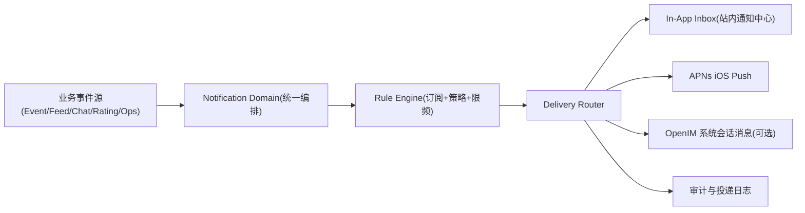

# Raver 通知系统 V1（独立模块）

> 目标：把“聊天通知 + 社区通知 + 运营通知 + 订阅提醒”统一到一套可扩展通知中台，后续新增通知类型不再零散加逻辑。

## 1. 原则（商用实践）

- 聊天实时消息：以 `WebSocket / Push` 为主，不依赖固定间隔轮询。
- 兜底策略：使用“事件触发补偿”（登录成功、重连成功、回到前台、点击通知）而不是后台持续轮询。
- 通知系统：统一入口、统一模板、统一路由、统一去重限频、统一审计。

## 2. 范围（V1 首批通知）

### 2.1 基础通知（本轮必须）

- 聊天消息通知（私信、小队群、活动临时群）
- 社区交互通知（点赞、评论、关注、提及、邀请、审核结果）

### 2.2 你指定的业务通知（V1 纳入）

- 关注活动倒计时通知：支持用户配置 `N 天前开始`、`每天提醒次数/时段`
- 关注活动相关动态：资讯、打分、每天结束后打卡提醒
- 定制路线后的 DJ 上台前提醒
- 关注 DJ 的动态：活动资讯、Sets、打分动态
- 关注 Brand 的活动资讯
- 重大资讯推送（平台级大新闻，如大型演出/城市落地）

## 3. 架构（单独可管理）

## 4. 服务端模块设计（server）

新增目录建议：`server/src/services/notification/`

- `notification-event.service.ts`
  - 接收标准化事件（谁、何时、什么事、对象）
- `notification-rule.service.ts`
  - 用户订阅与偏好（开关、静默时段、提醒频率）
- `notification-template.service.ts`
  - 文案模板、多语言、深链参数
- `notification-delivery.service.ts`
  - 统一路由：站内 / APNs / OpenIM
- `notification-scheduler.service.ts`
  - 倒计时、开场前提醒、每日打卡提醒（定时任务）
- `notification-dedupe-rate-limit.service.ts`
  - 去重、合并、限频（防刷屏）

## 5. 数据模型（最小闭环）

- `notification_subscriptions`
  - user_id, category, enabled, quiet_hours, frequency_config
- `notification_templates`
  - type, locale, title_template, body_template, deeplink_template
- `notification_jobs`
  - type, payload, schedule_at, status, retry_count
- `notification_deliveries`
  - job_id, user_id, channel(in_app/apns/openim), status, error, delivered_at
- `device_push_tokens`
  - user_id, device_id, platform, apns_token, is_active
- `notification_inbox`
  - user_id, type, title, body, deeplink, read_at, meta_json

## 6. 客户端模块设计（iOS）

新增目录建议：`mobile/ios/RaverMVP/RaverMVP/Core/NotificationCenter/`

- `NotificationCenterStore.swift`
  - 聚合站内通知、聊天未读、系统推送点击路由
- `PushTokenRegistrar.swift`
  - APNs token 上报/失效处理
- `NotificationRouter.swift`
  - 统一 deep link 跳转（聊天页、活动页、DJ 页、Brand 页、资讯页）
- `NotificationPreferencesViewModel.swift`
  - 用户通知偏好配置 UI 绑定（倒计时 N 天、每日提醒时段等）

## 7. 无轮询实时策略（落地要求）

- 聊天实时：OpenIM listener + APNs 离线推送
- 社区实时：服务端事件触发生成通知并推 APNs
- 补偿同步触发点（允许）：
  - 登录成功
  - OpenIM 重连成功
  - App 从后台回前台
  - 用户点击推送打开 App
- 禁止：后台常驻 2s/3s 固定轮询

## 8. V1 阶段拆解（勾选追踪）

### Phase N1：通知中台骨架

- [x] 建立 `notification` 服务目录和统一事件模型
- [x] 建立订阅/模板/投递/inbox 数据表与 migration
- [x] 新增通知中心可观测接口（状态诊断 + 投递明细查询）
- [x] 新增 Web 管理后台入口（通知中心状态 + 投递明细）
- [x] 新增管理端通知配置页面入口（模板、开关、灰度）

### Phase N2：聊天与社区通知接入

- [x] 聊天消息事件接入通知域（私信/群聊）
- [x] 社区互动事件接入通知域（点赞/评论/关注/提及/邀请）
- [x] 站内通知中心与消息 Tab 未读聚合打通
- [x] APNs 权限申请 + token 上报链路打通（iOS -> Server）
- [x] APNs Provider 实际投递打通（Server -> Apple Push Gateway，待配置凭证联调）
- [x] APNs 推送点击深链路由打通（通知内容 -> App 页面，首批路由已接入）

### Phase N3：订阅类提醒（你列的业务通知）

- [x] 活动倒计时 N 天提醒（用户可配置）
- [x] 活动日更提醒（资讯/打分/打卡）
- [x] 定制路线 DJ 开演前提醒
- [x] 关注 DJ 动态提醒（资讯/Sets/打分）
- [x] 关注 Brand 活动资讯提醒
- [x] 重大资讯推送通道（运营台一键触达）

### Phase N4：治理与运营

- [x] 去重、限频、免打扰时段、静默策略
- [x] 通知投递成功率/打开率/退订率监控
- [x] 审计日志与告警（失败重试、队列积压）

## 9. 关键执行日志

### 2026-04-22 +08（初始化）

- 已确认通知系统从 OpenIM 文档中拆分为独立模块文档；
- V1 通知范围已纳入：聊天 + 社区 + 你提出的全部业务提醒；
- 已明确“无固定轮询”策略：实时事件驱动 + 事件触发补偿同步。

### 2026-04-22 +08（无轮询改造落地）

- iOS 聊天链路调整为 OpenIM-only：会话/消息/已读/发送不再回退到 BFF 聊天接口；
- iOS 去除“聊天变化触发社区未读接口刷新”的隐性高频请求；
- 未读聚合调整为：`聊天实时未读（OpenIM） + 社区未读（按事件刷新）`；
- 结论：后端不再因聊天实时变化产生固定频率轮询请求。

### 2026-04-22 +08（通知中台骨架代码）

- 已新增服务端独立模块目录：`server/src/services/notification-center/`；
- 已落地统一事件模型与统一发布入口：
  - `notification-center.types.ts`
  - `notification-center.service.ts`
- 当前状态：具备统一通知编排入口，下一步接入数据库与 APNs/OpenIM 真投递。

### 2026-04-22 +08（通知中心表结构 + Push Token 闭环）

- 新增 Prisma 模型与 migration：
  - `notification_subscriptions`
  - `device_push_tokens`
  - `notification_events`
  - `notification_inbox`
  - `notification_deliveries`
- 新增服务端通知中心 API：
  - `POST /v1/notification-center/push-tokens`
  - `DELETE /v1/notification-center/push-tokens`
  - `GET /v1/notification-center/inbox`
  - `GET /v1/notification-center/inbox/unread-count`
  - `POST /v1/notification-center/inbox/read`
  - `POST /v1/notification-center/admin/publish-test`
  - `GET /v1/notification-center/admin/status`
  - `GET /v1/notification-center/admin/deliveries`
  - `GET /v1/notification-center/admin/config`
  - `PUT /v1/notification-center/admin/config`
  - `GET /v1/notification-center/admin/templates`
  - `PUT /v1/notification-center/admin/templates`
- iOS 已接入 APNs token 注册骨架：
  - App 启动请求通知权限
  - 获得 APNs token 后通过 `AppState` 在登录态上报服务端
  - 点击系统通知回到 App 后触发补偿刷新（OpenIM bootstrap + unread）
- 编译验证：
  - `pnpm --dir server prisma:generate` 通过
  - `pnpm --dir server build` 通过
  - iOS workspace 构建通过（`xcodebuild -workspace ...`）

### 2026-04-22 +08（N2 事件接入：聊天/社区）

- 已将真实业务写入点接入通知中台 `notification-center`：
  - 聊天：`POST /v1/chat/conversations/:id/messages`（私信 + 群聊）
  - 社区：`POST /v1/social/users/:id/follow`、`POST /v1/feed/posts/:id/like`、`POST /v1/feed/posts/:id/comments`
  - 小队邀请：`squadService.inviteUser`
- 已增加 OpenIM webhook 消息事件到通知中台的 best-effort 桥接（可解析用户/群 ID 时投递）；
- 当前事件统一写入 `notification_events` + `notification_inbox` + `notification_deliveries`，渠道先走 `in_app + apns`。
- 编译验证：
  - `pnpm --dir server build` 通过

### 2026-04-22 +08（N2 未读聚合收口：社区读已读 -> 消息 Tab 红点）

- iOS 新增社区未读事件总线：`Notification.Name.raverCommunityUnreadDidChange`；
- `MessageNotificationsViewModel` 与 `NotificationsViewModel` 在加载/已读变更时统一广播 `userInfo.total`；
- `AppState` 监听事件后仅更新 `cachedCommunityUnread` 并重算 `unreadMessagesCount`，无需额外拉取接口；
- `NotificationsView` 点击通知时先执行 `markRead`，再执行 deep link 跳转，确保未读即时收敛；
- 本轮结论：社区通知读完后，消息 Tab 红色未读 badge 可立即联动刷新。

### 2026-04-22 +08（APNs Provider 服务端投递）

- 新增 `notification-center` APNs channel handler：
  - 文件：`server/src/services/notification-center/notification-apns.handler.ts`
  - 能力：JWT token auth、HTTP/2 投递、无效 token 回收（`BadDeviceToken`/`Unregistered`）
- 启动注册：
  - `server/src/index.ts` 调用 `registerNotificationCenterAPNSHandler()`
- 新增环境变量（待你配置真实凭证）：
  - `NOTIFICATION_APNS_ENABLED`
  - `NOTIFICATION_APNS_KEY_ID`
  - `NOTIFICATION_APNS_TEAM_ID`
  - `NOTIFICATION_APNS_BUNDLE_ID`
  - `NOTIFICATION_APNS_PRIVATE_KEY_PATH`（或 `..._PRIVATE_KEY` / `..._PRIVATE_KEY_BASE64`）
  - `NOTIFICATION_APNS_USE_SANDBOX`
- 编译验证：
  - `pnpm --dir server build` 通过

### 2026-04-22 +08（iOS 系统通知 deep link 路由）

- iOS 已接入通知点击 deep link 消费链路：
  - `RaverAppDelegate` 缓存冷启动通知 payload；
  - `AppState` 统一解析 `deeplink` 并发布 `systemDeepLinkEvent`；
  - `MainTabCoordinator` 监听事件并执行路由跳转。
- 已支持首批 deep link：
  - `raver://messages/conversation/{id}`
  - `raver://community/post/{id}`
  - `raver://event/{id}`
  - `raver://dj/{id}`
  - `raver://squad/{id}`
  - `raver://profile/{id}`
- 编译验证：
  - `xcodebuild -workspace mobile/ios/RaverMVP/RaverMVP.xcworkspace -scheme RaverMVP ... build` 通过（`BUILD SUCCEEDED`）

### 2026-04-22 +08（通知投递可观测增强）

- 新增 APNs 配置诊断输出：
  - 暴露 `enabled/configured/providerHost/useSandbox/privateKeySource/missingConfig/tokenCache`（敏感字段已脱敏）
- 新增通知中心 admin 接口：
  - `GET /v1/notification-center/admin/status`（APNs 健康状态 + 近窗口投递统计）
  - `GET /v1/notification-center/admin/deliveries`（按 `channel/status/userId/eventId` 过滤）
- 通知投递记录升级为“按用户结果落库”：
  - APNs 渠道按用户聚合 token 发送结果，支持单用户多设备；
  - `notification_deliveries` 的 `status/error/attempts/deliveredAt` 现在基于用户级结果写入，更利于后台排障与运营复盘。
- 编译验证：
  - `pnpm --dir server build` 通过

### 2026-04-22 +08（Web 后台通知中心页面）

- 新增 API 封装：
  - `web/src/lib/api/notification-center-admin.ts`
  - 对接 `GET /v1/notification-center/admin/status`
  - 对接 `GET /v1/notification-center/admin/deliveries`
- 新增管理页面：
  - `web/src/app/admin/notification-center/page.tsx`
  - 支持 APNs 状态展示、投递总览、渠道统计、投递明细筛选（channel/status/userId/eventId/limit）
- 导航入口新增（管理员）：
  - `web/src/components/Navigation.tsx` -> `通知中心后台`
- 兼容修复：
  - `web/src/app/community/squads/page.tsx` 增加 `Suspense` 包裹，解决 Next.js 构建对 `useSearchParams` 的要求
- 验证结果：
  - `pnpm --dir web exec tsc --noEmit` 通过
  - `pnpm --dir web build` 通过（保留若干既有 lint warning，不阻塞构建）

### 2026-04-22 +08（通知配置中心 Phase N1 收口）

- 新增通知配置数据表：
  - `notification_templates`
  - `notification_admin_configs`
- 新增服务端能力：
  - 全局配置读取/更新（分类开关、渠道开关、灰度百分比、灰度白名单）
  - 模板查询/保存（category + locale + channel 唯一）
  - `publish` 已接入全局配置策略：分类开关 + 渠道开关 + 灰度过滤
- 新增管理端接口：
  - `GET /v1/notification-center/admin/config`
  - `PUT /v1/notification-center/admin/config`
  - `GET /v1/notification-center/admin/templates`
  - `PUT /v1/notification-center/admin/templates`
- 新增 Web 后台能力（`/admin/notification-center`）：
  - 配置编辑区（开关 + 灰度）
  - 模板编辑区（模板 CRUD 的首版 upsert 流程）
- 验证结果：
  - `pnpm --dir server prisma:generate` 通过
  - `pnpm --dir server build` 通过
  - `pnpm --dir web build` 通过

### 2026-04-22 +08（Phase N3 首个闭环：活动倒计时提醒）

- 已落地活动倒计时提醒调度器（服务端）：
  - 基于“收藏活动”数据源（`checkins.type=event & note=marked`）
  - 读取用户配置（N 天 + 每日提醒小时 + 时区 + 渠道）
  - 生成 `event_countdown` 通知并走统一通知中心投递
  - 使用 `dedupeKey` 实现同用户同活动同小时幂等
- 新增用户偏好接口：
  - `GET /v1/notification-center/preferences/event-countdown`
  - `PUT /v1/notification-center/preferences/event-countdown`
- 新增调度脚本（可重复回归）：
  - `pnpm --dir server notification:event-countdown:run`
- 新增环境变量：
  - `NOTIFICATION_EVENT_COUNTDOWN_ENABLED`
  - `NOTIFICATION_EVENT_COUNTDOWN_INTERVAL_MS`
  - `NOTIFICATION_EVENT_COUNTDOWN_MAX_DAYS`
- 验证结果：
  - `pnpm --dir server build` 通过
  - `pnpm --dir web build` 通过
  - `pnpm --dir server notification:event-countdown:run` 通过（当前环境 `enabled=false`）

### 2026-04-22 +08（Phase N3-2 闭环：活动日更提醒）

- 已落地活动日更提醒调度器（服务端）：
  - 基于“收藏活动”数据源（`checkins.type=event & note=marked`）
  - 聚合近 `lookbackHours` 活动资讯（`posts.eventId`）与活动打分（`checkins.rating`）
  - 在活动进行中的场景触发“每日打卡提醒”（当天未打卡才提醒）
  - 生成 `event_daily_digest` 通知并走统一通知中心投递
  - 使用 `dedupeKey` 实现同用户同活动同小时幂等
- 新增用户偏好接口：
  - `GET /v1/notification-center/preferences/event-daily-digest`
  - `PUT /v1/notification-center/preferences/event-daily-digest`
- 新增调度脚本（可重复回归）：
  - `pnpm --dir server notification:event-daily-digest:run`
- 新增环境变量：
  - `NOTIFICATION_EVENT_DAILY_DIGEST_ENABLED`
  - `NOTIFICATION_EVENT_DAILY_DIGEST_INTERVAL_MS`
  - `NOTIFICATION_EVENT_DAILY_DIGEST_MAX_DAYS_BEFORE_START`
  - `NOTIFICATION_EVENT_DAILY_DIGEST_MAX_DAYS_AFTER_END`
  - `NOTIFICATION_EVENT_DAILY_DIGEST_LOOKBACK_HOURS`
- 验证结果：
  - `pnpm --dir server build` 通过
  - `pnpm --dir server notification:event-daily-digest:run` 通过（当前环境 `enabled=false`）
  - `pnpm --dir server notification:event-countdown:run` 通过（回归未受影响）

### 2026-04-22 +08（Phase N3-3 闭环：定制路线 DJ 开演前提醒）

- 已落地定制路线 DJ 提醒调度器（服务端）：
  - 基于用户 `route_dj_reminder` 订阅配置中的 `watchedSlots`（eventId + slotId）
  - 按“开演前 N 分钟”窗口触发提醒，支持每个 slot 单独覆盖提醒分钟数
  - 生成 `route_dj_reminder` 通知并走统一通知中心投递
  - 使用 `dedupeKey` 实现同用户同 slot 同提醒阈值幂等
- 新增用户偏好接口：
  - `GET /v1/notification-center/preferences/route-dj-reminder`
  - `PUT /v1/notification-center/preferences/route-dj-reminder`
- 新增调度脚本（可重复回归）：
  - `pnpm --dir server notification:route-dj-reminder:run`
- 新增环境变量：
  - `NOTIFICATION_ROUTE_DJ_REMINDER_ENABLED`
  - `NOTIFICATION_ROUTE_DJ_REMINDER_INTERVAL_MS`
  - `NOTIFICATION_ROUTE_DJ_REMINDER_LOOKAHEAD_MINUTES`
  - `NOTIFICATION_ROUTE_DJ_REMINDER_TRIGGER_WINDOW_MINUTES`
- 验证结果：
  - `pnpm --dir server build` 通过
  - `pnpm --dir server notification:route-dj-reminder:run` 通过（当前环境 `enabled=false`）
  - `pnpm --dir server notification:event-daily-digest:run` 通过（回归未受影响）

### 2026-04-22 +08（Phase N3-4 闭环：关注 DJ 动态提醒）

- 已落地关注 DJ 动态提醒调度器（服务端）：
  - 基于用户真实关注关系（`follows.type='dj'`）
  - 聚合近 `lookbackHours` 的 DJ 动态：资讯（`posts.boundDjIds`）、Sets（`dj_sets`）、打分（`checkins.type='dj'`）
  - 按用户偏好提醒时段（`reminderHours + timezone`）触发并汇总为单条通知
  - 生成 `followed_dj_update` 通知并走统一通知中心投递
  - 使用 `dedupeKey` 实现同用户同小时幂等
- 新增用户偏好接口：
  - `GET /v1/notification-center/preferences/followed-dj-update`
  - `PUT /v1/notification-center/preferences/followed-dj-update`
- 新增调度脚本（可重复回归）：
  - `pnpm --dir server notification:followed-dj-update:run`
- 新增环境变量：
  - `NOTIFICATION_FOLLOWED_DJ_UPDATE_ENABLED`
  - `NOTIFICATION_FOLLOWED_DJ_UPDATE_INTERVAL_MS`
  - `NOTIFICATION_FOLLOWED_DJ_UPDATE_LOOKBACK_HOURS`
- 验证结果：
  - `pnpm --dir server build` 通过
  - `pnpm --dir server notification:followed-dj-update:run` 通过（当前环境 `enabled=false`）
  - `pnpm --dir server notification:route-dj-reminder:run` 通过（回归未受影响）

### 2026-04-22 +08（Phase N3-5 闭环：关注 Brand 活动资讯提醒）

- 已落地关注 Brand 动态提醒调度器（服务端）：
  - 基于用户 `followed_brand_update` 订阅配置中的 `watchedBrandIds`
  - 聚合近 `lookbackHours` 的 Brand 动态：资讯（`posts.boundBrandIds`）、活动更新（`events.wikiFestivalId + updatedAt`）
  - 按用户偏好提醒时段（`reminderHours + timezone`）触发并汇总为单条通知
  - 生成 `followed_brand_update` 通知并走统一通知中心投递
  - 使用 `dedupeKey` 实现同用户同小时幂等
- 新增用户偏好接口：
  - `GET /v1/notification-center/preferences/followed-brand-update`
  - `PUT /v1/notification-center/preferences/followed-brand-update`
- 新增调度脚本（可重复回归）：
  - `pnpm --dir server notification:followed-brand-update:run`
- 新增环境变量：
  - `NOTIFICATION_FOLLOWED_BRAND_UPDATE_ENABLED`
  - `NOTIFICATION_FOLLOWED_BRAND_UPDATE_INTERVAL_MS`
  - `NOTIFICATION_FOLLOWED_BRAND_UPDATE_LOOKBACK_HOURS`
- 验证结果：
  - `pnpm --dir server build` 通过
  - `pnpm --dir server notification:followed-brand-update:run` 通过（当前环境 `enabled=false`）
  - `pnpm --dir server notification:followed-dj-update:run` 通过（回归未受影响）

### 2026-04-22 +08（Phase N3-6 闭环：重大资讯推送通道）

- 已落地运营可用的重大资讯发布接口（服务端）：
  - `POST /v1/notification-center/admin/major-news/publish`
  - 支持指定 `targetUserIds` 定向推送，或按 `userLimit` 自动选择活跃用户批量推送
  - 支持 `channels`（默认 `in_app + apns`）和 `deeplink`
  - 走统一通知中心 `major_news` 分类，统一写入事件、inbox、投递日志
  - 支持 `dedupeKey`（未传时自动生成）避免重复触发
- 验证结果：
  - `pnpm --dir server build` 通过
  - `pnpm --dir server notification:followed-brand-update:run` 通过（回归未受影响）

### 2026-04-22 +08（Phase N4-1 基础治理：限频 + 免打扰 + 静默渠道）

- 通知中心全局配置新增治理策略 `governance`：
  - `rateLimit`：按用户窗口限频（`windowSeconds` + `maxPerUser`）
  - `quietHours`：免打扰时段（`startHour/endHour/timezone` + `muteChannels`）
  - 两类策略都支持 `exemptCategories`
- `publish` 流程新增治理拦截：
  - 命中 quiet hours 时，自动静默配置的渠道（如 APNs），保留其他渠道（如 in_app）
  - 命中限频时，过滤超限用户；全部超限时返回 `rate-limited-by-governance`
  - 当静默后无可用渠道时返回 `quiet-hours-muted-by-governance`
- 保留既有能力不变：
  - `dedupeKey` 幂等去重继续有效
  - 管理台分类开关、渠道开关、灰度开关继续生效
- Web 后台配置已补齐治理项编辑：
  - 限频：启用、窗口秒数、单用户最大通知数、豁免分类
  - 免打扰：启用、开始/结束小时、时区、静默渠道、豁免分类
- 验证结果：
  - `pnpm --dir server build` 通过
  - `pnpm --dir server notification:followed-brand-update:run` 通过（当前环境 `enabled=false`，回归未受影响）
  - `pnpm --dir web exec tsc --noEmit` 通过

### 2026-04-22 +08（Phase N4-2 可观测增强：成功率/打开率/退订率）

- 服务端 `GET /v1/notification-center/admin/status` 指标扩展：
  - `rates`: `deliverySuccessRate` / `deliveryFailureRate`
  - `engagement`: `inboxCreated` / `inboxRead` / `inboxUnread` / `openRate`
  - `subscriptions`: `total` / `disabled` / `disabledUpdatedInWindow` / `unsubscribeRate`
- Web 管理后台 `/admin/notification-center` 新增三张指标卡：
  - 投递成功率
  - 打开率（Inbox）
  - 退订率（订阅快照）
- 验证结果：
  - `pnpm --dir server build` 通过
  - `pnpm --dir web exec tsc --noEmit` 通过

### 2026-04-22 +08（Phase N4-3 告警与审计收口：失败重试 + 队列积压）

- `admin/status` 新增告警摘要 `alerts`：
  - `delivery_failed_rate`（失败率阈值告警）
  - `delivery_retry_high`（重试次数过高）
  - `event_queue_stuck`（事件队列积压）
  - `delivery_queue_stuck`（投递队列积压）
- 告警返回统一字段：
  - `code / severity / triggered / value / threshold / message`
  - 以及 `triggeredCount` 汇总
- Web 管理后台 `/admin/notification-center` 新增“告警摘要”面板，支持按规则查看当前触发状态；
- 审计面保留：
  - 既有 `notification_deliveries` 投递明细（失败原因、重试次数、事件/用户维度）
  - `notification_events` 事件状态（queued/sent/partial_failed）
- 验证结果：
  - `pnpm --dir server build` 通过
  - `pnpm --dir web exec tsc --noEmit` 通过

## 10. 商用做法说明（你关心的“是否轮询”）

- 头部产品主路径不是固定轮询，而是：
  - 在线：长连接实时事件（WebSocket / IM SDK listener）
  - 离线：系统 Push（APNs/FCM）唤醒
  - 补偿：仅在关键生命周期点触发一次性补拉
- 固定 2s/3s 轮询在商用里通常只作为短期排障或极端降级，不应作为常态。

## 11. 统一系统通知实现（聊天 + 社区 + 订阅提醒）

### 11.1 统一事件入口

- 所有通知先落统一事件模型：`NotificationEvent`
- 来源包括：OpenIM webhook、社区互动事件、运营推送、订阅定时任务

### 11.2 统一路由与模板

- 按 `type + scene + locale` 选择模板
- 统一输出：
  - In-App Inbox（站内通知中心）
  - APNs（系统通知）
  - 审计投递日志

### 11.3 APNs 关键链路

- iOS：
  - 请求通知权限
  - 上报 device token 到后端
  - 处理通知点击深链路由
- Server：
  - 维护 `device_push_tokens`
  - 根据用户偏好和静默时段决定是否推送
  - 写入 `notification_deliveries` 跟踪状态与失败重试

### 11.4 V1 深链规范

- `raver://messages/conversation/{id}`
- `raver://community/post/{id}`
- `raver://event/{id}`
- `raver://dj/{id}`
- `raver://brand/{id}`
- `raver://news/{id}`

## 12. 联调清单（当前可执行）

1. 服务端配置 APNs 凭证（`server/.env`）：
   - `NOTIFICATION_APNS_ENABLED=true`
   - `NOTIFICATION_APNS_KEY_ID / TEAM_ID / BUNDLE_ID`
   - `NOTIFICATION_APNS_PRIVATE_KEY_PATH`（或 inline/base64）
   - `NOTIFICATION_APNS_USE_SANDBOX=true`（开发环境）
2. iOS 登录后确认 push token 上报成功：
   - Xcode 日志包含 `[AppState] register push token success`
3. 用管理员接口发测试通知（`in_app + apns`）：
   - `POST /v1/notification-center/admin/publish-test`
   - `channels: ["in_app", "apns"]`
   - `deeplink: "raver://messages/conversation/{id}"`（或其他已支持 deep link）
4. 点击系统通知后验证：
   - App 跳转到目标页面；
   - `AppState` 会触发一次 `refreshOpenIMBootstrap + refreshUnreadMessages` 补偿同步。
5. 活动倒计时提醒联调（N3-1）：
   - 在 `server/.env` 设置 `NOTIFICATION_EVENT_COUNTDOWN_ENABLED=true`；
   - 用户先收藏活动（当前由事件 `checkin note=marked` 代表收藏）；
   - 调用 `PUT /v1/notification-center/preferences/event-countdown` 设置：
     - `daysBeforeStart`
     - `reminderHours`（0-23）
     - `timezone`
     - `channels`
   - 执行 `pnpm --dir server notification:event-countdown:run`；
   - 检查 `notification_events`、`notification_inbox`、`notification_deliveries` 是否新增 `event_countdown` 记录。
6. 活动日更提醒联调（N3-2）：
   - 在 `server/.env` 设置 `NOTIFICATION_EVENT_DAILY_DIGEST_ENABLED=true`；
   - 调用 `PUT /v1/notification-center/preferences/event-daily-digest` 设置：
     - `reminderHours`（0-23）
     - `timezone`
     - `channels`
     - `includeNews/includeRatings/includeCheckinReminder`
   - 执行 `pnpm --dir server notification:event-daily-digest:run`；
   - 检查 `notification_events`、`notification_inbox`、`notification_deliveries` 是否新增 `event_daily_digest` 记录。
7. 定制路线 DJ 提醒联调（N3-3）：
   - 在 `server/.env` 设置 `NOTIFICATION_ROUTE_DJ_REMINDER_ENABLED=true`；
   - 调用 `PUT /v1/notification-center/preferences/route-dj-reminder` 设置：
     - `timezone`
     - `channels`
     - `defaultReminderMinutesBefore`
     - `watchedSlots: [{ eventId, slotId, reminderMinutesBefore? }]`
   - 执行 `pnpm --dir server notification:route-dj-reminder:run`；
   - 检查 `notification_events`、`notification_inbox`、`notification_deliveries` 是否新增 `route_dj_reminder` 记录。
8. 关注 DJ 动态提醒联调（N3-4）：
   - 在 `server/.env` 设置 `NOTIFICATION_FOLLOWED_DJ_UPDATE_ENABLED=true`；
   - 调用 `PUT /v1/notification-center/preferences/followed-dj-update` 设置：
     - `reminderHours`（0-23）
     - `timezone`
     - `channels`
     - `includeInfos/includeSets/includeRatings`
   - 执行 `pnpm --dir server notification:followed-dj-update:run`；
   - 检查 `notification_events`、`notification_inbox`、`notification_deliveries` 是否新增 `followed_dj_update` 记录。
9. 关注 Brand 动态提醒联调（N3-5）：
   - 在 `server/.env` 设置 `NOTIFICATION_FOLLOWED_BRAND_UPDATE_ENABLED=true`；
   - 调用 `PUT /v1/notification-center/preferences/followed-brand-update` 设置：
     - `reminderHours`（0-23）
     - `timezone`
     - `channels`
     - `watchedBrandIds`
     - `includeInfos/includeEvents`
   - 执行 `pnpm --dir server notification:followed-brand-update:run`；
   - 检查 `notification_events`、`notification_inbox`、`notification_deliveries` 是否新增 `followed_brand_update` 记录。
10. 重大资讯推送联调（N3-6）：
   - 使用管理员账号调用 `POST /v1/notification-center/admin/major-news/publish`；
   - 请求体示例字段：
     - `headline`
     - `summary`
     - `deeplink`
     - `channels`
     - `targetUserIds`（可选）
     - `userLimit`（可选）
     - `dedupeKey`（可选）
   - 检查 `notification_events`、`notification_inbox`、`notification_deliveries` 是否新增 `major_news` 记录。
