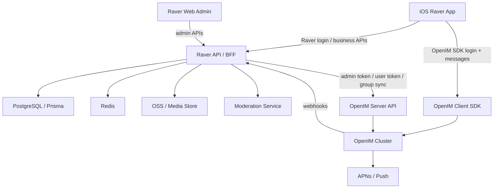

# Raver OpenIM 基座接入方案

> 状态：规划文档  
> 优先级：P0 聊天基座替换  
> 首期客户端：iOS  
> 目标：用 OpenIM 完整替代 Raver 当前自研聊天渠道，并保留 Raver 作为业务主系统。

## 1. 背景与结论

Raver 当前已经有自己的用户、动态、评论、小队、私信和小队消息模型。聊天相关能力目前主要由 Raver 后端的 `/v1/chat/*` BFF 接口和数据库表承载，包括：

- `DirectConversation`
- `DirectMessage`
- `DirectConversationRead`
- `SquadMessage`
- `SquadMember.lastReadAt`

这些模型能支撑 MVP，但它们还不是完整 IM 系统。随着产品需要支持 iOS 优先、多媒体消息、离线推送、群管理、活动临时群、举报审核、消息撤回、敏感词和图片审核，自研 IM 的复杂度会快速上升。

本方案的结论：

```text
Raver 继续做业务主系统
OpenIM 作为聊天基础设施
Raver Post/Feed/Comment/Search 不迁入 OpenIM
旧 DirectMessage/SquadMessage 全量迁移进 OpenIM
迁移完成后旧聊天渠道停止写入
```

OpenIM 只负责 IM 能力：

- 1v1 私信
- 小队群聊
- 活动临时群
- 系统通知类聊天消息
- 多媒体和自定义消息
- 聊天未读数
- 聊天消息离线和多端同步
- 聊天消息推送

Raver 继续负责：

- 用户注册、登录、封禁、资料
- 小队创建、官方认证、成员权限
- 活动、DJ、Set、Feed、评论、搜索
- 内容通知未读数
- 业务权限判断
- 管理后台
- 审核规则和举报处理

## 2. 已确认需求

### 2.1 客户端优先级

第一期先接入 iOS。

当前 iOS 入口：

- `mobile/ios/RaverMVP/RaverMVP/Features/Messages/ChatView.swift`
- `mobile/ios/RaverMVP/RaverMVP/Features/Messages/MessagesHomeView.swift`
- `mobile/ios/RaverMVP/RaverMVP/Features/Messages/MessagesViewModel.swift`
- `mobile/ios/RaverMVP/RaverMVP/Core/LiveSocialService.swift`

### 2.2 聊天范围

第一期和第二期覆盖：

- 私信 1v1
- 小队群聊
- 活动临时群
- 系统通知消息

### 2.3 小队和 OpenIM 群关系

每个 Raver `Squad` 对应一个 OpenIM `Group`。

建议映射：

```text
Raver Squad.id -> OpenIM groupID(确定性映射)
Raver User.id -> OpenIM userID(确定性映射)
```

创建规则：

```text
创建小队 = 创建群聊空间
创建者本人 + 初始成员必须不少于 3 人
即创建时至少选择 2 个好友
```

小队本质上是一个群聊空间，但 Raver 会在业务层额外赋予：

- 官方认证
- 特殊权限
- 小队主页
- 小队活动记录
- 小队相册
- 小队公告
- 小队推荐和展示

OpenIM 只承载群聊能力，不成为小队主库。

### 2.4 用户 ID

本地 OpenIM v3.8 实测发现：

- Raver 当前主键是带 `-` 的 UUID；
- OpenIM `userID` 不接受该格式直接注册；
- 因此不能再假设 `Raver User.id = OpenIM userID`。

当前落地方案：

```text
OpenIM userID = toOpenIMUserID(Raver User.id)
OpenIM groupID = toOpenIMGroupID(Raver Squad.id)
```

建议规则：

- userID 使用 `u_` 前缀 + 去掉非法字符后的稳定值；
- groupID 使用 `g_` 前缀 + 去掉非法字符后的稳定值；
- `ex` / 自定义扩展字段里保留原始 `raverUserId`、`raverSquadId` 便于排障；
- 不使用用户名作为 OpenIM 主键，避免后续改名带来漂移。

### 2.5 历史消息迁移

旧消息要迁移进 OpenIM。

迁移完成后：

- `DirectMessage` 不再写入
- `SquadMessage` 不再写入
- 旧 `/v1/chat/*` 可以短期作为兼容 BFF
- iOS 聊天页逐步改为 OpenIM SDK 数据源

### 2.6 客户端连接模式

采用推荐路线：

```text
聊天收发、会话、未读：iOS 直接接 OpenIM SDK
用户登录、OpenIM token、业务权限、群同步：继续走 Raver BFF
```

即：

- iOS 登录 Raver 后，向 Raver 后端请求 OpenIM token。
- Raver 后端调用 OpenIM 服务端 API 获取 user token。
- iOS 使用 OpenIM SDK 登录 IM。
- 小队/活动群的创建和成员同步只允许 Raver 后端发起。
- 客户端不能直接绕过 Raver 创建业务群。

### 2.7 消息类型

需要支持：

- 文本
- 图片
- 语音
- 视频
- 表情
- 活动卡片
- DJ/Set 卡片
- 系统消息

落地建议：

```text
OpenIM 原生消息：文本、图片、语音、视频
OpenIM 自定义消息：表情、活动卡片、DJ/Set 卡片、系统业务卡片
Raver 服务端消息：系统通知、审核提示、群成员变更提示
```

### 2.8 推送

采用推荐路线：

- iOS 先接 APNs
- Android 后续接 FCM 或国内厂商推送
- App badge 由 AppState 聚合

### 2.9 未读数

未读职责拆分：

```text
OpenIM：聊天未读数
Raver：内容通知未读数，如评论、点赞、关注、审核、小队邀请
iOS AppState：聚合总 badge
```

### 2.10 群聊权限

群聊需要支持：

- 群主
- 管理员
- 成员
- 踢人
- 禁言
- 退群
- 解散群
- 邀请审核
- 群公告

权限主库仍然是 Raver：

```text
Squad.leaderId / SquadMember.role 是权威数据
OpenIM group owner/admin/member 是聊天镜像
```

### 2.11 安全与审核

需要支持：

- 敏感词
- 图片审核
- 举报消息
- 管理员删除消息
- 撤回消息

推荐做法：

```text
发送前 webhook：敏感词和风控拦截
发送后 webhook：消息入 Raver 审核/索引/审计流水
媒体上传前：Raver OSS 上传和图片审核
举报：Raver 管理后台处理，必要时调用 OpenIM 删除/撤回消息
```

### 2.12 部署路线

采用推荐路线：

```text
本地：OpenIM Docker Compose 验证
测试环境：单机 Docker Compose
生产环境：先单机或轻量多容器，后续根据增长考虑 Kubernetes
```

### 2.13 首期规模

预估：

- 注册用户：1k
- 日活：1k
- 同时在线：1k
- 小队数量：100
- 单个小队最大人数：200
- 每日消息量：1000

这个规模可以先用单机 Docker Compose 测试环境验证。生产环境仍需做好备份、监控和扩容预案。

### 2.14 Web 管理后台

需要在当前 Web 后台/管理页面中加入 OpenIM 管理模块。

当前 Web 是 Next.js App Router 结构，暂未看到独立 `/admin` 目录。建议新增：

```text
web/src/app/admin/openim/page.tsx
web/src/app/admin/openim/users/page.tsx
web/src/app/admin/openim/groups/page.tsx
web/src/app/admin/openim/reports/page.tsx
web/src/app/admin/openim/sync-jobs/page.tsx
```

对应服务端新增：

```text
GET  /v1/admin/openim/overview
GET  /v1/admin/openim/users
GET  /v1/admin/openim/groups
GET  /v1/admin/openim/reports
GET  /v1/admin/openim/sync-jobs
POST /v1/admin/openim/sync/users/:id
POST /v1/admin/openim/sync/squads/:id
POST /v1/admin/openim/groups/:id/mute
POST /v1/admin/openim/messages/:id/revoke
POST /v1/admin/openim/reports/:id/resolve
```

后台接口必须要求 `role = admin`。

## 3. OpenIM 官方能力摘要

> 这里仅列接入方案需要用到的能力。实际开发时以当前 OpenIM 版本官方文档为准。

OpenIM 官方文档显示：

- 服务端 REST API 需要业务后端用管理员 token 调用。
- 用户可以通过 `user_register` 注册/导入。
- 客户端登录 OpenIM SDK 需要 user token。
- 服务端可以发送消息。
- 群管理 API 支持创建群、成员管理等能力。
- Webhook 能在消息发送前后、群变更等阶段通知业务系统。

已确认的产品约束：

- OpenIM 创建群接口文档说明：创建群指定群主，群成员包含群主不能少于 3 人。
- Raver 与 OpenIM 对齐：创建小队/群聊空间时，必须满足“创建者 + 初始成员 >= 3 人”。
- Raver 后端必须做硬校验，客户端只做体验层提示。
- 不采用假用户凑数，也不采用 1 人小队延迟物化群。

官方文档参考：

- OpenIM REST API introduction: https://docs.openim.io/restapi/apis/introduction
- OpenIM user register: https://docs.openim.io/restapi/apis/usermanagement/userregister
- OpenIM get admin token: https://docs.openim.io/restapi/apis/authenticationmanagement/getadmintoken
- OpenIM get user token: https://docs.openim.io/restapi/apis/authenticationmanagement/getusertoken
- OpenIM create group: https://docs.openim.io/restapi/apis/groupmanagement/creategroup
- OpenIM send message: https://docs.openim.io/restapi/apis/messagemanagement/sendmessage
- OpenIM webhook introduction: https://docs.openim.io/restapi/webhooks/introduction
- OpenIM SDK initSDK: https://docs.openim.io/sdks/api/initialization/initsdk

## 4. 总体架构



核心原则：

1. Raver 用户登录仍然走 Raver JWT。
2. OpenIM token 只能由 Raver 后端签发/获取。
3. 用户和群的业务状态以 Raver DB 为准。
4. OpenIM 负责聊天 runtime。
5. OpenIM webhook 回写到 Raver 做审核、审计和管理后台展示。
6. 旧聊天表只作为迁移源和短期备份，不再作为新消息主链路。

## 5. 数据映射

### 5.1 用户映射

```text
Raver User.id       -> toOpenIMUserID(User.id)
User.username       -> OpenIM nickname fallback
User.displayName    -> OpenIM nickname
User.avatarUrl      -> OpenIM faceURL
User.isActive=false -> OpenIM disable / Raver 阻止 token 签发
```

当前阶段先使用确定性函数映射，不新增数据库映射表。  
如果未来出现多 IM、历史兼容、或映射规则升级需求，再引入 `external_accounts` / `openim_accounts` 表。

### 5.2 私信会话映射

```text
旧 DirectConversation.userAId/userBId -> OpenIM single conversation
旧 DirectMessage.senderId             -> OpenIM sendID
旧 DirectMessage.conversation peer     -> OpenIM recvID
```

私信会话本身不用在 Raver 再建主表。OpenIM 会话列表作为聊天主数据源。

保留 Raver 侧轻量镜像表用于管理和排障：

```prisma
model OpenIMConversationMirror {
  id              String   @id @default(uuid())
  conversationId  String   @unique @map("conversation_id")
  conversationType String  @map("conversation_type") // single, group
  ownerUserId     String?  @map("owner_user_id")
  peerUserId      String?  @map("peer_user_id")
  groupId         String?  @map("group_id")
  lastMessageAt   DateTime? @map("last_message_at")
  lastSyncedAt    DateTime? @map("last_synced_at")
  createdAt       DateTime @default(now()) @map("created_at")
  updatedAt       DateTime @updatedAt @map("updated_at")

  @@index([ownerUserId])
  @@index([groupId])
  @@map("openim_conversation_mirrors")
}
```

### 5.3 小队群映射

```text
Raver Squad.id          -> toOpenIMGroupID(Squad.id)
Squad.name              -> groupName
Squad.avatarUrl         -> faceURL
Squad.description       -> introduction
Squad.notice            -> notification
Squad.leaderId          -> ownerUserID
SquadMember.role=admin  -> group admin
SquadMember.role=member -> group member
```

建议新增同步状态字段，不要只靠 OpenIM 成功与否隐式判断：

```prisma
enum OpenIMSyncStatus {
  pending
  synced
  failed
  disabled
}

model SquadOpenIMState {
  id             String   @id @default(uuid())
  squadId        String   @unique @map("squad_id")
  groupId        String   @unique @map("group_id")
  status         String   @default("pending")
  lastSyncedAt   DateTime? @map("last_synced_at")
  lastError      String?  @db.Text @map("last_error")
  retryCount     Int      @default(0) @map("retry_count")
  createdAt      DateTime @default(now()) @map("created_at")
  updatedAt      DateTime @updatedAt @map("updated_at")

  @@map("squad_openim_states")
}
```

### 5.4 活动临时群映射

活动临时群不是普通小队，但本质上也是 OpenIM Group。

建议新增 Raver 业务表：

```prisma
model EventChatRoom {
  id             String   @id @default(uuid())
  eventId        String   @map("event_id")
  groupId        String   @unique @map("group_id")
  name           String
  status         String   @default("active") // active, archived, dissolved
  ownerUserId    String   @map("owner_user_id")
  startsAt       DateTime? @map("starts_at")
  endsAt         DateTime? @map("ends_at")
  createdAt      DateTime @default(now()) @map("created_at")
  updatedAt      DateTime @updatedAt @map("updated_at")

  @@index([eventId])
  @@map("event_chat_rooms")
}
```

活动群成员来源策略需要产品确认：

- 参加/收藏活动后可申请加入
- 已打卡用户可加入
- 购票或人工认证用户可加入
- 管理员邀请加入

第一期建议：

```text
活动详情页提供“加入活动群”
用户点击后 Raver 检查登录和活动状态
Raver 后端调用 OpenIM 加群或发起入群申请
```

### 5.5 系统通知消息

系统通知消息分两类：

1. 内容通知：评论、点赞、关注、审核、小队邀请  
   仍归 Raver Notification 系统。

2. 聊天系统消息：入群、退群、踢人、群公告、活动群提醒  
   可由 Raver 服务端调用 OpenIM send message 发入会话。

系统消息发送者建议统一：

```text
openim_system_user_id = raver_system
```

需要在 OpenIM 初始化时注册该系统用户。

## 6. 服务端技术路线

### 6.1 新增环境变量

`server/.env` 建议新增：

```dotenv
OPENIM_ENABLED=false
OPENIM_API_BASE_URL=http://localhost:10002
OPENIM_WS_URL=ws://localhost:10001
OPENIM_ADMIN_USER_ID=imAdmin
OPENIM_ADMIN_SECRET=
OPENIM_PLATFORM_ID=1
OPENIM_SYSTEM_USER_ID=raver_system
OPENIM_CALLBACK_SECRET=
OPENIM_PATH_GET_ADMIN_TOKEN=/auth/get_admin_token
OPENIM_PATH_GET_USER_TOKEN=/auth/get_user_token
OPENIM_PATH_USER_REGISTER=/user/user_register
OPENIM_PATH_CREATE_GROUP=/group/create_group
OPENIM_PATH_INVITE_USER_TO_GROUP=/group/invite_user_to_group
OPENIM_PATH_KICK_GROUP=/group/kick_group
OPENIM_PATH_SET_GROUP_INFO=/group/set_group_info_ex
OPENIM_PATH_SET_GROUP_MEMBER_INFO=/group/set_group_member_info
OPENIM_PATH_TRANSFER_GROUP=/group/transfer_group

OPENIM_MIGRATION_BATCH_SIZE=200
OPENIM_MIGRATION_DRY_RUN=true

OPENIM_APNS_ENABLED=false
OPENIM_APNS_BUNDLE_ID=
OPENIM_APNS_CERT_PATH=
OPENIM_APNS_KEY_ID=
OPENIM_APNS_TEAM_ID=
```

注意：

- 具体 API URL、端口和 secret 以实际部署版本为准。
- 不要把 OpenIM admin secret 暴露给客户端。
- iOS 客户端只拿 `userToken` 和 SDK 连接配置。

### 6.2 新增服务目录

建议新增：

```text
server/src/services/openim/
├── openim-client.ts
├── openim-token.service.ts
├── openim-user.service.ts
├── openim-group.service.ts
├── openim-message.service.ts
├── openim-sync.service.ts
├── openim-migration.service.ts
├── openim-moderation.service.ts
└── openim-types.ts
```

职责：

- `openim-client.ts`：封装 HTTP 请求、管理员 token 缓存、错误处理。
- `openim-token.service.ts`：给当前 Raver 用户获取 OpenIM user token。
- `openim-user.service.ts`：注册/更新/禁用用户。
- `openim-group.service.ts`：创建群、加人、踢人、改群资料、禁言、解散。
- `openim-message.service.ts`：系统消息、卡片消息、消息撤回/删除。
- `openim-sync.service.ts`：业务事件到 OpenIM 的同步编排。
- `openim-migration.service.ts`：旧 DirectMessage/SquadMessage 迁移。
- `openim-moderation.service.ts`：敏感词、图片审核、举报处理。

### 6.3 OpenIM client 封装原则

所有 OpenIM API 调用都必须经过 `OpenIMClient`：

```typescript
export class OpenIMClient {
  async getAdminToken(): Promise<string>
  async post<T>(path: string, body: unknown): Promise<T>
}
```

要求：

- admin token 带过期时间缓存。
- 对 OpenIM 错误码做结构化日志。
- 给每次调用生成 `requestId`。
- 超时可配置，默认 10 秒。
- 非幂等操作通过 `OpenIMSyncJob` 做重试，不在 HTTP 请求里无限重试。

### 6.4 Raver 新增 API

#### 6.4.1 iOS 获取 OpenIM 配置

```http
GET /v1/openim/bootstrap
Authorization: Bearer <raver_jwt>
```

响应：

```json
{
  "enabled": true,
  "userID": "u_<mapped_openim_user_id>",
  "token": "openim-user-token",
  "apiURL": "https://im-api.raver.example.com",
  "wsURL": "wss://im-ws.raver.example.com",
  "platformID": 1,
  "systemUserID": "raver_system",
  "expiresAt": "2026-04-20T12:00:00.000Z"
}
```

逻辑：

1. 校验 Raver JWT。
2. 如果 `User.isActive=false`，拒绝签发。
3. 确保用户已注册到 OpenIM。
4. 调 OpenIM 获取 user token。
5. 返回 SDK 登录所需配置。

#### 6.4.2 旧聊天 BFF 兼容层

短期保留：

```text
GET  /v1/chat/conversations?type=
POST /v1/chat/conversations/:id/read
POST /v1/chat/direct/start
GET  /v1/chat/conversations/:id/messages
POST /v1/chat/conversations/:id/messages
```

但实现分阶段切换：

```text
Phase 1：仍查旧表
Phase 2：OpenIM enabled 用户查 OpenIM
Phase 3：iOS SDK 直连后，仅保留 direct/start 和业务入口
Phase 4：废弃旧读写消息接口
```

### 6.5 业务事件同步

所有业务事件都先落 Raver DB，再同步 OpenIM。

建议新增同步任务表：

```prisma
model OpenIMSyncJob {
  id           String   @id @default(uuid())
  type         String
  entityType   String   @map("entity_type")
  entityId     String   @map("entity_id")
  payload      Json
  status       String   @default("pending") // pending, running, succeeded, failed
  retryCount   Int      @default(0) @map("retry_count")
  lastError    String?  @db.Text @map("last_error")
  runAfter     DateTime @default(now()) @map("run_after")
  createdAt    DateTime @default(now()) @map("created_at")
  updatedAt    DateTime @updatedAt @map("updated_at")

  @@index([status, runAfter])
  @@index([entityType, entityId])
  @@map("openim_sync_jobs")
}
```

触发点：

| Raver 事件 | OpenIM 动作 |
| --- | --- |
| 用户注册 | user_register |
| 用户改昵称/头像 | update user info |
| 用户封禁 | 禁止 token 签发，必要时 OpenIM 禁用 |
| 创建小队，且创建者 + 初始成员 >= 3 人 | create group |
| 修改小队资料 | update group info |
| 小队认证变化 | update group ex/custom field or Raver mirror |
| 加入小队 | add group member |
| 退出小队 | remove group member |
| 踢出成员 | kick group member |
| 设置管理员 | set group member role |
| 禁言成员 | mute group member |
| 解散小队 | dismiss group |
| 创建活动临时群 | create group |
| 活动结束归档 | mute/archive/dismiss by policy |

### 6.6 Webhook 接入

新增路由：

```text
POST /v1/openim/webhooks
```

要求：

- 校验 `OPENIM_CALLBACK_SECRET` 或签名。
- 记录原始事件到审计表。
- 根据事件类型分发。
- 不在 webhook 同步链路做耗时审核。
- 对需要审核的事件写入队列/任务。

建议表：

```prisma
model OpenIMWebhookEvent {
  id          String   @id @default(uuid())
  eventType   String   @map("event_type")
  payload     Json
  status      String   @default("received") // received, processed, failed
  lastError   String?  @db.Text @map("last_error")
  createdAt   DateTime @default(now()) @map("created_at")
  processedAt DateTime? @map("processed_at")

  @@index([eventType])
  @@index([status, createdAt])
  @@map("openim_webhook_events")
}
```

重点 webhook：

- 发送消息前：敏感词、封禁状态、群权限。
- 发送消息后：审计、管理后台、举报定位。
- 群成员变更后：检测 OpenIM 和 Raver 是否漂移。
- 消息撤回/删除后：同步管理后台状态。

## 7. 历史消息迁移方案

### 7.1 迁移目标

迁移源：

- `DirectMessage`
- `SquadMessage`

迁移目标：

- OpenIM 单聊消息
- OpenIM 群聊消息

迁移后：

- iOS 只从 OpenIM 读取聊天历史。
- 旧表只保留归档，不再写入。
- 旧 BFF 接口逐步废弃。

### 7.2 迁移前提

1. 所有 Raver 用户都已注册进 OpenIM。
2. 所有存在历史 `SquadMessage` 的小队都已创建 OpenIM group。
3. 活动临时群如果没有旧表，可以不迁移。
4. OpenIM send message API 支持指定历史 `sendTime`；具体字段按实际 OpenIM 版本确认。
5. 迁移脚本必须支持 dry-run、断点续跑、失败重试。

### 7.3 迁移状态表

```prisma
model OpenIMMessageMigration {
  id              String   @id @default(uuid())
  sourceType      String   @map("source_type") // direct_message, squad_message
  sourceId        String   @map("source_id")
  targetMessageId String?  @map("target_message_id")
  conversationKey String   @map("conversation_key")
  status          String   @default("pending") // pending, migrated, failed, skipped
  error           String?  @db.Text
  migratedAt      DateTime? @map("migrated_at")
  createdAt       DateTime @default(now()) @map("created_at")
  updatedAt       DateTime @updatedAt @map("updated_at")

  @@unique([sourceType, sourceId])
  @@index([status])
  @@index([conversationKey])
  @@map("openim_message_migrations")
}
```

### 7.4 私信迁移步骤

1. 查询全部 `DirectConversation`。
2. 对每个会话按 `createdAt asc` 查询 `DirectMessage`。
3. 确保 `userAId`、`userBId` 均已注册 OpenIM。
4. 对每条消息调用 OpenIM 服务端 send message：
   - `sendID = message.senderId`
   - `recvID = peer user id`
   - `sessionType = single`
   - `contentType = text` 或后续映射
   - `sendTime = message.createdAt`
5. 写入 `OpenIMMessageMigration`。
6. 失败记录错误并继续下一条。

### 7.5 小队消息迁移步骤

1. 查询全部有 `SquadMessage` 的 `Squad`。
2. 确保对应 OpenIM group 存在。
3. 确保所有消息发送者是该 group 成员；不是成员则先补入或标记 skipped。
4. 按 `createdAt asc` 迁移。
5. 系统消息发送者可映射为：
   - 原 `userId`，如果表示用户行为；
   - `raver_system`，如果是纯系统通知。
6. 写入 `OpenIMMessageMigration`。

### 7.6 迁移校验

每个会话校验：

- 源消息数 = 成功迁移数 + 明确 skipped 数
- 最新消息时间一致
- 抽样读取 OpenIM 历史消息可见
- iOS 聊天页展示顺序正确
- 未读数迁移策略符合预期

未读数建议不迁移历史精确状态：

```text
迁移完成后统一将历史消息视为已读
新消息从 OpenIM 开始计算未读
```

原因：

- 旧 `lastReadAt` 可以映射，但历史未读精确恢复成本较高。
- 上线切换时用户最关心新消息。
- 避免迁移后 App badge 大量跳变。

### 7.7 切换策略

推荐灰度：

```text
T-7 天：部署 OpenIM，跑用户和群同步 dry-run
T-5 天：迁移测试环境消息
T-3 天：生产 dry-run，修数据
T-1 天：生产全量迁移，旧聊天写入冻结 10-30 分钟
T 日：iOS TestFlight 灰度 OpenIM
T+3 天：如果无重大问题，旧聊天写入口下线
T+14 天：旧聊天读接口标记 deprecated
```

## 8. iOS 接入方案

### 8.1 当前状态

当前 `ChatView`：

- 页面进入后调用 `service.fetchMessages(conversationID:)`
- 发送时调用 `service.sendMessage(conversationID:content:)`
- 消息模型 `ChatMessage` 只支持文本内容
- 会话列表由 `MessagesViewModel` 从 Raver BFF 拉 direct/group conversations

### 8.2 新增 iOS 模块

建议新增：

```text
mobile/ios/RaverMVP/RaverMVP/Core/OpenIM/
├── OpenIMConfig.swift
├── OpenIMSession.swift
├── OpenIMBootstrapService.swift
├── OpenIMChatRepository.swift
├── OpenIMConversationMapper.swift
├── OpenIMMessageMapper.swift
├── OpenIMMediaUploader.swift
└── OpenIMEventHandlers.swift
```

### 8.3 SDK 引入方式

当前 iOS 工程未看到 Podfile，主要是 Xcode project + Swift 源码。

需要先确认 OpenIM iOS SDK 当前推荐安装方式：

- 如果支持 Swift Package Manager，优先用 SPM。
- 如果仅支持 CocoaPods，则需要引入 Podfile。

接入前任务：

```text
1. 在独立分支验证 OpenIM iOS SDK 能否通过 SPM 或 CocoaPods 编译。
2. 记录 Xcode 工程变更。
3. 确认最低 iOS 版本、Swift 版本和现有工程兼容性。
4. 确认与现有 Vendor/KSPlayerLite 的依赖无冲突。
```

### 8.4 登录流程

iOS 启动或 Raver 登录成功后：

```text
Raver login -> 获取 JWT -> GET /v1/openim/bootstrap
-> OpenIM SDK init -> OpenIM SDK login(userID, token)
-> 注册 message/conversation/group listeners
-> refresh AppState unread
```

伪代码：

```swift
final class OpenIMSession: ObservableObject {
    func bootstrapIfNeeded() async throws {
        let config = try await bootstrapService.fetchBootstrap()
        try OpenIMSDK.shared.initSDK(apiAddr: config.apiURL, wsAddr: config.wsURL)
        try await OpenIMSDK.shared.login(userID: config.userID, token: config.token)
        registerListeners()
    }
}
```

实际 API 名称以 OpenIM iOS SDK 为准。

### 8.5 会话列表

替换方向：

```text
旧：MessagesViewModel -> Raver BFF /v1/chat/conversations
新：MessagesViewModel -> OpenIMChatRepository -> OpenIM SDK conversation list
```

但业务入口仍然需要 Raver：

- 从用户主页发起私信：先调 Raver `/v1/chat/direct/start` 或新 `/v1/openim/direct/start` 做业务校验，再由 OpenIM SDK 打开会话。
- 从小队主页进入群聊：先调 Raver `/v1/squads/:id/profile` 确认权限，再打开 OpenIM group conversation。
- 从活动详情进入临时群：先调 Raver join/check API，再打开 group conversation。

### 8.6 消息模型扩展

当前：

```swift
struct ChatMessage {
    let id: String
    let conversationID: String
    var sender: UserSummary
    var content: String
    var createdAt: Date
    var isMine: Bool
}
```

建议扩展：

```swift
enum ChatMessageKind: Codable, Hashable {
    case text(String)
    case image(url: String, width: Double?, height: Double?)
    case voice(url: String, duration: Double?)
    case video(url: String, coverURL: String?, duration: Double?)
    case emoji(code: String, url: String?)
    case eventCard(eventID: String, title: String, coverURL: String?)
    case setCard(setID: String, title: String, coverURL: String?)
    case djCard(djID: String, name: String, avatarURL: String?)
    case system(String)
    case unsupported(summary: String)
}

struct ChatMessage: Codable, Identifiable, Hashable {
    let id: String
    let conversationID: String
    var sender: UserSummary
    var kind: ChatMessageKind
    var createdAt: Date
    var isMine: Bool
    var status: ChatMessageStatus
}
```

### 8.7 多媒体发送

推荐路径：

```text
iOS 选择媒体
-> 上传到 Raver OSS 签名地址或 Raver upload API
-> Raver 完成图片/视频审核
-> 审核通过后 iOS 使用 OpenIM SDK 发送 image/video/voice/custom message
```

不要让 OpenIM 成为业务媒体主存储。

原因：

- Raver 已有 OSS 接入。
- 图片审核需要 Raver 管控。
- Feed、评论、聊天媒体可以复用同一套存储和审核策略。

### 8.8 卡片消息

活动卡片、DJ/Set 卡片使用 OpenIM custom message。

建议 payload：

```json
{
  "version": 1,
  "type": "raver.event_card",
  "eventID": "event-id",
  "title": "Ultra Music Festival",
  "subtitle": "Miami",
  "coverURL": "https://...",
  "deepLink": "raver://events/event-id"
}
```

```json
{
  "version": 1,
  "type": "raver.set_card",
  "setID": "set-id",
  "title": "Martin Garrix Live Set",
  "artistName": "Martin Garrix",
  "coverURL": "https://...",
  "deepLink": "raver://sets/set-id"
}
```

### 8.9 撤回和删除

用户侧：

- 允许撤回自己消息。
- 撤回时间窗口建议 2 分钟或 5 分钟。

管理员侧：

- 管理后台可删除/撤回违规消息。
- 后端调用 OpenIM 管理 API。
- Raver 记录操作审计。

### 8.10 iOS 分阶段改造

Phase iOS-1：

- 添加 OpenIM bootstrap。
- App 启动后登录 OpenIM。
- 保留旧 ChatView UI。
- 会话列表仍可从 Raver BFF 拉。

Phase iOS-2：

- `MessagesViewModel` 改为读取 OpenIM conversation list。
- `ChatView` 改为读取 OpenIM message history。
- 文本发送走 OpenIM SDK。

Phase iOS-3：

- 图片、语音、视频。
- 自定义卡片消息渲染。
- 撤回、举报入口。

Phase iOS-4：

- 小队管理页联动 OpenIM 群公告、禁言、踢人。
- 活动临时群入口。

## 9. OpenIM 群和 Raver 权限模型

### 9.1 角色映射

| Raver role | OpenIM role | 说明 |
| --- | --- | --- |
| `leader` | owner | 小队队长，最高权限 |
| `admin` | admin | 小队管理员 |
| `member` | member | 普通成员 |

Raver 的 `Squad.leaderId` 是 owner 权威来源。OpenIM 只是镜像。

### 9.2 官方认证

小队官方认证不建议强依赖 OpenIM 原生字段。

建议：

- Raver `Squad` 表新增或保留认证字段。
- OpenIM 群资料可同步一个 custom/ex 字段用于客户端显示。
- iOS 小队详情和群资料页从 Raver BFF 拉认证状态。

示例：

```json
{
  "raver": {
    "squadID": "squad-id",
    "verified": true,
    "verificationType": "official",
    "badge": "official_squad"
  }
}
```

### 9.3 邀请审核

Raver 侧当前有 `SquadInvite`。建议继续以它为主。

流程：

```text
用户申请/被邀请
-> Raver 创建 SquadInvite
-> 队长/管理员审核
-> Raver 写 SquadMember
-> OpenIMSyncJob add_group_member
-> OpenIM 系统消息提示入群
```

客户端不要直接调用 OpenIM 入群绕过审核。

### 9.4 禁言

禁言分两类：

- 群全员禁言
- 单成员禁言

Raver 后台和小队管理页发起：

```text
PATCH /v1/squads/:id/members/:userId/mute
```

后端：

1. 检查当前用户是否 leader/admin。
2. 写 Raver `SquadMemberMute` 表。
3. 创建 OpenIMSyncJob 调用 OpenIM 禁言。
4. 发送系统消息。

建议表：

```prisma
model SquadMemberMute {
  id          String   @id @default(uuid())
  squadId     String   @map("squad_id")
  userId      String   @map("user_id")
  mutedById   String   @map("muted_by_id")
  reason      String?
  expiresAt   DateTime? @map("expires_at")
  createdAt   DateTime @default(now()) @map("created_at")

  @@index([squadId, userId])
  @@map("squad_member_mutes")
}
```

### 9.5 解散群

小队解散：

```text
Raver Squad status -> dissolved
OpenIM dismiss group
保留 Raver 历史数据
```

活动临时群归档：

```text
EventChatRoom status -> archived
OpenIM 可保留只读或解散，按产品策略
```

建议活动临时群先“归档禁言”，不要立即解散，方便用户回看。

## 10. 审核与举报

### 10.1 敏感词

发送前 webhook 拦截。

规则：

- 命中严重违规：拒绝发送。
- 命中疑似违规：允许发送但标记 reviewing，或替换为审核提示。
- 多次违规：Raver 风控限制发言。

敏感词来源：

- 本地词库
- 第三方内容安全服务
- 管理后台动态配置

### 10.2 图片审核

图片/视频上传先走 Raver 上传流程：

```text
上传媒体 -> OSS -> 内容安全审核 -> 审核通过 -> 发送 OpenIM 消息
```

如果 OpenIM SDK 默认直接上传媒体到 OpenIM/MinIO，需要改造成：

- 优先使用 Raver OSS URL 构造消息。
- 或使用 OpenIM 媒体存储但通过 webhook 做审核和删除。

推荐第一种。

### 10.3 举报消息

新增接口：

```http
POST /v1/openim/messages/:messageId/report
```

请求：

```json
{
  "conversationId": "xxx",
  "conversationType": "single|group",
  "reason": "spam|harassment|illegal|other",
  "description": "..."
}
```

表：

```prisma
model OpenIMMessageReport {
  id              String   @id @default(uuid())
  reporterId      String   @map("reporter_id")
  messageId       String   @map("message_id")
  conversationId  String   @map("conversation_id")
  conversationType String  @map("conversation_type")
  senderId        String?  @map("sender_id")
  reason          String
  description     String?  @db.Text
  status          String   @default("pending") // pending, accepted, rejected
  handledById     String?  @map("handled_by_id")
  handledAt       DateTime? @map("handled_at")
  action          String?  // none, revoke, mute, ban
  createdAt       DateTime @default(now()) @map("created_at")

  @@index([status, createdAt])
  @@index([messageId])
  @@map("openim_message_reports")
}
```

### 10.4 管理员删除消息

后台操作：

```text
管理员查看举报
-> 查看消息上下文
-> 选择撤回/删除
-> Raver 调 OpenIM
-> 记录审计
-> 如有必要禁言/封禁用户
```

审计表：

```prisma
model AdminAuditLog {
  id          String   @id @default(uuid())
  adminId     String   @map("admin_id")
  action      String
  targetType  String   @map("target_type")
  targetId    String   @map("target_id")
  payload     Json?
  createdAt   DateTime @default(now()) @map("created_at")

  @@index([adminId, createdAt])
  @@index([targetType, targetId])
  @@map("admin_audit_logs")
}
```

## 11. Web 管理后台方案

### 11.1 页面结构

建议新增 OpenIM 管理模块：

```text
/admin/openim
  总览

/admin/openim/users
  用户 IM 状态、token 签发状态、同步状态、封禁状态

/admin/openim/groups
  小队群、活动群、成员数、群主、同步状态、最后消息时间

/admin/openim/reports
  消息举报、处理、撤回、禁言、封禁

/admin/openim/sync-jobs
  同步任务、失败重试、错误详情

/admin/openim/webhooks
  webhook 事件、失败事件、重放
```

### 11.2 总览指标

```text
OpenIM enabled
OpenIM API health
OpenIM WS health
用户同步成功/失败
群同步成功/失败
待处理举报
失败同步任务
今日消息量
今日撤回数
今日敏感词拦截数
```

### 11.3 管理操作

用户：

- 同步用户到 OpenIM
- 禁用 IM 登录
- 解除禁用
- 查看该用户群列表

群：

- 同步群资料
- 同步群成员
- 设置群公告
- 群禁言
- 解散群
- 查看同步错误

举报：

- 查看消息上下文
- 撤回消息
- 禁言用户
- 封禁用户
- 驳回举报

同步任务：

- 重试
- 标记跳过
- 查看 payload

### 11.4 权限

所有管理页面和 API 必须要求：

```text
Raver User.role = admin
```

管理 API 禁止客户端普通 token 访问。

## 12. 部署方案

### 12.1 本地开发

目标：

- 本地 OpenIM 跑通。
- iOS 模拟器能登录 OpenIM。
- Raver 后端能调用 OpenIM API。
- Webhook 能打回本地 Raver API。

建议新增：

```text
infra/openim/docker-compose.yml
infra/openim/.env.example
docs/OPENIM_LOCAL_DEV.md
```

本地可以先和现有 `docker-compose.yml` 分离，避免污染当前 Postgres/Redis。

### 12.2 测试环境

测试环境单机 Docker Compose：

```text
OpenIM services
MongoDB
Redis
Kafka or OpenIM required MQ
MinIO or media storage
Raver API
Raver Web
Nginx / TLS
```

如果 OpenIM 版本默认依赖 MySQL/Mongo/Redis/Kafka/MinIO，以官方 compose 为准。

### 12.3 生产环境

首期规模不大，但生产必须具备：

- TLS
- 数据备份
- 日志采集
- OpenIM API/WS 监控
- Mongo/Redis/Kafka/MinIO 监控
- APNs 证书或 token 管理
- 灾备恢复手册

### 12.4 域名建议

```text
api.raver.example.com       Raver API
web.raver.example.com       Raver Web
im-api.raver.example.com    OpenIM API
im-ws.raver.example.com     OpenIM WebSocket
im-admin.raver.example.com  internal only, if needed
```

不要把 OpenIM 管理端口裸露公网。

## 13. 分阶段实施计划

### Phase 0：接入前验证

目标：验证 OpenIM 版本、SDK、部署、创建群约束。

任务：

- 本地部署 OpenIM。
- Raver 后端写最小 `OpenIMClient`。
- 调通 admin token。
- 调通 user register。
- 调通 user token。
- iOS demo 登录 SDK。
- 验证创建群是否必须至少 3 人。
- 验证服务端 send message 是否能指定历史 sendTime。
- 验证 webhook 能回调 Raver。

验收：

- 一个 Raver 测试用户能登录 OpenIM。
- 两个测试用户能单聊。
- 一个测试群能发送消息。
- webhook 能收到消息事件。

### Phase 1：服务端基础设施

目标：Raver 后端具备 OpenIM adapter。

任务：

- 增加 `OPENIM_*` env。
- 新增 `server/src/services/openim/*`。
- 新增 `/v1/openim/bootstrap`。
- 新增用户同步服务。
- 新增同步任务表。
- 登录/注册时触发用户同步。
- 新增 OpenIM health check。

验收：

- Raver 登录后能拿到 OpenIM bootstrap。
- 用户资料更新能同步 OpenIM。
- 同步失败能在任务表看到。

### Phase 2：小队群和活动群同步

目标：Raver 小队和活动群能映射到 OpenIM group。

任务：

- 新增 `SquadOpenIMState`。
- 创建小队时创建 OpenIM group。
- 加入/退出/踢人同步群成员。
- leader/admin/member 同步角色。
- 小队资料更新同步 group info。
- 新增 `EventChatRoom`。
- 活动详情加入活动临时群。

验收：

- 创建小队后 OpenIM group 存在。
- 成员加入后能进入群聊。
- 退出/踢人后不能继续发群消息。
- 群公告能同步。

### Phase 3：历史消息迁移

目标：旧消息全部迁移进 OpenIM。

任务：

- 新增 `OpenIMMessageMigration`。
- 写 dry-run 迁移脚本。
- 迁移 DirectMessage。
- 迁移 SquadMessage。
- 生成迁移报告。
- 抽样校验 iOS 展示。

验收：

- 迁移成功率达到 99% 以上。
- skipped 都有明确原因。
- 私信和小队历史消息顺序正确。
- 旧聊天写入冻结后没有数据丢失。

### Phase 4：iOS SDK 切换

目标：iOS 聊天功能使用 OpenIM。

任务：

- 集成 OpenIM iOS SDK。
- 登录后 bootstrap OpenIM。
- `MessagesViewModel` 接 OpenIM 会话。
- `ChatView` 接 OpenIM 历史消息。
- 文本发送走 OpenIM。
- 图片/语音/视频发送。
- 自定义卡片消息渲染。
- 撤回和举报入口。
- AppState 聚合 OpenIM 未读数和 Raver 通知未读。

验收：

- 私信实时到达。
- 小队群消息实时到达。
- 活动临时群可用。
- 断网重连后消息补齐。
- App badge 正确。
- 新旧接口灰度切换可回滚。

### Phase 5：审核、举报、后台

目标：满足上线后的治理能力。

任务：

- OpenIM webhook 验签。
- 敏感词拦截。
- 图片审核流程。
- 消息举报接口。
- Web 管理后台 OpenIM 模块。
- 管理员撤回/删除消息。
- 禁言和封禁联动。
- 审计日志。

验收：

- 敏感词命中可拦截。
- 举报能进入后台。
- 管理员能撤回违规消息。
- 操作审计完整。

### Phase 6：生产上线

目标：稳定替代旧聊天渠道。

任务：

- APNs 配置。
- 监控和报警。
- 备份和恢复演练。
- TestFlight 灰度。
- 生产迁移。
- 旧聊天接口只读。
- 旧聊天写入口下线。

验收：

- 1k 同时在线压测通过。
- 每日 1000 消息量稳定。
- 推送可用。
- 无明显消息丢失。
- 回滚预案可执行。

### 13.7 当前执行看板

> 说明：这里记录“实际已经动手执行”的状态，不再只是规划。  
> 更新规则：做完即勾选；遇到阻塞时在“当前阻塞与下一步”补充原因；关键命令输出沉淀到“关键执行日志”。

#### Phase 0：接入前验证

状态：已完成

- [x] 本地拉起 OpenIM 官方 `openim-docker`
- [x] `openim-server` / `openim-chat` 健康检查通过
- [x] Raver 后端最小 `OpenIMClient` 可请求 OpenIM API
- [x] 跑通 admin token
- [x] 跑通真实 Raver 用户 `user_register`
- [x] 跑通真实 Raver 用户 `get_user_token`
- [x] 验证 OpenIM 建群至少 3 人约束
- [x] 发现并确认 Raver 原始 UUID 不能直接作为 OpenIM `userID`
- [x] 改为确定性 OpenIM ID 映射策略
- [x] 用 3 个真实 Raver 用户完成群创建 smoke test
- [x] 验证 webhook 回调到 Raver
- [ ] 验证服务端 send message 是否支持历史 `sendTime`
- [ ] iOS demo 直接登录 OpenIM SDK

#### Phase 1：服务端基础设施

状态：进行中

- [x] 增加 `OPENIM_*` 环境变量约定
- [x] 新增 [server/.env.openim.example](/Users/blackie/Projects/raver/server/.env.openim.example)
- [x] 新增本地运行文档 [docs/OPENIM_LOCAL_DEV.md](/Users/blackie/Projects/raver/docs/OPENIM_LOCAL_DEV.md)
- [x] 新增 `server/src/services/openim/*` 基础 adapter
- [x] 新增 [server/src/services/openim/openim-client.ts](/Users/blackie/Projects/raver/server/src/services/openim/openim-client.ts)
- [x] 新增 [server/src/services/openim/openim-token.service.ts](/Users/blackie/Projects/raver/server/src/services/openim/openim-token.service.ts)
- [x] 新增 [server/src/services/openim/openim-user.service.ts](/Users/blackie/Projects/raver/server/src/services/openim/openim-user.service.ts)
- [x] 新增 [server/src/services/openim/openim-group.service.ts](/Users/blackie/Projects/raver/server/src/services/openim/openim-group.service.ts)
- [x] 新增 [server/src/services/openim/openim-id.ts](/Users/blackie/Projects/raver/server/src/services/openim/openim-id.ts)
- [x] 新增 `/v1/openim/bootstrap`
- [x] 新增 `/v1/openim/health`
- [x] 新增 `pnpm openim:smoke`
- [x] `/v1/openim/bootstrap` 返回 OpenIM 映射后的 `userID`
- [x] 用户注册逻辑改为幂等
- [x] 登录/注册事件自动触发 OpenIM 用户同步（`/v1/auth/*` 与 `/v1/bff/auth/*` 已接 best-effort 同步）
- [x] 用户资料变更同步 OpenIM（补充 `update_user_info_ex` 路径与资料更新/头像更新同步）
- [x] 同步任务表 `OpenIMSyncJob`（Prisma model + migration 已落地）
- [x] 后端统一同步编排与失败重试（入队 + worker 轮询 + 指数退避重试）

#### Phase 2：小队群和活动群同步

状态：进行中

- [x] 产品规则已对齐为“创建小队至少 3 人”
- [x] 后端创建小队入口已硬校验“至少选择 2 位好友”
- [x] iOS 创建小队页面已硬校验“至少选择 2 位好友”
- [x] web 新建小队页面已补充规则提示
- [x] OpenIM 群创建 payload 已按当前版本修正
- [x] 群创建 smoke test 已通过
- [x] 创建真实 `Squad` 时自动创建 OpenIM group
- [x] 邀请通过/公开加入时同步 OpenIM 群成员
- [x] 成员退出时同步 OpenIM 群成员
- [x] 踢人同步 OpenIM 群成员（代码已接入；当前 OpenIM `v3.8.3-patch.12` 实测存在 `maxSeq is invalid` 阻塞，见最新执行日志）
- [x] leader transfer 同步 OpenIM owner
- [x] admin/member 角色同步
- [x] 小队资料同步到 group info
- [ ] 活动临时群模型与同步链路

#### Phase 3：历史消息迁移

状态：已完成本地迁移验证

- [x] 设计 `OpenIMMessageMigration`（Prisma model + migration 已落地）
- [x] 设计 DirectMessage dry-run 迁移脚本
- [x] 设计 SquadMessage dry-run 迁移脚本
- [x] 验证历史消息时间戳策略（数据侧：`createdAt asc + id asc`，并建议 `sendTime=createdAt`）
- [x] 生成迁移报告模板
- [x] 新增真实迁移执行器（pending -> send_msg -> migrated/failed）
- [x] 真实执行器 plan 模式运行验证
- [x] 真实执行器 OpenIM 私信沙箱发送验证（1 条 direct_message 成功）
- [x] 新增小队 OpenIM group reconcile 脚本
- [x] 真实执行器 OpenIM 小队群消息沙箱发送验证（5 条 squad_message 成功，4 条历史 1/2 人小队按规则 skipped）
- [x] DirectMessage 本地历史消息真实迁移完成（16/16 migrated）
- [x] 本地迁移最终状态无 failed

#### Phase 4：iOS SDK 切换

状态：进行中

- [x] iOS `SocialService` 已增加 `fetchOpenIMBootstrap()`
- [x] iOS `LiveSocialService` 已接 `/v1/openim/bootstrap`
- [x] iOS `AppState` 已增加 `openIMBootstrap` 状态承载
- [x] mock service 已增加 OpenIM bootstrap mock
- [ ] 将登录后 bootstrap 正式接入 App 启动/恢复流程验证
- [x] 接入 OpenIM iOS SDK（`Podfile + pod install + xcworkspace` 编译通过）
- [x] 完成 `initSDK + login` 代码路径（编译通过，运行时登录验收待实机/模拟器登录流程）
- [x] 会话列表切到 OpenIM SDK（OpenIM 优先 + BFF fallback，`xcworkspace` 编译通过）
- [x] 聊天页切到 OpenIM SDK（OpenIM 优先 + BFF fallback，`xcworkspace` 编译通过）
- [x] 文本发送切到 OpenIM SDK（OpenIM 优先 + BFF fallback，`xcworkspace` 编译通过）
- [x] 未读数聚合到 AppState（OpenIM 未读总数优先 + BFF fallback，`xcworkspace` 编译通过）
- [x] OpenIM 实时消息/会话回调桥接到 SwiftUI 状态（`xcworkspace` 编译通过，待双模拟器复测）
- [x] 增加 `OpenIMChatStore` 本地同步层，统一接收 OpenIM SDK 事件、前台 catch-up、会话列表和消息页状态
- [x] `ChatView` / `MessagesViewModel` 改为订阅 `OpenIMChatStore`，页面不再各自维护 SDK 监听和消息缓存
- [x] 修复 Raver 业务会话 ID 与 OpenIM conversationID 双 key 消息合并，避免实时回调写入 OpenIM key 后 UI 仍读取旧业务 key

#### Phase 5：审核、举报、后台

状态：进行中

- [x] OpenIM webhook 验签（HMAC 校验 + 时间窗 + 落库）
- [x] 敏感词拦截（支持空格/符号绕过归一化检测 + 正则规则）
- [x] 图片审核链路（webhook 抽取图片 URL -> 入库任务 -> 后台审核）
- [x] 举报消息接口（`POST /v1/openim/messages/:messageId/report`）
- [x] 管理员撤回/删除消息（`POST /v1/openim/admin/messages/:messageId/revoke|delete`）
- [x] Web 管理后台 OpenIM 模块（最小可用：总览/举报/图片审核/Webhook/同步/审计）
- [x] 审计日志（`admin_audit_logs` + `GET /v1/openim/admin/audit-logs`）

#### Phase 6：生产上线

状态：未开始

- [x] 本地 OpenIM REST 发消息压测（2000 条消息 / 50 并发 / 100 人群 / 0 失败）
- [ ] APNs 与推送验证
- [ ] 1000 个 WebSocket 在线连接 soak test
- [ ] 监控与报警
- [ ] 备份恢复演练
- [ ] TestFlight 灰度
- [ ] 生产迁移
- [ ] 旧聊天写入口下线

### 13.8 关键执行日志

#### 2026-04-20 13:28 CST：OpenIM 本地容器启动成功

```text
NAME            STATUS
openim-server   Up ... (healthy)
openim-chat     Up ... (healthy)
```

关键结果：

- `openim-server` 监听 `10001`、`10002`
- `openim-chat` 监听 `10008`、`10009`
- Mongo / Redis / Kafka / MinIO / Etcd 均正常启动

#### 2026-04-20 13:29 CST：OpenIM 服务自检通过

`openim-server` 日志摘要：

```text
Etcd check succeeded.
Mongo check succeeded.
Redis check succeeded.
Kafka check succeeded.
MinIO check succeeded.
All components checks passed successfully.
All services are running normally.
```

`openim-chat` 日志摘要：

```text
Mongo check succeeded.
Redis check succeeded.
OpenIM check succeeded.
All services are running normally.
```

#### 2026-04-20 13:31 CST：首次 smoke 失败，定位到 header 约束

失败现象：

```text
OpenIMClientError: ArgsError
errDlt: header must have operationID
```

结论：

- 当前 OpenIM 版本要求 `operationID` 必须放在请求 header；
- 仅放在 JSON body 不够；
- 已在 `OpenIMClient` 中统一补齐。

#### 2026-04-20 13:36 CST：定位到 UUID 不能直接作为 OpenIM userID

手工注册原始 UUID：

```text
POST /user/user_register
errMsg: ArgsError
errDlt: userID is legal
```

使用映射后的合法 ID：

```text
userID = u_0fcba61a6bf340108e33981ed7a2b0e0
errCode = 0
```

结论：

- `Raver User.id` 不能直接等于 `OpenIM userID`
- 必须引入确定性映射：`toOpenIMUserID()` / `toOpenIMGroupID()`

#### 2026-04-20 13:39 CST：真实用户 bootstrap 成功

命令：

```text
OPENIM_SMOKE_USER_ID=0fcba61a-6bf3-4010-8e33-981ed7a2b0e0 pnpm openim:smoke
```

结果：

```text
[openim-smoke] admin token ok
[openim-smoke] user bootstrap ok
userID: u_0fcba61a6bf340108e33981ed7a2b0e0
expiresAt: 2026-07-19T05:39:09.010Z
```

补充验证：

- 又对另外 2 个真实用户完成了同样的 bootstrap
- 说明“注册用户 + 获取 user token”链路已经可用

#### 2026-04-20 13:40 CST：3 人群创建 smoke 成功

命令：

```text
OPENIM_SMOKE_CREATE_GROUP=true
OPENIM_SMOKE_GROUP_ID=test-squad-openim-001
OPENIM_SMOKE_GROUP_OWNER_ID=0fcba61a-6bf3-4010-8e33-981ed7a2b0e0
OPENIM_SMOKE_GROUP_MEMBER_IDS=1f4cafda-6d46-4dcf-8e98-7d4892d09425,30acef14-61a6-4e5e-8087-64ff089fb9b8
pnpm openim:smoke
```

结果：

```text
[openim-smoke] group creation ok
groupId: test-squad-openim-001
```

结论：

- 当前 `create_group` payload 已对齐本地 OpenIM 版本
- “3 人建群”这条关键产品约束已经被真实环境验证

#### 2026-04-20 13:41 CST：iOS 先接入 bootstrap 骨架

已完成：

- `SocialService` 新增 `fetchOpenIMBootstrap()`
- `LiveSocialService` 已接 `/v1/openim/bootstrap`
- `AppState` 新增 `openIMBootstrap`
- 登录/注册成功后会尝试刷新 bootstrap

当前还未完成：

- OpenIM iOS SDK 依赖接入
- `initSDK + login`
- 会话页 / 聊天页切换到 SDK

#### 2026-04-20 13:42 CST：当前仓库已有非 OpenIM 编译阻塞

命令：

```text
cd server && pnpm build
```

结果摘要：

```text
src/routes/bff.routes.ts
Property 'postSave' does not exist on type 'PrismaClient'
Property 'postHide' does not exist on type 'PrismaClient'
...
```

结论：

- `server` 当前存在一组与 `post save/share/hide` 相关的既有类型错误；
- 这批错误不由本轮 OpenIM 改动引入；
- 后续如果要以 `pnpm build` 作为全量通过标准，需要先处理这批既有问题。

#### 2026-04-20 14:00 CST：真实 Squad 创建已自动同步 OpenIM group

本轮代码改动：

- `squadService.createSquad()` 在数据库创建成功后，会立即调用 `openIMGroupService.createSquadGroup()`
- `BFF POST /v1/squads` 也接入了同样的 OpenIM 建群逻辑
- 如果 OpenIM 建群失败，会补偿删除刚创建的 `Squad` 和 `SquadMember`，避免 Raver 小队与 OpenIM 群状态分裂
- `openIMGroupService` 新增成员同步能力：
  - `addGroupMembers()`
  - `removeGroupMembers()`
- `squadService.handleInvite()`、`squadService.leaveSquad()`、`BFF POST /v1/squads/:id/join` 已接入成员同步
- 群创建/加人前会自动补齐 OpenIM 用户注册，避免“用户没 bootstrap 就建群失败”

真实验证命令：

```text
cd server && node -r ts-node/register -e "require('dotenv/config'); const { squadService } = require('./src/services/squad.service'); (async () => { const squad = await squadService.createSquad({ name: 'OpenIM Sync Smoke ' + Date.now(), description: 'openim sync smoke', leaderId: '0fcba61a-6bf3-4010-8e33-981ed7a2b0e0', memberIds: ['1f4cafda-6d46-4dcf-8e98-7d4892d09425', '30acef14-61a6-4e5e-8087-64ff089fb9b8'], isPublic: false, maxMembers: 50 }); console.log(JSON.stringify({ id: squad.id, name: squad.name, memberCount: squad.members.length }, null, 2)); })().catch((error) => { console.error(error); process.exit(1); });"
```

结果：

```text
{
  "id": "04e8f08a-fcc9-47ba-8314-9badc0c4d2ee",
  "name": "OpenIM Sync Smoke 1776664795924",
  "memberCount": 3
}
```

结论：

- 真实 Raver `Squad` 创建链路已经接入 OpenIM 建群；
- 当前这条链路是硬同步，不再只是 smoke script；
- 真实 3 人小队创建已可作为后续 iOS 接入的后端基座。

#### 2026-04-20 14:00 CST：本轮改动涉及文件通过单独 TypeScript 静态检查

命令：

```text
cd server && pnpm exec tsc --noEmit --skipLibCheck --target es2020 --module commonjs --esModuleInterop src/services/openim/openim-group.service.ts src/services/openim/openim-user.service.ts src/services/squad.service.ts src/routes/bff.routes.ts
```

结果：

```text
exit code 0
```

结论：

- 本轮新增的 OpenIM 群同步代码已通过单文件级别静态检查；
- 全量 `pnpm build` 仍然会被仓库中既有的 Prisma 类型问题阻塞。

#### 2026-04-20 15:18 CST：小队资料同步与成员角色同步 adapter 已跑通

本轮新增能力：

- `openIMGroupService.syncSquadGroupProfile()`
- `openIMGroupService.updateGroupMemberRole()`
- `openIMGroupService.transferGroupOwner()`
- `BFF PATCH /v1/squads/:id/manage` 在修改资料后会同步 OpenIM group info
- `BFF POST /v1/squads/:id/avatar` 在修改头像后会同步 OpenIM group info
- 新增成员管理路由：
  - `PATCH /v1/squads/:id/members/:memberUserId/role`
  - `POST /v1/squads/:id/members/:memberUserId/remove`

真实验证命令：

```text
cd server && node -r ts-node/register/transpile-only -e "require('dotenv/config'); const { squadService } = require('./src/services/squad.service'); const { openIMGroupService } = require('./src/services/openim/openim-group.service'); (async () => { const leaderId = '0fcba61a-6bf3-4010-8e33-981ed7a2b0e0'; const adminCandidateId = '1f4cafda-6d46-4dcf-8e98-7d4892d09425'; const memberId = '30acef14-61a6-4e5e-8087-64ff089fb9b8'; const seed = Date.now(); const squad = await squadService.createSquad({ name: 'OpenIM Manage Smoke ' + seed, description: 'openim manage smoke', leaderId, memberIds: [adminCandidateId, memberId], isPublic: false, maxMembers: 50 }); await openIMGroupService.syncSquadGroupProfile({ squadId: squad.id, name: squad.name + ' Updated', description: 'openim manage smoke updated', notice: 'notice-' + seed, avatarUrl: squad.avatarUrl, bannerUrl: null, qrCodeUrl: null, isPublic: false, verified: false }); await openIMGroupService.updateGroupMemberRole(squad.id, adminCandidateId, 'admin'); console.log(JSON.stringify({ squadId: squad.id, name: squad.name, syncedProfile: true, promotedAdminUserId: adminCandidateId }, null, 2)); })().catch((error) => { console.error(error); process.exit(1); });"
```

结果：

```text
{
  "squadId": "38d1127f-2f31-4744-9a49-56dc4a955342",
  "name": "OpenIM Manage Smoke 1776669491732",
  "syncedProfile": true,
  "promotedAdminUserId": "1f4cafda-6d46-4dcf-8e98-7d4892d09425"
}
```

结论：

- OpenIM `set_group_info_ex` 已经被真实调用通过；
- OpenIM `set_group_member_info` 已经被真实调用通过；
- 小队资料镜像和 admin/member 角色镜像已经具备可用基座。

#### 2026-04-20 15:18 CST：`bff.routes.ts` 的单文件静态检查仍被仓库既有错误阻塞

命令：

```text
cd server && pnpm exec tsc --noEmit --skipLibCheck --target es2020 --module commonjs --esModuleInterop src/services/openim/openim-group.service.ts src/services/openim/openim-user.service.ts src/routes/bff.routes.ts
```

结果摘要：

```text
src/routes/bff.routes.ts(1073,73): error TS2339: Property 'user' does not exist ...
src/routes/bff.routes.ts(1109,25): error TS2353: Object literal may only specify known properties, and 'tags' does not exist ...
```

补充验证：

```text
cd server && pnpm exec tsc --noEmit --skipLibCheck --target es2020 --module commonjs --esModuleInterop src/services/openim/openim-group.service.ts src/services/openim/openim-user.service.ts src/services/openim/openim-config.ts src/services/openim/openim-types.ts
exit code 0
```

结论：

- 新增的 OpenIM adapter 文件本身类型检查通过；
- `bff.routes.ts` 仍然受该文件中既有非 OpenIM 类型错误影响，暂时不能把“整文件 typecheck 通过”作为本轮验收标准。

#### 2026-04-20 15:26 CST：综合群管理 smoke 全部通过

本轮对 `pnpm openim:smoke` 做了增强，新增可重复执行的群管理验证项：

- `OPENIM_SMOKE_SYNC_GROUP_INFO`
- `OPENIM_SMOKE_PROMOTE_ADMIN_USER_ID`
- `OPENIM_SMOKE_TRANSFER_GROUP_TO_USER_ID`
- `OPENIM_SMOKE_KICK_GROUP_MEMBER_IDS`

真实验证命令：

```text
cd server && OPENIM_SMOKE_CREATE_GROUP=true OPENIM_SMOKE_GROUP_ID=test-squad-openim-manage-001 OPENIM_SMOKE_GROUP_OWNER_ID=0fcba61a-6bf3-4010-8e33-981ed7a2b0e0 OPENIM_SMOKE_GROUP_MEMBER_IDS=1f4cafda-6d46-4dcf-8e98-7d4892d09425,30acef14-61a6-4e5e-8087-64ff089fb9b8 OPENIM_SMOKE_SYNC_GROUP_INFO=true OPENIM_SMOKE_PROMOTE_ADMIN_USER_ID=1f4cafda-6d46-4dcf-8e98-7d4892d09425 OPENIM_SMOKE_TRANSFER_GROUP_TO_USER_ID=1f4cafda-6d46-4dcf-8e98-7d4892d09425 OPENIM_SMOKE_KICK_GROUP_MEMBER_IDS=30acef14-61a6-4e5e-8087-64ff089fb9b8 pnpm openim:smoke
```

结果：

```text
[openim-smoke] group creation ok
[openim-smoke] group profile sync ok
[openim-smoke] promote admin ok
[openim-smoke] transfer owner ok
[openim-smoke] kick members ok
```

结论：

- OpenIM `create_group / set_group_info_ex / set_group_member_info / transfer_group / kick_group` 已在同一条真实 smoke 链路里全部通过；
- 小队群镜像的核心服务端能力已经闭环；
- 后续重点可以转到 iOS SDK `initSDK + login`。

#### 2026-04-20 15:26 CST：综合 smoke 脚本与 OpenIM adapter 类型检查通过

命令：

```text
cd server && pnpm exec tsc --noEmit --skipLibCheck --target es2020 --module commonjs --esModuleInterop src/scripts/openim-smoke.ts src/services/openim/openim-group.service.ts src/services/openim/openim-user.service.ts src/services/openim/openim-config.ts src/services/openim/openim-types.ts
```

结果：

```text
exit code 0
```

结论：

- 可重复执行的 OpenIM smoke 脚本已通过类型检查；
- OpenIM adapter 当前可以作为后续 iOS 接入与回归验证基座。

#### 2026-04-20 23:34 CST：综合 smoke 复跑，定位踢人链路版本级阻塞

本轮为“确认上次执行是否完整”进行复跑，先后处理了两个环境前置：

1. Docker daemon 未启动（`docker.sock` 不可用），启动 Docker Desktop 后恢复；
2. 本地 PostgreSQL 未启动（`localhost:5432` 不可达），启动 `raver-postgres` 后恢复。

复跑命令（修正为动态 group id，避免固定 `groupID` 冲突）：

```text
cd server && GROUP_ID="test-squad-openim-manage-$(date +%s)" && OPENIM_SMOKE_CREATE_GROUP=true OPENIM_SMOKE_GROUP_ID="$GROUP_ID" OPENIM_SMOKE_GROUP_OWNER_ID=0fcba61a-6bf3-4010-8e33-981ed7a2b0e0 OPENIM_SMOKE_GROUP_MEMBER_IDS=1f4cafda-6d46-4dcf-8e98-7d4892d09425,30acef14-61a6-4e5e-8087-64ff089fb9b8 OPENIM_SMOKE_SYNC_GROUP_INFO=true OPENIM_SMOKE_PROMOTE_ADMIN_USER_ID=1f4cafda-6d46-4dcf-8e98-7d4892d09425 OPENIM_SMOKE_TRANSFER_GROUP_TO_USER_ID=1f4cafda-6d46-4dcf-8e98-7d4892d09425 OPENIM_SMOKE_KICK_GROUP_MEMBER_IDS=30acef14-61a6-4e5e-8087-64ff089fb9b8 pnpm openim:smoke
```

复跑结果：

```text
[openim-smoke] group creation ok
[openim-smoke] group profile sync ok
[openim-smoke] promote admin ok
[openim-smoke] transfer owner ok
[openim-smoke] failed OpenIMClientError: ArgsError (errCode: 1001)
```

`openim-server` 日志关键原因（服务端内部）：

```text
/openim.group.group/kickGroupMember -> Error: 1001 ArgsError maxSeq is invalid
```

结论：

- `create_group / set_group_info_ex / set_group_member_info / transfer_group` 当前复跑可通过；
- `kick_group` 在当前 OpenIM 版本（`v3.8.3-patch.12`）下存在间歇性阻塞，属于上游服务行为而非 Raver payload 基础字段缺失；
- Phase 2 的“踢人链路”当前应按“实现已接入 + 版本阻塞待解”跟踪，不应视为彻底验收完成。

#### 2026-04-20 23:45 CST：踢人阻塞增加可控容忍开关，脚本双模式复跑

本轮新增：

1. 服务端配置增加 `OPENIM_TOLERATE_KICK_MAXSEQ_ISSUE`（默认 `false`）；
2. smoke 脚本增加 `OPENIM_SMOKE_ALLOW_KICK_KNOWN_ISSUE`（默认 `false`）；
3. `openIMGroupService.removeGroupMembers()` 增加已知 `kick_group` 错误容忍分支（仅在显式开启时生效）。

验证 1（严格模式，容忍关闭）：

```text
cd server && GROUP_ID="test-squad-openim-strict-$(date +%s)" && OPENIM_SMOKE_CREATE_GROUP=true OPENIM_SMOKE_GROUP_ID="$GROUP_ID" OPENIM_SMOKE_GROUP_OWNER_ID=0fcba61a-6bf3-4010-8e33-981ed7a2b0e0 OPENIM_SMOKE_GROUP_MEMBER_IDS=1f4cafda-6d46-4dcf-8e98-7d4892d09425,30acef14-61a6-4e5e-8087-64ff089fb9b8 OPENIM_SMOKE_SYNC_GROUP_INFO=true OPENIM_SMOKE_PROMOTE_ADMIN_USER_ID=1f4cafda-6d46-4dcf-8e98-7d4892d09425 OPENIM_SMOKE_TRANSFER_GROUP_TO_USER_ID=1f4cafda-6d46-4dcf-8e98-7d4892d09425 OPENIM_SMOKE_KICK_GROUP_MEMBER_IDS=30acef14-61a6-4e5e-8087-64ff089fb9b8 OPENIM_SMOKE_ALLOW_KICK_KNOWN_ISSUE=false pnpm openim:smoke
```

结果（关键行）：

```text
[openim-smoke] transfer owner ok
[openim-smoke] failed OpenIMClientError: ArgsError (errCode: 1001)
```

验证 2（容忍模式，容忍开启）：

```text
cd server && GROUP_ID="test-squad-openim-tolerant-$(date +%s)" && OPENIM_SMOKE_CREATE_GROUP=true OPENIM_SMOKE_GROUP_ID="$GROUP_ID" OPENIM_SMOKE_GROUP_OWNER_ID=0fcba61a-6bf3-4010-8e33-981ed7a2b0e0 OPENIM_SMOKE_GROUP_MEMBER_IDS=1f4cafda-6d46-4dcf-8e98-7d4892d09425,30acef14-61a6-4e5e-8087-64ff089fb9b8 OPENIM_SMOKE_SYNC_GROUP_INFO=true OPENIM_SMOKE_PROMOTE_ADMIN_USER_ID=1f4cafda-6d46-4dcf-8e98-7d4892d09425 OPENIM_SMOKE_TRANSFER_GROUP_TO_USER_ID=1f4cafda-6d46-4dcf-8e98-7d4892d09425 OPENIM_SMOKE_KICK_GROUP_MEMBER_IDS=30acef14-61a6-4e5e-8087-64ff089fb9b8 OPENIM_SMOKE_ALLOW_KICK_KNOWN_ISSUE=true pnpm openim:smoke
```

结果（关键行）：

```text
[openim-smoke] transfer owner ok
[openim-smoke] kick members ok
```

本轮结论：

- 脚本已经具备“双模式回归”能力：严格模式用于暴露问题，容忍模式用于不中断后续链路验证；
- `kick_group` 问题目前表现为间歇性，需要继续保留上游版本兼容跟踪；
- 在未确认上游彻底修复前，建议 CI 或日常开发默认使用严格模式，联调联排可临时启用容忍模式。

#### 2026-04-20 23:56 CST：iOS OpenIM SDK 真接入并通过 workspace 编译

本轮动作：

1. 本机 Ruby 2.6 环境安装 CocoaPods `1.11.3`（用户目录，不污染系统 Ruby）；
2. 执行 `pod install`，安装 `OpenIMSDK (3.8.3-hotfix.12)` / `OpenIMSDKCore` / `MJExtension`；
3. 修复 `OpenIMSession` 中 `initSDK` 调用签名（`withConfig` -> `with`）；
4. 用 `RaverMVP.xcworkspace` 完成带 Pods 的模拟器编译。

关键命令：

```text
export PATH="$HOME/.gem/ruby/2.6.0/bin:$PATH"
cd mobile/ios/RaverMVP && pod install
xcodebuild -workspace /Users/blackie/Projects/raver/mobile/ios/RaverMVP/RaverMVP.xcworkspace -scheme RaverMVP -configuration Debug -sdk iphonesimulator -destination 'platform=iOS Simulator,name=iPhone 17 Pro' CODE_SIGNING_ALLOWED=NO build
```

结果（关键行）：

```text
Pod installation complete! There is 1 dependency from the Podfile and 3 total pods installed.
** BUILD SUCCEEDED **
```

备注：

- Pods 工程有 `IPHONEOS_DEPLOYMENT_TARGET=11.0` 的 warning（OpenIM SDK 侧），不影响当前 Debug 编译通过；
- 运行时登录链路仍需要通过 App 实际登录流程做一次端到端验收（包含 `/v1/openim/bootstrap -> initSDK -> login`）。

#### 2026-04-21 00:10 CST：会话列表切换到 OpenIM 优先路径并编译通过

本轮动作：

1. `OpenIMSession` 新增会话桥接：`fetchConversations(type:)`，将 `OIMConversationInfo` 映射为 `Conversation`；
2. `OpenIMSession` 新增 `markConversationRead(conversationID:)`，对接 OpenIM `markConversationMessage`；
3. `LiveSocialService.fetchConversations` 改为 OpenIM 优先，异常或不可用时回退到 BFF；
4. `LiveSocialService.markConversationRead` 改为 OpenIM 优先，失败回退 BFF；
5. 用 `RaverMVP.xcworkspace` 进行全量模拟器编译验证。

关键命令：

```text
xcodebuild -workspace /Users/blackie/Projects/raver/mobile/ios/RaverMVP/RaverMVP.xcworkspace -scheme RaverMVP -configuration Debug -sdk iphonesimulator -destination 'platform=iOS Simulator,name=iPhone 17 Pro' CODE_SIGNING_ALLOWED=NO build
```

结果（关键行）：

```text
** BUILD SUCCEEDED **
```

备注：

- OpenIM Swift API 命名与 ObjC Header 存在桥接差异（例如 `getAllConversationListWith(onSuccess:onFailure:)`、`markConversationMessage(asRead:onSuccess:onFailure:)`），已按真实 Swift 暴露签名修正；
- 目前仍是“OpenIM 优先 + BFF 兜底”策略，便于灰度期稳定运行。

#### 2026-04-21 00:21 CST：聊天页读取/文本发送切到 OpenIM 优先路径并编译通过

本轮动作：

1. `OpenIMSession` 新增：
   - `fetchMessages(conversationID:)`
   - `sendTextMessage(conversationID:content:)`
2. `LiveSocialService.fetchMessages/sendMessage` 改为 OpenIM 优先，异常或不可用时回退 BFF；
3. 消息已读场景新增传输 ID 兼容：
   - `Conversation` 增加 `openIMConversationID`
   - `ChatView` 发送/拉取优先使用 `openIMConversationID`
   - `MessagesHomeView` 标记已读优先使用 `openIMConversationID`
4. OpenIM 用户 ID 到 Raver UUID 的 iOS 侧反向解析已接入（用于私信对象 profile 跳转兼容）。

关键命令：

```text
xcodebuild -workspace /Users/blackie/Projects/raver/mobile/ios/RaverMVP/RaverMVP.xcworkspace -scheme RaverMVP -configuration Debug -sdk iphonesimulator -destination 'platform=iOS Simulator,name=iPhone 17 Pro' CODE_SIGNING_ALLOWED=NO build
```

结果（关键行）：

```text
** BUILD SUCCEEDED **
```

备注：

- 当前仍需做真实登录后的端到端验证，确认 OpenIM 在线链路下的“拉消息、发文本、标已读”行为与预期一致；
- Pods 仍有 `IPHONEOS_DEPLOYMENT_TARGET=11.0` warning，不影响当前 Debug 编译。

#### 2026-04-21 00:32 CST：会话 ID 语义修正（业务 ID 与 OpenIM 传输 ID 解耦）

本轮动作：

1. `Conversation.id` 恢复为业务侧可路由 ID（私信用户 ID / 小队 ID）；
2. 新增 `openIMConversationID` 作为 OpenIM 传输层会话 ID；
3. `OpenIMSession` 增加 `resolveOpenIMConversationID`：
   - 支持“业务 ID -> OpenIM conversationID”转换；
   - `markConversationRead / fetchMessages / sendTextMessage` 全部走该转换；
4. 聊天页和消息页回到传业务 ID 调用 service，避免 fallback 到 BFF 时误传 OpenIM conversationID。

关键命令：

```text
xcodebuild -workspace /Users/blackie/Projects/raver/mobile/ios/RaverMVP/RaverMVP.xcworkspace -scheme RaverMVP -configuration Debug -sdk iphonesimulator -destination 'platform=iOS Simulator,name=iPhone 17 Pro' CODE_SIGNING_ALLOWED=NO build
```

结果（关键行）：

```text
** BUILD SUCCEEDED **
```

备注：

- 这一步主要修正“导航与回退路径的一致性”，避免群聊页面跳转 `squadProfile` 使用到 OpenIM conversationID；
- 下一步仍是做真实登录后的端到端联调验收。

#### 2026-04-21 00:47 CST：AppState 未读聚合切到 OpenIM 优先路径并编译通过

本轮动作：

1. `OpenIMSession` 新增 `fetchTotalUnreadCount()`，直接调用 OpenIM SDK 未读总数接口；
2. `AppState.refreshUnreadMessages()` 调整为：
   - OpenIM 在线可用时优先用 `fetchTotalUnreadCount` 作为聊天未读；
   - OpenIM 不可用或失败时回退到会话列表求和；
3. 内容通知未读仍由 Raver 通知接口负责，最终在 `AppState` 聚合。

关键命令：

```text
xcodebuild -workspace /Users/blackie/Projects/raver/mobile/ios/RaverMVP/RaverMVP.xcworkspace -scheme RaverMVP -configuration Debug -sdk iphonesimulator -destination 'platform=iOS Simulator,name=iPhone 17 Pro' CODE_SIGNING_ALLOWED=NO build
```

结果（关键行）：

```text
** BUILD SUCCEEDED **
```

备注：

- 该项已完成代码与编译层验证；
- 仍需在真实登录链路下做一次端到端验收，确认数值与 OpenIM 会话角标一致。

#### 2026-04-21 01:26 CST：服务端用户同步补齐（登录/注册触发 + 资料变更同步）并编译通过

本轮动作：

1. OpenIM 配置新增 `OPENIM_PATH_UPDATE_USER_INFO`（默认 `/user/update_user_info_ex`）；
2. `openim-user.service` 增加：
   - `syncUserProfile`（注册幂等 + 资料更新）；
   - `syncUserById`（按用户 ID 拉取并同步）；
   - `update_user_info_ex` 调用并兼容 fallback 到 `/user/update_user_info`；
3. `/v1/auth` 与 `/v1/bff` 的以下入口已接入 best-effort 自动同步：
   - 登录；
   - 注册；
   - 资料更新；
   - 头像更新。

关键命令：

```text
pnpm -C /Users/blackie/Projects/raver/server build
```

结果（关键行）：

```text
> raver-server@1.0.0 build /Users/blackie/Projects/raver/server
> tsc
```

接口回归（关键状态）：

```text
/v1/auth/register -> 201
/v1/auth/login -> 200
/v1/profile/me (PATCH) -> 200
```

备注：

- 本轮同步策略为 best-effort：OpenIM 同步失败不会阻断主业务登录/资料更新；
- 当前下一步重点转到 iOS 真实登录联调验收与 webhook/同步任务编排。

#### 2026-04-21 01:19 CST：OpenIM 同步任务表与重试编排落地（`OpenIMSyncJob`）

本轮动作：

1. Prisma 新增 `OpenIMSyncJob` 模型，并新增 migration：
   - [server/prisma/migrations/20260421114000_add_openim_sync_jobs/migration.sql](/Users/blackie/Projects/raver/server/prisma/migrations/20260421114000_add_openim_sync_jobs/migration.sql)
2. 新增同步编排服务：
   - [server/src/services/openim/openim-sync-job.service.ts](/Users/blackie/Projects/raver/server/src/services/openim/openim-sync-job.service.ts)
   - 支持 `queueUserProfileSync`
   - 支持 worker `runWorkerOnce/startWorker`
   - 支持锁超时抢占 + 指数退避重试
3. 同步入口改为“入队”：
   - `/v1/auth/*` 与 `/v1/bff/*` 的登录/注册/资料更新/头像更新，统一入 `OpenIMSyncJob`
4. 服务启动时自动拉起 worker：
   - [server/src/index.ts](/Users/blackie/Projects/raver/server/src/index.ts)

关键命令：

```text
pnpm -C /Users/blackie/Projects/raver/server exec prisma migrate deploy
pnpm -C /Users/blackie/Projects/raver/server exec prisma generate
pnpm -C /Users/blackie/Projects/raver/server build
```

结果（关键行）：

```text
Applying migration `20260421114000_add_openim_sync_jobs`
All migrations have been successfully applied.
✔ Generated Prisma Client ...
> raver-server@1.0.0 build /Users/blackie/Projects/raver/server
> tsc
```

补充 smoke（关键结果）：

```text
queueUserProfileSync + runWorkerOnce => job.status = succeeded
attempts = 1
queue missing user + runWorkerOnce => job.status = retrying
attempts = 1 / maxAttempts = 3
```

#### 2026-04-21 01:30 CST：OpenIM webhook 验签与事件落库链路落地

本轮动作：

1. 新增 webhook 事件表：
   - [server/prisma/migrations/20260421122000_add_openim_webhook_events/migration.sql](/Users/blackie/Projects/raver/server/prisma/migrations/20260421122000_add_openim_webhook_events/migration.sql)
2. 新增 webhook 验签服务：
   - [server/src/services/openim/openim-webhook.service.ts](/Users/blackie/Projects/raver/server/src/services/openim/openim-webhook.service.ts)
   - 支持 HMAC-SHA256 验签、时间窗校验、签名格式兼容（hex/base64）
3. 新增基础敏感词审核服务：
   - [server/src/services/openim/openim-moderation.service.ts](/Users/blackie/Projects/raver/server/src/services/openim/openim-moderation.service.ts)
4. 新增 webhook 路由并落库：
   - [server/src/routes/openim.routes.ts](/Users/blackie/Projects/raver/server/src/routes/openim.routes.ts)
   - `POST /v1/openim/webhooks`
5. 全局请求增加 `rawBody` 捕获用于验签：
   - [server/src/index.ts](/Users/blackie/Projects/raver/server/src/index.ts)

关键命令：

```text
pnpm -C /Users/blackie/Projects/raver/server exec prisma migrate deploy
pnpm -C /Users/blackie/Projects/raver/server exec prisma generate
pnpm -C /Users/blackie/Projects/raver/server build
curl -X POST http://localhost:3901/v1/openim/webhooks ...
```

结果（关键行）：

```text
Applying migration `20260421122000_add_openim_webhook_events`
All migrations have been successfully applied.
> raver-server@1.0.0 build /Users/blackie/Projects/raver/server
> tsc
/v1/openim/webhooks -> 200 {"errCode":0,"errMsg":""}
openim_webhook_events.signature_valid = true
```

#### 2026-04-21 01:33 CST：消息举报接口落地并 smoke 通过

本轮动作：

1. 新增消息举报表：
   - [server/prisma/migrations/20260421123500_add_openim_message_reports/migration.sql](/Users/blackie/Projects/raver/server/prisma/migrations/20260421123500_add_openim_message_reports/migration.sql)
2. 新增举报接口：
   - `POST /v1/openim/messages/:messageId/report`
   - 文件：[server/src/routes/openim.routes.ts](/Users/blackie/Projects/raver/server/src/routes/openim.routes.ts)
3. 接口行为：
   - 需要登录态；
   - 支持 `reason/detail/conversationID/metadata`；
   - `(messageId, reportedByUserId)` 唯一约束，重复举报走 upsert 更新。

关键命令：

```text
pnpm -C /Users/blackie/Projects/raver/server exec prisma migrate deploy
pnpm -C /Users/blackie/Projects/raver/server exec prisma generate
pnpm -C /Users/blackie/Projects/raver/server build
pnpm -C /Users/blackie/Projects/raver/server dev
POST /v1/openim/messages/msg_test_001/report
```

结果（关键行）：

```text
Applying migration `20260421123500_add_openim_message_reports`
All migrations have been successfully applied.
POST /v1/openim/messages/msg_test_001/report -> 201
{"id":"...","messageID":"msg_test_001","status":"pending","reason":"spam",...}
```

#### 2026-04-21 01:46 CST：管理员消息治理与管理查询接口落地（后端最小可用）

本轮动作：

1. 新增 OpenIM 消息治理 service：
   - [server/src/services/openim/openim-message.service.ts](/Users/blackie/Projects/raver/server/src/services/openim/openim-message.service.ts)
   - 支持管理员撤回/删除消息（含 path fallback）。
2. 新增管理员接口（均为 admin 鉴权）：
   - `GET /v1/openim/admin/overview`
   - `GET /v1/openim/admin/reports`
   - `PATCH /v1/openim/admin/reports/:id/resolve`
   - `GET /v1/openim/admin/webhooks`
   - `GET /v1/openim/admin/sync-jobs`
   - `POST /v1/openim/admin/messages/:messageId/revoke`
   - `POST /v1/openim/admin/messages/:messageId/delete`
3. 配置补充：
   - `OPENIM_PATH_REVOKE_MESSAGE`
   - `OPENIM_PATH_DELETE_MESSAGE`

关键命令：

```text
pnpm -C /Users/blackie/Projects/raver/server build
PORT=3002 pnpm -C /Users/blackie/Projects/raver/server dev
```

结果（关键行）：

```text
> raver-server@1.0.0 build /Users/blackie/Projects/raver/server
> tsc
GET /v1/openim/admin/overview -> 200
GET /v1/openim/admin/reports?status=pending&limit=5 -> 200
PATCH /v1/openim/admin/reports/:id/resolve -> 200
GET /v1/openim/admin/webhooks?limit=3 -> 200
GET /v1/openim/admin/sync-jobs?limit=3 -> 200
GET /v1/openim/admin/overview (non-admin) -> 403
```

#### 2026-04-21 01:58 CST：审计日志落地并接入管理员操作留痕

本轮动作：

1. 新增审计日志表：
   - [server/prisma/migrations/20260421125500_add_admin_audit_logs/migration.sql](/Users/blackie/Projects/raver/server/prisma/migrations/20260421125500_add_admin_audit_logs/migration.sql)
2. 管理员操作留痕：
   - 举报处理：`openim.report.resolve`
   - 消息撤回：`openim.message.revoke`
   - 消息删除：`openim.message.delete`
3. 新增审计查询接口（admin）：
   - `GET /v1/openim/admin/audit-logs`

关键命令：

```text
pnpm -C /Users/blackie/Projects/raver/server exec prisma migrate deploy
pnpm -C /Users/blackie/Projects/raver/server exec prisma generate
pnpm -C /Users/blackie/Projects/raver/server build
PORT=3002 pnpm -C /Users/blackie/Projects/raver/server dev
GET /v1/openim/admin/audit-logs?action=openim.report.resolve&limit=5
```

结果（关键行）：

```text
Applying migration `20260421125500_add_admin_audit_logs`
All migrations have been successfully applied.
PATCH /v1/openim/admin/reports/:id/resolve -> 200
GET /v1/openim/admin/audit-logs?... -> 200
firstAuditAction = openim.report.resolve
```

#### 2026-04-21 07:56 CST：敏感词拦截硬化 + 图片审核链路（任务入库 + 管理审核）落地

本轮动作：

1. 扩展 OpenIM 配置与审核服务：
   - [server/src/services/openim/openim-config.ts](/Users/blackie/Projects/raver/server/src/services/openim/openim-config.ts)
   - [server/src/services/openim/openim-types.ts](/Users/blackie/Projects/raver/server/src/services/openim/openim-types.ts)
   - [server/src/services/openim/openim-moderation.service.ts](/Users/blackie/Projects/raver/server/src/services/openim/openim-moderation.service.ts)
   - 新增能力：敏感词归一化检测（含空格/符号绕过）、`OPENIM_SENSITIVE_PATTERNS` 正则规则、图片 URL 抽取与风险判定。
2. 新增图片审核任务表：
   - [server/prisma/migrations/20260421142000_add_openim_image_moderation_jobs/migration.sql](/Users/blackie/Projects/raver/server/prisma/migrations/20260421142000_add_openim_image_moderation_jobs/migration.sql)
   - [server/prisma/schema.prisma](/Users/blackie/Projects/raver/server/prisma/schema.prisma)
3. `POST /v1/openim/webhooks` 串起图片审核任务入库：
   - [server/src/routes/openim.routes.ts](/Users/blackie/Projects/raver/server/src/routes/openim.routes.ts)
   - 图片 URL 命中后落 `openim_image_moderation_jobs`，可按配置阻断发送。
4. 新增管理员图片审核接口：
   - `GET /v1/openim/admin/image-moderation/jobs`
   - `PATCH /v1/openim/admin/image-moderation/jobs/:id/review`
   - 审核动作写入 `admin_audit_logs`（`openim.image_moderation.review`）。
5. 更新本地 runbook 与环境变量示例：
   - [docs/OPENIM_LOCAL_DEV.md](/Users/blackie/Projects/raver/docs/OPENIM_LOCAL_DEV.md)
   - [server/.env.openim.example](/Users/blackie/Projects/raver/server/.env.openim.example)

关键命令：

```text
pnpm -C /Users/blackie/Projects/raver/server exec prisma migrate deploy
pnpm -C /Users/blackie/Projects/raver/server exec prisma generate
pnpm -C /Users/blackie/Projects/raver/server build
PORT=3002 OPENIM_SENSITIVE_WORDS=spam OPENIM_WEBHOOK_BLOCK_SENSITIVE_WORDS=true OPENIM_IMAGE_MODERATION_ENABLED=true OPENIM_IMAGE_MODERATION_ALLOWED_HOSTS=cdn.raverapp.com OPENIM_IMAGE_MODERATION_BLOCK_KEYWORDS=nsfw OPENIM_WEBHOOK_BLOCK_IMAGE_HITS=true OPENIM_WEBHOOK_REQUIRE_SIGNATURE=false pnpm -C /Users/blackie/Projects/raver/server dev
```

结果（关键行）：

```text
Applying migration `20260421142000_add_openim_image_moderation_jobs`
All migrations have been successfully applied.
> raver-server@1.0.0 build /Users/blackie/Projects/raver/server
> tsc
POST /v1/openim/webhooks (msg_img_pending) -> 200 {"errCode":0,"errMsg":""}
POST /v1/openim/webhooks (msg_img_reject) -> 200 {"errCode":201,"errMsg":"blocked by moderation: image-moderation-blocked:keyword-hit:nsfw"}
POST /v1/openim/webhooks (msg_sensitive_1) -> 200 {"errCode":201,"errMsg":"blocked by moderation: sensitive-word-detected:spam"}
GET /v1/openim/admin/image-moderation/jobs?status=pending&limit=1 -> 200
PATCH /v1/openim/admin/image-moderation/jobs/:id/review -> 200
GET /v1/openim/admin/audit-logs?action=openim.image_moderation.review&limit=1 -> 200
```

#### 2026-04-21 08:15 CST：Web 管理后台 OpenIM 模块（最小可用）接入

本轮动作：

1. 新增 OpenIM 管理 API client：
   - [web/src/lib/api/openim-admin.ts](/Users/blackie/Projects/raver/web/src/lib/api/openim-admin.ts)
   - 覆盖总览、举报处理、图片审核任务、webhook、sync-jobs、audit-logs。
2. 新增管理页面：
   - [web/src/app/community/openim/page.tsx](/Users/blackie/Projects/raver/web/src/app/community/openim/page.tsx)
   - 能查看指标、处理 pending 举报、处理 pending 图片审核、查看最近 webhook/sync/audit。
3. 管理员菜单增加入口：
   - [web/src/components/Navigation.tsx](/Users/blackie/Projects/raver/web/src/components/Navigation.tsx)
   - `role=admin` 显示 `OpenIM 管理`。

关键命令：

```text
pnpm -C /Users/blackie/Projects/raver/web exec tsc --noEmit
pnpm -C /Users/blackie/Projects/raver/web build
```

结果（关键行）：

```text
tsc --noEmit -> 0 (通过)
next build -> 因历史既有页面 /community/squads 的 useSearchParams 缺少 Suspense 边界而失败（与本次 OpenIM 页面改动无直接耦合）
```

#### 2026-04-21 08:08 CST：历史消息迁移 dry-run 首轮落地（Direct + Squad）

本轮动作：

1. 新增迁移状态模型与迁移表：
   - [server/prisma/schema.prisma](/Users/blackie/Projects/raver/server/prisma/schema.prisma)
   - [server/prisma/migrations/20260421150500_add_openim_message_migrations/migration.sql](/Users/blackie/Projects/raver/server/prisma/migrations/20260421150500_add_openim_message_migrations/migration.sql)
2. 新增 dry-run 脚本（支持 `all/direct/squad`、可选持久化计划行、自动生成报告）：
   - [server/src/scripts/openim-migration-dryrun.ts](/Users/blackie/Projects/raver/server/src/scripts/openim-migration-dryrun.ts)
3. 增加脚本入口：
   - [server/package.json](/Users/blackie/Projects/raver/server/package.json)
   - `pnpm openim:migration:dry-run`
   - `pnpm openim:migration:dry-run:direct`
   - `pnpm openim:migration:dry-run:squad`
4. 新增迁移报告模板：
   - [docs/OPENIM_MIGRATION_REPORT_TEMPLATE.md](/Users/blackie/Projects/raver/docs/OPENIM_MIGRATION_REPORT_TEMPLATE.md)
5. 产出首轮 dry-run 报告：
   - [docs/reports/openim-migration-dryrun-2026-04-21T00-07-46-284Z.md](/Users/blackie/Projects/raver/docs/reports/openim-migration-dryrun-2026-04-21T00-07-46-284Z.md)

关键命令：

```text
pnpm -C /Users/blackie/Projects/raver/server exec prisma migrate deploy
pnpm -C /Users/blackie/Projects/raver/server exec prisma generate
pnpm -C /Users/blackie/Projects/raver/server build
pnpm -C /Users/blackie/Projects/raver/server openim:migration:dry-run
```

结果（关键行）：

```text
Applying migration `20260421150500_add_openim_message_migrations`
All migrations have been successfully applied.
> raver-server@1.0.0 build /Users/blackie/Projects/raver/server
> tsc
[openim-migration-dryrun] summary
direct_message: conversations=12, messages=16, candidates=16, outOfOrder=0
squad_message: conversations=5, messages=9, candidates=9, outOfOrder=0
[openim-migration-dryrun] report /Users/blackie/Projects/raver/docs/reports/openim-migration-dryrun-2026-04-21T00-07-46-284Z.md
```

#### 2026-04-21 08:31 MYT：历史消息真实迁移执行器落地（编译通过）

本轮动作：

1. OpenIM message service 增加历史消息发送能力：
   - [server/src/services/openim/openim-message.service.ts](/Users/blackie/Projects/raver/server/src/services/openim/openim-message.service.ts)
   - 新增 `sendHistoricalMessage()`
   - 支持单聊/群聊、`sendTime=createdAt`、`clientMsgID=raver_migration_<sourceId>`、文本/图片基础映射。
2. OpenIM path 配置补充：
   - `OPENIM_PATH_SEND_MESSAGE=/msg/send_msg`
   - [server/src/services/openim/openim-config.ts](/Users/blackie/Projects/raver/server/src/services/openim/openim-config.ts)
   - [server/.env.openim.example](/Users/blackie/Projects/raver/server/.env.openim.example)
3. 新增真实迁移执行器：
   - [server/src/scripts/openim-migration-execute.ts](/Users/blackie/Projects/raver/server/src/scripts/openim-migration-execute.ts)
   - plan 模式：`pnpm openim:migration:plan`
   - 真实执行：`OPENIM_ENABLED=true pnpm openim:migration:execute`
   - 行为：读取 `openim_message_migrations(status=pending)`，补齐源消息上下文，调用 OpenIM `send_msg`，成功写 `migrated/targetMessageId/migratedAt`，失败写 `failed/error`。
4. 更新本地 runbook：
   - [docs/OPENIM_LOCAL_DEV.md](/Users/blackie/Projects/raver/docs/OPENIM_LOCAL_DEV.md)

关键命令：

```text
pnpm -C /Users/blackie/Projects/raver/server build
```

结果（关键行）：

```text
> raver-server@1.0.0 build /Users/blackie/Projects/raver/server
> tsc
```

补充运行验证：

```text
OPENIM_MIGRATION_DRYRUN_PERSIST=true pnpm -C server openim:migration:dry-run
-> direct_message candidates=16, squad_message candidates=9, pending 基线写入成功

pnpm -C server openim:migration:plan
-> scannedRows=25, planned=25, failed=0, skipped=0

OPENIM_MIGRATION_EXECUTE_BATCH_SIZE=1 OPENIM_MIGRATION_EXECUTE_MAX_MESSAGES=1 pnpm -C server openim:migration:execute
-> scannedRows=1, sourceType=squad_message, failed=1, error=RecordNotFoundError

OPENIM_MIGRATION_SOURCE_TYPE=direct_message OPENIM_MIGRATION_EXECUTE_BATCH_SIZE=1 OPENIM_MIGRATION_EXECUTE_MAX_MESSAGES=1 pnpm -C server openim:migration:execute
-> scannedRows=1, migrated=1, targetMessageId=f5506c76e204667060e9a198e2103719
```

报告文件：

- [docs/reports/openim-migration-dryrun-2026-04-21T08-48-47-747Z.md](/Users/blackie/Projects/raver/docs/reports/openim-migration-dryrun-2026-04-21T08-48-47-747Z.md)
- [docs/reports/openim-migration-execute-2026-04-21T08-49-01-555Z.md](/Users/blackie/Projects/raver/docs/reports/openim-migration-execute-2026-04-21T08-49-01-555Z.md)
- [docs/reports/openim-migration-execute-2026-04-21T08-49-15-511Z.md](/Users/blackie/Projects/raver/docs/reports/openim-migration-execute-2026-04-21T08-49-15-511Z.md)
- [docs/reports/openim-migration-execute-2026-04-21T08-49-28-654Z.md](/Users/blackie/Projects/raver/docs/reports/openim-migration-execute-2026-04-21T08-49-28-654Z.md)

迁移状态表当前统计：

```text
direct_message: migrated=1, pending=15
squad_message: failed=1, pending=8
```

结论：

- `send_msg` payload 对私信历史迁移可用；
- 小队群消息失败原因是 OpenIM 返回 `RecordNotFoundError`，更像是 group 前置同步/本地 OpenIM 数据缺失，而不是执行器本身无法调用；
- 执行器已支持 `OPENIM_MIGRATION_INCLUDE_FAILED=true`，修复 group 同步后可重跑失败行。

#### 2026-04-21 08:54 MYT：小队 OpenIM group reconcile + SquadMessage 迁移验证通过

本轮动作：

1. 新增小队 group reconcile 脚本：
   - [server/src/scripts/openim-squad-reconcile.ts](/Users/blackie/Projects/raver/server/src/scripts/openim-squad-reconcile.ts)
   - plan：`pnpm openim:squad:reconcile:plan`
   - execute：`OPENIM_ENABLED=true pnpm openim:squad:reconcile`
2. 迁移执行器增强：
   - [server/src/scripts/openim-migration-execute.ts](/Users/blackie/Projects/raver/server/src/scripts/openim-migration-execute.ts)
   - 自动识别历史 1/2 人小队，按当前 3 人开群规则标记 `skipped`，避免反复失败。
3. 更新 runbook：
   - [docs/OPENIM_LOCAL_DEV.md](/Users/blackie/Projects/raver/docs/OPENIM_LOCAL_DEV.md)

关键命令：

```text
pnpm -C /Users/blackie/Projects/raver/server build
pnpm -C /Users/blackie/Projects/raver/server openim:squad:reconcile:plan
OPENIM_ENABLED=true pnpm -C /Users/blackie/Projects/raver/server openim:squad:reconcile
OPENIM_MIGRATION_SOURCE_TYPE=squad_message OPENIM_MIGRATION_INCLUDE_FAILED=true OPENIM_MIGRATION_EXECUTE_BATCH_SIZE=20 OPENIM_MIGRATION_EXECUTE_MAX_MESSAGES=20 pnpm -C /Users/blackie/Projects/raver/server openim:migration:execute
```

结果（关键行）：

```text
openim:squad:reconcile:plan -> blocked=3, planned=2
openim:squad:reconcile -> blocked=3, reconciled=2
openim:migration:execute squad_message -> scannedRows=9, migrated=5, skipped=4, failed=0
```

报告文件：

- [docs/reports/openim-squad-reconcile-2026-04-21T08-54-02-060Z.md](/Users/blackie/Projects/raver/docs/reports/openim-squad-reconcile-2026-04-21T08-54-02-060Z.md)
- [docs/reports/openim-squad-reconcile-2026-04-21T08-54-11-997Z.md](/Users/blackie/Projects/raver/docs/reports/openim-squad-reconcile-2026-04-21T08-54-11-997Z.md)
- [docs/reports/openim-migration-execute-2026-04-21T08-54-16-612Z.md](/Users/blackie/Projects/raver/docs/reports/openim-migration-execute-2026-04-21T08-54-16-612Z.md)

迁移状态表当前统计：

```text
direct_message: migrated=1, pending=15
squad_message: migrated=5, skipped=4
```

结论：

- 符合 3 人规则的历史小队消息已完成真实迁移；
- 4 条 skipped 来自历史 1/2 人小队，按“当前 app 与 OpenIM 对齐为 3 人开群”的产品规则不创建 OpenIM group；
- 小队消息迁移链路本身已经跑通。

#### 2026-04-21 08:55 MYT：DirectMessage 剩余历史消息迁移完成

本轮动作：

1. 历史消息发送前自动补齐 OpenIM 用户镜像：
   - [server/src/services/openim/openim-message.service.ts](/Users/blackie/Projects/raver/server/src/services/openim/openim-message.service.ts)
   - direct message 迁移前确保 sender/receiver 均已注册 OpenIM；
   - group message 迁移前确保 sender 已注册 OpenIM。
2. 重跑失败 DirectMessage：
   - 使用 `OPENIM_MIGRATION_INCLUDE_FAILED=true`；
   - 8 条此前因 `RecordNotFoundError` 失败的私信全部迁移成功。

关键命令：

```text
pnpm -C /Users/blackie/Projects/raver/server build
OPENIM_MIGRATION_SOURCE_TYPE=direct_message OPENIM_MIGRATION_INCLUDE_FAILED=true OPENIM_MIGRATION_EXECUTE_BATCH_SIZE=20 OPENIM_MIGRATION_EXECUTE_MAX_MESSAGES=20 pnpm -C /Users/blackie/Projects/raver/server openim:migration:execute
```

结果（关键行）：

```text
openim:migration:execute direct_message -> scannedRows=8, migrated=8, failed=0, skipped=0
```

报告文件：

- [docs/reports/openim-migration-execute-2026-04-21T08-55-07-354Z.md](/Users/blackie/Projects/raver/docs/reports/openim-migration-execute-2026-04-21T08-55-07-354Z.md)
- [docs/reports/openim-migration-execute-2026-04-21T08-55-39-293Z.md](/Users/blackie/Projects/raver/docs/reports/openim-migration-execute-2026-04-21T08-55-39-293Z.md)

迁移状态表最终统计：

```text
direct_message: migrated=16
squad_message: migrated=5, skipped=4
failed=0
```

结论：

- 本地历史私信已全部迁移成功；
- 合规小队群历史消息已迁移成功；
- 历史 1/2 人小队消息按产品规则 skipped；
- Phase 3 在本地开发环境已经完成闭环验证。

#### 2026-04-22 09:35 MYT：OpenIM 本地 REST 发消息压测通过

新增可重复执行压测脚本：

```text
server/src/scripts/openim-load-test.ts
pnpm -C server openim:load-test
```

脚本能力：

- 创建/复用本地压测用户；
- 注册 OpenIM 用户镜像；
- 创建 OpenIM 群；
- 通过 OpenIM REST `send_msg` 并发发送私信和群聊文本消息；
- 统计 min / avg / p50 / p95 / p99 / max；
- 输出 Markdown 报告到 `docs/reports/openim-load-test-*.md`。

本地结果：

| 轮次 | users | groupSize | direct | group | concurrency | attempted | succeeded | failed | p50 | p95 | p99 | max |
| --- | ---: | ---: | ---: | ---: | ---: | ---: | ---: | ---: | ---: | ---: | ---: | ---: |
| smoke | 20 | 10 | 100 | 100 | 10 | 200 | 200 | 0 | 5.27ms | 17.32ms | 44.98ms | 45.52ms |
| burst-1k | 50 | 30 | 500 | 500 | 25 | 1000 | 1000 | 0 | 8.79ms | 23.8ms | 33.93ms | 37.79ms |
| burst-2k | 100 | 100 | 1000 | 1000 | 50 | 2000 | 2000 | 0 | 14.93ms | 33.78ms | 46.24ms | 77.18ms |

报告文件：

- [docs/reports/openim-load-test-2026-04-22T01-34-30-128Z.md](/Users/blackie/Projects/raver/docs/reports/openim-load-test-2026-04-22T01-34-30-128Z.md)
- [docs/reports/openim-load-test-2026-04-22T01-34-36-002Z.md](/Users/blackie/Projects/raver/docs/reports/openim-load-test-2026-04-22T01-34-36-002Z.md)
- [docs/reports/openim-load-test-2026-04-22T01-35-36-577Z.md](/Users/blackie/Projects/raver/docs/reports/openim-load-test-2026-04-22T01-35-36-577Z.md)

第三轮压测后 Docker 资源快照：

```text
openim-chat   CPU 1.36%   MEM 300MiB
openim-server CPU 8.51%   MEM 1.466GiB
mongo         CPU 1.07%   MEM 364.2MiB
kafka         CPU 3.43%   MEM 1.209GiB
redis         CPU 0.36%   MEM 27.39MiB
etcd          CPU 0.68%   MEM 83.93MiB
```

结论：

- 当前本地 OpenIM REST 发消息链路在 2000 条消息、50 并发、100 人群的 burst 下 0 失败；
- 这对“每日消息量 1000”的服务端发送入口是一个正向信号；
- 但它不等价于“1000 个在线用户保证”，生产前仍需补 WebSocket 在线连接、iOS SDK 端到端、APNs 和长时间 soak test。

详细压测方案：

[docs/OPENIM_LOAD_TEST_PLAN.md](/Users/blackie/Projects/raver/docs/OPENIM_LOAD_TEST_PLAN.md)

#### 2026-04-22 10:31 MYT：iOS OpenIM 实时回调桥接完成

问题现象：

- 双模拟器聊天时，A 发送消息后，B 在聊天页内不会立即显示；
- B 返回会话列表再进入聊天页后可以看到新消息；
- B 停留在会话列表时，如果不刷新，列表也不会出现新消息提示。

原因判断：

- iOS 已经能通过 OpenIM SDK 拉取会话和消息；
- 但 `OpenIMSession` 只实现了主动拉取和发送，没有注册 SDK 的 `onRecvNewMessage`、`onConversationChanged`、`onNewConversation`、`onTotalUnreadMessageCountChanged`；
- `ChatView` 和 `MessagesViewModel` 因此只能在页面重新加载时看到 OpenIM 本地库里的新数据。

本轮修复：

1. `OpenIMSession` 注册 OpenIM SDK 实时监听：
   - `setAdvancedMsgListenerWithOnRecvNewMessage`
   - `setConversationListenerWithOnConversationChanged`
   - `setConversationListenerWithOnNewConversation`
   - `setConversationListenerWithOnTotalUnreadMessageCountChanged`
2. 将 SDK 回调桥接为 Combine publisher：
   - `messagePublisher`
   - `conversationPublisher`
   - `totalUnreadPublisher`
3. `ChatView` 订阅 `messagePublisher`：
   - 当前会话收到新消息时立即 append；
   - 自动去重；
   - 自动滚到底部；
   - 当前聊天页内收到消息后 best-effort 标记已读并刷新未读数。
4. `MessagesViewModel` 订阅 `conversationPublisher`：
   - 会话列表实时更新最新消息、未读数和排序；
   - 新会话自动插入列表。
5. `AppState` 订阅 OpenIM 实时未读/消息事件：
   - 主 Tab badge 跟随刷新。

关键文件：

- [OpenIMSession.swift](/Users/blackie/Projects/raver/mobile/ios/RaverMVP/RaverMVP/Core/OpenIMSession.swift)
- [ChatView.swift](/Users/blackie/Projects/raver/mobile/ios/RaverMVP/RaverMVP/Features/Messages/ChatView.swift)
- [MessagesViewModel.swift](/Users/blackie/Projects/raver/mobile/ios/RaverMVP/RaverMVP/Features/Messages/MessagesViewModel.swift)
- [AppState.swift](/Users/blackie/Projects/raver/mobile/ios/RaverMVP/RaverMVP/Core/AppState.swift)

验证命令：

```text
xcodebuild -workspace mobile/ios/RaverMVP/RaverMVP.xcworkspace -scheme RaverMVP -configuration Debug -sdk iphonesimulator -destination 'platform=iOS Simulator,name=iPhone 17 Pro' CODE_SIGNING_ALLOWED=NO build
```

结果：

```text
** BUILD SUCCEEDED **
```

待复测：

- 双模拟器同时停留在同一聊天页，A 发消息后 B 应立即显示；
- B 停留在会话列表，A 发消息后 B 的会话列表应立即更新最新消息和未读数；
- B 打开聊天页后未读数应清零，主 Tab badge 应同步刷新。

#### 2026-04-22 10:38 MYT：iOS 前台 catch-up 同步补强

复测反馈：

- 仅接 OpenIM listener 后，双模拟器仍然没有立即刷新 UI。

判断：

- “监听 SDK 实时事件”是成熟 IM 客户端的标准方案，但成熟聊天软件不会只依赖单个 UI 回调；
- 稳定方案通常是“长连接事件 -> 本地消息库 -> seq/游标同步 -> UI 订阅本地数据源”；
- 如果实时事件丢失、回调没触发、客户端切后台、网络重连或本地数据库同步稍慢，前台页面仍需要可恢复的 catch-up 同步。

本轮补强：

1. `OpenIMSession` 增加 DEBUG 日志：
   - listener 注册；
   - `onRecvNewMessage`；
   - `onConversationChanged`；
   - `onNewConversation`；
   - `onTotalUnreadMessageCountChanged`；
   - 消息 conversation 映射失败。
2. `ChatView` 增加前台可见 catch-up：
   - 页面可见时每 2 秒静默拉一次当前会话 OpenIM 本地消息；
   - 仅有变化时更新 `messages`；
   - 不显示 loading，不影响手动刷新/显式错误提示。
3. `MessagesViewModel` 增加前台可见 catch-up：
   - 消息列表可见时每 3 秒静默拉一次 direct/group 会话；
   - 仅有变化时更新列表和未读数。

验证命令：

```text
xcodebuild -workspace mobile/ios/RaverMVP/RaverMVP.xcworkspace -scheme RaverMVP -configuration Debug -sdk iphonesimulator -destination 'platform=iOS Simulator,name=iPhone 17 Pro' CODE_SIGNING_ALLOWED=NO build
```

结果：

```text
** BUILD SUCCEEDED **
```

下一轮复测时需要观察 Xcode console：

- 如果能看到 `[OpenIMSession] onRecvNewMessage...`，说明 SDK 实时回调到了，后续重点看 conversationID 映射；
- 如果只看到 catch-up 后 UI 更新，看不到 `onRecvNewMessage`，说明当前 OpenIM iOS SDK listener 没按预期触发，需要进一步查 SDK 登录态、WS 回调或官方 listener 使用方式；
- 如果 catch-up 也不更新，则说明当前页面的 `conversation.id` 和 OpenIM 本地会话映射仍有问题。

#### 2026-04-22 10:47 MYT：iOS 成熟 IM 同步层改造

目标：

- 从“页面直接订阅 SDK 回调”升级为“OpenIM 事件/拉取补偿 -> 本地同步 Store -> SwiftUI 页面观察 Store”；
- 对齐成熟聊天客户端常见架构：长连接事件负责实时性，前台 catch-up 负责容错，UI 不直接依赖单个 SDK callback；
- 修复双模拟器复测中“回到列表再进入才看到新消息”的高概率根因：Raver 业务会话 ID 和 OpenIM conversationID 分别作为 key 写入/读取，导致实时消息进入 OpenIM key 后页面仍优先读取旧业务 key。

本轮改造：

1. 新增 `mobile/ios/RaverMVP/RaverMVP/Core/OpenIMChatStore.swift`：
   - 统一维护 `conversations`、`unreadTotal`、`messagesByConversationID`；
   - 内部订阅 `OpenIMSession.messagePublisher`、`conversationPublisher`、`totalUnreadPublisher`；
   - 提供会话加载、消息加载、发送消息、标记已读、前台会话列表同步、前台聊天页同步入口。
2. `MessagesViewModel` 改为订阅 `OpenIMChatStore`：
   - 不再直接订阅 OpenIM SDK publisher；
   - 不再本地维护另一套会话排序/未读聚合；
   - 前台 catch-up 统一委托给 Store。
3. `ChatView` 改为订阅 `OpenIMChatStore`：
   - 页面不再持有独立 `@State messages`；
   - 消息列表始终从 Store 读取；
   - 发送成功后由 Store 合并消息；
   - 可见聊天页消息变化后自动标记当前会话已读并刷新全局 badge。
4. `AppState` 改为观察 `OpenIMChatStore`：
   - 全局未读刷新由 Store 的会话/未读变化触发；
   - logout、session expired、未登录状态统一 reset Store。
5. `OpenIMChatStore` 修复双 key 合并：
   - `messages(for:)` 会合并业务 conversation id 和 OpenIM conversation id 下的消息并去重排序；
   - 实时消息进入时会根据会话映射同步写回业务 id、OpenIM id 和 message.conversationID，避免 UI 读取旧 key。

验证命令：

```text
xcodegen generate
xcodebuild -workspace mobile/ios/RaverMVP/RaverMVP.xcworkspace -scheme RaverMVP -configuration Debug -sdk iphonesimulator -destination 'platform=iOS Simulator,name=iPhone 17 Pro' CODE_SIGNING_ALLOWED=NO build
```

结果：

```text
Created project at /Users/blackie/Projects/raver/mobile/ios/RaverMVP/RaverMVP.xcodeproj
** BUILD SUCCEEDED **
```

复测预期：

- 双模拟器同时停留在同一聊天页，A 发消息后 B 应通过 Store 立即显示；如果 SDK callback 没触发，前台 catch-up 应在约 2 秒内补齐；
- B 停留在会话列表，A 发消息后 B 的列表应通过 Store 更新；如果 conversation callback 没触发，前台 catch-up 应在约 3 秒内补齐；
- B 当前打开聊天页时，新消息进入后会自动标记当前会话已读，主 Tab badge 随后刷新。

### 13.9 当前阻塞与下一步

当前阻塞：

1. iOS 运行时链路已升级为 `OpenIMSession -> OpenIMChatStore -> SwiftUI`，仍需你在双模拟器复测 `/v1/openim/bootstrap -> initSDK -> login -> 会话列表 -> 拉消息 -> 实时收消息 -> 标已读 -> 未读聚合`。
2. `AppState` 未读聚合已改为 OpenIM/Store 驱动，但尚未完成“OpenIM 在线态 + 双模拟器 + 前后台切换”的人工验收。
3. 1000 个 WebSocket 在线连接 soak test 尚未开始；当前只完成 REST 发消息压测。
4. `kick_group` 在 OpenIM `v3.8.3-patch.12` 复跑中间歇性出现 `maxSeq is invalid`，已支持可控容忍开关，仍需上游版本确认。
5. 历史消息迁移本地闭环完成；旧 1/2 人小队历史消息按规则 skipped；活动临时群链路仍未开始；Web 管理台仍需补充更细粒度筛选与批量处理。

下一步建议顺序：

1. 在模拟器做一次真实登录联调，确认会话列表、拉消息、发文本、已读回执走 OpenIM（含 fallback 观测）。
2. 验证 `AppState` 未读总数在 OpenIM 在线态下的准确性。
3. 补 1000 个 WebSocket 在线连接 soak test，确认连接稳定性和消息实时送达。
4. 补齐管理台筛选/批处理能力，并开始活动临时群模型与同步链路。
5. 活动临时群在服务端群镜像稳定后单独接入。

### 13.10 第二阶段：商用级聊天系统改造

状态：已开启

启动时间：2026-04-22 11:02 +08

第二阶段目标不是“能聊天”，而是把 Raver 的聊天系统提升到可以承接真实用户、真实运营、真实事故排查的商用级能力。核心标准：

- 消息实时到达可观测、可补偿、可恢复；
- 聊天未读和社区互动未读分离展示、分离统计、分离排障；
- 客户端以本地同步层为主，具备离线可读、重连补齐、去重排序能力；
- 服务端具备同步任务、审核、举报、删除/撤回、审计、压测和回滚能力；
- 所有关键改造都有勾选式进度、执行日志、验收命令和复测结论。

#### Phase 2-A：未读模型和入口体验

目标：先把用户最容易感知的消息入口做成商用形态。

- [x] 设计消息 Tab 统一红色未读模型：
  - 聊天未读：私信、小队群聊、活动临时群；
  - 社区互动未读：关注、点赞、评论、小队邀请；
  - 两类未读统一汇总为一个红色 badge。
- [x] `AppState.unreadMessagesCount` 统一承载聊天 + 社区互动总未读。
- [x] TabBar 消息 icon 右上角展示一个红色未读 badge。
- [x] 会话列表中的聊天未读 badge 从紫色改为红色。
- [x] 聊天页打开当前会话后，聊天未读能通过 `refreshUnreadMessages()` 刷新统一红色 badge（代码路径已接入，待双模拟器复测）。
- [x] 社区通知读完后，社区未读能刷新统一红色 badge。
- [ ] 双模拟器复测统一 badge：聊天消息和社区互动都能增加同一个红色未读数。

验收标准：

- B 停留在消息 Tab 或其他 Tab 时，A 发聊天消息，B 的消息 Tab 红色 badge 增加；
- B 收到点赞/评论/关注/小队邀请时，消息 Tab 红色 badge 增加；
- 聊天未读和社区互动未读同时存在时，只显示一个合计红色 badge；
- 任一未读超过 99 时显示 `99+`，不撑破 TabBar 布局；
- 未登录、退出登录、session expired 时红色 badge 归零。

#### Phase 2-B：客户端本地消息库

目标：从内存 Store 升级到本地持久化同步层，达到成熟 IM 客户端的基础形态。

- [ ] 选型本地持久化方案：SQLite/GRDB 优先，CoreData 备选。
- [ ] 设计本地表：
  - `local_conversations`
  - `local_messages`
  - `local_message_sync_state`
  - `local_pending_messages`
  - `local_message_attachments`
- [ ] `OpenIMChatStore` 读写本地库，而不是只保存在内存。
- [ ] 消息页先显示本地库，再后台向 OpenIM 拉取增量。
- [ ] 会话列表先显示本地库，再后台向 OpenIM 拉取增量。
- [ ] 本地消息按 `sendTime/serverTime + seq + clientMsgID` 去重排序。
- [ ] App 重启后无需网络也能看到最近会话和历史消息。

验收标准：

- 断网重启 App 后，最近会话和已拉取消息仍可展示；
- 重新联网后自动补齐缺口；
- 同一条消息经实时回调、前台 catch-up、历史拉取重复到达时只显示一次；
- 本地库升级失败有回滚策略，不导致 App 白屏或崩溃。

#### Phase 2-C：增量同步、重连补偿和一致性

目标：把“实时性”从依赖单个 callback 升级为完整同步协议。

- [ ] 梳理 OpenIM iOS SDK 支持的 seq/cursor/拉取接口。
- [ ] 为每个 conversation 保存本地同步位点。
- [ ] 前台启动执行会话级增量补齐。
- [ ] App 从后台回到前台执行轻量补齐。
- [ ] OpenIM 重连成功后执行 gap fill。
- [ ] 发送消息失败进入 pending 队列，可重试、可取消。
- [ ] 处理消息撤回、删除、编辑、已读回执、群公告等状态事件。

验收标准：

- 人为断网 30 秒再恢复，消息不丢、不重复、顺序正确；
- 杀 App 后重新打开，未同步消息能补齐；
- 后台超过 10 分钟再回前台，未读和会话预览准确；
- 发送失败时 UI 明确展示失败状态，不伪装成功。

#### Phase 2-D：多媒体和自定义消息

目标：覆盖真实社交 App 的核心消息类型。

- [ ] 文本消息完善：复制、撤回、删除、举报。
- [ ] 图片消息：上传、审核、缩略图、原图查看。
- [ ] 语音消息：录制、上传、播放进度、时长展示。
- [ ] 视频消息：上传、封面、转码状态、播放。
- [ ] 表情消息。
- [ ] 活动卡片消息。
- [ ] DJ/Set 卡片消息。
- [ ] 系统消息样式。
- [ ] 多媒体消息发送失败重试和取消。

验收标准：

- 每种消息在私信、小队群、活动群至少各完成一次收发；
- 媒体审核未通过时消息不可见或被替换为审核提示；
- 自定义卡片消息点击后能跳转正确业务页面；
- 网络不稳定时不会出现重复媒体消息。

#### Phase 2-E：离线推送和通知路由

目标：用户不在 App 内时仍能收到可控、可跳转、可统计的通知。

- [ ] 接入 APNs token 注册和刷新。
- [ ] OpenIM 离线推送配置。
- [ ] Raver 自有内容通知推送配置。
- [ ] 推送路由：
  - 私信 -> 对话页；
  - 小队群聊 -> 小队会话；
  - 活动临时群 -> 活动群会话；
  - 点赞/评论/关注/邀请 -> 对应社区通知页或业务详情。
- [ ] 前台通知展示策略。
- [ ] 后台点击通知后的会话/未读补齐。

验收标准：

- App 退出后能收到聊天推送；
- App 退出后能收到社区互动推送；
- 点击推送跳转准确；
- 推送到达后本地未读不会和服务端未读长期不一致。

#### Phase 2-F：治理、风控和后台运营

目标：达到可以面向真实社区运营的治理能力。

- [ ] 敏感词规则支持分级：拦截、替换、仅记录。
- [ ] 图片/视频审核接入异步任务和人工复核。
- [ ] 消息举报进入管理后台处理流。
- [ ] 管理员撤回消息、删除消息、禁言用户。
- [ ] 群主/管理员/成员权限完整接入。
- [ ] 邀请审核、群公告、踢人、退群、解散群完成 iOS UI。
- [ ] 审计日志可按用户、群、消息、操作人、时间筛选。

验收标准：

- 每个治理动作都有后台记录；
- 用户端能感知被撤回/被删除/被禁言状态；
- 管理后台操作后 iOS 能同步反映；
- 审计日志能复盘一次完整举报处理链路。

#### Phase 2-G：压测、稳定性和容量规划

目标：证明系统在目标规模下不会靠运气运行。

- [ ] REST 发消息压测：保留 2000 条/50 并发基线。
- [ ] WebSocket 在线连接 soak test：1000 在线，至少 2 小时。
- [ ] 群聊 fanout 压测：100 人群、200 人群、活动群峰值。
- [ ] 客户端双模拟器长期收发 soak test。
- [ ] OpenIM/Raver 服务端 CPU、内存、连接数、错误率监控。
- [ ] 数据库慢查询和队列堆积监控。
- [ ] 灾难演练：OpenIM 短暂不可用、Raver BFF 不可用、网络抖动。

验收标准：

- 目标 MVP 规模：注册 1k、DAU 1k、同时在线 1k、小队 100、单队 200、每日消息 1000，系统稳定运行；
- P95 发送接口延迟和接收端展示延迟有明确指标；
- 出现 OpenIM 短暂不可用时，App 不崩溃，能恢复同步；
- 压测报告沉淀到 `docs/reports/`。

#### Phase 2-H：迁移、灰度和回滚

目标：确保从旧聊天到 OpenIM 的迁移可以被控制。

- [ ] 旧聊天写入口下线计划。
- [ ] 旧消息迁移生产 dry-run。
- [ ] 生产迁移抽样校验。
- [ ] TestFlight 灰度 5% / 20% / 50% / 100%。
- [ ] 每一档灰度记录 crash、消息丢失、重复消息、未读偏差。
- [ ] OpenIM 关闭开关和 Raver fallback 开关演练。
- [ ] 迁移完成后旧表只读保留期和删除策略。

验收标准：

- 任一灰度阶段可暂停、回滚；
- 回滚后用户仍能看到迁移前的可用消息视图；
- 上线报告包含问题清单、指标截图、回滚演练结果。

#### Phase 2-I：日志和观测系统

目标：任何“消息没到、未读不准、推送没跳转”的问题都能定位。

客户端 DEBUG 日志事件：

```text
openim.sdk.init
openim.sdk.login.success
openim.sdk.login.failed
openim.connection.changed
openim.message.recv
openim.conversation.changed
openim.store.merge_message
openim.store.refresh_conversations
openim.store.refresh_messages
openim.unread.refresh
openim.badge.update
openim.push.received
openim.push.opened
```

服务端结构化日志事件：

```text
openim.user.sync.started
openim.user.sync.succeeded
openim.user.sync.failed
openim.group.sync.started
openim.group.sync.succeeded
openim.group.sync.failed
openim.message.migration.started
openim.message.migration.succeeded
openim.message.migration.failed
openim.webhook.received
openim.webhook.rejected
openim.moderation.action
openim.admin.audit
```

每条日志至少包含：

```text
event
timestamp
requestId / traceId
raverUserId
openIMUserId
conversationId
openIMConversationId
messageId / clientMsgID
source: sdk | bff | webhook | admin | migration | push
durationMs
status
errorCode
errorMessage
```

文档执行日志规则：

- 每完成一个阶段任务，在本文件对应 Phase 勾选；
- 每次关键命令必须记录命令和结果；
- 每次双模拟器复测必须记录：设备、账号、场景、预期、实际、结论；
- 每次压测必须记录：并发、用户数、消息数、失败数、P50/P95/P99、服务端资源；
- 每个阻塞必须记录：阻塞原因、影响范围、下一步动作、负责人。

执行日志模板：

````text
#### YYYY-MM-DD HH:mm TZ：标题

范围：
- 

执行：
- 

命令：
```text

```

结果：
```text

```

结论：
- 

下一步：
- 
````

#### 2026-04-22 11:02 +08：第二阶段商用化改造启动

范围：

- 开启第二阶段商用级聊天系统改造；
- 明确 Phase 2-A 到 Phase 2-I 的任务拆解、验收标准和日志规范；
- 首个执行项为消息 Tab 未读 badge，最终产品决策为聊天和社区互动统一红色 badge。

执行：

- 已在本文档新增第二阶段商用化改造看板；
- 下一步进入 iOS 状态和 TabBar 统一红色 badge 实现。

结论：

- 第二阶段已开启；
- 后续每一轮代码改动必须同步更新本节执行日志和 Phase 勾选状态。

#### 2026-04-22 11:05 +08：Phase 2-A 未读 badge 初版接入

范围：

- 曾按聊天和社区互动拆分未读进行初版接入；
- 该方案已在 2026-04-22 11:23 +08 按最新产品决策调整为统一红色 badge；
- 社区互动未读统计纳入小队邀请。

执行：

- `AppState` 在初版中曾拆分聊天和社区互动未读，后续已回收为统一 `unreadMessagesCount`；
- `refreshUnreadMessages()` 统一计算聊天未读 + 社区互动未读；
- logout、session expired、未登录状态统一清零未读计数；
- `MainTabView` 新增 `TabUnreadBadge`；
- `MessageNotificationsViewModel` 的 `total` 计算补入 `squadInvites`。

命令：

```text
xcodebuild -workspace mobile/ios/RaverMVP/RaverMVP.xcworkspace -scheme RaverMVP -configuration Debug -sdk iphonesimulator -destination 'platform=iOS Simulator,name=iPhone 17 Pro' CODE_SIGNING_ALLOWED=NO build
```

结果：

```text
** BUILD SUCCEEDED **
```

结论：

- Phase 2-A 的未读 badge 初版已通过编译；
- 最新结论见 2026-04-22 11:23 +08 执行日志，当前 UI 为统一红色 badge。

下一步：

- 用两个模拟器验证 OpenIM 聊天未读和 TabBar 统一红色 badge；
- 触发点赞/评论/关注/小队邀请验证统一红色 badge；
- 如视觉位置有偏差，再用截图微调 badge 贴边距离。

#### 2026-04-22 11:23 +08：Phase 2-A 统一红色 badge 与实时/兜底日志

范围：

- 按最新产品决策取消聊天/社区双 badge；
- 聊天消息和社区互动通知统一汇总到消息 Tab 的一个红色未读 badge；
- 会话列表中的聊天未读 badge 从紫色改为红色；
- 增加 OpenIM 实时回调和 2s/3s catch-up 的区分日志。

执行：

- `AppState` 移除 UI 层拆分展示，只保留 `unreadMessagesCount = chatsUnread + communityUnread`；
- `MainTabView` 的消息 Tab 改为单个红色 `TabUnreadBadge`；
- `MessagesHomeView` 的会话未读角标改为红色；
- `OpenIMChatStore` 增加 DEBUG 日志：
  - `realtime message received ...`
  - `realtime conversations changed ...`
  - `realtime total unread changed ...`
  - `catchup messages changed ...`
  - `catchup conversations changed ...`
  - `catchup unread changed ...`
  - `merge message inserted ...`

命令：

```text
xcodebuild -workspace mobile/ios/RaverMVP/RaverMVP.xcworkspace -scheme RaverMVP -configuration Debug -sdk iphonesimulator -destination 'platform=iOS Simulator,name=iPhone 17 Pro' CODE_SIGNING_ALLOWED=NO build
```

结果：

```text
** BUILD SUCCEEDED **
```

判断实时还是兜底：

```text
[OpenIMSession] onRecvNewMessage...
[OpenIMChatStore] realtime message received...
[OpenIMChatStore] merge message inserted...
```

如果先看到以上日志并且 UI 立刻更新，说明 OpenIM 实时通信链路生效。

```text
[OpenIMChatStore] catchup messages changed...
```

如果没有看到实时日志，而是约 2 秒后看到 `catchup messages changed` 才更新聊天页，说明是聊天页 2 秒兜底同步生效。

```text
[OpenIMChatStore] catchup conversations changed...
[OpenIMChatStore] catchup unread changed...
```

如果会话列表约 3 秒后才更新，说明是会话列表 3 秒兜底同步生效。

结论：

- 当前 UI 已回到一个红色总未读 badge；
- 后续双模拟器复测时，Xcode console 可以直接区分实时回调和兜底刷新。

#### 2026-04-22 20:27 +08：Phase 2-A 社区已读联动统一红色 badge

范围：

- 收口“社区通知读完后，消息 Tab 红色 badge 立即刷新”。

执行：

- `AppState` 新增 `Notification.Name.raverCommunityUnreadDidChange` 监听；
- `MessageNotificationsViewModel` 在通知加载、已读递减、失败回滚时统一广播 `userInfo.total`；
- `NotificationsViewModel` 新增 `markRead`，并统一广播社区未读总数；
- `NotificationsView` 点击通知先 `markRead`，再执行 deep link 跳转。

命令：

```text
xcodebuild -workspace mobile/ios/RaverMVP/RaverMVP.xcworkspace -scheme RaverMVP -configuration Debug -sdk iphonesimulator -destination 'platform=iOS Simulator,name=iPhone 17 Pro' CODE_SIGNING_ALLOWED=NO build
```

结果：

```text
** BUILD SUCCEEDED **
```

#### 2026-04-22 21:11 +08：Phase 2-A 双模拟器验收工具链就绪

范围：

- 提供可重复执行的双模拟器日志探针，降低“实时链路 vs catch-up 链路”排查成本；
- 给统一红色 badge 增加来源级日志，直接定位触发源。

执行：

- `AppState` 新增 badge 重算来源日志：
  - `badge recompute source=openim-realtime`
  - `badge recompute source=community-event`
  - `badge recompute source=refresh-success|refresh-fallback`
- 新增脚本：
  - [`mobile/ios/RaverMVP/scripts/openim_dual_sim_probe.sh`](/Users/blackie/Projects/raver/mobile/ios/RaverMVP/scripts/openim_dual_sim_probe.sh)
  - 作用：自动 boot 两台模拟器并并行抓取 `[OpenIMSession] / [OpenIMChatStore] / [AppState]` 日志
- 新增 runbook：
  - [`docs/OPENIM_DUAL_SIM_BADGE_RUNBOOK.md`](/Users/blackie/Projects/raver/docs/OPENIM_DUAL_SIM_BADGE_RUNBOOK.md)
  - 包含：双模拟器步骤、判定规则、日志检索命令、通过标准

命令：

```text
bash mobile/ios/RaverMVP/scripts/openim_dual_sim_probe.sh
xcodebuild -workspace mobile/ios/RaverMVP/RaverMVP.xcworkspace -scheme RaverMVP -configuration Debug -sdk iphonesimulator -destination 'platform=iOS Simulator,name=iPhone 17 Pro' CODE_SIGNING_ALLOWED=NO build
```

结果：

```text
script syntax check passed
** BUILD SUCCEEDED **
```

说明：

- 本轮完成“验收工具链搭建 + 编译验收”，
- `双模拟器复测统一 badge` checkbox 仍保留未勾，待你按 runbook 完成实操后再勾选。

#### 2026-04-22 21:22 +08：Phase 2-A 双模拟器探针修正（路径 + PID 分流）

范围：

- 修复脚本输出路径错误与“日志文件 0 行”的高概率原因；
- 保持 Xcode Console 与探针日志可同时定位问题。

执行：

- 修复探针输出目录根路径：`/Users/blackie/Projects/raver/docs/reports/...`；
- 探针从 `processImagePath CONTAINS UDID` 改为 `processIdentifier == <pid>` 分流，避免 UDID 过滤不命中；
- 探针启动时打印 `SIM1 PID` / `SIM2 PID`，便于核对当前进程；
- `OpenIMSession` / `OpenIMChatStore` / `AppState` 的 `debug` 日志改为：
  - `os.Logger` 写统一日志（用于脚本抓取）
  - `print` 保留（用于 Xcode Console 现场排查）
  - 且统一带 `[OpenIMSession] / [OpenIMChatStore] / [AppState]` 前缀。

命令：

```text
bash mobile/ios/RaverMVP/scripts/openim_dual_sim_probe.sh
xcodebuild -workspace mobile/ios/RaverMVP/RaverMVP.xcworkspace -scheme RaverMVP -configuration Debug -sdk iphonesimulator -destination 'platform=iOS Simulator,name=iPhone 17 Pro' CODE_SIGNING_ALLOWED=NO build
```

结果：

```text
探针启动成功，显示 SIM1/SIM2 PID 与 reports 目录
** BUILD SUCCEEDED **
```

说明：

- `getpwuid_r did not find a match for uid 501` 不属于业务链路错误，可忽略；
- `双模拟器复测统一 badge` 仍待你按 runbook 完成实测后勾选。

#### 2026-04-22 21:35 +08：Phase 2-A 社区分类详情“进入即清零”修复

范围：

- 修复“点进点赞/评论/关注详情页后返回，分类 badge 不消失”的体验问题；
- 产品规则对齐为：进入分类详情页即将该分类未读整体置零，不依赖用户是否逐条点开。

执行：

- iOS `MessageNotificationsViewModel` 新增 `markAllRead(for:)`，进入分类页时批量清零本地状态并同步后端；
- iOS `MainTabCoordinator` 的 `MessagesAlertDetailContainerView` 调整为：`load -> markAllRead(for: category.type) -> onReadChange`；
- iOS 增加 `Notification.Name.raverMessageAlertsDidMutate`，用于详情页和首页分类 badge 的状态同步；
- iOS `MessagesHomeView` 监听上述事件并触发 `alertViewModel.load()`，保证返回首页时分类 badge 立即同步；
- BFF `POST /v1/notifications/read` 新增 `notificationType` 入参（`follow|like|comment|squad_invite`），支持按类型一键标记已读。

命令：

```text
xcodebuild -workspace mobile/ios/RaverMVP/RaverMVP.xcworkspace -scheme RaverMVP -configuration Debug -sdk iphonesimulator -destination 'platform=iOS Simulator,name=iPhone 17 Pro' CODE_SIGNING_ALLOWED=NO build
pnpm -C server exec tsc --noEmit
```

结果：

```text
** BUILD SUCCEEDED **
tsc --noEmit exited 0
```

说明：

- 这是“分类级清零”而不是“单条已读”，进入分类详情页即触发；
- 若后续要把小队邀请也改为“进入即清零”，可复用同一机制。

## 14. 回滚方案

必须保留功能开关：

```dotenv
OPENIM_ENABLED=false
OPENIM_IOS_ENABLED=false
OPENIM_WRITE_ENABLED=false
OPENIM_MIGRATION_READ_ONLY=true
```

回滚级别：

### 14.1 iOS 回滚

- 关闭远端 OpenIM feature flag。
- iOS 回到旧 `/v1/chat/*`。
- 仅适用于旧聊天写入口尚未下线的阶段。

### 14.2 服务端写入回滚

- 停止 OpenIM sync job worker。
- Raver 恢复旧聊天写入。
- 标记迁移后 OpenIM 数据为非权威。

### 14.3 生产完全回滚

只有在旧聊天写入口未删除时可完全回滚。

一旦完成最终切换并停止旧写入，回滚策略应变成：

```text
修复 OpenIM / adapter
不再回到旧聊天表
```

## 15. 风险清单

### R1：OpenIM 创建群成员数约束

风险：

- OpenIM 要求创建群时至少 3 人，如果 Raver 允许 1 人或 2 人小队，会导致小队业务和 IM 群物化规则不一致。

已定方案：

1. Raver 产品规则直接对齐 OpenIM：创建小队必须满足创建者 + 初始成员不少于 3 人。
2. 后端在所有创建小队入口硬校验。
3. iOS 创建页要求至少选择 2 个好友。
4. 不支持假用户凑数。
5. 不支持 1 人小队延迟创建 OpenIM group。

### R2：OpenIM ID 合法性约束

风险：

- OpenIM 当前版本不接受 Raver 现有带连字符 UUID 直接作为 `userID`；
- 如果继续按“Raver 主键直接等于 OpenIM 主键”实现，用户注册、token 签发、建群都会失败；
- `Squad.id` / `Event temp group id` 同样不应再直接作为 OpenIM `groupID`。

已验证事实：

1. `user_register` 对原始 UUID 返回 `ArgsError`。
2. 使用 `u_<uuid去掉连字符>` 的合法 ID 后，`user_register` 与 `get_user_token` 可成功。
3. 因此接入方案必须改为确定性 ID 映射。

已定方案：

1. 后端统一通过 `toOpenIMUserID()` / `toOpenIMGroupID()` 生成 OpenIM 主键。
2. iOS `/v1/openim/bootstrap` 返回的是 OpenIM userID，不再是 Raver raw user id。
3. OpenIM 自定义字段 `ex` 中写回原始 Raver ID，方便后台排障和数据回溯。
4. 文档、迁移脚本、管理后台全部按“映射后 ID”实现。

### R3：历史消息迁移顺序和时间

风险：

- 迁移消息可能无法完全保留原发送时间或顺序。

方案：

- 验证 send message API 是否支持 `sendTime`。
- 按会话串行迁移。
- 迁移后抽样校验。

### R4：iOS SDK 集成方式

风险：

- 当前工程没有 Podfile，OpenIM iOS SDK 可能需要 CocoaPods。

方案：

- Phase 0 独立验证。
- 若必须 CocoaPods，记录 Xcode 工程迁移步骤。

### R4：媒体存储路径

风险：

- OpenIM 默认媒体上传和 Raver OSS/审核链路冲突。

方案：

- 多媒体先上传 Raver OSS。
- 审核通过后发送 URL 消息或自定义消息。

### R5：权限漂移

风险：

- Raver 小队成员和 OpenIM 群成员不一致。

方案：

- Raver 是权威主库。
- 定时 reconcile job。
- Web 后台显示漂移并支持一键修复。

### R6：Webhook 可用性

风险：

- webhook 失败导致审核/审计丢事件。

方案：

- OpenIM webhook 入库。
- 失败可重放。
- 对发送前审核设置超时和降级策略。

### R7：推送配置复杂

风险：

- APNs 证书、bundle id、生产/开发环境容易错。

方案：

- 单独写 `docs/OPENIM_IOS_PUSH_RUNBOOK.md`。
- TestFlight 前完成推送验收。

## 16. 验收 Checklist

### 基础

- [x] OpenIM 本地部署成功。
- [x] Raver 后端能获取 admin token。
- [x] Raver 用户能注册到 OpenIM。
- [x] 本地 OpenIM REST 发消息压测通过（2000 条消息 / 50 并发 / 0 失败）。
- [ ] iOS 能获取 `/v1/openim/bootstrap`。
- [ ] iOS 能登录 OpenIM SDK。

### 私信

- [ ] A 能给 B 发文本。
- [ ] B 在线实时收到。
- [ ] B 离线后重新上线能收到。
- [ ] 未读数正确。
- [ ] 会话列表最新消息正确。

### 小队群

- [x] 创建小队后生成 OpenIM group。
- [x] 加入小队后进入群。
- [x] 退出小队后退出群。
- [x] 队长/管理员/成员角色正确。
- [ ] 群公告可用。
- [ ] 禁言可用。
- [ ] 踢人可用。
- [ ] 解散群可用。

### 活动临时群

- [ ] 活动详情可加入活动群。
- [ ] 活动群消息可收发。
- [ ] 活动结束后可归档或禁言。

### 多媒体

- [ ] 图片消息。
- [ ] 语音消息。
- [ ] 视频消息。
- [ ] 表情消息。
- [ ] 活动卡片。
- [ ] DJ/Set 卡片。

### 审核和治理

- [x] 敏感词拦截。
- [x] 图片审核。
- [x] 举报消息。
- [x] 管理员撤回消息。
- [x] 管理员删除消息。
- [x] 审计日志。

### 迁移

- [x] DirectMessage dry-run。
- [x] SquadMessage dry-run。
- [x] 本地 DirectMessage 真实迁移。
- [x] 本地 SquadMessage 真实迁移。
- [x] 生产迁移报告模板。
- [x] 抽样消息顺序正确（dry-run 校验 outOfOrder=0）。
- [ ] 旧聊天写入口停止。

### 后台

- [x] OpenIM 总览。
- [ ] 用户同步状态。
- [ ] 群同步状态。
- [x] 举报处理。
- [x] 同步任务重试。
- [x] Webhook 事件查看。

## 17. 建议开发顺序

最小可落地顺序：

1. `OPENIM_ENABLED` feature flag。
2. 本地 OpenIM 部署。
3. `OpenIMClient` + admin token。
4. 用户注册同步。
5. `/v1/openim/bootstrap`。
6. iOS SDK 登录。
7. 单聊文本。
8. 小队群创建和文本。
9. 历史消息迁移 dry-run。
10. 多媒体消息。
11. 活动临时群。
12. 审核、举报、后台。
13. 生产迁移和灰度上线。

## 18. 首批文件改动建议

### 后端

```text
server/src/services/openim/openim-client.ts
server/src/services/openim/openim-token.service.ts
server/src/services/openim/openim-user.service.ts
server/src/services/openim/openim-group.service.ts
server/src/services/openim/openim-message.service.ts
server/src/services/openim/openim-sync.service.ts
server/src/services/openim/openim-migration.service.ts
server/src/routes/openim.routes.ts
server/src/routes/admin-openim.routes.ts
server/prisma/schema.prisma
```

### iOS

```text
mobile/ios/RaverMVP/RaverMVP/Core/OpenIM/OpenIMConfig.swift
mobile/ios/RaverMVP/RaverMVP/Core/OpenIM/OpenIMSession.swift
mobile/ios/RaverMVP/RaverMVP/Core/OpenIM/OpenIMBootstrapService.swift
mobile/ios/RaverMVP/RaverMVP/Core/OpenIM/OpenIMChatRepository.swift
mobile/ios/RaverMVP/RaverMVP/Features/Messages/ChatView.swift
mobile/ios/RaverMVP/RaverMVP/Features/Messages/MessagesViewModel.swift
mobile/ios/RaverMVP/RaverMVP/Core/AppState.swift
```

### Web

```text
web/src/app/admin/openim/page.tsx
web/src/app/admin/openim/users/page.tsx
web/src/app/admin/openim/groups/page.tsx
web/src/app/admin/openim/reports/page.tsx
web/src/app/admin/openim/sync-jobs/page.tsx
web/src/lib/api/openim-admin.ts
```

### 文档和运维

```text
docs/OPENIM_INTEGRATION_PLAN.md
docs/OPENIM_LOCAL_DEV.md
docs/OPENIM_MIGRATION_RUNBOOK.md
docs/OPENIM_IOS_PUSH_RUNBOOK.md
infra/openim/docker-compose.yml
infra/openim/.env.example
```

## 19. 后续待决策项

1. 活动临时群的加入条件。
2. 活动临时群结束后是归档、禁言还是解散。
3. OpenIM iOS SDK 使用 SPM 还是 CocoaPods。
4. 多媒体是否完全走 Raver OSS。
5. 敏感词服务用本地词库还是第三方内容安全。
6. 图片/视频审核服务选型。
7. 管理后台是否先做最小页面还是完整模块。
8. 旧聊天表保留多久。

## 20. 通知系统拆分与无轮询策略（2026-04-22）

为便于后续扩展与集中管理，通知系统已从本方案中独立拆分到：

- [NOTIFICATION_SYSTEM_V1_PLAN.md](/Users/blackie/Projects/raver/docs/NOTIFICATION_SYSTEM_V1_PLAN.md)

同步策略更新：

- 聊天链路采用实时事件驱动（OpenIM listener + APNs），不再使用固定间隔轮询兜底；
- 允许的补偿同步仅限事件触发（登录、重连、回前台、点击推送）；
- 后续通知新需求统一在独立通知系统文档中扩展，不再散落在 OpenIM 接入条目里。
- 2026-04-22 本轮代码已移除 iOS 侧聊天 API 的 BFF 回退（OpenIM-only），避免聊天变化导致后端高频兜底请求；
- 2026-04-22 本轮代码已将未读聚合改为“OpenIM 实时未读 + 社区未读缓存聚合”，不再因聊天实时变化反复请求社区未读接口。
- 2026-04-22 已接入通知中心核心表与 `push-token` 上报接口，并在 iOS AppState 完成 APNs token 登录态自动上报骨架。
- 2026-04-22 本轮已将聊天/社区真实事件接入通知中台：
  - 聊天发送（私信/群聊）-> `chat_message`
  - 关注/点赞/评论/小队邀请 -> `community_interaction`
  - OpenIM webhook 新消息事件 -> best-effort 通知桥接（解析到用户/群时触发）
- 2026-04-22 已新增服务端 APNs 投递 handler（`notification-center`）并在服务启动时注册，支持 JWT token auth + HTTP/2 投递 + 无效 token 回收；待配置 Apple 凭证进行联调验收。
- 2026-04-22 iOS 已接入系统通知 deep link 路由链路（冷启动 payload 缓存 + AppState 事件发布 + MainTabCoordinator 跳转），首批支持会话/动态/活动/DJ/小队/用户主页。
- 2026-04-22 iOS `xcworkspace` 无沙箱构建复测通过（`BUILD SUCCEEDED`），通知 deep link 改造已通过编译验收。
- 2026-04-22 通知中心已补充 admin 可观测 API：`GET /v1/notification-center/admin/status`、`GET /v1/notification-center/admin/deliveries`，用于查看 APNs 配置健康与投递明细。
- 2026-04-22 APNs 渠道投递结果已升级为“按用户聚合落库”，`notification_deliveries` 记录可直接用于后台排障与运营追踪。
- 2026-04-22 Web 已新增通知中心后台入口：`/admin/notification-center`，可直接查看 APNs 状态、渠道统计与投递明细筛选。
- 2026-04-22 通知中心已完成 Phase N1 配置化收口：模板管理、分类/渠道开关、灰度配置均已在 `/admin/notification-center` 落地并接入服务端持久化。
- 2026-04-22 通知系统已进入 Phase N3：活动倒计时提醒（用户可配置）已打通（偏好接口 + 调度器 + 统一投递 + 去重）。
- 2026-04-22 通知系统 Phase N3-2 已打通：活动日更提醒（资讯/打分/打卡）已落地（偏好接口 + 调度器 + 可重复执行脚本 + 幂等去重）。
- 2026-04-22 通知系统 Phase N3-3 已打通：定制路线 DJ 开演前提醒已落地（用户路线槽位配置 + 调度器 + 可重复执行脚本 + 幂等去重）。
- 2026-04-22 通知系统 Phase N3-4 已打通：关注 DJ 动态提醒已落地（真实关注关系聚合资讯/Sets/打分 + 用户偏好接口 + 调度器 + 可重复执行脚本 + 幂等去重）。
- 2026-04-22 通知系统 Phase N3-5 已打通：关注 Brand 动态提醒已落地（用户关注 Brand 列表聚合资讯/活动更新 + 用户偏好接口 + 调度器 + 可重复执行脚本 + 幂等去重）。
- 2026-04-22 通知系统 Phase N3-6 已打通：重大资讯运营推送通道已落地（管理员发布接口 + 批量目标用户 + 统一投递与审计日志）。
- 2026-04-22 通知系统 Phase N4-2 已打通：通知中心状态接口与 Web 后台已支持投递成功率、Inbox 打开率、订阅退订率监控（含窗口内退订变化计数）。
- 2026-04-22 通知系统 Phase N4-3 已打通：通知中心状态接口与 Web 后台已支持失败率/重试次数/队列积压告警摘要，`notification_deliveries + notification_events` 可用于审计排障闭环。
- 2026-04-22 通知系统治理配置已在 Web 后台可编辑：限频（窗口/上限/豁免）与免打扰（时段/时区/静默渠道/豁免）均支持在线配置并持久化。
- 2026-04-22 OpenIM iOS 前后台 `10102 User has logged in repeatedly` 专项修复已落地：
  - `OpenIMSession` 登录前读取 SDK `getLoginStatus/getLoginUserID`，同账号已登录时不再重复调用 `login`；
  - 命中 `10102` 时按 SDK 当前状态做自愈：同账号视为已连接，不同账号先 `logout` 再重登；
  - `AppState.refreshOpenIMBootstrap` 增加 in-flight 合并（single-flight）与来源标记日志，避免前后台/通知并发触发重复登录链路；
  - iOS `xcworkspace` 编译复测通过（`BUILD SUCCEEDED`）。
