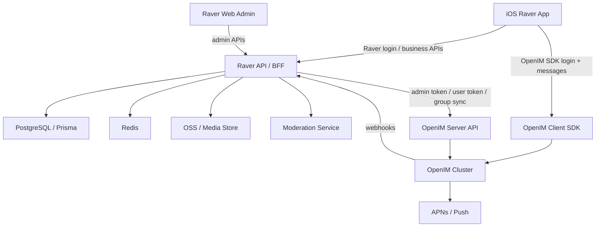

# Raver OpenIM 基座接入方案

> 状态：规划文档  
> 优先级：P0 聊天基座替换  
> 首期客户端：iOS  
> 目标：用 OpenIM 完整替代 Raver 当前自研聊天渠道，并保留 Raver 作为业务主系统。

## 1. 背景与结论

Raver 当前已经有自己的用户、动态、评论、小队、私信和小队消息模型。聊天相关能力目前主要由 Raver 后端的 `/v1/chat/*` BFF 接口和数据库表承载，包括：

- `DirectConversation`
- `DirectMessage`
- `DirectConversationRead`
- `SquadMessage`
- `SquadMember.lastReadAt`

这些模型能支撑 MVP，但它们还不是完整 IM 系统。随着产品需要支持 iOS 优先、多媒体消息、离线推送、群管理、活动临时群、举报审核、消息撤回、敏感词和图片审核，自研 IM 的复杂度会快速上升。

本方案的结论：

```text
Raver 继续做业务主系统
OpenIM 作为聊天基础设施
Raver Post/Feed/Comment/Search 不迁入 OpenIM
旧 DirectMessage/SquadMessage 全量迁移进 OpenIM
迁移完成后旧聊天渠道停止写入
```

OpenIM 只负责 IM 能力：

- 1v1 私信
- 小队群聊
- 活动临时群
- 系统通知类聊天消息
- 多媒体和自定义消息
- 聊天未读数
- 聊天消息离线和多端同步
- 聊天消息推送

Raver 继续负责：

- 用户注册、登录、封禁、资料
- 小队创建、官方认证、成员权限
- 活动、DJ、Set、Feed、评论、搜索
- 内容通知未读数
- 业务权限判断
- 管理后台
- 审核规则和举报处理

## 2. 已确认需求

### 2.1 客户端优先级

第一期先接入 iOS。

当前 iOS 入口：

- `mobile/ios/RaverMVP/RaverMVP/Features/Messages/ChatView.swift`
- `mobile/ios/RaverMVP/RaverMVP/Features/Messages/MessagesHomeView.swift`
- `mobile/ios/RaverMVP/RaverMVP/Features/Messages/MessagesViewModel.swift`
- `mobile/ios/RaverMVP/RaverMVP/Core/LiveSocialService.swift`

### 2.2 聊天范围

第一期和第二期覆盖：

- 私信 1v1
- 小队群聊
- 活动临时群
- 系统通知消息

### 2.3 小队和 OpenIM 群关系

每个 Raver `Squad` 对应一个 OpenIM `Group`。

建议映射：

```text
Raver Squad.id = OpenIM groupID
Raver User.id = OpenIM userID
```

小队本质上是一个群聊空间，但 Raver 会在业务层额外赋予：

- 官方认证
- 特殊权限
- 小队主页
- 小队活动记录
- 小队相册
- 小队公告
- 小队推荐和展示

OpenIM 只承载群聊能力，不成为小队主库。

### 2.4 用户 ID

可以复用：

```text
Raver User.id = OpenIM userID
```

不再额外维护 `openimUserId` 映射，降低同步和排查复杂度。

### 2.5 历史消息迁移

旧消息要迁移进 OpenIM。

迁移完成后：

- `DirectMessage` 不再写入
- `SquadMessage` 不再写入
- 旧 `/v1/chat/*` 可以短期作为兼容 BFF
- iOS 聊天页逐步改为 OpenIM SDK 数据源

### 2.6 客户端连接模式

采用推荐路线：

```text
聊天收发、会话、未读：iOS 直接接 OpenIM SDK
用户登录、OpenIM token、业务权限、群同步：继续走 Raver BFF
```

即：

- iOS 登录 Raver 后，向 Raver 后端请求 OpenIM token。
- Raver 后端调用 OpenIM 服务端 API 获取 user token。
- iOS 使用 OpenIM SDK 登录 IM。
- 小队/活动群的创建和成员同步只允许 Raver 后端发起。
- 客户端不能直接绕过 Raver 创建业务群。

### 2.7 消息类型

需要支持：

- 文本
- 图片
- 语音
- 视频
- 表情
- 活动卡片
- DJ/Set 卡片
- 系统消息

落地建议：

```text
OpenIM 原生消息：文本、图片、语音、视频
OpenIM 自定义消息：表情、活动卡片、DJ/Set 卡片、系统业务卡片
Raver 服务端消息：系统通知、审核提示、群成员变更提示
```

### 2.8 推送

采用推荐路线：

- iOS 先接 APNs
- Android 后续接 FCM 或国内厂商推送
- App badge 由 AppState 聚合

### 2.9 未读数

未读职责拆分：

```text
OpenIM：聊天未读数
Raver：内容通知未读数，如评论、点赞、关注、审核、小队邀请
iOS AppState：聚合总 badge
```

### 2.10 群聊权限

群聊需要支持：

- 群主
- 管理员
- 成员
- 踢人
- 禁言
- 退群
- 解散群
- 邀请审核
- 群公告

权限主库仍然是 Raver：

```text
Squad.leaderId / SquadMember.role 是权威数据
OpenIM group owner/admin/member 是聊天镜像
```

### 2.11 安全与审核

需要支持：

- 敏感词
- 图片审核
- 举报消息
- 管理员删除消息
- 撤回消息

推荐做法：

```text
发送前 webhook：敏感词和风控拦截
发送后 webhook：消息入 Raver 审核/索引/审计流水
媒体上传前：Raver OSS 上传和图片审核
举报：Raver 管理后台处理，必要时调用 OpenIM 删除/撤回消息
```

### 2.12 部署路线

采用推荐路线：

```text
本地：OpenIM Docker Compose 验证
测试环境：单机 Docker Compose
生产环境：先单机或轻量多容器，后续根据增长考虑 Kubernetes
```

### 2.13 首期规模

预估：

- 注册用户：1k
- 日活：1k
- 同时在线：1k
- 小队数量：100
- 单个小队最大人数：200
- 每日消息量：1000

这个规模可以先用单机 Docker Compose 测试环境验证。生产环境仍需做好备份、监控和扩容预案。

### 2.14 Web 管理后台

需要在当前 Web 后台/管理页面中加入 OpenIM 管理模块。

当前 Web 是 Next.js App Router 结构，暂未看到独立 `/admin` 目录。建议新增：

```text
web/src/app/admin/openim/page.tsx
web/src/app/admin/openim/users/page.tsx
web/src/app/admin/openim/groups/page.tsx
web/src/app/admin/openim/reports/page.tsx
web/src/app/admin/openim/sync-jobs/page.tsx
```

对应服务端新增：

```text
GET  /v1/admin/openim/overview
GET  /v1/admin/openim/users
GET  /v1/admin/openim/groups
GET  /v1/admin/openim/reports
GET  /v1/admin/openim/sync-jobs
POST /v1/admin/openim/sync/users/:id
POST /v1/admin/openim/sync/squads/:id
POST /v1/admin/openim/groups/:id/mute
POST /v1/admin/openim/messages/:id/revoke
POST /v1/admin/openim/reports/:id/resolve
```

后台接口必须要求 `role = admin`。

## 3. OpenIM 官方能力摘要

> 这里仅列接入方案需要用到的能力。实际开发时以当前 OpenIM 版本官方文档为准。

OpenIM 官方文档显示：

- 服务端 REST API 需要业务后端用管理员 token 调用。
- 用户可以通过 `user_register` 注册/导入。
- 客户端登录 OpenIM SDK 需要 user token。
- 服务端可以发送消息。
- 群管理 API 支持创建群、成员管理等能力。
- Webhook 能在消息发送前后、群变更等阶段通知业务系统。

需要重点验证的约束：

- OpenIM 创建群接口文档说明：创建群指定群主，群成员包含群主不能少于 3 人。
- Raver 当前 Squad 可能允许 1 人先创建小队。
- 如果该约束在所选 OpenIM 版本中仍存在，则需要采用“延迟物化 OpenIM 群”或“产品层要求创建群时至少 3 人”的策略。

官方文档参考：

- OpenIM REST API introduction: https://docs.openim.io/restapi/apis/introduction
- OpenIM user register: https://docs.openim.io/restapi/apis/usermanagement/userregister
- OpenIM get admin token: https://docs.openim.io/restapi/apis/authenticationmanagement/getadmintoken
- OpenIM get user token: https://docs.openim.io/restapi/apis/authenticationmanagement/getusertoken
- OpenIM create group: https://docs.openim.io/restapi/apis/groupmanagement/creategroup
- OpenIM send message: https://docs.openim.io/restapi/apis/messagemanagement/sendmessage
- OpenIM webhook introduction: https://docs.openim.io/restapi/webhooks/introduction
- OpenIM SDK initSDK: https://docs.openim.io/sdks/api/initialization/initsdk

## 4. 总体架构



核心原则：

1. Raver 用户登录仍然走 Raver JWT。
2. OpenIM token 只能由 Raver 后端签发/获取。
3. 用户和群的业务状态以 Raver DB 为准。
4. OpenIM 负责聊天 runtime。
5. OpenIM webhook 回写到 Raver 做审核、审计和管理后台展示。
6. 旧聊天表只作为迁移源和短期备份，不再作为新消息主链路。

## 5. 数据映射

### 5.1 用户映射

```text
Raver User.id       -> OpenIM userID
User.username       -> OpenIM nickname fallback
User.displayName    -> OpenIM nickname
User.avatarUrl      -> OpenIM faceURL
User.isActive=false -> OpenIM disable / Raver 阻止 token 签发
```

不建议新增 `openimUserId`。如果未来需要兼容第三方 IM，再加 `external_accounts` 表。

### 5.2 私信会话映射

```text
旧 DirectConversation.userAId/userBId -> OpenIM single conversation
旧 DirectMessage.senderId             -> OpenIM sendID
旧 DirectMessage.conversation peer     -> OpenIM recvID
```

私信会话本身不用在 Raver 再建主表。OpenIM 会话列表作为聊天主数据源。

保留 Raver 侧轻量镜像表用于管理和排障：

```prisma
model OpenIMConversationMirror {
  id              String   @id @default(uuid())
  conversationId  String   @unique @map("conversation_id")
  conversationType String  @map("conversation_type") // single, group
  ownerUserId     String?  @map("owner_user_id")
  peerUserId      String?  @map("peer_user_id")
  groupId         String?  @map("group_id")
  lastMessageAt   DateTime? @map("last_message_at")
  lastSyncedAt    DateTime? @map("last_synced_at")
  createdAt       DateTime @default(now()) @map("created_at")
  updatedAt       DateTime @updatedAt @map("updated_at")

  @@index([ownerUserId])
  @@index([groupId])
  @@map("openim_conversation_mirrors")
}
```

### 5.3 小队群映射

```text
Raver Squad.id          -> OpenIM groupID
Squad.name              -> groupName
Squad.avatarUrl         -> faceURL
Squad.description       -> introduction
Squad.notice            -> notification
Squad.leaderId          -> ownerUserID
SquadMember.role=admin  -> group admin
SquadMember.role=member -> group member
```

建议新增同步状态字段，不要只靠 OpenIM 成功与否隐式判断：

```prisma
enum OpenIMSyncStatus {
  pending
  synced
  failed
  disabled
}

model SquadOpenIMState {
  id             String   @id @default(uuid())
  squadId        String   @unique @map("squad_id")
  groupId        String   @unique @map("group_id")
  status         String   @default("pending")
  lastSyncedAt   DateTime? @map("last_synced_at")
  lastError      String?  @db.Text @map("last_error")
  retryCount     Int      @default(0) @map("retry_count")
  createdAt      DateTime @default(now()) @map("created_at")
  updatedAt      DateTime @updatedAt @map("updated_at")

  @@map("squad_openim_states")
}
```

### 5.4 活动临时群映射

活动临时群不是普通小队，但本质上也是 OpenIM Group。

建议新增 Raver 业务表：

```prisma
model EventChatRoom {
  id             String   @id @default(uuid())
  eventId        String   @map("event_id")
  groupId        String   @unique @map("group_id")
  name           String
  status         String   @default("active") // active, archived, dissolved
  ownerUserId    String   @map("owner_user_id")
  startsAt       DateTime? @map("starts_at")
  endsAt         DateTime? @map("ends_at")
  createdAt      DateTime @default(now()) @map("created_at")
  updatedAt      DateTime @updatedAt @map("updated_at")

  @@index([eventId])
  @@map("event_chat_rooms")
}
```

活动群成员来源策略需要产品确认：

- 参加/收藏活动后可申请加入
- 已打卡用户可加入
- 购票或人工认证用户可加入
- 管理员邀请加入

第一期建议：

```text
活动详情页提供“加入活动群”
用户点击后 Raver 检查登录和活动状态
Raver 后端调用 OpenIM 加群或发起入群申请
```

### 5.5 系统通知消息

系统通知消息分两类：

1. 内容通知：评论、点赞、关注、审核、小队邀请  
   仍归 Raver Notification 系统。

2. 聊天系统消息：入群、退群、踢人、群公告、活动群提醒  
   可由 Raver 服务端调用 OpenIM send message 发入会话。

系统消息发送者建议统一：

```text
openim_system_user_id = raver_system
```

需要在 OpenIM 初始化时注册该系统用户。

## 6. 服务端技术路线

### 6.1 新增环境变量

`server/.env` 建议新增：

```dotenv
OPENIM_ENABLED=false
OPENIM_API_BASE_URL=http://localhost:10002
OPENIM_WS_URL=ws://localhost:10001
OPENIM_ADMIN_USER_ID=imAdmin
OPENIM_ADMIN_SECRET=
OPENIM_PLATFORM_ID=1
OPENIM_SYSTEM_USER_ID=raver_system
OPENIM_CALLBACK_SECRET=

OPENIM_MIGRATION_BATCH_SIZE=200
OPENIM_MIGRATION_DRY_RUN=true

OPENIM_APNS_ENABLED=false
OPENIM_APNS_BUNDLE_ID=
OPENIM_APNS_CERT_PATH=
OPENIM_APNS_KEY_ID=
OPENIM_APNS_TEAM_ID=
```

注意：

- 具体 API URL、端口和 secret 以实际部署版本为准。
- 不要把 OpenIM admin secret 暴露给客户端。
- iOS 客户端只拿 `userToken` 和 SDK 连接配置。

### 6.2 新增服务目录

建议新增：

```text
server/src/services/openim/
├── openim-client.ts
├── openim-token.service.ts
├── openim-user.service.ts
├── openim-group.service.ts
├── openim-message.service.ts
├── openim-sync.service.ts
├── openim-migration.service.ts
├── openim-moderation.service.ts
└── openim-types.ts
```

职责：

- `openim-client.ts`：封装 HTTP 请求、管理员 token 缓存、错误处理。
- `openim-token.service.ts`：给当前 Raver 用户获取 OpenIM user token。
- `openim-user.service.ts`：注册/更新/禁用用户。
- `openim-group.service.ts`：创建群、加人、踢人、改群资料、禁言、解散。
- `openim-message.service.ts`：系统消息、卡片消息、消息撤回/删除。
- `openim-sync.service.ts`：业务事件到 OpenIM 的同步编排。
- `openim-migration.service.ts`：旧 DirectMessage/SquadMessage 迁移。
- `openim-moderation.service.ts`：敏感词、图片审核、举报处理。

### 6.3 OpenIM client 封装原则

所有 OpenIM API 调用都必须经过 `OpenIMClient`：

```typescript
export class OpenIMClient {
  async getAdminToken(): Promise<string>
  async post<T>(path: string, body: unknown): Promise<T>
}
```

要求：

- admin token 带过期时间缓存。
- 对 OpenIM 错误码做结构化日志。
- 给每次调用生成 `requestId`。
- 超时可配置，默认 10 秒。
- 非幂等操作通过 `OpenIMSyncJob` 做重试，不在 HTTP 请求里无限重试。

### 6.4 Raver 新增 API

#### 6.4.1 iOS 获取 OpenIM 配置

```http
GET /v1/openim/bootstrap
Authorization: Bearer <raver_jwt>
```

响应：

```json
{
  "enabled": true,
  "userID": "raver-user-id",
  "token": "openim-user-token",
  "apiURL": "https://im-api.raver.example.com",
  "wsURL": "wss://im-ws.raver.example.com",
  "platformID": 1,
  "systemUserID": "raver_system",
  "expiresAt": "2026-04-20T12:00:00.000Z"
}
```

逻辑：

1. 校验 Raver JWT。
2. 如果 `User.isActive=false`，拒绝签发。
3. 确保用户已注册到 OpenIM。
4. 调 OpenIM 获取 user token。
5. 返回 SDK 登录所需配置。

#### 6.4.2 旧聊天 BFF 兼容层

短期保留：

```text
GET  /v1/chat/conversations?type=
POST /v1/chat/conversations/:id/read
POST /v1/chat/direct/start
GET  /v1/chat/conversations/:id/messages
POST /v1/chat/conversations/:id/messages
```

但实现分阶段切换：

```text
Phase 1：仍查旧表
Phase 2：OpenIM enabled 用户查 OpenIM
Phase 3：iOS SDK 直连后，仅保留 direct/start 和业务入口
Phase 4：废弃旧读写消息接口
```

### 6.5 业务事件同步

所有业务事件都先落 Raver DB，再同步 OpenIM。

建议新增同步任务表：

```prisma
model OpenIMSyncJob {
  id           String   @id @default(uuid())
  type         String
  entityType   String   @map("entity_type")
  entityId     String   @map("entity_id")
  payload      Json
  status       String   @default("pending") // pending, running, succeeded, failed
  retryCount   Int      @default(0) @map("retry_count")
  lastError    String?  @db.Text @map("last_error")
  runAfter     DateTime @default(now()) @map("run_after")
  createdAt    DateTime @default(now()) @map("created_at")
  updatedAt    DateTime @updatedAt @map("updated_at")

  @@index([status, runAfter])
  @@index([entityType, entityId])
  @@map("openim_sync_jobs")
}
```

触发点：

| Raver 事件 | OpenIM 动作 |
| --- | --- |
| 用户注册 | user_register |
| 用户改昵称/头像 | update user info |
| 用户封禁 | 禁止 token 签发，必要时 OpenIM 禁用 |
| 创建小队 | create group |
| 修改小队资料 | update group info |
| 小队认证变化 | update group ex/custom field or Raver mirror |
| 加入小队 | add group member |
| 退出小队 | remove group member |
| 踢出成员 | kick group member |
| 设置管理员 | set group member role |
| 禁言成员 | mute group member |
| 解散小队 | dismiss group |
| 创建活动临时群 | create group |
| 活动结束归档 | mute/archive/dismiss by policy |

### 6.6 Webhook 接入

新增路由：

```text
POST /v1/openim/webhooks
```

要求：

- 校验 `OPENIM_CALLBACK_SECRET` 或签名。
- 记录原始事件到审计表。
- 根据事件类型分发。
- 不在 webhook 同步链路做耗时审核。
- 对需要审核的事件写入队列/任务。

建议表：

```prisma
model OpenIMWebhookEvent {
  id          String   @id @default(uuid())
  eventType   String   @map("event_type")
  payload     Json
  status      String   @default("received") // received, processed, failed
  lastError   String?  @db.Text @map("last_error")
  createdAt   DateTime @default(now()) @map("created_at")
  processedAt DateTime? @map("processed_at")

  @@index([eventType])
  @@index([status, createdAt])
  @@map("openim_webhook_events")
}
```

重点 webhook：

- 发送消息前：敏感词、封禁状态、群权限。
- 发送消息后：审计、管理后台、举报定位。
- 群成员变更后：检测 OpenIM 和 Raver 是否漂移。
- 消息撤回/删除后：同步管理后台状态。

## 7. 历史消息迁移方案

### 7.1 迁移目标

迁移源：

- `DirectMessage`
- `SquadMessage`

迁移目标：

- OpenIM 单聊消息
- OpenIM 群聊消息

迁移后：

- iOS 只从 OpenIM 读取聊天历史。
- 旧表只保留归档，不再写入。
- 旧 BFF 接口逐步废弃。

### 7.2 迁移前提

1. 所有 Raver 用户都已注册进 OpenIM。
2. 所有存在历史 `SquadMessage` 的小队都已创建 OpenIM group。
3. 活动临时群如果没有旧表，可以不迁移。
4. OpenIM send message API 支持指定历史 `sendTime`；具体字段按实际 OpenIM 版本确认。
5. 迁移脚本必须支持 dry-run、断点续跑、失败重试。

### 7.3 迁移状态表

```prisma
model OpenIMMessageMigration {
  id              String   @id @default(uuid())
  sourceType      String   @map("source_type") // direct_message, squad_message
  sourceId        String   @map("source_id")
  targetMessageId String?  @map("target_message_id")
  conversationKey String   @map("conversation_key")
  status          String   @default("pending") // pending, migrated, failed, skipped
  error           String?  @db.Text
  migratedAt      DateTime? @map("migrated_at")
  createdAt       DateTime @default(now()) @map("created_at")
  updatedAt       DateTime @updatedAt @map("updated_at")

  @@unique([sourceType, sourceId])
  @@index([status])
  @@index([conversationKey])
  @@map("openim_message_migrations")
}
```

### 7.4 私信迁移步骤

1. 查询全部 `DirectConversation`。
2. 对每个会话按 `createdAt asc` 查询 `DirectMessage`。
3. 确保 `userAId`、`userBId` 均已注册 OpenIM。
4. 对每条消息调用 OpenIM 服务端 send message：
   - `sendID = message.senderId`
   - `recvID = peer user id`
   - `sessionType = single`
   - `contentType = text` 或后续映射
   - `sendTime = message.createdAt`
5. 写入 `OpenIMMessageMigration`。
6. 失败记录错误并继续下一条。

### 7.5 小队消息迁移步骤

1. 查询全部有 `SquadMessage` 的 `Squad`。
2. 确保对应 OpenIM group 存在。
3. 确保所有消息发送者是该 group 成员；不是成员则先补入或标记 skipped。
4. 按 `createdAt asc` 迁移。
5. 系统消息发送者可映射为：
   - 原 `userId`，如果表示用户行为；
   - `raver_system`，如果是纯系统通知。
6. 写入 `OpenIMMessageMigration`。

### 7.6 迁移校验

每个会话校验：

- 源消息数 = 成功迁移数 + 明确 skipped 数
- 最新消息时间一致
- 抽样读取 OpenIM 历史消息可见
- iOS 聊天页展示顺序正确
- 未读数迁移策略符合预期

未读数建议不迁移历史精确状态：

```text
迁移完成后统一将历史消息视为已读
新消息从 OpenIM 开始计算未读
```

原因：

- 旧 `lastReadAt` 可以映射，但历史未读精确恢复成本较高。
- 上线切换时用户最关心新消息。
- 避免迁移后 App badge 大量跳变。

### 7.7 切换策略

推荐灰度：

```text
T-7 天：部署 OpenIM，跑用户和群同步 dry-run
T-5 天：迁移测试环境消息
T-3 天：生产 dry-run，修数据
T-1 天：生产全量迁移，旧聊天写入冻结 10-30 分钟
T 日：iOS TestFlight 灰度 OpenIM
T+3 天：如果无重大问题，旧聊天写入口下线
T+14 天：旧聊天读接口标记 deprecated
```

## 8. iOS 接入方案

### 8.1 当前状态

当前 `ChatView`：

- 页面进入后调用 `service.fetchMessages(conversationID:)`
- 发送时调用 `service.sendMessage(conversationID:content:)`
- 消息模型 `ChatMessage` 只支持文本内容
- 会话列表由 `MessagesViewModel` 从 Raver BFF 拉 direct/group conversations

### 8.2 新增 iOS 模块

建议新增：

```text
mobile/ios/RaverMVP/RaverMVP/Core/OpenIM/
├── OpenIMConfig.swift
├── OpenIMSession.swift
├── OpenIMBootstrapService.swift
├── OpenIMChatRepository.swift
├── OpenIMConversationMapper.swift
├── OpenIMMessageMapper.swift
├── OpenIMMediaUploader.swift
└── OpenIMEventHandlers.swift
```

### 8.3 SDK 引入方式

当前 iOS 工程未看到 Podfile，主要是 Xcode project + Swift 源码。

需要先确认 OpenIM iOS SDK 当前推荐安装方式：

- 如果支持 Swift Package Manager，优先用 SPM。
- 如果仅支持 CocoaPods，则需要引入 Podfile。

接入前任务：

```text
1. 在独立分支验证 OpenIM iOS SDK 能否通过 SPM 或 CocoaPods 编译。
2. 记录 Xcode 工程变更。
3. 确认最低 iOS 版本、Swift 版本和现有工程兼容性。
4. 确认与现有 Vendor/KSPlayerLite 的依赖无冲突。
```

### 8.4 登录流程

iOS 启动或 Raver 登录成功后：

```text
Raver login -> 获取 JWT -> GET /v1/openim/bootstrap
-> OpenIM SDK init -> OpenIM SDK login(userID, token)
-> 注册 message/conversation/group listeners
-> refresh AppState unread
```

伪代码：

```swift
final class OpenIMSession: ObservableObject {
    func bootstrapIfNeeded() async throws {
        let config = try await bootstrapService.fetchBootstrap()
        try OpenIMSDK.shared.initSDK(apiAddr: config.apiURL, wsAddr: config.wsURL)
        try await OpenIMSDK.shared.login(userID: config.userID, token: config.token)
        registerListeners()
    }
}
```

实际 API 名称以 OpenIM iOS SDK 为准。

### 8.5 会话列表

替换方向：

```text
旧：MessagesViewModel -> Raver BFF /v1/chat/conversations
新：MessagesViewModel -> OpenIMChatRepository -> OpenIM SDK conversation list
```

但业务入口仍然需要 Raver：

- 从用户主页发起私信：先调 Raver `/v1/chat/direct/start` 或新 `/v1/openim/direct/start` 做业务校验，再由 OpenIM SDK 打开会话。
- 从小队主页进入群聊：先调 Raver `/v1/squads/:id/profile` 确认权限，再打开 OpenIM group conversation。
- 从活动详情进入临时群：先调 Raver join/check API，再打开 group conversation。

### 8.6 消息模型扩展

当前：

```swift
struct ChatMessage {
    let id: String
    let conversationID: String
    var sender: UserSummary
    var content: String
    var createdAt: Date
    var isMine: Bool
}
```

建议扩展：

```swift
enum ChatMessageKind: Codable, Hashable {
    case text(String)
    case image(url: String, width: Double?, height: Double?)
    case voice(url: String, duration: Double?)
    case video(url: String, coverURL: String?, duration: Double?)
    case emoji(code: String, url: String?)
    case eventCard(eventID: String, title: String, coverURL: String?)
    case setCard(setID: String, title: String, coverURL: String?)
    case djCard(djID: String, name: String, avatarURL: String?)
    case system(String)
    case unsupported(summary: String)
}

struct ChatMessage: Codable, Identifiable, Hashable {
    let id: String
    let conversationID: String
    var sender: UserSummary
    var kind: ChatMessageKind
    var createdAt: Date
    var isMine: Bool
    var status: ChatMessageStatus
}
```

### 8.7 多媒体发送

推荐路径：

```text
iOS 选择媒体
-> 上传到 Raver OSS 签名地址或 Raver upload API
-> Raver 完成图片/视频审核
-> 审核通过后 iOS 使用 OpenIM SDK 发送 image/video/voice/custom message
```

不要让 OpenIM 成为业务媒体主存储。

原因：

- Raver 已有 OSS 接入。
- 图片审核需要 Raver 管控。
- Feed、评论、聊天媒体可以复用同一套存储和审核策略。

### 8.8 卡片消息

活动卡片、DJ/Set 卡片使用 OpenIM custom message。

建议 payload：

```json
{
  "version": 1,
  "type": "raver.event_card",
  "eventID": "event-id",
  "title": "Ultra Music Festival",
  "subtitle": "Miami",
  "coverURL": "https://...",
  "deepLink": "raver://events/event-id"
}
```

```json
{
  "version": 1,
  "type": "raver.set_card",
  "setID": "set-id",
  "title": "Martin Garrix Live Set",
  "artistName": "Martin Garrix",
  "coverURL": "https://...",
  "deepLink": "raver://sets/set-id"
}
```

### 8.9 撤回和删除

用户侧：

- 允许撤回自己消息。
- 撤回时间窗口建议 2 分钟或 5 分钟。

管理员侧：

- 管理后台可删除/撤回违规消息。
- 后端调用 OpenIM 管理 API。
- Raver 记录操作审计。

### 8.10 iOS 分阶段改造

Phase iOS-1：

- 添加 OpenIM bootstrap。
- App 启动后登录 OpenIM。
- 保留旧 ChatView UI。
- 会话列表仍可从 Raver BFF 拉。

Phase iOS-2：

- `MessagesViewModel` 改为读取 OpenIM conversation list。
- `ChatView` 改为读取 OpenIM message history。
- 文本发送走 OpenIM SDK。

Phase iOS-3：

- 图片、语音、视频。
- 自定义卡片消息渲染。
- 撤回、举报入口。

Phase iOS-4：

- 小队管理页联动 OpenIM 群公告、禁言、踢人。
- 活动临时群入口。

## 9. OpenIM 群和 Raver 权限模型

### 9.1 角色映射

| Raver role | OpenIM role | 说明 |
| --- | --- | --- |
| `leader` | owner | 小队队长，最高权限 |
| `admin` | admin | 小队管理员 |
| `member` | member | 普通成员 |

Raver 的 `Squad.leaderId` 是 owner 权威来源。OpenIM 只是镜像。

### 9.2 官方认证

小队官方认证不建议强依赖 OpenIM 原生字段。

建议：

- Raver `Squad` 表新增或保留认证字段。
- OpenIM 群资料可同步一个 custom/ex 字段用于客户端显示。
- iOS 小队详情和群资料页从 Raver BFF 拉认证状态。

示例：

```json
{
  "raver": {
    "squadID": "squad-id",
    "verified": true,
    "verificationType": "official",
    "badge": "official_squad"
  }
}
```

### 9.3 邀请审核

Raver 侧当前有 `SquadInvite`。建议继续以它为主。

流程：

```text
用户申请/被邀请
-> Raver 创建 SquadInvite
-> 队长/管理员审核
-> Raver 写 SquadMember
-> OpenIMSyncJob add_group_member
-> OpenIM 系统消息提示入群
```

客户端不要直接调用 OpenIM 入群绕过审核。

### 9.4 禁言

禁言分两类：

- 群全员禁言
- 单成员禁言

Raver 后台和小队管理页发起：

```text
PATCH /v1/squads/:id/members/:userId/mute
```

后端：

1. 检查当前用户是否 leader/admin。
2. 写 Raver `SquadMemberMute` 表。
3. 创建 OpenIMSyncJob 调用 OpenIM 禁言。
4. 发送系统消息。

建议表：

```prisma
model SquadMemberMute {
  id          String   @id @default(uuid())
  squadId     String   @map("squad_id")
  userId      String   @map("user_id")
  mutedById   String   @map("muted_by_id")
  reason      String?
  expiresAt   DateTime? @map("expires_at")
  createdAt   DateTime @default(now()) @map("created_at")

  @@index([squadId, userId])
  @@map("squad_member_mutes")
}
```

### 9.5 解散群

小队解散：

```text
Raver Squad status -> dissolved
OpenIM dismiss group
保留 Raver 历史数据
```

活动临时群归档：

```text
EventChatRoom status -> archived
OpenIM 可保留只读或解散，按产品策略
```

建议活动临时群先“归档禁言”，不要立即解散，方便用户回看。

## 10. 审核与举报

### 10.1 敏感词

发送前 webhook 拦截。

规则：

- 命中严重违规：拒绝发送。
- 命中疑似违规：允许发送但标记 reviewing，或替换为审核提示。
- 多次违规：Raver 风控限制发言。

敏感词来源：

- 本地词库
- 第三方内容安全服务
- 管理后台动态配置

### 10.2 图片审核

图片/视频上传先走 Raver 上传流程：

```text
上传媒体 -> OSS -> 内容安全审核 -> 审核通过 -> 发送 OpenIM 消息
```

如果 OpenIM SDK 默认直接上传媒体到 OpenIM/MinIO，需要改造成：

- 优先使用 Raver OSS URL 构造消息。
- 或使用 OpenIM 媒体存储但通过 webhook 做审核和删除。

推荐第一种。

### 10.3 举报消息

新增接口：

```http
POST /v1/openim/messages/:messageId/report
```

请求：

```json
{
  "conversationId": "xxx",
  "conversationType": "single|group",
  "reason": "spam|harassment|illegal|other",
  "description": "..."
}
```

表：

```prisma
model OpenIMMessageReport {
  id              String   @id @default(uuid())
  reporterId      String   @map("reporter_id")
  messageId       String   @map("message_id")
  conversationId  String   @map("conversation_id")
  conversationType String  @map("conversation_type")
  senderId        String?  @map("sender_id")
  reason          String
  description     String?  @db.Text
  status          String   @default("pending") // pending, accepted, rejected
  handledById     String?  @map("handled_by_id")
  handledAt       DateTime? @map("handled_at")
  action          String?  // none, revoke, mute, ban
  createdAt       DateTime @default(now()) @map("created_at")

  @@index([status, createdAt])
  @@index([messageId])
  @@map("openim_message_reports")
}
```

### 10.4 管理员删除消息

后台操作：

```text
管理员查看举报
-> 查看消息上下文
-> 选择撤回/删除
-> Raver 调 OpenIM
-> 记录审计
-> 如有必要禁言/封禁用户
```

审计表：

```prisma
model AdminAuditLog {
  id          String   @id @default(uuid())
  adminId     String   @map("admin_id")
  action      String
  targetType  String   @map("target_type")
  targetId    String   @map("target_id")
  payload     Json?
  createdAt   DateTime @default(now()) @map("created_at")

  @@index([adminId, createdAt])
  @@index([targetType, targetId])
  @@map("admin_audit_logs")
}
```

## 11. Web 管理后台方案

### 11.1 页面结构

建议新增 OpenIM 管理模块：

```text
/admin/openim
  总览

/admin/openim/users
  用户 IM 状态、token 签发状态、同步状态、封禁状态

/admin/openim/groups
  小队群、活动群、成员数、群主、同步状态、最后消息时间

/admin/openim/reports
  消息举报、处理、撤回、禁言、封禁

/admin/openim/sync-jobs
  同步任务、失败重试、错误详情

/admin/openim/webhooks
  webhook 事件、失败事件、重放
```

### 11.2 总览指标

```text
OpenIM enabled
OpenIM API health
OpenIM WS health
用户同步成功/失败
群同步成功/失败
待处理举报
失败同步任务
今日消息量
今日撤回数
今日敏感词拦截数
```

### 11.3 管理操作

用户：

- 同步用户到 OpenIM
- 禁用 IM 登录
- 解除禁用
- 查看该用户群列表

群：

- 同步群资料
- 同步群成员
- 设置群公告
- 群禁言
- 解散群
- 查看同步错误

举报：

- 查看消息上下文
- 撤回消息
- 禁言用户
- 封禁用户
- 驳回举报

同步任务：

- 重试
- 标记跳过
- 查看 payload

### 11.4 权限

所有管理页面和 API 必须要求：

```text
Raver User.role = admin
```

管理 API 禁止客户端普通 token 访问。

## 12. 部署方案

### 12.1 本地开发

目标：

- 本地 OpenIM 跑通。
- iOS 模拟器能登录 OpenIM。
- Raver 后端能调用 OpenIM API。
- Webhook 能打回本地 Raver API。

建议新增：

```text
infra/openim/docker-compose.yml
infra/openim/.env.example
docs/OPENIM_LOCAL_DEV.md
```

本地可以先和现有 `docker-compose.yml` 分离，避免污染当前 Postgres/Redis。

### 12.2 测试环境

测试环境单机 Docker Compose：

```text
OpenIM services
MongoDB
Redis
Kafka or OpenIM required MQ
MinIO or media storage
Raver API
Raver Web
Nginx / TLS
```

如果 OpenIM 版本默认依赖 MySQL/Mongo/Redis/Kafka/MinIO，以官方 compose 为准。

### 12.3 生产环境

首期规模不大，但生产必须具备：

- TLS
- 数据备份
- 日志采集
- OpenIM API/WS 监控
- Mongo/Redis/Kafka/MinIO 监控
- APNs 证书或 token 管理
- 灾备恢复手册

### 12.4 域名建议

```text
api.raver.example.com       Raver API
web.raver.example.com       Raver Web
im-api.raver.example.com    OpenIM API
im-ws.raver.example.com     OpenIM WebSocket
im-admin.raver.example.com  internal only, if needed
```

不要把 OpenIM 管理端口裸露公网。

## 13. 分阶段实施计划

### Phase 0：接入前验证

目标：验证 OpenIM 版本、SDK、部署、创建群约束。

任务：

- 本地部署 OpenIM。
- Raver 后端写最小 `OpenIMClient`。
- 调通 admin token。
- 调通 user register。
- 调通 user token。
- iOS demo 登录 SDK。
- 验证创建群是否必须至少 3 人。
- 验证服务端 send message 是否能指定历史 sendTime。
- 验证 webhook 能回调 Raver。

验收：

- 一个 Raver 测试用户能登录 OpenIM。
- 两个测试用户能单聊。
- 一个测试群能发送消息。
- webhook 能收到消息事件。

### Phase 1：服务端基础设施

目标：Raver 后端具备 OpenIM adapter。

任务：

- 增加 `OPENIM_*` env。
- 新增 `server/src/services/openim/*`。
- 新增 `/v1/openim/bootstrap`。
- 新增用户同步服务。
- 新增同步任务表。
- 登录/注册时触发用户同步。
- 新增 OpenIM health check。

验收：

- Raver 登录后能拿到 OpenIM bootstrap。
- 用户资料更新能同步 OpenIM。
- 同步失败能在任务表看到。

### Phase 2：小队群和活动群同步

目标：Raver 小队和活动群能映射到 OpenIM group。

任务：

- 新增 `SquadOpenIMState`。
- 创建小队时创建 OpenIM group。
- 加入/退出/踢人同步群成员。
- leader/admin/member 同步角色。
- 小队资料更新同步 group info。
- 新增 `EventChatRoom`。
- 活动详情加入活动临时群。

验收：

- 创建小队后 OpenIM group 存在。
- 成员加入后能进入群聊。
- 退出/踢人后不能继续发群消息。
- 群公告能同步。

### Phase 3：历史消息迁移

目标：旧消息全部迁移进 OpenIM。

任务：

- 新增 `OpenIMMessageMigration`。
- 写 dry-run 迁移脚本。
- 迁移 DirectMessage。
- 迁移 SquadMessage。
- 生成迁移报告。
- 抽样校验 iOS 展示。

验收：

- 迁移成功率达到 99% 以上。
- skipped 都有明确原因。
- 私信和小队历史消息顺序正确。
- 旧聊天写入冻结后没有数据丢失。

### Phase 4：iOS SDK 切换

目标：iOS 聊天功能使用 OpenIM。

任务：

- 集成 OpenIM iOS SDK。
- 登录后 bootstrap OpenIM。
- `MessagesViewModel` 接 OpenIM 会话。
- `ChatView` 接 OpenIM 历史消息。
- 文本发送走 OpenIM。
- 图片/语音/视频发送。
- 自定义卡片消息渲染。
- 撤回和举报入口。
- AppState 聚合 OpenIM 未读数和 Raver 通知未读。

验收：

- 私信实时到达。
- 小队群消息实时到达。
- 活动临时群可用。
- 断网重连后消息补齐。
- App badge 正确。
- 新旧接口灰度切换可回滚。

### Phase 5：审核、举报、后台

目标：满足上线后的治理能力。

任务：

- OpenIM webhook 验签。
- 敏感词拦截。
- 图片审核流程。
- 消息举报接口。
- Web 管理后台 OpenIM 模块。
- 管理员撤回/删除消息。
- 禁言和封禁联动。
- 审计日志。

验收：

- 敏感词命中可拦截。
- 举报能进入后台。
- 管理员能撤回违规消息。
- 操作审计完整。

### Phase 6：生产上线

目标：稳定替代旧聊天渠道。

任务：

- APNs 配置。
- 监控和报警。
- 备份和恢复演练。
- TestFlight 灰度。
- 生产迁移。
- 旧聊天接口只读。
- 旧聊天写入口下线。

验收：

- 1k 同时在线压测通过。
- 每日 1000 消息量稳定。
- 推送可用。
- 无明显消息丢失。
- 回滚预案可执行。

## 14. 回滚方案

必须保留功能开关：

```dotenv
OPENIM_ENABLED=false
OPENIM_IOS_ENABLED=false
OPENIM_WRITE_ENABLED=false
OPENIM_MIGRATION_READ_ONLY=true
```

回滚级别：

### 14.1 iOS 回滚

- 关闭远端 OpenIM feature flag。
- iOS 回到旧 `/v1/chat/*`。
- 仅适用于旧聊天写入口尚未下线的阶段。

### 14.2 服务端写入回滚

- 停止 OpenIM sync job worker。
- Raver 恢复旧聊天写入。
- 标记迁移后 OpenIM 数据为非权威。

### 14.3 生产完全回滚

只有在旧聊天写入口未删除时可完全回滚。

一旦完成最终切换并停止旧写入，回滚策略应变成：

```text
修复 OpenIM / adapter
不再回到旧聊天表
```

## 15. 风险清单

### R1：OpenIM 创建群成员数约束

风险：

- Raver 小队允许 1 人创建，但 OpenIM 可能要求创建群时至少 3 人。

方案：

1. 接入前实测当前版本。
2. 如果确实限制，产品选择：
   - 小队至少邀请 2 人后才开通群聊；
   - 或小队先创建，OpenIM group 延迟物化；
   - 不推荐加入假用户凑数。

### R2：历史消息迁移顺序和时间

风险：

- 迁移消息可能无法完全保留原发送时间或顺序。

方案：

- 验证 send message API 是否支持 `sendTime`。
- 按会话串行迁移。
- 迁移后抽样校验。

### R3：iOS SDK 集成方式

风险：

- 当前工程没有 Podfile，OpenIM iOS SDK 可能需要 CocoaPods。

方案：

- Phase 0 独立验证。
- 若必须 CocoaPods，记录 Xcode 工程迁移步骤。

### R4：媒体存储路径

风险：

- OpenIM 默认媒体上传和 Raver OSS/审核链路冲突。

方案：

- 多媒体先上传 Raver OSS。
- 审核通过后发送 URL 消息或自定义消息。

### R5：权限漂移

风险：

- Raver 小队成员和 OpenIM 群成员不一致。

方案：

- Raver 是权威主库。
- 定时 reconcile job。
- Web 后台显示漂移并支持一键修复。

### R6：Webhook 可用性

风险：

- webhook 失败导致审核/审计丢事件。

方案：

- OpenIM webhook 入库。
- 失败可重放。
- 对发送前审核设置超时和降级策略。

### R7：推送配置复杂

风险：

- APNs 证书、bundle id、生产/开发环境容易错。

方案：

- 单独写 `docs/OPENIM_IOS_PUSH_RUNBOOK.md`。
- TestFlight 前完成推送验收。

## 16. 验收 Checklist

### 基础

- [ ] OpenIM 本地部署成功。
- [ ] Raver 后端能获取 admin token。
- [ ] Raver 用户能注册到 OpenIM。
- [ ] iOS 能获取 `/v1/openim/bootstrap`。
- [ ] iOS 能登录 OpenIM SDK。

### 私信

- [ ] A 能给 B 发文本。
- [ ] B 在线实时收到。
- [ ] B 离线后重新上线能收到。
- [ ] 未读数正确。
- [ ] 会话列表最新消息正确。

### 小队群

- [ ] 创建小队后生成 OpenIM group。
- [ ] 加入小队后进入群。
- [ ] 退出小队后退出群。
- [ ] 队长/管理员/成员角色正确。
- [ ] 群公告可用。
- [ ] 禁言可用。
- [ ] 踢人可用。
- [ ] 解散群可用。

### 活动临时群

- [ ] 活动详情可加入活动群。
- [ ] 活动群消息可收发。
- [ ] 活动结束后可归档或禁言。

### 多媒体

- [ ] 图片消息。
- [ ] 语音消息。
- [ ] 视频消息。
- [ ] 表情消息。
- [ ] 活动卡片。
- [ ] DJ/Set 卡片。

### 审核和治理

- [ ] 敏感词拦截。
- [ ] 图片审核。
- [ ] 举报消息。
- [ ] 管理员撤回消息。
- [ ] 管理员删除消息。
- [ ] 审计日志。

### 迁移

- [ ] DirectMessage dry-run。
- [ ] SquadMessage dry-run。
- [ ] 生产迁移报告。
- [ ] 抽样消息顺序正确。
- [ ] 旧聊天写入口停止。

### 后台

- [ ] OpenIM 总览。
- [ ] 用户同步状态。
- [ ] 群同步状态。
- [ ] 举报处理。
- [ ] 同步任务重试。
- [ ] Webhook 事件查看。

## 17. 建议开发顺序

最小可落地顺序：

1. `OPENIM_ENABLED` feature flag。
2. 本地 OpenIM 部署。
3. `OpenIMClient` + admin token。
4. 用户注册同步。
5. `/v1/openim/bootstrap`。
6. iOS SDK 登录。
7. 单聊文本。
8. 小队群创建和文本。
9. 历史消息迁移 dry-run。
10. 多媒体消息。
11. 活动临时群。
12. 审核、举报、后台。
13. 生产迁移和灰度上线。

## 18. 首批文件改动建议

### 后端

```text
server/src/services/openim/openim-client.ts
server/src/services/openim/openim-token.service.ts
server/src/services/openim/openim-user.service.ts
server/src/services/openim/openim-group.service.ts
server/src/services/openim/openim-message.service.ts
server/src/services/openim/openim-sync.service.ts
server/src/services/openim/openim-migration.service.ts
server/src/routes/openim.routes.ts
server/src/routes/admin-openim.routes.ts
server/prisma/schema.prisma
```

### iOS

```text
mobile/ios/RaverMVP/RaverMVP/Core/OpenIM/OpenIMConfig.swift
mobile/ios/RaverMVP/RaverMVP/Core/OpenIM/OpenIMSession.swift
mobile/ios/RaverMVP/RaverMVP/Core/OpenIM/OpenIMBootstrapService.swift
mobile/ios/RaverMVP/RaverMVP/Core/OpenIM/OpenIMChatRepository.swift
mobile/ios/RaverMVP/RaverMVP/Features/Messages/ChatView.swift
mobile/ios/RaverMVP/RaverMVP/Features/Messages/MessagesViewModel.swift
mobile/ios/RaverMVP/RaverMVP/Core/AppState.swift
```

### Web

```text
web/src/app/admin/openim/page.tsx
web/src/app/admin/openim/users/page.tsx
web/src/app/admin/openim/groups/page.tsx
web/src/app/admin/openim/reports/page.tsx
web/src/app/admin/openim/sync-jobs/page.tsx
web/src/lib/api/openim-admin.ts
```

### 文档和运维

```text
docs/OPENIM_INTEGRATION_PLAN.md
docs/OPENIM_LOCAL_DEV.md
docs/OPENIM_MIGRATION_RUNBOOK.md
docs/OPENIM_IOS_PUSH_RUNBOOK.md
infra/openim/docker-compose.yml
infra/openim/.env.example
```

## 19. 后续待决策项

1. OpenIM 群创建是否确实要求至少 3 人。
2. 小队是否允许 1 人创建后暂不开通群聊。
3. 活动临时群的加入条件。
4. 活动临时群结束后是归档、禁言还是解散。
5. OpenIM iOS SDK 使用 SPM 还是 CocoaPods。
6. 多媒体是否完全走 Raver OSS。
7. 敏感词服务用本地词库还是第三方内容安全。
8. 图片/视频审核服务选型。
9. 管理后台是否先做最小页面还是完整模块。
10. 旧聊天表保留多久。
