# Raver 技术架构文档

## 1. 文档说明

希望通过这份文档配合 App 使用视频，把以下问题尽量讲清楚：

- App 视频里展示的核心功能分别由哪些客户端、后端和数据库设计支撑。
- 目前 iOS、Web/Admin、后端、数据库、IM、通知、异步任务等技术选型是否匹配当前阶段。
- 哪些设计是合理的工程化，哪些地方可能存在过度设计或技术债。
- 如果后续要继续商业化和团队化开发，哪些架构问题值得优先调整。

阅读时可以先看领域名词说明和产品核心逻辑，再结合视频查看“App 视频功能与技术实现对应表”。如果时间有限，也可以直接关注客户端、后端、数据库和风险章节。

本文尽量使用中文描述。少量英文保留在技术名词、代码路径、框架名称和数据库模型名中。

---

## 2. 电子音乐领域名词说明

为了减少领域背景带来的理解成本，下面先把 App 中常见的电子音乐相关名词翻译成更通用的互联网产品概念。

| App / 电子音乐名词 | 通用理解 | 在系统里的技术含义 |
| --- | --- | --- |
| Event | 线下活动 | 平台中心实体，连接资讯、阵容、讨论、通知、小队、打卡 |
| Festival | 大型音乐节 / 多日活动 | 一类更复杂的活动，通常包含多天、多舞台、多阵容 |
| DJ / Artist | 活动嘉宾 / 艺人 / 内容创作者 | 可被关注、可出现在活动阵容中，也可关联 Set 和 Tracklist |
| Lineup | 活动阵容 | Event 与 DJ / Artist 的关联列表 |
| Timetable | 演出时间表 / 排期 | 活动中每个艺人在不同时间、舞台的演出安排 |
| Set | 一段 DJ 演出内容或演出录像 | 可播放、可评论、可收藏、可分享的音乐内容资产 |
| Tracklist | 曲目单 | 一个 Set 中包含哪些音乐曲目的结构化列表 |
| Track | 单首曲目 | Tracklist 中的具体音乐条目 |
| Label | 音乐厂牌 | 音乐内容和艺人资料的一类组织实体 |
| Genre | 曲风 | 音乐风格分类，用于内容组织和用户兴趣表达 |
| Squad | 小队 / 同行群组 | 用户围绕线下活动组成的小群体，可聊天、邀请、共享现场状态和位置 |
| Check-in | 打卡 / 参与记录 | 用户参加过某个活动或看过某个 DJ 的记录，用于身份沉淀和个人主页展示 |
| 活动实时讨论区 | 活动现场评论流 | 围绕某个 Event 的公开或半公开讨论内容 |
| 小队定位分享 | 活动现场位置协同 | 小队成员在活动期间共享位置和状态的能力 |
| 内容共建 | 平台和用户共同维护资讯 | 活动、DJ、Set、Tracklist、Label、Festival 等资料可由运营、导入脚本和用户贡献共同完善 |

---

## 3. 产品核心逻辑

### 3.1 一句话说明

Raver 是一个围绕线下电子音乐活动展开的移动端垂直社区平台。

它的核心不是“活动列表”，也不是“音乐播放器”，而是围绕线下活动形成完整闭环：

```text
活动前：发现活动、获取资讯、关注 DJ、接收提醒
活动中：实时讨论、评论互动、私聊、小队群聊、小队定位分享
活动后：打卡记录、内容沉淀、Set / Tracklist、社区传播、资讯共建
```

也就是说，App 视频里看到的功能虽然很多，但它们本质上都围绕“线下电子音乐活动”这个中心对象展开。

### 3.2 核心业务闭环图

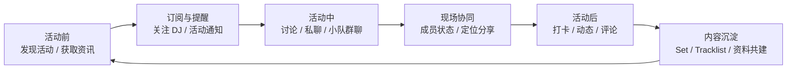


### 3.3 主要功能域

| 功能域 | 用户看到的功能 | 技术上对应的系统 |
| --- | --- | --- |
| 活动资讯 | 活动列表、活动详情、阵容、时间表、票务和地点 | Event / Festival / Lineup / Timetable 数据模型 |
| 音乐内容 | DJ 详情、Set、Tracklist、Label、曲风 | Music Content Domain |
| 推送提醒 | 活动倒计时、关注 DJ 更新、路线提醒、站内通知 | Notification Center + APNs + Worker |
| 社区讨论 | Feed、评论区、活动实时讨论区、点赞、收藏、转发 | Feed / Comment / EventLiveComment |
| 社交关系 | 关注用户、关注 DJ、用户主页、小队成员 | User / Follow / Squad |
| 即时通信 | 私聊、小队群聊、聊天卡片 | Tencent IM + 后端 IM 编排 |
| 线下协同 | 小队活动、成员状态、定位分享 | SquadOfflineActivity + Location Upload |
| 活动后沉淀 | Check-in、Timeline、Gallery、Stats | Check-in v2 Projection |
| 内容共建 | 用户和运营补充活动、DJ、Set、Tracklist | Admin / CMS / Contributor / Import Jobs |
| 运营后台 | 预报名、通知运营、内容管理、审计 | Next.js Admin + Admin API |

---

## 4. 总体系统架构

### 4.1 总体架构图


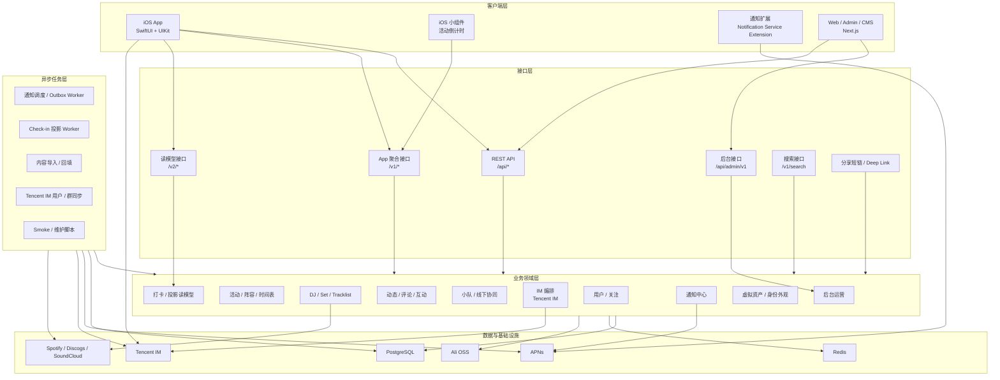

### 4.2 当前技术选型总览

| 层级 | 当前技术 | 选择原因 | 希望请教的问题 |
| --- | --- | --- | --- |
| iOS 主客户端 | SwiftUI + UIKit | App 核心能力依赖原生推送、定位、IM、Widget、复杂滚动和媒体体验 | 原生优先是否合理，SwiftUI/UIKit 混合边界是否清楚 |
| iOS 架构 | Coordinator + MVVM + Repository 迁移中 | 控制导航复杂度，隔离 ViewModel 和底层 API service | Repository 是否拆得合理，是否有 Fat Repository 风险 |
| Web / Admin | Next.js + React + TypeScript + Tailwind | Web 当前主要做后台、CMS、预报名和分享 fallback | Admin 和 public 页面是否需要进一步隔离 |
| 后端框架 | Node.js + Express + TypeScript | 当前项目重心是领域边界治理，Express 成本低、灵活 | 是否需要更强框架约束，如 NestJS / Fastify |
| 后端架构 | Modular Monolith | 当前不急于微服务化，先按领域拆清边界 | module facade 是否真的形成边界 |
| ORM / 数据库 | Prisma + PostgreSQL | 关系模型复杂，Prisma 提供类型和开发效率 | 复杂查询、事务、性能和索引是否足够 |
| 缓存 | Redis | 缓存、后续队列和状态存储基础 | 当前是否需要更正式的队列系统 |
| 即时通信 | Tencent IM | 私聊、群聊、离线消息、群同步自研成本高 | provider lock-in 和隔离程度 |
| 推送 | Notification Center + APNs | 活动强时间属性，通知需要统一基础设施 | outbox、失败重试、订阅偏好、可观测性 |
| 对象存储 | Ali OSS | 图片、视频、头像、封面、二维码、海报更适合走对象存储 | CDN、鉴权、清理策略 |
| 异步任务 | Node scripts / schedulers / workers | 当前阶段务实，适合导入、回填、投影、通知 | 幂等、重试、job history、监控是否足够 |

---

## 5. App 视频功能与技术实现对应表

这一节用于配合 App 使用视频观看。视频中每看到一个功能，可以对照下表理解它背后的实现。

| 视频中看到的功能 | 客户端实现 | 后端实现 | 数据库 / 外部系统 | 架构说明 |
| --- | --- | --- | --- | --- |
| 登录 / 注册 / 会话恢复 | iOS Auth、SessionTokenStore、AppState | `/api/auth`、JWT、refresh token、短信验证码 | `User`、`AuthRefreshToken`、`AuthSmsCode` | 登录态是所有社交、IM、打卡、通知能力的身份基础 |
| 活动列表 | Discover / Events 模块 | Event API / BFF 聚合 | `Event`、`EventTicketTier` | 活动是平台中心实体，列表主要读取活动基础信息和推荐信息 |
| 活动详情 | SwiftUI + UIKit 混合详情页 | Event controller / BFF | `Event`、`EventLineupArtist`、`EventTimetableSlot` | 活动详情聚合阵容、时间表、评论、关注状态等多领域数据 |
| DJ 列表和详情 | Discover / DJs 模块 | DJ API、Music module | `DJ`、`DJContributor`、`Follow` | DJ 是可关注的艺人实体，也是活动阵容和音乐内容的连接点 |
| Set / Tracklist | Discover / Sets 模块 | DJSet service、Music routes | `DJSet`、`Tracklist`、`Track`、`TracklistTrack` | 活动后的演出内容沉淀，支持结构化曲目清单 |
| Feed 动态 | FeedView、FeedViewModel | Feed module、BFF | `Post`、`FeedEvent` | Feed 是围绕活动、DJ、Set 的社区传播层 |
| 评论区 | PostDetail、Comment UI | PostComment service、comment routes | `PostComment`、`Comment`、`EventLiveComment` | 评论能力分为 Feed 评论、Set 评论、活动现场讨论 |
| 点赞 / 收藏 / 转发 / 分享 | Feed interaction UI | PostInteraction service | `PostLike`、`PostSave`、`PostRepost`、`PostShare` | 互动计数和行为事件支撑社区反馈和后续推荐 |
| 活动实时讨论区 | 活动详情内讨论入口 | EventLiveComment API | `EventLiveComment`、`EventLiveCommentLike` | 活动现场讨论不完全走 IM，而是保留为活动上下文内容 |
| 私聊 | Messages 模块、Tencent IM SDK | IM bootstrap、UserSig | Tencent IM、`DirectConversation` 兼容模型 | 实时消息由 Tencent IM 承担，业务身份由 Raver 后端维护 |
| 小队群聊 | Messages / Squad 入口 | Squad to Tencent IM group sync | Tencent IM、`Squad`、`SquadMember` | 小队是业务关系，Tencent IM group 是实时通信载体 |
| 聊天业务卡片 | ChatCustomCardCodec、RouteTarget | 分享 / IM 编排接口 | ShareLink、Tencent IM custom message | 活动、DJ、Set、Check-in 可作为结构化卡片在聊天中传播 |
| 小队主页 | SquadProfileView / ViewModel | Squad service | `Squad`、`SquadMember`、`SquadInvite` | 小队是活动同行和线下社交的组织单位 |
| 小队线下活动 | SquadOfflineActivityView | Squad offline activity API | `SquadOfflineActivity`、`Participant` | 表达一次线下同行活动，绑定小队和可选活动 |
| 小队成员状态 | iOS 状态按钮和 banner | status event API | `SquadOfflineActivityStatusEvent` | 如暂离、买饮料等轻量状态，不一定需要独立实时服务 |
| 小队定位分享 | LocationUploader | location upload API | `SquadOfflineActivityLocation` | 定位数据绑定小队活动上下文，可以重点请教隐私和可见性设计 |
| Check-in 打卡 | Profile / Checkins 模块 | Check-in v2 API | `Checkin`、`CheckinSnapshot`、`CheckinSelection` | 记录用户参加过的活动或看过的 DJ |
| 我的打卡 Timeline / Gallery / Stats | MyCheckinsView | Projection read API | `UserCheckinTimelineEntry`、`UserCheckinStat`、Gallery aggregates | 高频复杂读取通过投影表优化 |
| 通知中心 | NotificationsView / ViewModel | Notification Center routes | `NotificationInboxItem`、`NotificationEvent` | 站内通知统一收口社区互动、活动提醒、运营通知 |
| 系统推送 | APNs、Notification Extension | APNs handler、outbox worker | `DevicePushToken`、`NotificationDelivery` | 线下活动强依赖时间提醒，所以推送是核心基础设施 |
| 活动倒计时 Widget | Countdown Widget | Widget selectable event sync | iOS App Group / BFF | 活动前提醒和回访场景 |
| 分享短链 / 二维码 | Share action panel | ShareLink service | `ShareLink`、`ShareLinkEvent` | 跨 App、Web、外部渠道传播内容 |
| 后台管理 / CMS | Next.js Admin | `/api/admin/v1` facade | AdminAuditLog、各领域模型 | 资讯共建、通知运营、预报名审核和数据运维入口 |

---

## 6. 客户端架构设计

### 6.1 客户端定位

iOS 是当前主客户端。选择原生 iOS 的原因不是“技术偏好”，而是产品核心能力天然依赖移动端原生能力：

- 活动提醒依赖 APNs 和通知扩展。
- 小队线下协同依赖定位权限和系统能力。
- 私聊 / 群聊依赖 Tencent IM SDK。
- 活动倒计时依赖 Widget。
- 聊天、Feed、活动详情需要复杂滚动、媒体加载和本地缓存。
- 分享和 Deep Link 需要稳定的 App 路由。

### 6.2 iOS 架构图

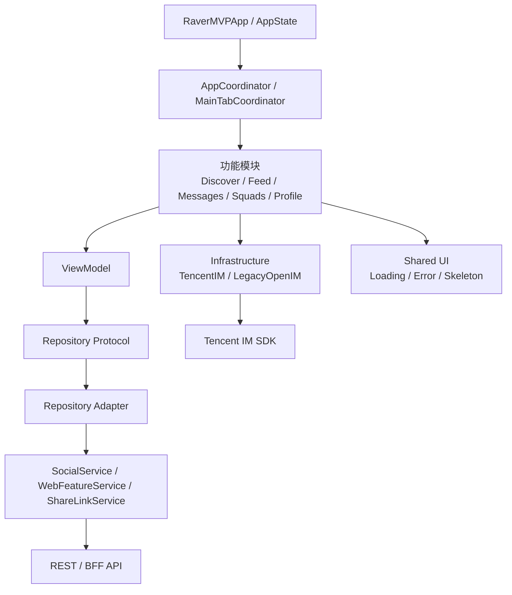

### 6.3 iOS 目录结构

```text
mobile/ios/RaverMVP/RaverMVP/
  Application/
    Coordinator/
    DI/
  Core/
    AppState.swift
    SessionTokenStore.swift
    SocialService.swift
    WebFeatureService.swift
    ShareLinkService.swift
  Features/
    Auth/
    Discover/
    Feed/
    Messages/
    Notifications/
    Profile/
    Search/
    Squads/
    VirtualAssets/
  Infrastructure/
    TencentIM/
    LegacyOpenIM/
  Shared/
  Vendor/
```

### 6.4 客户端分层说明

| 层级 | 职责 | 当前状态 | 可请教的点 |
| --- | --- | --- | --- |
| AppState | 登录态、全局状态、启动协调 | 已存在 | 是否过重，是否承担过多业务逻辑 |
| Coordinator | App 路由、Tab、深链、跨模块跳转 | 迁移中 | 是否能支撑聊天卡片、分享链接、通知点击跳转 |
| Feature | 页面和模块功能 | Discover、Feed、Messages、Profile 等已按功能组织 | 模块边界是否清楚 |
| ViewModel | 页面状态和用户交互编排 | 已广泛使用 | 是否直接依赖大 service |
| Repository | 领域数据接口 | 正在从旧 service 迁移 | 是否拆得过细或过粗 |
| Service / Adapter | 底层 API client 和兼容层 | `SocialService`、`WebFeatureService` 仍存在 | 不适合继续扩大为 God Service |
| Infrastructure | SDK、IM、缓存、媒体、系统能力 | TencentIM 已独立目录 | provider 是否隔离 |
| Shared UI | 通用 UI、loading、error、skeleton | 已存在 | 是否沉淀为设计系统 |

### 6.5 客户端技术选择说明

| 问题 | 当前选择 | 理由 | 风险 |
| --- | --- | --- | --- |
| 为什么不是纯 SwiftUI？ | SwiftUI + UIKit 混合 | 聊天、复杂滚动、部分页面 UIKit 更稳定 | 混合边界需要治理 |
| 为什么需要 Coordinator？ | AppCoordinator + feature coordinator | App 有深链、Tab、聊天卡片、通知跳转 | Coordinator 可能变重 |
| 为什么引入 Repository？ | ViewModel 依赖 Repository protocol | 降低 ViewModel 对旧 service 和 API 的直接依赖 | Repository 可能过度拆分 |
| 为什么保留旧 Service？ | 迁移期兼容 | 避免一次性大迁移破坏功能 | 旧 service 继续膨胀 |
| 为什么 Tencent IM 放 Infrastructure？ | SDK 和 provider 属于基础设施 | 业务层尽量不要直接散落依赖 IM SDK | provider 隔离不充分会增加替换成本 |

---

## 7. 后端架构设计

### 7.1 后端定位

后端当前采用 Node.js + Express + TypeScript + Prisma。

架构上选择 modular monolith，而不是直接拆微服务。原因是当前项目最需要解决的问题是：

- 领域边界清晰。
- 历史路线和当前主线隔离。
- BFF、routes、services 不继续横向膨胀。
- 数据库模型 owner 明确。
- 后台任务和数据修复有门禁。

当前阶段如果直接拆微服务，会提前引入部署、通信、一致性、监控和数据拆分复杂度。

### 7.2 后端架构图


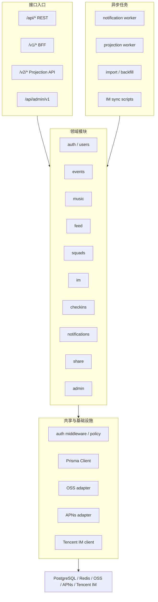

### 7.3 后端目录结构

```text
server/src/
  index.ts
  routes/
  controllers/
  services/
  modules/
    admin/
    checkins/
    events/
    feed/
    im/
    music/
    notifications/
    share/
  jobs/
    checkin-projection/
  infrastructure/
  shared/
  legacy/
  scripts/
```

### 7.4 模块职责

| 模块 | 负责功能 | 当前状态 |
| --- | --- | --- |
| `auth / users` | 登录、注册、用户资料、关注关系 | current，仍需进一步模块化 |
| `events` | 活动、阵容、时间表、票档、活动讨论 | current + compat |
| `music` | DJ、Set、Tracklist、Track、Label、Genre | current + compat |
| `feed` | Feed、评论、点赞、收藏、转发、FeedEvent | current + compat |
| `squads` | 小队、成员、邀请、线下活动、定位 | current |
| `im` | Tencent IM bootstrap、UserSig、用户/群同步 | current + migration |
| `notifications` | Notification Center、APNs、Inbox、Delivery | current |
| `checkins` | Check-in v2、snapshot、projection、outbox | current + compat |
| `share` | 分享短链、二维码、fallback、归因 | current |
| `admin` | 后台 facade、审计、状态聚合 | current + facade |

### 7.5 API 分层

| API 层 | 用途 | 示例 |
| --- | --- | --- |
| REST API | 基础领域接口 | `/api/events`、`/api/djs`、`/api/dj-sets` |
| BFF API | App / Web 聚合读取 | `/v1/*` |
| Projection API | 投影读模型 | `/v2/checkins` |
| Admin API | 后台运营入口 | `/api/admin/v1` |
| IM API | Tencent IM 编排 | `/v1/im/tencent` |
| Notification API | 通知中心 | `/v1/notification-center` |
| Share Route | 分享短链和 fallback | share routes |

### 7.6 后端技术选择说明

| 问题 | 当前选择 | 理由 | 风险 |
| --- | --- | --- | --- |
| 为什么不是微服务？ | Modular monolith | 当前主要问题是边界治理，不是独立扩容 | 单体继续变胖 |
| 为什么不是 NestJS？ | Express + TypeScript | 当前已有代码基线，迁移成本低，灵活 | 缺少强约束，需要文档和规范补足 |
| 为什么有 BFF？ | App 需要聚合数据 | 活动详情、Feed、个人页都需要跨领域读取 | BFF 可能承载业务逻辑 |
| 为什么有 Admin facade？ | 后台需要统一入口 | 审计、权限、运营状态聚合需要收口 | RBAC 还需完善 |
| 为什么保留 compat route？ | 迁移期保持稳定 | 避免重构破坏现有客户端 | legacy 容易误导开发 |

---

## 8. 数据库设计

### 8.1 数据库定位

当前主数据库是 PostgreSQL，使用 Prisma 管理 schema 和访问。

Raver 的数据模型不是简单 CRUD，而是围绕活动中心对象形成多领域关系：

- 活动和音乐内容：Event、DJ、Set、Tracklist。
- 社区互动：Post、Comment、Like、Save、Share。
- 社交关系：User、Follow、Squad、SquadMember。
- 实时协同状态：SquadOfflineActivity、Participant、Location。
- 活动后沉淀：Checkin、Snapshot、Projection。
- 通知系统：NotificationEvent、InboxItem、Delivery。
- 共建和运营：Contributor、AdminAuditLog、PreRegistration。

### 8.2 核心数据关系图

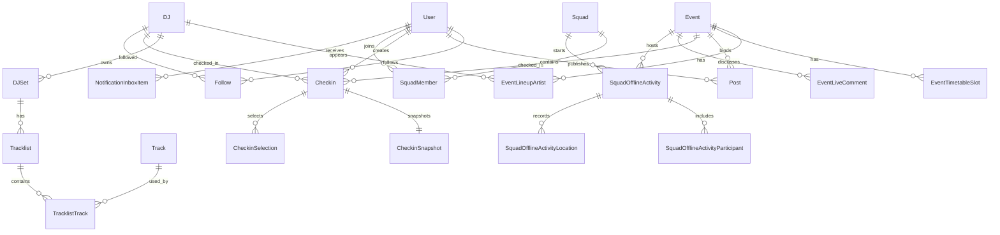

### 8.3 按领域分组的核心表

| 领域 | 核心模型 | 说明 |
| --- | --- | --- |
| 用户身份 | `User`、`AuthRefreshToken`、`AuthSmsCode` | 用户、登录态、短信验证码 |
| 社交关系 | `Follow`、`Squad`、`SquadMember`、`SquadInvite` | 关注、小队、成员、邀请 |
| 活动资讯 | `Event`、`EventLineupArtist`、`EventTimetableSlot`、`EventTicketTier` | 活动、阵容、排期、票档 |
| 音乐内容 | `DJ`、`DJSet`、`Tracklist`、`Track`、`Label`、`Genre` | DJ、Set、曲目单、厂牌、曲风 |
| 社区内容 | `Post`、`PostComment`、`PostLike`、`PostSave`、`PostShare`、`FeedEvent` | Feed、评论、互动和行为记录 |
| 活动讨论 | `EventLiveComment`、`EventLiveCommentLike` | 活动实时讨论区 |
| 小队协同 | `SquadOfflineActivity`、`SquadOfflineActivityParticipant`、`SquadOfflineActivityLocation`、`SquadOfflineActivityStatusEvent` | 线下活动、成员状态、定位 |
| 打卡沉淀 | `Checkin`、`CheckinSnapshot`、`UserCheckinTimelineEntry`、`UserCheckinStat`、Gallery aggregates | 写模型、快照、投影读模型 |
| 通知系统 | `NotificationEvent`、`NotificationInboxItem`、`NotificationDelivery`、`DevicePushToken`、`NotificationTemplate` | 站内通知、投递、设备 token、模板 |
| 分享增长 | `ShareLink`、`ShareLinkEvent`、`InviteReferral` | 短链、归因、邀请 |
| 运营后台 | `AdminAuditLog`、`PreRegistration`、`PreRegistrationDecision` | 审计、预报名、审核 |
| 虚拟资产 | `VirtualAssetDefinition`、`UserVirtualAsset`、`UserVirtualAssetEquip` | 用户身份外观和装备 |

### 8.4 Check-in 投影读模型

Check-in 是当前数据库设计中最典型的“写模型 + 快照 + 投影读模型”。

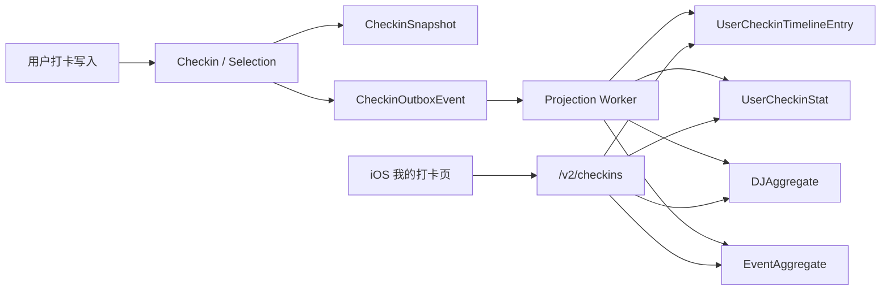

这样设计的原因：

- App 的“我的打卡”不是简单列表，而是 Timeline、Gallery、Stats 等多种聚合视图。
- 直接从原始打卡表实时聚合会让查询越来越复杂。
- Snapshot 可以保留打卡当时的活动和 DJ 展示信息，避免后续资料变更影响历史记录。
- Projection table 可以让客户端读取更快、更稳定。

可以请教的点：

- 当前数据规模是否已经需要 projection。
- projection 的一致性、重试、freshness 检查是否足够。
- reproject 和 snapshot rebuild 是否有足够安全门禁。

---

## 9. 关键功能链路

### 9.1 活动资讯与推送链路

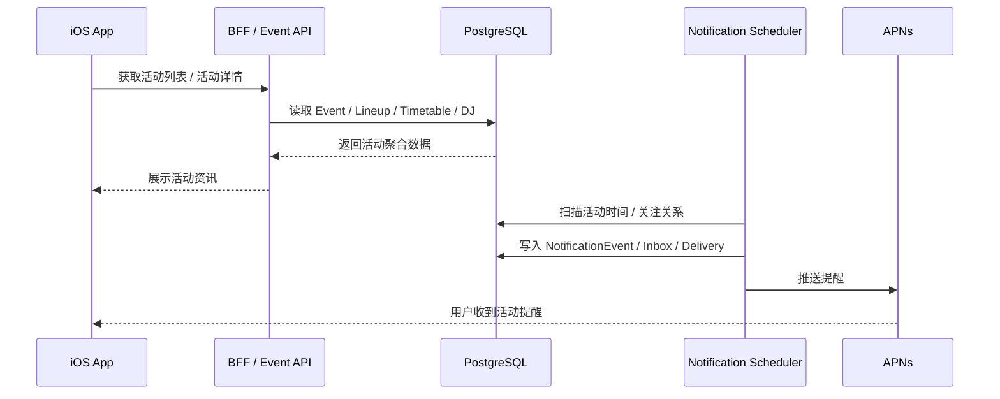

可以请教的点：

- 活动数据模型是否能支撑复杂活动和多日排期。
- 关注关系是否能支撑个性化提醒。
- 通知系统是否和业务写入解耦。

### 9.2 社区讨论链路

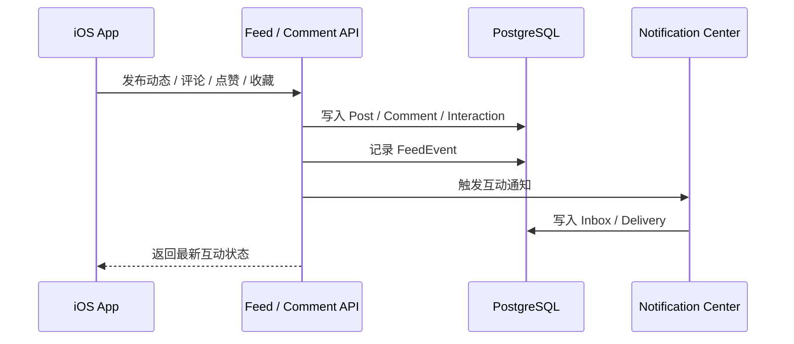

可以请教的点：

- Feed、活动讨论、Set 评论的边界是否清楚。
- 互动计数是否有一致性策略。
- FeedEvent 是否足够支撑后续推荐和分析。

### 9.3 私聊与小队群聊链路

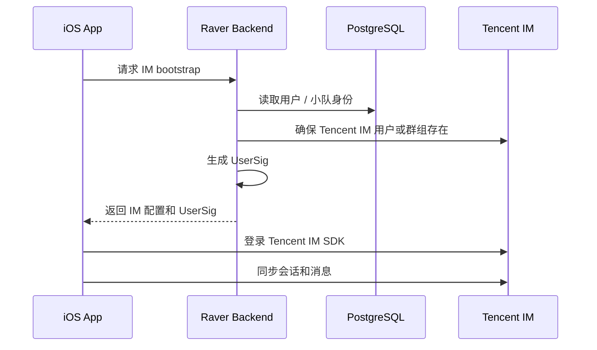

可以请教的点：

- Raver 后端是否保留了业务身份和权限权威。
- Tencent IM provider 是否隔离良好。
- 小队成员变更和 IM group sync 是否有补偿机制。

### 9.4 小队定位分享链路

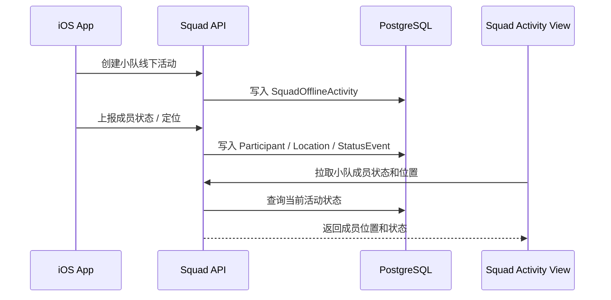

可以请教的点：

- 位置数据可见性、保留时间、上报频率是否合理。
- 当前是否需要实时推送，还是轻实时轮询即可。
- 定位能力是否始终绑定小队和活动上下文。

### 9.5 内容共建链路

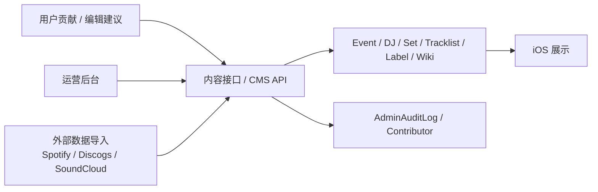

可以请教的点：

- 内容共建是否需要更完整的审核、版本、来源和贡献记录。
- CMS 是否足够支撑活动资讯维护。
- 外部数据导入是否有去重、回滚和审计能力。

---

## 10. Web / Admin / CMS 设计

### 10.1 Web 的定位

当前 Web 不是主产品客户端，而是承担：

- Admin Console
- Content CMS
- 预报名页面
- 分享 fallback 页面
- 历史 Web 功能兼容

### 10.2 Web 技术结构

```text
web/src/
  app/
    admin/
    pre-register/
    events/
    djs/
    sets/
    notifications/
  components/
  lib/
    api/
    admin/
```

### 10.3 Admin 与 App 的关系

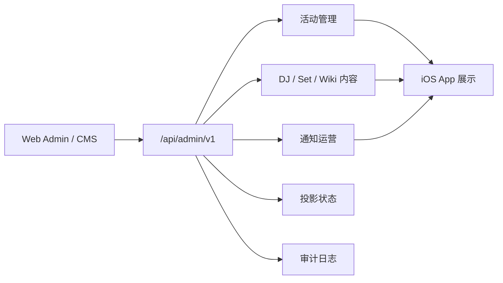

---

## 11. 为什么这些技术选型和功能匹配

| 产品需求 | 技术选择 | 匹配原因 | 可能问题 |
| --- | --- | --- | --- |
| 移动端现场体验 | iOS Native | 推送、定位、Widget、IM SDK、媒体体验都依赖原生能力 | Android 覆盖暂时不足 |
| 活动和内容关系复杂 | PostgreSQL | Event、DJ、Set、Tracklist、Feed、Check-in 都是关系密集模型 | 大规模搜索可能需要独立索引 |
| 快速迭代复杂 API | Express + TypeScript | 当前已有代码基线，灵活、迁移成本低 | 需要靠规范补足框架约束 |
| 跨领域页面聚合 | BFF | App 页面需要一次性拿到活动、DJ、互动、关注等聚合数据 | BFF 容易变胖 |
| 聊天和群组 | Tencent IM | 降低自研 IM 的巨大复杂度 | vendor lock-in |
| 活动时间提醒 | Notification Center + APNs | 统一处理站内信、系统推送、定时提醒 | worker 运维和失败重试要加强 |
| 活动后身份沉淀 | Check-in Projection | Timeline、Gallery、Stats 聚合读取复杂 | 增加一致性和维护成本 |
| 资讯共建和运营 | Next.js Admin / CMS | 后台表单、审核、批处理适合 Web | RBAC 和审计还需深化 |
| 图片视频存储 | Ali OSS | 媒体文件更适合由对象存储承载 | CDN、鉴权、生命周期策略 |

---

## 12. 当前风险和希望技术负责人帮忙把关的问题

### 12.1 客户端风险

| 风险 | 当前情况 | 希望请教 |
| --- | --- | --- |
| 旧 Service 过大 | `SocialService`、`WebFeatureService` 仍存在 | Repository 迁移节奏是否合理 |
| UIKit / SwiftUI 混合复杂 | 聊天和复杂详情页使用 UIKit | 混合边界是否清楚 |
| 路由复杂 | 通知、分享、聊天卡片都需要跳转 | Coordinator 是否足够 |
| iOS-first | 当前主客户端是 iOS | 是否需要提前投入 Android |

### 12.2 后端风险

| 风险 | 当前情况 | 希望请教 |
| --- | --- | --- |
| BFF 变胖 | 部分聚合和 DTO hydration 仍在 BFF routes | 是否应优先拆 service / mapper |
| module facade 仍偏表层 | 部分模块只是 re-export 旧实现 | 下一阶段拆分优先级 |
| Express 缺少强约束 | 依赖文档和工程纪律 | 是否要引入 validation / DTO / framework convention |
| Admin 权限不足 | 已有 facade 和 audit 基础 | RBAC 是否应优先做 |

### 12.3 数据和基础设施风险

| 风险 | 当前情况 | 希望请教 |
| --- | --- | --- |
| Projection 运维复杂 | Check-in v2 已采用 projection | 是否过度设计，freshness 是否够 |
| 位置隐私 | 小队定位功能已存在 | 权限、频率、保留策略是否合理 |
| IM provider lock-in | Tencent IM 是 current | provider adapter 是否足够隔离 |
| 内容共建治理不足 | CMS 和 contributor 基础存在 | 是否需要版本、审核、来源追踪 |
| Worker 可观测性 | 目前以脚本和 scheduler 为主 | 是否需要正式队列和 job history |

