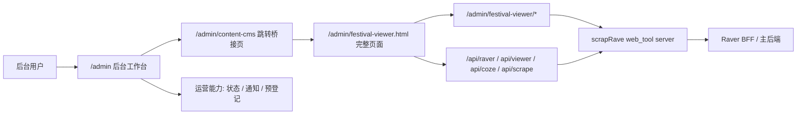

# Raver Content CMS Unified Admin Plan

> Status: Active  
> Owner: Web / Admin / Content Platform  
> Last Updated: 2026-05-13  
> Applies To: `web/src/app/admin`, `web/next.config.js`, `scrapRave/festival-viewer*`

## 1. 目标

把当前通过 Python 单独启动访问的 `festival-viewer` 收束到 Raver Web Admin 中，让后台只保留一个用户可见入口：

```text
/admin -> /admin/content-cms
```

第一批目标是入口统一、权限边界表达和代理接入，不做数据库迁移、不新增 RBAC 表、不重写 `festival-viewer` 大工具。

## 2. 当前问题

`festival-viewer` 已经承载活动、DJ、品牌、资讯、榜单、AI 导入、地图配置和 OSS 上传等成熟工具链，但它存在独立入口和独立启动方式：

- 入口是 `scrapRave/festival-viewer.html`。
- 静态资源位于 `scrapRave/festival-viewer/`。
- Python 服务是 `scrapRave/web_tool/server.py`。
- API 大量使用相对路径，例如 `/api/raver/*`、`/api/viewer/*`、`/api/coze/*`、`/api/scrape/*`。

如果继续让用户从 Python 工具入口进入后台，后台会天然分裂成“运营后台”和“内容后台”两套入口，不符合商用后台的产品形态。

## 3. 第一批架构



关键决策：

- `/admin` 是唯一可见后台入口。
- `/admin/content-cms` 是内容后台跳转桥接页，负责权限检查和登录态同步。
- `festival-viewer` 以完整页面打开，不使用 iframe 内嵌，避免工具页面被后台壳限制视野和交互空间。
- Next rewrites 代理 `festival-viewer` 静态资源和专用 API。
- Web 登录态同步到 `festival-viewer` 原有 localStorage key，避免二次登录。

## 4. 角色模型

第一批继续使用现有 `User.role` 字符串和已有内容 owner / contributor 字段，不新增数据表。

| 角色 | 能力 | 当前约束来源 |
| --- | --- | --- |
| 管理员 `admin` | 管理全站活动、DJ、Set、资讯、百科、榜单；访问通知中心和运营状态 | `User.role` |
| 运营管理员 `operator` | 预登记、状态巡检、运营协作、内容工具访问 | `User.role` |
| 入驻主办方 `organizer` | 以官方身份发布活动和资讯，维护自己名下活动 | `User.role` + `Event.organizerId` |
| 艺人 `artist` | 维护自己的艺人资料，同时具备普通用户内容管理能力 | `User.role` + DJ contributor / future claim |
| 普通用户 `user` | 管理自己上传的活动、DJ、Set、资讯等内容 | uploadedBy / owner / contributor 字段 |

## 5. 权限落地边界

第一批只做 Web 入口层权限表达：

- Web 使用 `web/src/lib/admin/role-policy.ts` 统一入口和页面展示判断。
- 后端仍由已有 API 权限控制内容写入边界。
- `festival-viewer` 仍使用自己的登录 token 请求 `/api/raver/*`，由后端继续判断 owner / contributor / admin 权限。

不在第一批做：

- 不新增 `Organization`、`OrganizationMember`、`ArtistClaim`、`ContentOwnership`、`AdminRolePolicy`。
- 不做 Prisma schema migration。
- 不做历史数据回填。
- 不做 projection rebuild 或 snapshot rebuild。

## 6. 后续正式化方向

正式商用 RBAC / 入驻主体模型应拆成独立小批次：

- `Organization`：主办方主体。
- `OrganizationMember`：主办方成员和角色。
- `ArtistClaim`：艺人认领和认证状态。
- `ContentOwnership`：统一内容 owner / contributor 映射。
- `AdminRolePolicy`：后台细粒度权限矩阵。

这些改造涉及 schema migration 和历史数据回填，执行前必须先按 `docs/DATABASE_BACKUP_GATEKEEPER.md` 备份数据库并验证可读。

## 7. 验收

本地启动推荐：

```bash
./start-all.sh
```

该脚本会同时启动主后端、Festival Viewer WebTool 和 Web 前端，并注入 `RAVER_BFF_BASE` / `FESTIVAL_VIEWER_ORIGIN`，保证 `/admin/festival-viewer.html` 的代理链路指向当前本地主后端。

- 用户只需要从 `/admin` 进入后台。
- `/admin/content-cms` 能同步登录态并跳转到 `/admin/festival-viewer.html`。
- `festival-viewer` 静态资源通过 Next 代理加载。
- `festival-viewer` 专用 API 不被通用 `/api/:path*` rewrite 送到主后端。
- Web build 通过。
- 未执行数据库动作，因此不需要新增数据库备份记录。
