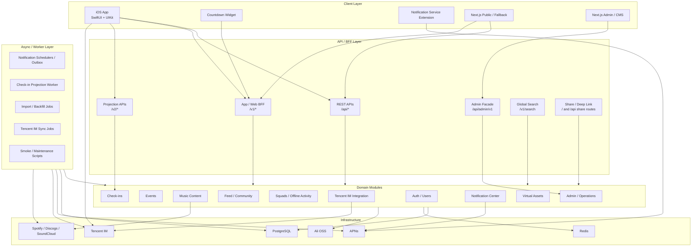
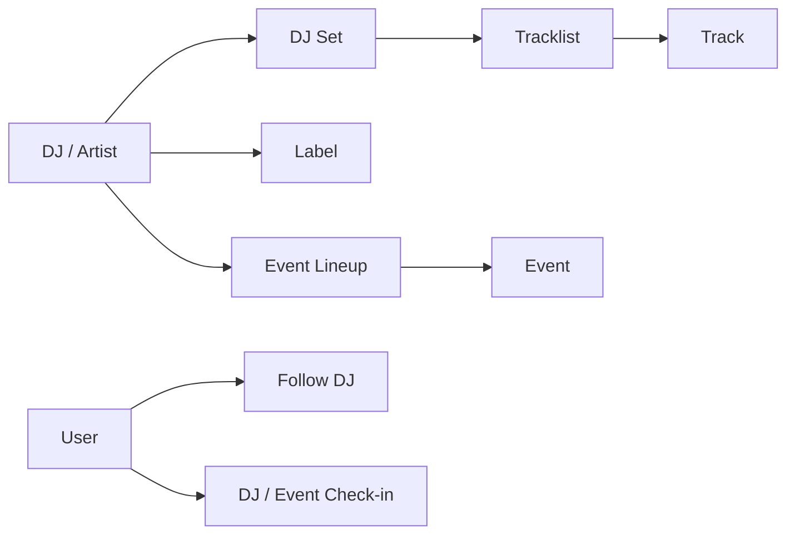
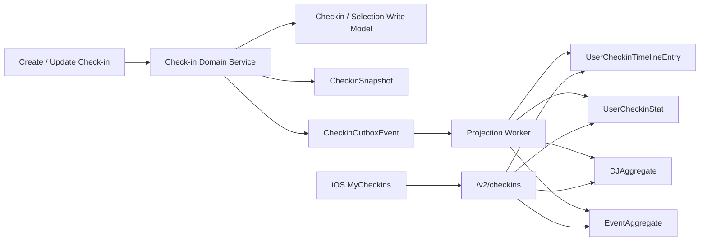
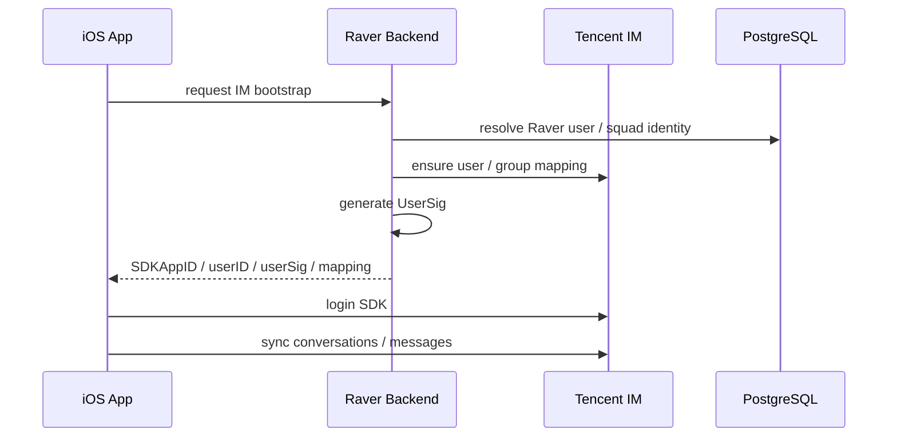
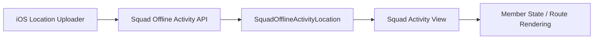

# Raver Platform Architecture

> Status: Active  
> Owner: Architecture / Backend / iOS / Web Admin  
> Last Updated: 2026-05-13  
> Applies To: `server/`, `mobile/ios/RaverMVP/`, `web/`, `docs/`  
> Purpose: 用平台级架构方式说明 Raver 的产品定位、领域模型、系统分层、客户端、后端、实时协同、内容基础设施、运营后台和工程亮点。

## 0. 文档定位

这份文档不是技术栈清单，而是 Raver 当前产品和工程系统的完整架构说明。

Raver 已经不是普通 App，也不是单一活动列表、音乐内容站或聊天工具。它是一个围绕电子音乐场景构建的 App-first 垂直社交平台，内部同时包含：

- 活动与 Festival 平台
- DJ / Artist / Label / Genre 音乐知识图谱
- Set / Tracklist / Track 结构化内容系统
- Feed / 评论 / 点赞 / 收藏 / 转发社区系统
- Squad 小队社交组织系统
- Tencent IM 实时聊天与自定义消息卡片
- 线下活动协同、定位上报与成员状态系统
- Check-in、集邮、统计、Gallery 与身份沉淀系统
- Notification Center、APNs、定时提醒与运营通知系统
- Share Link、二维码、Deep Link 与分享归因系统
- Web Admin / CMS / 预报名 / 公共 fallback
- 后台任务、投影读模型、数据导入、同步与运营脚本

因此本文采用：

> 领域驱动 + 系统分层 + 数据流 + 核心能力模块

的方式组织，而不是按页面或菜单介绍。

## 0.1 相比旧要求的适配调整

根据当前重构后的仓库状态，以下口径需要明确调整：

| 旧口径或容易误解的点 | 当前准确口径 |
| --- | --- |
| 后端是 NestJS | 当前后端是 Node.js + Express + TypeScript + Prisma |
| Web 是主产品客户端 | 当前主客户端是 iOS Native；Web 主要承载 Admin / CMS / 预报名 / public fallback |
| IM 以 OpenIM 为主线 | Tencent IM 是当前 IM 主线；OpenIM 是 legacy / migration reference |
| Check-in 是普通打卡表 | Check-in v2 projection read model 是当前主线 |
| iOS 已完全迁入最终 `Modules/` 目录 | iOS 已建立 Coordinator / Repository / Infrastructure 边界，但物理目录仍处于 `Application/Core/Features/Infrastructure/Shared` 迁移期 |
| 地图协同等于独立实时地图服务 | 当前主要由 Squad offline activity、location upload、IM/group sync 和客户端状态渲染组合实现，尚不是独立地图微服务 |
| 推荐系统是完整算法平台 | 当前更准确地说是 FeedEvent、ranking config、关注更新、通知调度等推荐基础设施，不应夸大为完整 ML 推荐平台 |
| Badge 是独立模型 | 当前身份视觉沉淀主要由 Virtual Asset 相关模型承担，Badge 可作为后续产品概念 |

---

## 1. Product Overview

### 1.1 一句话定位

Raver 是一个围绕电子音乐活动、DJ、Set、社区、小队与线下协同构建的 App-first 垂直社交平台。

用户可以在 Raver 中发现活动、关注 DJ、查看 Set 和 Tracklist、发布动态、组织小队、聊天、参与线下活动、记录打卡、接收提醒，并沉淀自己的电子音乐身份。

### 1.2 Core Product Structure

系统主要由以下产品能力组成：

- Event & Festival Platform：活动、Festival、阵容、时间表、票档、地点、现场讨论
- DJ / Artist Knowledge Graph：DJ、艺人、国家、曲风、社媒链接、外部数据源、贡献者
- Set / Tracklist Content System：DJ Set、Tracklist、Track、视频、封面、评论
- Social Feed & Community：动态流、评论、点赞、收藏、转发、隐藏、分享
- Squad-based Social Layer：小队、成员、角色、邀请、小队活动、小队相册
- Realtime IM & Custom Cards：Tencent IM、私聊、群聊、自定义业务卡片
- Offline Collaboration：小队线下活动、定位上报、成员状态、活动参与状态
- Check-in & Collection System：活动/DJ 打卡、快照、Timeline、Gallery、统计、派生信号
- Notification Infrastructure：站内通知、APNs、定时提醒、关注更新、运营通知
- Share & Deep Link Infrastructure：短链、二维码、海报、Universal Link / fallback
- Virtual Asset & Identity Layer：虚拟资产、装备、聊天/列表外观渲染
- Web CMS & Operation Console：后台工作台、预报名审核、通知运营、投影状态、审计日志
- iOS Native Client：当前主客户端，承载完整 App-first 体验

### 1.3 当前主线结论

- 主客户端：`mobile/ios/RaverMVP/`
- 后端：`server/`，Express + TypeScript + Prisma，当前采用 modular monolith
- 数据库：PostgreSQL 15，开发环境由 Docker Compose 启动
- 缓存：Redis 7
- Web：`web/`，Next.js + React + Tailwind，定位为 Admin / CMS / 预报名 / public fallback
- IM：Tencent IM 是 current；OpenIM 是 legacy / migration
- 通知：Notification Center + APNs 是 current；旧 `/api/notifications` 是 compat
- 打卡：Check-in v2 projection read model 是 current；v1 route 是 compat

---

## 2. Overall System Architecture

### 2.1 总体分层

Raver 当前可以拆成六个系统层：

| 层级 | 职责 | 当前实现 |
| --- | --- | --- |
| Client Layer | 用户端、后台端、扩展端 | iOS App、Widget、Notification Service Extension、Next.js Web/Admin |
| API / BFF Layer | App/Web 聚合、认证、搜索、分享、Admin facade | Express routes：`/api/*`、`/v1/*`、`/v2/*`、`/api/admin/v1` |
| Domain Layer | 领域能力和业务规则 | `server/src/modules/*` facade + 仍在迁移中的 controllers/services |
| Data / Read Model Layer | 写模型、读模型、快照、outbox、审计 | PostgreSQL + Prisma schema |
| Realtime / External Layer | IM、推送、对象存储、第三方音乐数据 | Tencent IM、APNs、Ali OSS、Spotify、Discogs、SoundCloud |
| Async / Worker Layer | 投影、通知、导入、回填、同步 | `server/src/scripts/*`、`server/src/jobs/*`、package scripts |

### 2.2 系统总览图



### 2.3 代码目录映射

| 范围 | 路径 | 当前定位 |
| --- | --- | --- |
| iOS App | `mobile/ios/RaverMVP/RaverMVP/` | 主客户端 |
| iOS App Shell | `Application/Coordinator/`、`Application/DI/` | Coordinator、Tab、依赖容器 |
| iOS Feature | `Features/` | Discover、Feed、Messages、Profile、Squads、Search、Notifications、VirtualAssets |
| iOS Infra | `Infrastructure/TencentIM/`、`Infrastructure/LegacyOpenIM/` | Tencent IM current、OpenIM legacy |
| iOS Shared | `Shared/` | 共享 UI、loading/error/skeleton 状态 |
| iOS Widget | `RaverCountdownWidgets/` | 活动倒计时小组件 |
| iOS Notification Extension | `RaverNotificationService/` | 推送通知扩展 |
| Backend | `server/src/` | Express API、routes、controllers、services、modules、jobs |
| Backend modules | `server/src/modules/` | modular monolith 目标边界 |
| Backend jobs | `server/src/jobs/`、`server/src/scripts/` | worker、scheduler、import、backfill、smoke |
| Prisma | `server/prisma/schema.prisma` | 数据模型、读模型、outbox、审计模型 |
| Web | `web/src/app/` | Next.js 页面、Admin、CMS、预报名、public fallback |
| Web API client | `web/src/lib/api/` | Web/Admin API 封装 |
| Docs | `docs/` | 当前主线、ADR、runbook、tracker |

### 2.4 后端 API 命名空间

| Namespace | 当前用途 |
| --- | --- |
| `/api/auth` | 登录、注册、refresh、短信等认证能力 |
| `/api/events`、`/api/djs`、`/api/dj-sets`、`/api/music`、`/api/labels` | 事件与音乐内容基础 REST |
| `/api/checkins` | Check-in v1 compat |
| `/v2/checkins` | Check-in v2 projection 主线 |
| `/v1` | App/Web BFF 聚合接口 |
| `/v1/search` | 全局搜索 |
| `/v1/im/tencent` | Tencent IM bootstrap / usersig / sync |
| `/v1/notification-center` | Notification Center 主线 |
| `/api/notifications` | 旧通知 compat |
| `/api/admin/v1` | Admin / Operations facade |
| `/api/pre-registrations`、`/api/admin/pre-registrations` | 预报名与后台审核 |
| `/` + share routes | 分享短链、fallback、深链解析 |

---

## 3. Domain Architecture

Raver 的复杂度来自多个领域之间的组合。本文按领域拆分，而不是按页面拆分。

### 3.1 Identity & Social Graph Domain

#### 领域职责

负责用户身份、登录态、资料、关注关系、公开主页和社交图谱。

#### 核心能力

- 用户注册、登录、短信验证码、refresh token
- 用户资料、头像、昵称、地区、偏好、资料审核
- 用户关注用户、用户关注 DJ
- 公开主页、我的发布、我的收藏、我的打卡等聚合入口
- 分享码、邀请 referral、用户深链打开

#### 核心模型

- `User`
- `UserProfileModerationJob`
- `Follow`
- `AuthRefreshToken`
- `AuthSmsCode`
- `AuthPhoneAuthState`
- `ShareLink`
- `InviteReferral`

#### 架构要点

`User` 是全系统身份源。Feed、Squad、IM、Check-in、Notification、Virtual Asset 都依赖同一套 user identity。

`Follow` 同时承载用户关注用户与用户关注 DJ，因此它不仅是社交关系表，也是关注更新通知、推荐基础和个人兴趣画像的输入。

### 3.2 Event & Festival Domain

#### 领域职责

负责活动、Festival、场地信息、阵容、时间表、票档、现场讨论和活动生命周期。

#### 核心能力

- 活动列表、活动详情、活动创建/编辑/删除
- 多语言名称、描述、城市、国家、地址
- 票档、票价、官方链接、社媒链接
- Lineup artist 和 timetable slot
- 活动现场评论和评论点赞
- 活动与 DJ、Set、Check-in、Squad、Notification 的交叉关联

#### 核心模型

- `Event`
- `EventTicketTier`
- `EventLineupSlot`
- `EventLineupArtist`
- `EventTimetableSlot`
- `EventLiveComment`
- `EventLiveCommentLike`
- `WikiFestival`
- `WikiFestivalContributor`

#### 当前模块边界

- Current facade：`server/src/modules/events/`
- 当前 route：`server/src/routes/event.routes.ts`
- 兼容实现：`server/src/controllers/event.controller.ts`、`lineup.controller.ts`、`timetable.controller.ts`

#### 架构要点

Event 是 Raver 的中心业务实体之一。它不仅是活动详情页的数据源，也是线下协同、通知提醒、阵容知识图谱、打卡、社区内容和小队活动的上下文。

当前没有独立 `Venue` 表，场地信息主要内嵌在 `Event` 的 `venueName`、`venueAddress`、`latitude`、`longitude`、`locationPoint` 等字段中。后续如果活动规模扩大，可以再拆出 Venue Domain。

### 3.3 Music Content Domain

#### 领域职责

负责 DJ、Set、Tracklist、Track、Label、Genre、榜单和外部音乐元数据聚合。

#### 核心能力

- DJ 列表、详情、关注、编辑、贡献者
- Spotify / Discogs / SoundCloud 元数据补全
- DJ Set 上传、详情、编辑、删除、评论
- Tracklist 创建、替换、自动链接
- Track 结构化信息、时间轴、外部链接
- Label、Genre、Wiki Festival、Ranking 内容组织
- DJ 与活动 lineup、set、checkin 的交叉关系

#### 核心模型

- `DJ`
- `DJContributor`
- `DJSet`
- `Tracklist`
- `Track`
- `TracklistTrack`
- `Comment`
- `Label`
- `Genre`
- `WikiFestival`

#### 当前模块边界

- Current facade：`server/src/modules/music/`
- 当前 routes：`dj.routes.ts`、`djset.routes.ts`、`music.routes.ts`、`label.routes.ts`、`dj-aggregator.routes.ts`
- 外部数据服务：`spotify-artist.service.ts`、`discogs-artist.service.ts`、`soundcloud-artist.service.ts`、`dj-aggregator.service.ts`

#### 内容图谱



#### 架构要点

Music Content Domain 是 Raver 区别于普通活动 App 的关键。它把电子音乐内容从“活动里的名字”升级为可沉淀、可补全、可搜索、可关联的知识图谱。

### 3.4 Community Content Domain

#### 领域职责

负责 Feed、动态、评论、点赞、收藏、转发、分享、隐藏、Feed 行为事件和内容互动聚合。

#### 核心能力

- 动态发布、编辑、删除
- latest / recommended / follow / event-scoped Feed
- 动态详情和评论树
- 点赞、收藏、转发、分享、隐藏
- 作者关注、内容绑定 DJ / Brand / Event / Set
- FeedEvent 行为记录和排序实验基础

#### 核心模型

- `Post`
- `PostLike`
- `PostRepost`
- `PostSave`
- `PostShare`
- `PostHide`
- `FeedEvent`
- `PostComment`
- `EventLiveComment`

#### 当前模块边界

- Current facade：`server/src/modules/feed/`
- 已收束服务：`feed-event.service.ts`、`post-interaction.service.ts`、`post-comment.service.ts`
- Compat：`bff.routes.ts`、`bff.web.routes.ts` 中仍保留部分 Feed stream、DTO hydration 和 notification orchestration

#### 架构要点

Raver 的 Feed 不是纯文本 UGC。`Post` 可以绑定活动、Set、Squad、DJ、Brand 和 Event，因此它本质上是内容图谱之上的社交表达层。

`FeedEvent` 的存在说明系统已经为后续推荐排序、兴趣建模、内容质量分析和运营实验预留了行为数据基础。

### 3.5 Squad & Offline Collaboration Domain

#### 领域职责

负责小队组织、成员关系、邀请、角色权限、小队内容、小队相册和线下活动协同。

#### 核心能力

- 创建、加入、退出、解散小队
- 队长 / 管理员 / 成员角色
- 小队公开状态、人数上限、公告、头像、二维码
- 小队邀请与分享裂变
- 小队相册与活动记录
- 小队线下活动创建、参与、结束
- 成员状态表达，如暂离、买饮料等
- 定位上报和轨迹记录
- Squad 与 Tencent IM group 同步

#### 核心模型

- `Squad`
- `SquadMember`
- `SquadInvite`
- `SquadActivity`
- `SquadOfflineActivity`
- `SquadOfflineActivityParticipant`
- `SquadOfflineActivityStatusEvent`
- `SquadOfflineActivityLocation`
- `SquadAlbum`
- `SquadAlbumPhoto`
- `SquadMessage`

#### 架构要点

Squad 不是普通群组，而是 Raver 的线下社交组织单位。它同时承担：

- 社交关系容器
- IM 群组映射来源
- 线下活动协同单元
- 定位共享上下文
- 分享邀请与裂变入口
- 活动后相册和记忆沉淀容器

### 3.6 Realtime IM & Messaging Domain

#### 领域职责

负责私聊、群聊、会话同步、Tencent IM 身份映射、群组同步、自定义消息卡片、消息治理和历史迁移。

#### 核心能力

- 登录后 IM bootstrap
- Tencent IM UserSig 生成
- Raver user 与 Tencent IM user 映射
- Squad 与 Tencent IM group 同步
- 私聊和群聊会话
- 会话列表、消息渲染、搜索索引、媒体解析
- 自定义业务卡片
- OpenIM 历史数据和迁移参考隔离

#### 核心模型

- `DirectConversation`
- `DirectConversationRead`
- `DirectMessage`
- `SquadMessage`
- `OpenIMSyncJob`
- `OpenIMWebhookEvent`
- `OpenIMMessageReport`
- `OpenIMImageModerationJob`
- `OpenIMMessageMigration`

#### 当前模块边界

- Current facade：`server/src/modules/im/`
- Tencent provider：`server/src/services/tencent-im/`
- IM routes：`server/src/routes/tencent-im.routes.ts`
- Legacy marker：`server/src/services/openim/README.md`
- iOS current infra：`Infrastructure/TencentIM/`
- iOS legacy infra：`Infrastructure/LegacyOpenIM/`

#### 架构要点

Raver 后端不直接承担所有实时消息分发。当前设计是：

- Raver 后端负责业务身份、权限、Squad 关系、IM bootstrap 和业务卡片协议。
- Tencent IM 负责会话、群组、消息同步等实时能力。
- iOS 负责 SDK 会话、UI 渲染、本地索引、媒体临时文件和 custom card routing。

### 3.7 Check-in & Collection Domain

#### 领域职责

负责活动打卡、DJ 打卡、打卡快照、用户 Timeline、Gallery、统计、派生信号和可重建读模型。

#### 核心能力

- 活动 / DJ 打卡
- 备注、图片、评分、可见性
- 打卡快照，固化当时活动 / DJ / 用户信息
- 多日活动选择、DJ 选择、演出选择
- 我的打卡 Timeline
- DJ Gallery / Event Gallery
- 用户打卡统计
- 派生信号，为推荐、身份和画像预留基础
- Outbox 驱动投影更新
- 投影 freshness 检查、reproject 和 snapshot rebuild

#### 核心模型

- `Checkin`
- `CheckinSnapshot`
- `CheckinSelection`
- `CheckinSelectionDJ`
- `UserCheckinTimelineEntry`
- `UserCheckinStat`
- `UserCheckinGalleryDJAggregate`
- `UserCheckinGalleryEventAggregate`
- `UserCheckinDerivedSignal`
- `CheckinOutboxEvent`

#### 当前模块边界

- Current facade：`server/src/modules/checkins/`
- Current API：`/v2/checkins`
- Compat API：`/api/checkins`
- Worker：`server/src/jobs/checkin-projection/projection-worker.job.ts`
- Scripts：`checkins:projection:*`、`checkins:reproject:*`、`checkins:snapshots:rebuild`

#### Projection 数据流



#### 架构要点

Check-in v2 是当前项目里最清晰的工程化读模型设计：

- 写模型保留用户原始行为。
- Snapshot 固化展示语义，避免历史内容被后续活动/DJ 修改破坏。
- Projection tables 服务 App 高性能读取。
- Outbox 负责从写事件驱动投影。
- Freshness 与 Admin status 提供可观测性。
- Reproject / rebuild 脚本提供修复和恢复能力。

### 3.8 Notification Domain

#### 领域职责

负责站内通知、APNs、设备 token、通知模板、通知订阅、定时提醒和通知投递状态。

#### 核心能力

- Inbox、未读数、标记已读
- 设备 push token 注册与平台归一化
- 通知订阅、通知模板、Admin 配置
- 通知事件、投递记录、失败重试
- APNs handler
- 活动倒计时、每日摘要、路线 DJ 提醒
- 关注 DJ / Brand 更新提醒
- Notification outbox worker 和灰度验证

#### 核心模型

- `NotificationRead`
- `NotificationSubscription`
- `DevicePushToken`
- `NotificationEvent`
- `NotificationInboxItem`
- `NotificationDelivery`
- `NotificationTemplate`
- `NotificationAdminConfig`

#### 当前模块边界

- Current facade：`server/src/modules/notifications/`
- Current service：`server/src/services/notification-center/`
- Current route：`server/src/routes/notification-center.routes.ts`
- Compat route：`server/src/routes/notification.routes.ts`
- iOS extension：`RaverNotificationService/`

#### 架构要点

通知系统不是附属列表，而是跨领域基础设施。它连接社区互动、聊天消息、活动提醒、关注更新、运营通知、APNs 和 App 内通知中心。

### 3.9 Share & Deep Link Domain

#### 领域职责

负责分享短链、二维码、海报、fallback 页面、Universal Link / Deep Link 和分享归因。

#### 核心能力

- 创建分享链接
- 解析短链并跳转 App / fallback
- 记录 scan / click / share event
- 生成二维码和海报
- 邀请 referral 与奖励状态
- 支持 Event、DJ、Set、Post、Profile、Squad 等目标类型

#### 核心模型

- `ShareLink`
- `ShareLinkEvent`
- `InviteReferral`

#### 当前模块边界

- Current facade：`server/src/modules/share/`
- Current route：`server/src/routes/share.routes.ts`
- Current service：`server/src/services/share-link.service.ts`
- Smoke：`share-links:smoke`、`share-invites:smoke`

### 3.10 Virtual Asset & Identity Projection Domain

#### 领域职责

负责虚拟资产、装备状态、头像/聊天/列表外观渲染和用户身份视觉表达。

#### 核心能力

- 虚拟资产定义
- 用户资产领取、状态、装备
- 聊天中的外观渲染
- 列表和资料页的身份表现
- 资产缓存和 fallback 渲染

#### 核心模型

- `VirtualAssetDefinition`
- `UserVirtualAsset`
- `UserVirtualAssetEquip`

#### 客户端模块

- `Features/VirtualAssets/`
- `VirtualAssetRenderers.swift`
- `VirtualAssetUIKitChatRenderers.swift`
- `VirtualAssetChatAppearanceResolver.swift`
- `VirtualAssetListAppearanceResolver.swift`

#### 架构要点

虚拟资产不是孤立商城能力，而是用户身份系统的一部分。它已经与聊天、列表、个人页外观产生关系，后续可以承载活动纪念、成就、商业化和稀缺身份表达。

### 3.11 Admin / Operations Domain

#### 领域职责

负责后台运营入口、权限策略、审计日志、运营状态聚合、预报名审核、通知运营和敏感操作记录。

#### 核心能力

- Admin status aggregation
- Admin audit log query
- Notification Center admin operations
- Pre-registration review
- Check-in projection status
- Virtual asset grants
- 共享 admin / operator role policy

#### 核心模型

- `AdminAuditLog`
- `PreRegistration`
- `PreRegistrationBatch`
- `PreRegistrationDecision`
- `PreRegistrationNotification`
- `NotificationAdminConfig`
- `NotificationTemplate`

#### 当前模块边界

- Admin facade：`server/src/modules/admin/`
- API prefix：`/api/admin/v1`
- Web入口：`web/src/app/admin/page.tsx`

#### 架构要点

Admin 当前不应被理解成几个后台页面，而是运营系统的入口层。它不拥有所有领域业务规则，而是通过 facade 组合已有领域能力，并补上权限、审计和运营可观测性。

### 3.12 Search Domain

#### 领域职责

负责跨领域搜索，聚合用户、活动、DJ、Set、Label、Wiki 等内容。

#### 当前实现

- Route：`server/src/routes/search.routes.ts`
- Service：`server/src/services/global-search.service.ts`、`music-search.service.ts`
- iOS：`Features/Search/`

#### 架构要点

Search 当前是跨领域读取层，不应直接拥有领域写入规则。后续可以演进为独立索引或搜索服务，但当前阶段仍应保持在 modular monolith 内。

---

## 4. iOS Client Architecture

### 4.1 客户端定位

iOS 是当前 Raver 的主客户端。它不是 WebView 壳，而是原生 App-first 架构，包含登录态、导航、Feed、Discover、Messages、Squad、Profile、Search、Notification、Virtual Assets、Widget 和 Notification Extension。

### 4.2 当前目录结构

```text
RaverMVP/
  Application/
    Coordinator/
    DI/
  Core/
  Features/
    Auth/
    Circle/
    Discover/
    Feed/
    Messages/
    Notifications/
    Profile/
    Search/
    Squads/
    VirtualAssets/
  Infrastructure/
    TencentIM/
    LegacyOpenIM/
  Shared/
  Vendor/
```

目标架构会继续朝 `App/Core/DesignSystem/Modules/Infrastructure/Shared/Legacy` 收束，但当前物理目录仍保留 `Features/` 作为迁移期主结构。

### 4.3 App Shell & Navigation

核心文件：

- `RaverMVPApp.swift`
- `Application/Coordinator/AppCoordinator.swift`
- `Application/Coordinator/MainTabCoordinator.swift`
- `Application/DI/AppContainer.swift`
- `Features/MainTabView.swift`

设计特征：

- App 启动后进行 auth bootstrap。
- Coordinator 承担跨 feature 路由、主 Tab、深链跳转。
- Feature 内可拥有自己的 Coordinator，例如 Discover、Messages、Circle、Profile。
- 通过 route target 和 coordinator 降低 View 内裸跳转逻辑。

### 4.4 UI Layer

当前 UI 是 SwiftUI + UIKit 混合：

- SwiftUI 承担大部分业务页面和状态绑定。
- UIKit 用于复杂聊天界面、PageViewController、部分细粒度滚动体验。
- `Shared/` 提供跨模块 UI 组件，如 loading、error、skeleton、navigation chrome、segmented control。
- `Vendor/ChatLayout` 和 `Features/Messages/UIKitChat` 承担聊天渲染能力。

### 4.5 State & Repository Layer

iOS 正在从历史大 service 迁移到 feature-scoped repository：

- 历史 service：`SocialService`、`WebFeatureService`、`LiveSocialService`、`LiveWebFeatureService`
- 当前方向：ViewModel 依赖更小的 Repository protocol
- 迁移策略：旧 service 降级为 API client / adapter，不继续承接新领域能力

已出现或正在使用的 repository 边界包括：

- Discover：Events / DJs / Sets / Wiki / News repositories
- Feed：Feed stream、post command、post interaction、post comment、media、tracking
- Messages：Conversation、ChatMessage、MessageNotification、ChatSettings
- Profile：ProfileUser、ProfileContent、ProfileCheckin
- Notifications：NotificationRepository
- Squads：SquadProfile、SquadActivity、LocationSync
- VirtualAssets：VirtualAssetRepository
- Search：GlobalSearchRepository
- Share：ShareLinkRepository、ShareMessageRepository

### 4.6 IM Layer

当前 IM 主线集中在：

- `Infrastructure/TencentIM/Session/TencentIMSession.swift`
- `Infrastructure/TencentIM/IMChatStore.swift`
- `Infrastructure/TencentIM/ChatMessageSearchIndex.swift`
- `Infrastructure/TencentIM/Media/RaverChatMediaResolver.swift`
- `Features/Messages/`
- `Features/Messages/UIKitChat/`
- `Features/Messages/CustomCards/`

核心能力：

- Tencent IM bootstrap
- 会话列表同步
- 聊天窗口消息渲染
- 本地消息搜索索引
- 图片 / 视频媒体解析和临时文件管理
- Custom card codec、registry、route target
- 聊天设置和消息通知入口

### 4.7 Media Layer

媒体能力跨多个模块：

- 活动封面、lineup 图片
- DJ 头像、banner
- Set 封面、视频
- Feed 图片 / 视频
- 聊天媒体
- 虚拟资产渲染资源

当前基础能力包括：

- OSS 上传 pipeline
- 远程图片加载和缓存
- `ImageCacheBootstrap`
- `RemoteCoverImage`
- Chat media temp file store
- Notification rich content extension

### 4.8 Offline Collaboration & Location Layer

小队线下协同在 iOS 侧主要位于：

- `Features/Squads/SquadOfflineActivityView.swift`
- `Features/Squads/SquadOfflineActivityLocationUploader.swift`
- `Features/Squads/SquadOfflineActivityModels.swift`
- `Features/Squads/SquadOfflineActivityBanner.swift`

核心能力：

- 线下活动状态展示
- 成员参与状态
- 定位上传
- 小队活动历史
- 与活动上下文、Squad、IM 群组联动

### 4.9 Notification & Widget Layer

通知相关：

- `Features/Notifications/`
- `RaverNotificationService/`
- `server/src/services/notification-center/`

Widget 相关：

- `RaverCountdownWidgets/`
- `Core/Widget/`

核心能力：

- 站内通知 inbox
- APNs 推送展示
- Notification Service Extension 处理富通知
- 活动倒计时 Widget
- Widget selectable events sync
- Deep link routing

---

## 5. Backend Architecture

### 5.1 后端定位

后端当前采用 Express + TypeScript + Prisma 的 modular monolith。

当前阶段不适合直接拆微服务，因为系统最需要解决的是领域边界、主线收束、兼容路线隔离和数据动作门禁。微服务拆分应在模块边界稳定、扩容瓶颈明确之后再评估。

### 5.2 目标目录

```text
server/src/
  modules/
  shared/
  infrastructure/
  jobs/
  legacy/
  routes/
  controllers/
  services/
  scripts/
```

当前 `routes/controllers/services/scripts` 仍然活跃，但新能力应优先进入对应 module boundary。

### 5.3 Module Ownership

| Module | 状态 | 负责范围 |
| --- | --- | --- |
| `admin` | Current + Facade | Admin API、审计、状态聚合、运营入口 |
| `notifications` | Current | Notification Center、APNs、Inbox、Delivery、Schedulers |
| `checkins` | Current + Compat | Check-in v2、snapshot、projection、outbox |
| `share` | Current | Share link、deep link、QR/poster、invite referral |
| `im` | Current + Migration | Tencent IM bootstrap、usersig、用户/群同步 |
| `feed` | Current + Compat | Post、评论、互动、FeedEvent |
| `events` | Current + Compat | 活动、阵容、时间表、票档、现场评论 |
| `music` | Current + Compat | DJ、Set、Tracklist、Track、Label、Genre、外部音乐数据 |
| `squads` | Current | 小队、成员、邀请、线下活动、定位 |
| `virtual-assets` | Current | 虚拟资产、装备、外观 |
| `search` | Current | 全局搜索与跨领域聚合 |
| `auth/users` | Current | 登录、用户资料、关注关系，后续仍需模块化收束 |
| `bff` | Compat / Migration | App/Web 聚合接口，后续逐步拆回领域模块 |

### 5.4 API Layer

后端 API 层当前包括：

- REST routes：基础 CRUD、领域操作、兼容接口
- BFF routes：App/Web 聚合读取和 DTO hydration
- Admin facade：后台统一入口
- Projection APIs：Check-in v2 读模型接口
- Search route：跨领域搜索
- Share routes：短链和 fallback
- IM route：Tencent IM bootstrap 和 usersig

### 5.5 Data Layer

核心数据基础：

- PostgreSQL：主数据库
- Prisma：ORM、schema、migration
- Redis：缓存和后续状态/队列基础
- Projection tables：Check-in v2 读模型
- Snapshot tables：Check-in snapshot
- Outbox tables：Check-in outbox、Notification delivery / event
- Audit log：AdminAuditLog

### 5.6 Async Processing

当前异步能力主要由 npm scripts、scheduler 和 worker 组合：

- Notification outbox worker
- Event countdown scheduler
- Event daily digest scheduler
- Route DJ reminder scheduler
- Followed DJ / Brand update scheduler
- Check-in projection worker
- Check-in reproject / snapshot rebuild
- Tencent IM sync users / export mapping
- DJ / Label / Festival import and backfill
- Auth / share / notification smoke scripts

### 5.7 Media Infrastructure

媒体基础设施包括：

- Ali OSS object storage
- Multer upload handling
- QR code generation
- Poster / share image generation
- iOS image cache and remote cover rendering
- Chat media resolver and temporary storage

### 5.8 External Integrations

当前外部系统：

- Tencent IM：聊天、会话、群组、usersig
- APNs：iOS 推送
- Ali OSS：对象存储
- Spotify：artist metadata
- Discogs：artist metadata
- SoundCloud：artist links and enrichment
- SMS provider abstraction：短信验证码

---

## 6. Realtime System Design

### 6.1 当前实时架构定位

Raver 的实时能力不是单一聊天系统，而是由以下能力组合：

- Tencent IM 会话与消息同步
- Squad 与 IM group 同步
- 小队线下活动状态
- 成员定位上报
- 站内通知与 APNs 推送
- 自定义消息卡片
- App 本地状态、搜索索引和渲染状态

### 6.2 IM Synchronization

核心链路：



核心能力：

- Raver user to Tencent IM user mapping
- Squad to Tencent IM group synchronization
- UserSig generation
- Friend import and system tip messages
- Operational sync scripts

### 6.3 Presence & Squad Activity

当前 presence 不是独立 presence server，而是由小队活动参与状态、IM 在线能力、客户端状态渲染和通知组合实现。

核心状态包括：

- 是否加入线下活动
- 是否离开活动
- lastLocationAt
- isInRestroom
- isBuyingDrink
- activity status active / ended

### 6.4 Location Synchronization

定位链路：



当前定位能力是 event/squad-centric 的协同能力，而不是通用地图平台。它围绕活动和小队上下文服务。

### 6.5 Custom Message Protocol

聊天中支持业务卡片协议，当前设计上可承载：

- Event Card
- DJ Card
- Set Card
- Squad Activity Card
- Check-in Card
- Share Link Card
- Virtual Asset Appearance

iOS 侧关键文件：

- `ChatCustomCardCodec.swift`
- `ChatCardRouteTarget.swift`
- `ChatCustomCardRegistry.swift`
- `RaverChatDataProvider.swift`
- `TencentUIKitChatView.swift`

---

## 7. Content Infrastructure

### 7.1 统一内容互动模型

Raver 的内容系统不是单一 Feed，而是跨多个实体提供统一互动能力：

- Like
- Comment
- Bookmark / Save
- Repost
- Share
- Hide
- Follow
- Check-in
- Rating

覆盖对象包括：

- Feed Post
- DJ Set
- Event Live Comment
- Event
- DJ
- Check-in
- Share Link

### 7.2 Feed Architecture

当前 Feed 能力包括：

- latest / recommended stream
- media-rich post rendering
- post detail
- comment tree
- like / save / repost / share / hide
- feed event tracking
- interaction counter maintenance
- notification orchestration

后续演进方向：

- 把 `bff.routes.ts` 中 feed stream 和 DTO hydration 逐步抽成 module service / mapper
- 基于 FeedEvent 和 Follow 图谱做更清晰的 ranking experiments
- 为内容审核、举报、推荐解释性预留边界，但不要在当前架构收束阶段扩张

### 7.3 Structured Music Content

Music 内容基础设施包括：

- DJ graph
- Set to DJ relationship
- Tracklist to Track relationship
- Label and Genre taxonomy
- External metadata aggregation
- Event lineup to DJ binding
- DJ follow and notification triggers

这让 Raver 的音乐内容不是静态百科，而是可与活动、社交、打卡、推荐、通知联动的数据网络。

### 7.4 Check-in as Identity Content

Check-in 不是简单行为记录。它在 Raver 中承担：

- 用户参加过哪些活动
- 用户看过哪些 DJ
- 用户电子音乐偏好
- 用户可展示的身份资产
- 推荐和通知的派生信号
- 活动后内容沉淀入口

因此 Check-in 采用 projection read model 是合理选择。

---

## 8. Operations & CMS

### 8.1 Web Admin 定位

`web/` 当前不应被描述为主产品客户端，而应描述为：

- Admin Console
- Content CMS
- Pre-registration website
- Public fallback pages
- Legacy web frontend

核心页面：

- `web/src/app/admin/page.tsx`
- `web/src/app/pre-register/page.tsx`
- `web/src/app/events/page.tsx`
- `web/src/app/djs/page.tsx`
- `web/src/app/sets/page.tsx`
- `web/src/app/community/page.tsx`
- `web/src/app/notifications/page.tsx`

### 8.2 Admin Infrastructure

后台能力包括：

- Admin status aggregation
- Notification Center operations
- Pre-registration review
- Batch moderation foundation
- Virtual asset grant
- Projection freshness status
- Admin audit log
- Role policy

当前 Admin API 处于 facade 阶段，不应把所有领域逻辑搬进 admin module。Admin 负责入口、权限、审计和编排，领域规则仍归属原领域 module。

### 8.3 Projection & Rebuild Operations

Raver 当前已经具备比较工程化的数据运维能力：

- Check-in projection freshness
- Projection worker
- Reproject dirty users
- Reproject specific user
- Snapshot rebuild
- Notification outbox gray verify
- Tencent IM user mapping export
- Database backup gatekeeper

重要规则：

> 任何 migration、backfill、reproject apply、snapshot rebuild、批量修复、IM 批量同步 apply 之前，必须先备份数据库并验证备份可读。

---

## 9. Infrastructure & Scalability

### 9.1 Storage

| 存储 | 当前用途 |
| --- | --- |
| PostgreSQL | 主业务数据、关系、内容、投影、通知、审计 |
| Redis | 缓存和后续状态/队列基础 |
| Ali OSS | 图片、视频、头像、封面、海报、二维码等对象存储 |
| iOS local cache | 图片缓存、IM store、搜索索引、Widget selectable events |

### 9.2 Scalability Considerations

当前扩展策略不是直接微服务化，而是：

- modular monolith 先稳定领域边界
- projection read model 优化高频读
- outbox/worker 隔离异步副作用
- BFF 聚合减少客户端多接口拼装复杂度
- 外部 provider adapter 隔离第三方 SDK
- Admin status 提供运营可观测性
- 媒体走 OSS/CDN 思路，避免 API server 承载大文件
- IM 实时分发交给 Tencent IM，业务后端保持身份和规则权威

### 9.3 当前风险和边界

- `bff.routes.ts` 和 `bff.web.routes.ts` 仍然偏重，需要持续按领域拆出 service/repository/mapper。
- `Core/Models.swift` 和 `WebFeatureModels.swift` 仍是 iOS 大模型文件，后续应继续按模块拆。
- Web Admin 已有 facade，但完整 RBAC、组织入驻、内容 ownership、艺人认领仍是后续商用化深化项。
- Search 当前是 DB 聚合读取，不是独立索引服务。
- 推荐基础设施已有数据入口，但尚不是完整推荐平台。
- OpenIM 文档和历史路径仍存在，需要继续标记、隔离、归档。

---

## 10. Engineering Highlights

### 10.1 Hybrid Realtime + Social Architecture

Raver 把 Tencent IM、小队、线下活动、定位、通知和业务卡片连接起来。聊天不是孤立模块，而是活动协同和内容分享的实时承载层。

### 10.2 Event-centric Social Design

Raver 的社交关系不是泛社交，而是围绕线下活动组织：

- 活动发现
- 活动阵容
- 小队同行
- 活动现场状态
- 活动后打卡
- 活动内容分享
- 活动提醒和回访

### 10.3 Structured Electronic Music Knowledge Graph

系统形成了 DJ -> Set -> Tracklist -> Track -> Label -> Event -> Check-in 的内容图谱。这个图谱让 Raver 具备从内容平台、社区平台到活动协同平台的延展空间。

### 10.4 Projection-driven Check-in System

Check-in v2 通过写模型、快照、outbox、projection、freshness、reproject/rebuild 构成可维护的数据同步系统。它比普通 CRUD 更接近平台级读模型设计。

### 10.5 Unified Share & Deep Link Infrastructure

ShareLink 不只是复制链接，而是包含 canonical URL、deep link、fallback URL、preview metadata、poster、scan/click 归因和 invite referral，为增长和跨端打开提供基础设施。

### 10.6 Admin Facade and Operational Visibility

`/api/admin/v1` 将后台从页面集合升级为运营入口，开始承接权限、审计、状态聚合和敏感操作治理。

### 10.7 Modular Monolith Before Microservices

当前选择 modular monolith 是正确的工程策略。它保留单体开发效率，同时通过 module boundary、ADR、owner、runbook、backup gatekeeper 控制复杂度。

### 10.8 App-first Native Client

iOS 不是 Web 的附属端，而是完整主客户端。Coordinator、Repository、Tencent IM Infrastructure、Notification Extension、Widget、UIKit Chat 共同组成 App-first 产品体验。

---

## 11. 推荐介绍方式

对外介绍 Raver 时，不建议按页面说：

- 登录页
- 首页
- 活动页
- 我的页面

这会低估系统复杂度。

更适合的介绍方式是：

1. Product Overview：这是围绕电子音乐活动、DJ、Set、社区、小队与线下协同的垂直社交平台。
2. Domain Architecture：Identity、Events、Music Content、Feed、Squads、IM、Check-in、Notification、Share、Virtual Assets、Admin。
3. System Architecture：iOS App、Web/Admin、Express API/BFF、PostgreSQL/Redis/OSS、Tencent IM/APNs、Workers。
4. Realtime Architecture：IM bootstrap、Squad group sync、custom cards、offline activity、location upload、notification delivery。
5. Content Infrastructure：Feed、DJ graph、Set/Tracklist、Check-in projection、share/deep link。
6. Operations：Admin facade、CMS、pre-registration、audit、projection freshness、backup gatekeeper。
7. Engineering Highlights：modular monolith、projection read model、event-centric social、hybrid realtime、structured music graph。

---

## 12. 相关文档

- [Docs Index](./README.md)
- [Raver 商用级架构整理与重构方案](./RAVER_COMMERCIAL_ARCHITECTURE_RESTRUCTURE_PLAN.md)
- [Raver 商用级架构改造进度与日志](./RAVER_COMMERCIAL_ARCHITECTURE_RESTRUCTURE_TRACKER.md)
- [Raver 商用级架构改造总结](./RAVER_COMMERCIAL_ARCHITECTURE_RESTRUCTURE_SUMMARY.md)
- [Raver Backend Module Ownership](./RAVER_BACKEND_MODULE_OWNERSHIP.md)
- [Raver Legacy And Current Mainline Inventory](./RAVER_LEGACY_AND_CURRENT_MAINLINE_INVENTORY.md)
- [iOS Repository Naming And Module Guide](./IOS_REPOSITORY_NAMING_AND_MODULE_GUIDE.md)
- [Database Backup Gatekeeper](./DATABASE_BACKUP_GATEKEEPER.md)
- [Architecture Scope Control](./ARCHITECTURE_SCOPE_CONTROL.md)

关键 ADR：

- [ADR-0001 App-first iOS Native](./adr/0001-app-first-ios-native.md)
- [ADR-0002 Tencent IM As Current IM Provider](./adr/0002-tencent-im-as-current-im-provider.md)
- [ADR-0003 Check-in v2 Projection Read Model](./adr/0003-checkin-v2-projection-read-model.md)
- [ADR-0004 Notification Center As Current Notification System](./adr/0004-notification-center-current-system.md)
- [ADR-0005 Modular Monolith Before Microservices](./adr/0005-modular-monolith-before-microservices.md)
- [ADR-0006 Admin Console Over Public Web First](./adr/0006-admin-console-over-public-web-first.md)
