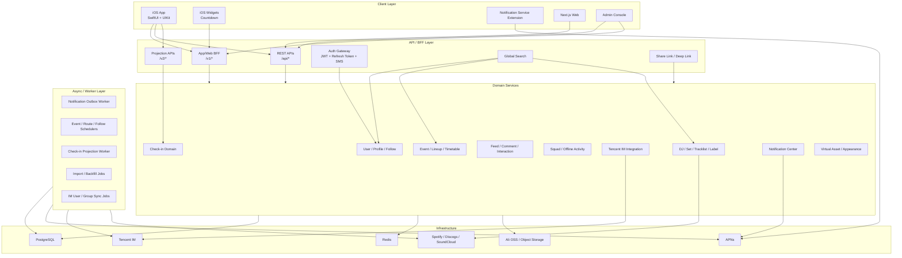
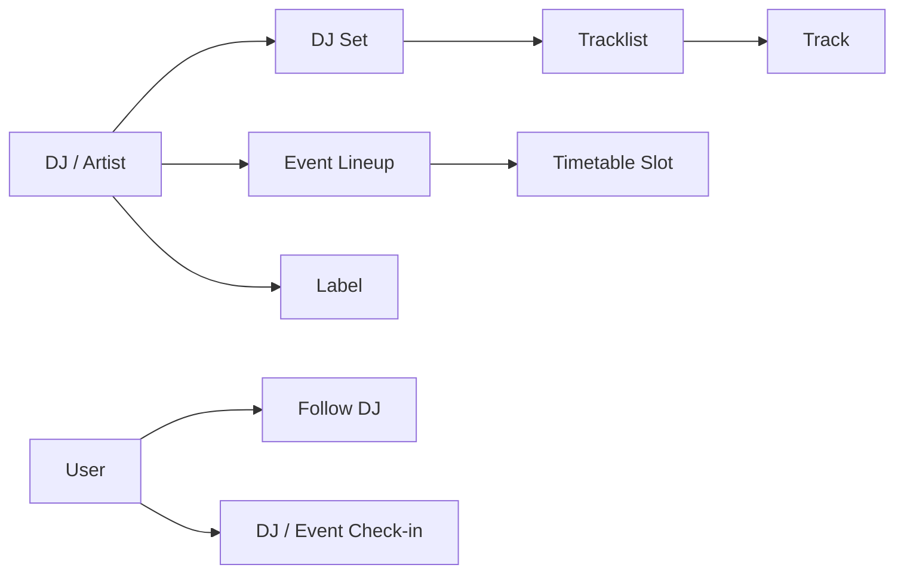
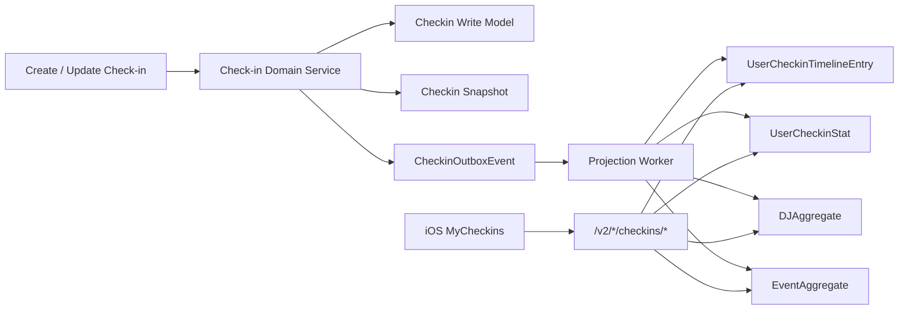
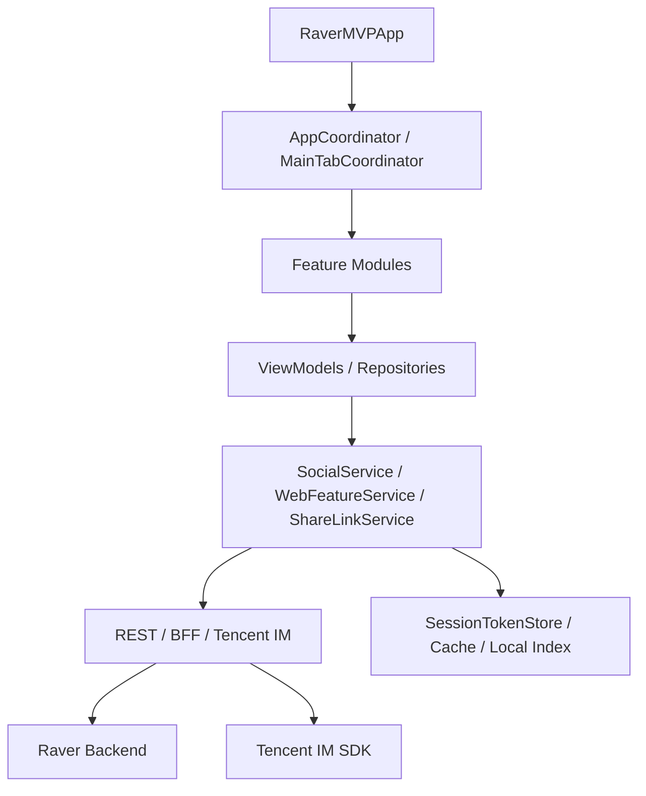
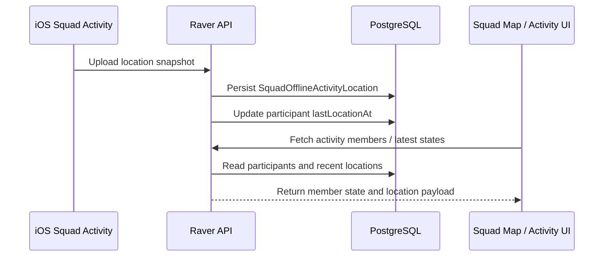
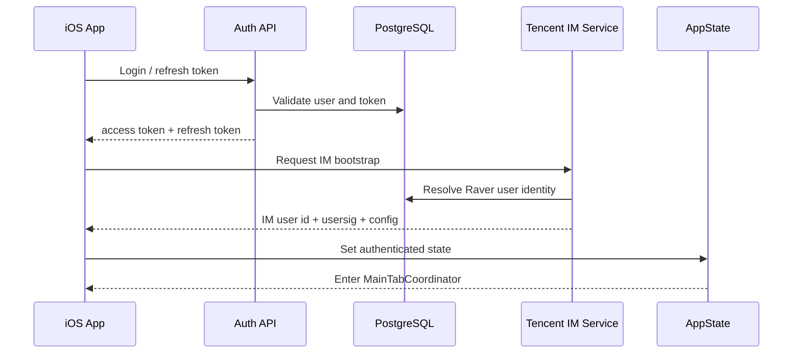
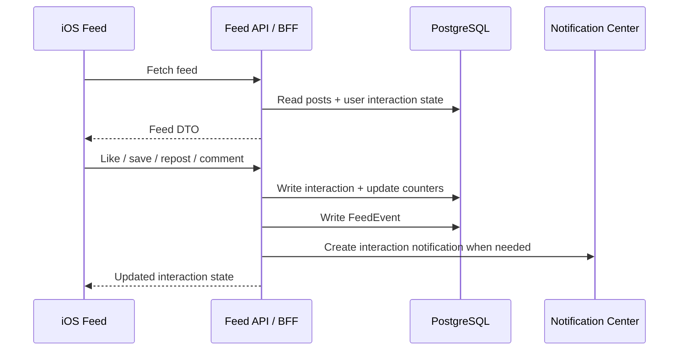
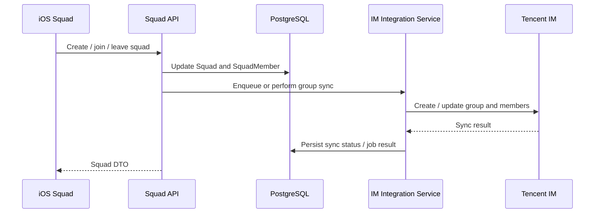
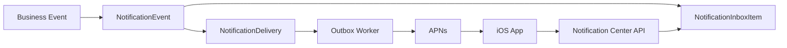
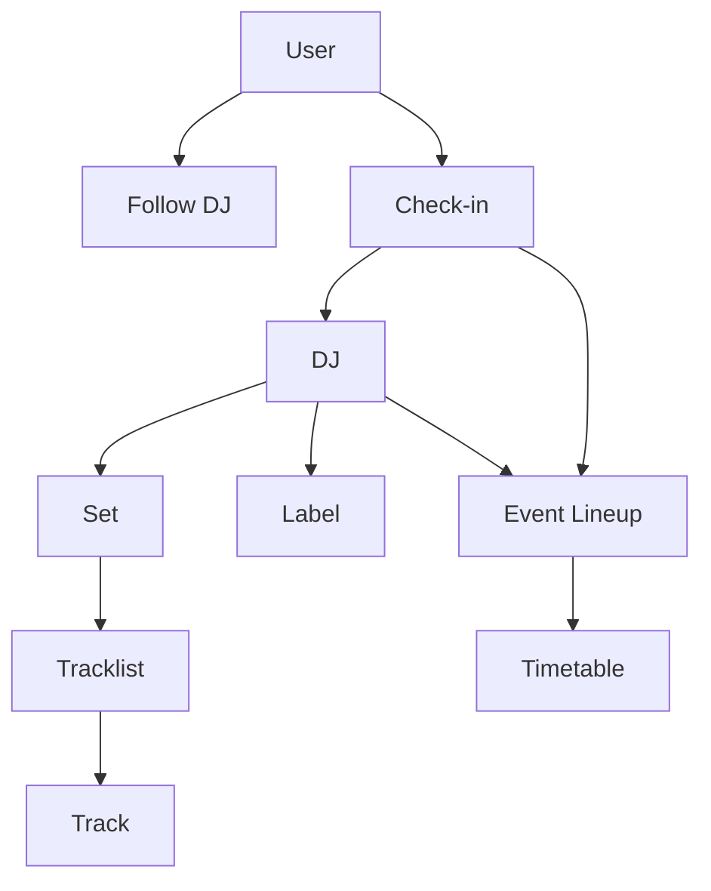

# Raver Platform Architecture

> 更新时间：2026-05-12  
> 适用对象：技术评审、团队交接、后端/客户端架构讨论、产品融资或招聘介绍  
> 代码基线：当前仓库 `server/`、`mobile/ios/RaverMVP/`、`web/`、`docs/`、`scripts/`  

## 0. 文档定位

这份文档不是简单罗列“用了什么技术栈”，而是用平台级系统的方式说明 Raver 的产品边界、领域模型、客户端架构、后端架构、实时系统、内容系统、运营系统与基础设施。

Raver 当前已经不是一个普通 App，也不是一个单一活动列表或音乐内容站。它更接近一个围绕电子音乐场景构建的垂直社交平台，系统内部同时包含：

- 活动与 Festival 内容平台
- DJ / Artist / Label / Genre 知识图谱
- Set / Tracklist / Track 结构化音乐内容系统
- Feed / 评论 / 点赞 / 收藏 / 转发社区系统
- 小队 Squad 社交组织系统
- 即时通讯、会话、群组与自定义消息卡片
- 线下活动协同、位置共享与成员状态系统
- Check-in、集邮、评分与用户身份沉淀系统
- 通知中心、APNs、定时提醒与运营通知系统
- Web CMS / Admin Console / 预报名运营系统
- 后台任务、投影读模型、数据导入与同步系统

因此，这份架构介绍采用：

> 领域驱动 + 系统分层 + 数据流 + 核心能力模块

的方式来组织，而不是按页面、菜单或技术名词堆叠。

---

## 1. Product Overview

### 1.1 一句话定位

Raver 是一个围绕电子音乐活动、DJ、Set、社区、小队与线下协同构建的 App-first 垂直社交平台。

用户可以在 Raver 中发现活动、关注 DJ、查看 Set 和 Tracklist、发布动态、组织小队、聊天、参与线下活动、记录打卡、接收提醒，并沉淀自己的电子音乐身份。

### 1.2 产品形态

从产品结构看，Raver 由以下核心部分组成：

- Event & Festival Platform：活动、Festival、票务信息、阵容、时间表、地点与路线
- DJ / Artist Knowledge Graph：DJ、艺人、国家、曲风、社媒链接、外部数据源与贡献者
- Set / Tracklist Content System：DJ Set、Tracklist、Track、视频、缩略图、评论
- Social Feed & Community：动态流、评论、点赞、收藏、转发、隐藏、分享与 Feed 行为
- Squad-based Social Layer：小队、成员、角色、邀请、相册、小队活动
- Realtime IM & Presence：私聊、群聊、Tencent IM 接入、消息同步、已读、免打扰
- Offline Collaboration：线下小队活动、定位上报、成员状态、活动参与状态
- Check-in & Collection System：活动打卡、DJ 打卡、打卡快照、Timeline、Gallery、统计
- Notification & Recommendation Infrastructure：通知中心、APNs、定时任务、关注更新、活动提醒
- Share & Deep Link Infrastructure：短链、二维码、Universal Link、分享打开埋点
- Web CMS & Operation Console：预报名审核、通知运营、OpenIM 管理、内容辅助管理
- iOS Native Client：当前主要客户端，承载 App-first 的完整产品体验

### 1.3 当前架构口径

当前仓库中需要特别明确三点：

1. iOS App 是当前主客户端。
2. `web/` 是 Next.js 前台/后台混合项目，当前更适合作为运营台、CMS、预报名和历史 Web 能力承载，而不是主产品叙述中心。
3. 后端真实技术基线是 Node.js + Express + TypeScript + Prisma，不是 NestJS。

---

## 2. Overall System Architecture

### 2.1 总体分层

Raver 的整体架构可以分为六层：

- Client Layer：iOS App、Web Frontend、Admin Console、Widget / Notification Extension
- API / BFF Layer：REST API、App BFF、Web BFF、Admin API、Auth、Upload、Search、Share Link
- Domain Service Layer：User、Event、DJ、Set、Feed、Squad、IM、Check-in、Notification、Virtual Asset
- Realtime / External Layer：Tencent IM、APNs、Spotify、Discogs、SoundCloud、OSS
- Data / Read Model Layer：PostgreSQL、Prisma、Projection Tables、Snapshot Tables、Outbox Tables
- Async / Worker Layer：通知 worker、投影 worker、导入脚本、同步任务、定时提醒、回填任务

### 2.2 系统总览图

### 2.3 代码目录映射

| 层级 | 目录 / 文件 | 说明 |
| --- | --- | --- |
| iOS App | `mobile/ios/RaverMVP/RaverMVP/` | iOS 主客户端，SwiftUI/UIKit 混合 |
| iOS Coordinator | `mobile/ios/RaverMVP/RaverMVP/Application/Coordinator/` | App 级导航、主 Tab 和深链入口 |
| iOS Services | `mobile/ios/RaverMVP/RaverMVP/Core/` | AppState、API service、IM session、share link、cache |
| iOS Features | `mobile/ios/RaverMVP/RaverMVP/Features/` | Auth、Discover、Feed、Messages、Squads、Profile、Search、Notifications 等 |
| iOS Widget | `mobile/ios/RaverMVP/RaverCountdownWidgets/` | 活动倒计时小组件 |
| iOS Notification Extension | `mobile/ios/RaverMVP/RaverNotificationService/` | 推送通知服务扩展 |
| Backend | `server/src/` | Express API、routes、controllers、services、scripts |
| Prisma Schema | `server/prisma/schema.prisma` | 核心领域数据模型 |
| Web | `web/src/app/` | Next.js 页面、Admin、预报名、社区、活动等 |
| Web API Client | `web/src/lib/api/` | Web 侧 API 封装 |
| Docs | `docs/` | IM、APNs、Check-in Projection、导航、搜索等工程文档 |

---

## 3. Domain Architecture

Raver 的核心复杂度来自多个领域之间的组合，而不是单个页面的复杂度。下面按业务领域拆解。

### 3.1 Identity & Social Graph Domain

#### 领域职责

Identity & Social Graph 负责用户身份、资料、登录态、关注关系、好友/粉丝关系和用户主页聚合。

#### 核心能力

- 用户注册、登录、短信验证码登录
- JWT access token 与 refresh token 轮转
- 用户资料、头像、昵称、简介、地区、偏好 DJ / Genre
- 用户资料审核，如昵称和头像状态
- 关注用户、关注 DJ、粉丝列表、关注列表
- 用户主页聚合和用户行为历史查询
- Profile 分享码、二维码与深链打开

#### 核心模型

- `User`
- `UserProfileModerationJob`
- `Follow`
- `AuthRefreshToken`
- `AuthSmsCode`
- `AuthPhoneAuthState`
- `ShareLink`
- `ShareLinkEvent`
- `InviteReferral`

#### 设计要点

`Follow` 不是只服务用户关系，它同时支持用户关注用户和用户关注 DJ，因此它也是通知、推荐、关注更新和个人兴趣画像的基础。

`User` 不是单纯账号表，而是多个子系统的身份源。Feed、Squad、Check-in、Notification、IM、Virtual Asset 都依赖同一套 user identity。

---

### 3.2 Event & Festival Domain

#### 领域职责

Event Domain 负责活动、Festival、场地、时间、阵容、票档、排班和活动生命周期。

#### 核心能力

- 活动列表、推荐活动、活动详情
- 活动发布、编辑、删除、图片上传
- 多语言名称、描述、城市、国家、地址
- 场地、经纬度、活动状态、票价与票档
- Lineup 艺人阵容
- Timetable 演出时间表
- 活动现场评论
- 活动与 DJ、Check-in、Squad 活动、通知提醒的关联

#### 核心模型

- `Event`
- `EventTicketTier`
- `EventLineupSlot`
- `EventLineupArtist`
- `EventTimetableSlot`
- `EventLiveComment`
- `EventLiveCommentLike`
- `WikiFestival`
- `WikiFestivalContributor`

#### 设计要点

活动是 Raver 的中心业务实体之一。它不仅是内容页，也是社交关系、线下协同、打卡、通知和小队活动的上下文。

Raver 的 Event Domain 不是普通 CRUD。`Event -> Lineup -> Timetable -> DJ -> Check-in -> Route Reminder` 形成了活动中心化的数据链路。

---

### 3.3 Music Content Domain

#### 领域职责

Music Content Domain 负责 DJ、Set、Tracklist、Track、Label、Genre、榜单与外部音乐数据源聚合。

#### 核心能力

- DJ 列表、详情、关注、贡献与编辑
- Spotify / Discogs / SoundCloud 数据补全
- DJ Set 上传、详情、编辑、评论
- Tracklist 版本管理
- Track 结构化信息、时间轴、外部音乐链接
- Label / Wiki Festival / Genre / Ranking 内容组织
- DJ 与活动 lineup、set、checkin 的交叉关系

#### 核心模型

- `DJ`
- `DJContributor`
- `DJSet`
- `Tracklist`
- `Track`
- `TracklistTrack`
- `Comment`
- `Label`
- `Genre`

#### 外部集成

- Spotify artist metadata
- Discogs artist metadata
- SoundCloud artist links
- EDM Dance Directory import
- DJMag ranking data

#### 设计要点

Music Content Domain 是 Raver 区别于普通活动 App 的关键。它把电子音乐内容从“活动上的名字”升级为可持续沉淀的知识图谱：

---

### 3.4 Community Content Domain

#### 领域职责

Community Content Domain 负责社区动态、评论、点赞、收藏、转发、分享、隐藏、Feed 行为和内容互动聚合。

#### 核心能力

- 动态发布、编辑、删除
- 推荐 / 关注 / 最新 Feed 流
- 动态详情和评论树
- 点赞、收藏、转发、分享
- 不感兴趣隐藏
- Feed 行为记录和实验基础
- 内容绑定 DJ、Brand、Event、Set

#### 核心模型

- `Post`
- `PostLike`
- `PostRepost`
- `PostSave`
- `PostShare`
- `PostHide`
- `FeedEvent`
- `PostComment`
- `EventLiveComment`

#### 设计要点

Raver 的 Feed 不只是 UGC 文本流。`Post` 支持绑定活动、Set、Squad、DJ、Brand 和 Event，因此它本质是内容图谱上的社交表达层。

FeedEvent 的存在意味着系统已经为后续推荐、排序实验、内容质量分析和用户兴趣建模预留了行为数据基础。

---

### 3.5 Squad & Offline Collaboration Domain

#### 领域职责

Squad Domain 负责小队组织、成员关系、邀请、角色权限、小队内容、小队相册和线下活动协同。

#### 核心能力

- 创建、加入、退出、解散小队
- 队长 / 管理员 / 成员角色
- 小队公开状态、人数上限、公告、头像、二维码
- 小队邀请和分享裂变
- 小队相册与活动记录
- 小队线下活动
- 活动参与状态，如暂离、买饮料等状态表达
- 活动定位上报和轨迹记录

#### 核心模型

- `Squad`
- `SquadMember`
- `SquadInvite`
- `SquadActivity`
- `SquadAlbum`
- `SquadAlbumPhoto`
- `SquadOfflineActivity`
- `SquadOfflineActivityParticipant`
- `SquadOfflineActivityStatusEvent`
- `SquadOfflineActivityLocation`

#### 设计要点

Squad 是 Raver 的社交组织单位，而不是普通群组。它同时承担：

- 社交关系容器
- IM 群组映射来源
- 线下活动协同单元
- 位置共享上下文
- 分享邀请与裂变入口
- 活动后相册和记忆沉淀容器

---

### 3.6 Realtime IM & Messaging Domain

#### 领域职责

IM Domain 负责私聊、群聊、会话同步、Tencent IM 身份映射、群组同步、自定义消息卡片、消息治理和迁移。

#### 核心能力

- 登录后 IM bootstrap
- Tencent IM usersig 生成
- Raver user 与 Tencent IM user 映射
- Squad 与 IM group 同步
- 私聊和群聊会话
- 消息已读、免打扰、清理历史
- 文本、图片、视频、语音等消息
- 自定义分享卡片
- OpenIM / Tencent IM 历史兼容、迁移、webhook、内容审核

#### 核心模型

- `DirectConversation`
- `DirectConversationRead`
- `DirectMessage`
- `SquadMessage`
- `OpenIMSyncJob`
- `OpenIMWebhookEvent`
- `OpenIMMessageReport`
- `OpenIMImageModerationJob`
- `OpenIMMessageMigration`

#### 客户端核心模块

- `Core/IMSession.swift`
- `Core/IMChatStore.swift`
- `Core/ChatMessageSearchIndex.swift`
- `Features/Messages/`
- `Features/Messages/UIKitChat/`
- `Features/Messages/CustomCards/`

#### 设计要点

Raver 后端不直接承担所有消息实时分发，而是作为业务权威源和 IM 编排层：

- 用户、Squad、权限和业务关系由 Raver 后端负责。
- 会话、消息同步、群组实时能力由 Tencent IM 承担。
- 自定义业务卡片由 Raver 定义协议和渲染。

---

### 3.7 Check-in & Collection Domain

#### 领域职责

Check-in Domain 负责活动打卡、DJ 打卡、打卡快照、用户 Timeline、Gallery、统计、派生信号和可重建读模型。

#### 核心能力

- 活动 / DJ 打卡
- 打卡备注、图片、评分、可见性
- 打卡快照，固化当时活动 / DJ / 用户信息
- 多日活动选择、DJ 选择、演出选择
- 我的打卡 Timeline
- Event Gallery / DJ Gallery
- 用户打卡统计
- 派生信号，为推荐、身份和画像做准备
- Outbox 驱动的投影更新
- 投影 freshness 检查和重建

#### 核心模型

- `Checkin`
- `CheckinSnapshot`
- `CheckinSelection`
- `CheckinSelectionDJ`
- `UserCheckinTimelineEntry`
- `UserCheckinStat`
- `UserCheckinGalleryDJAggregate`
- `UserCheckinGalleryEventAggregate`
- `UserCheckinDerivedSignal`
- `CheckinOutboxEvent`

#### 设计要点

Check-in v2 是当前项目里最明显的工程化读模型设计之一：

- 写模型保留用户原始打卡和选择数据。
- Snapshot 固化展示所需的历史语义。
- Projection tables 服务 App 高性能读。
- Outbox 负责从写入事件驱动投影。
- Freshness 脚本和 Admin status 接口负责可观测性。
- Reproject / rebuild 脚本负责修复和恢复。

---

### 3.8 Notification Domain

#### 领域职责

Notification Domain 负责站内通知、APNs 推送、设备 token、通知模板、通知订阅、定时提醒和通知投递状态。

#### 核心能力

- 通知 inbox
- 未读数
- 按项标记已读
- 按类型批量标记已读
- 设备 push token 注册和失效
- 通知订阅和静默时间
- 通知模板
- 通知事件与投递记录
- APNs handler
- 活动倒计时、每日摘要、路线 DJ 提醒
- 关注 DJ / Brand 更新提醒
- 通知 outbox worker 和灰度验证脚本

#### 核心模型

- `NotificationRead`
- `NotificationSubscription`
- `DevicePushToken`
- `NotificationEvent`
- `NotificationInboxItem`
- `NotificationDelivery`
- `NotificationTemplate`
- `NotificationAdminConfig`

#### 后端模块

- `server/src/services/notification-center/`
- `server/src/routes/notification-center.routes.ts`
- `server/src/scripts/notification-*.ts`

#### 设计要点

通知系统不是附属列表，而是独立基础设施。它连接：

- 社区互动
- 聊天消息
- 活动提醒
- 关注更新
- 运营通知
- iOS APNs
- App 内通知中心

---

### 3.9 Virtual Asset & Identity Projection Domain

#### 领域职责

Virtual Asset Domain 负责虚拟资产、皮肤、头像/聊天外观、装备状态和身份视觉表达。

#### 核心能力

- 虚拟资产定义
- 用户资产领取和状态
- 用户装备状态
- 聊天中的外观渲染
- 列表和资料页的身份表现
- 资产缓存

#### 核心模型

- `VirtualAssetDefinition`
- `UserVirtualAsset`
- `UserVirtualAssetEquip`

#### 客户端模块

- `Features/VirtualAssets/`
- `VirtualAssetRenderers.swift`
- `VirtualAssetUIKitChatRenderers.swift`
- `VirtualAssetChatAppearanceResolver.swift`
- `VirtualAssetListAppearanceResolver.swift`

#### 设计要点

虚拟资产不是孤立商城能力，而是用户身份系统的一部分。它已经与聊天、列表、个人页外观产生关系，后续可以承载活动纪念、成就、Badge、商业化和用户身份稀缺性。

---

## 4. iOS Client Architecture

### 4.1 客户端定位

iOS 是当前 Raver 的主客户端。它不是 WebView 壳，而是原生 App-first 架构，包含完整的登录态、导航、Feed、Discover、Messages、Squad、Profile、Search、Notification、Virtual Assets、Widget 和 Notification Extension。

### 4.2 架构分层

### 4.3 App Shell & Navigation

核心文件：

- `RaverMVPApp.swift`
- `Application/Coordinator/AppCoordinator.swift`
- `Application/Coordinator/MainTabCoordinator.swift`
- `Application/DI/AppContainer.swift`

设计特征：

- App 启动后先进行 auth bootstrap。
- 通过 `AppState` 决定 authenticated / unauthenticated flow。
- 登录后进入主 Tab 协调器。
- 通过 `onOpenURL` 处理 Universal Link 和 share link。
- `AppContainer` 注入 Social、WebFeature、VirtualAsset 等跨 feature 依赖。
- Features 通过 Repository Adapter 隔离服务实现。

### 4.4 UI Layer

主要特征：

- SwiftUI 为主，UIKit 在复杂聊天、事件详情和部分高级交互中承载精细控制。
- Feature-based 页面组织，如 `Discover`、`Feed`、`Messages`、`Squads`、`Profile`、`Search`。
- Shared UI 组件统一基础样式，如 `RaverSegmentedControl`、`RemoteCoverImage`、`PostCardView`、`SkeletonViews`。
- UIKit Chat 使用 collection view pipeline，实现更接近 IM SDK / demo 的复杂消息渲染。

### 4.5 State Management

主要特征：

- `AppState` 维护全局登录态、语言、深链事件和错误提示。
- Feature ViewModel 管理局部状态和异步加载。
- Repository Adapter 将 UI 与服务层解耦。
- 支持 loading、empty、error、operation banner、skeleton 等状态表达。
- 部分交互支持 optimistic UI，如点赞、收藏、关注、已读状态等。

### 4.6 Network & Service Layer

核心服务：

- `SocialService`：社交、Feed、消息、通知、用户关系、小队
- `WebFeatureService`：活动、DJ、Set、Wiki、搜索等内容域能力
- `ShareLinkService`：短链、分享事件、深链解析
- `VirtualAssetRepository`：虚拟资产列表、装备、缓存
- `IMSession`：IM 登录态和 SDK 会话

命名说明：

`WebFeatureService` 是历史命名，当前在 iOS 中实际承担内容域 BFF 访问，不代表 Web 是主客户端。

### 4.7 IM & Chat Layer

客户端 IM 分为三层：

- Session 层：IM 登录、usersig、SDK bootstrap
- Store 层：会话、消息、未读、搜索索引、存储治理
- UI 层：UIKit chat controller、消息 cell、媒体 resolver、自定义卡片 registry

核心文件：

- `Core/IMSession.swift`
- `Core/IMChatStore.swift`
- `Core/ChatMessageSearchIndex.swift`
- `Features/Messages/UIKitChat/RaverChatController.swift`
- `Features/Messages/UIKitChat/RaverChatCollectionDataSource.swift`
- `Features/Messages/UIKitChat/RaverChatMessageCellFactory.swift`
- `Features/Messages/CustomCards/ChatCustomCardRegistry.swift`

### 4.8 Map & Offline Collaboration Layer

当前小队线下协同能力主要体现在：

- 小队线下活动启动和参与
- 成员定位上传
- 成员状态上报
- 活动历史
- 活动详情与小队上下文关联

核心文件：

- `Features/Squads/SquadOfflineActivityView.swift`
- `Features/Squads/SquadOfflineActivityLocationUploader.swift`
- `Features/Squads/SquadOfflineActivityStarterSheet.swift`
- `Features/Squads/SquadOfflineActivityHistoryView.swift`

### 4.9 Notification Layer

客户端通知由三部分构成：

- App 内通知中心页面和 ViewModel
- APNs 设备 token 注册
- Notification Service Extension

核心文件：

- `Features/Notifications/NotificationsView.swift`
- `Features/Notifications/NotificationsViewModel.swift`
- `RaverNotificationService/NotificationService.swift`

### 4.10 Widget Layer

当前 iOS Widget 用于活动倒计时，配合用户选择的活动和 App 端同步。

核心文件：

- `RaverCountdownWidgets/EventCountdownWidget.swift`
- `Core/Widget/WidgetSelectableEventsStore.swift`
- `Core/Widget/WidgetSelectableEventsSyncService.swift`

---

## 5. Backend Architecture

### 5.1 后端技术基线

当前后端位于 `server/`，技术栈为：

- Node.js
- Express
- TypeScript
- Prisma ORM
- PostgreSQL
- Redis
- Ali OSS
- JWT + bcrypt
- Tencent IM usersig / REST integration
- APNs notification handler

### 5.2 API Layer

后端入口为 `server/src/index.ts`，主要 API 分组：

| API | 说明 |
| --- | --- |
| `/health` | 健康检查 |
| `/api/auth` | 登录、注册、短信、token |
| `/api/events` | 活动 |
| `/api/djs` | DJ |
| `/api/checkins` | 旧 checkin API |
| `/api/follows` | 关注 |
| `/api/dj-sets` | DJ Set 与评论 |
| `/api/music` | 音乐搜索 |
| `/api/squads` | 小队 |
| `/api/notifications` | 旧通知 |
| `/api/labels` | Label |
| `/v1/*` | App / Web BFF、虚拟资产、搜索、IM |
| `/v1/im/tencent` | Tencent IM bootstrap / sync |
| `/v1/notification-center` | 通知中心 |
| `/v2/*` | Check-in v2 projection read APIs |

### 5.3 Service Layer

后端服务模块按领域拆分：

- `checkin-domain.ts`
- `checkin-projection*.ts`
- `comment.service.ts`
- `djset.service.ts`
- `dj-aggregator.service.ts`
- `global-search.service.ts`
- `music-search.service.ts`
- `notification-center/`
- `share-link.service.ts`
- `squad.service.ts`
- `tencent-im/`
- `virtual-asset.service.ts`
- `spotify-artist.service.ts`
- `discogs-artist.service.ts`
- `soundcloud-artist.service.ts`

### 5.4 Data Layer

数据层以 PostgreSQL 为主，Prisma 作为 ORM 和 schema 管理工具。

数据设计特征：

- 一个统一的业务数据库承载核心领域。
- 部分领域有写模型和读模型拆分，如 Check-in v2。
- 使用 Snapshot 固化历史显示语义。
- 使用 Outbox 表承载异步投影和任务可靠性。
- 大量索引用于按用户、时间、状态、实体关系读取。
- JSON 字段用于多语言、第三方元数据、配置和扩展 payload。

### 5.5 Async Processing

后端异步能力通过 scripts、scheduler 和 worker 组合实现。

关键脚本：

- `notification:event-countdown:run`
- `notification:event-daily-digest:run`
- `notification:route-dj-reminder:run`
- `notification:outbox:run`
- `notification:followed-dj-update:run`
- `notification:followed-brand-update:run`
- `checkins:projection:run`
- `checkins:reproject:user`
- `checkins:reproject:dirty`
- `checkins:projection:freshness`
- `checkins:snapshots:rebuild`
- `tencent-im:sync:all-users`
- `tencent-im:export:user-mapping`
- `virtual-assets:seed`

### 5.6 Media Infrastructure

媒体能力包括：

- 活动图片上传
- DJ 头像 / banner 上传
- Set 缩略图和视频 URL
- 用户头像
- 小队头像 / banner / 相册
- 分享海报 / QR code
- 默认头像和 DJ 头像回填到 OSS

当前后端依赖：

- `ali-oss`
- `multer`
- `qrcode`
- `pngjs`

### 5.7 External Integrations

外部服务分为三类：

- 音乐数据：Spotify、Discogs、SoundCloud、EDM Dance Directory、DJMag ranking data
- 实时通讯：Tencent IM
- 系统基础能力：APNs、Ali OSS、SMS provider

---

## 6. Realtime Architecture

### 6.1 实时系统边界

Raver 的 realtime 不只是聊天。它包括：

- IM 消息同步
- 私聊 / 群聊会话状态
- Squad 与 IM group 同步
- 线下小队活动成员状态
- 定位上报和活动状态同步
- APNs 推送
- 通知 inbox 同步
- 自定义消息卡片和深链路由

### 6.2 IM Synchronization

IM 同步的核心职责：

- 为 Raver 用户生成 Tencent IM usersig。
- 将 Raver user identity 映射为 IM user identity。
- 将 Squad 生命周期同步到 IM group。
- 维护 IM sync job 和失败重试。
- 接收 webhook 事件并进入治理、审核或迁移流程。

相关模块：

- `server/src/services/tencent-im/`
- `server/src/routes/tencent-im.routes.ts`
- `OpenIMSyncJob`
- `OpenIMWebhookEvent`
- `OpenIMMessageMigration`

### 6.3 Presence & Offline Activity State

当前 presence 更偏活动上下文中的成员状态：

- 用户是否参与某个小队线下活动
- 用户是否离开活动
- 用户最后定位时间
- 用户是否处于特定状态，如临时离开、买饮料
- 活动是否 active / ended

核心模型：

- `SquadOfflineActivity`
- `SquadOfflineActivityParticipant`
- `SquadOfflineActivityStatusEvent`
- `SquadOfflineActivityLocation`

### 6.4 Location Synchronization

定位同步链路：

后续如果升级为更强实时能力，可以将当前轮询 / API 同步演进为 WebSocket、SSE 或基于 Tencent IM custom message 的状态广播。

### 6.5 Custom Message Protocol

Raver 聊天系统规划了统一自定义卡片协议。自定义卡片的目标是让聊天成为内容分发和协同入口，而不是只发送文本。

通用字段建议包括：

- `cardType`
- `entityID`
- `title`
- `subtitle`
- `coverImageURL`
- `badgeText`
- `primaryMeta`
- `secondaryMeta`
- `deeplinkRoute`
- `webFallbackURL`
- `shareContext`
- `version`

核心卡片类型：

- Event Card
- DJ Card
- Set Card
- Tracklist Card
- Post Card
- Squad Card
- Squad Invite Card
- Check-in Card
- Rating Card
- Timetable / Lineup Slot Card
- User Profile Card
- Label / Brand / Genre Card

---

## 7. Content Infrastructure

### 7.1 统一内容互动模型

Raver 的内容互动不是只服务 Feed，而是跨多个内容实体复用：

- Like
- Comment
- Bookmark / Save
- Repost
- Share
- Hide
- Follow
- Check-in
- Rating

当前已经落地较完整的是 Feed/Post、DJSet Comment、EventLiveComment、Follow、Check-in、ShareLink 等。

### 7.2 Feed Architecture

Feed 设计包含：

- 多模式流，如推荐、关注、最新
- 动态内容本体 `Post`
- 内容绑定，如 Event、Set、Squad、DJ、Brand
- 用户互动状态，如 liked、saved、reposted、hidden
- 评论树
- 分享记录
- FeedEvent 行为埋点

Feed 的下一步演进方向可以是：

- 将 ranking logic 从接口内逻辑逐步抽象为 Feed Ranking Service。
- 基于 `FeedEvent` 构建用户兴趣向量。
- 将 `boundDjIds`、`boundEventIds`、`boundBrandIds` 与推荐候选集结合。
- 支持内容安全、审核和运营置顶。

### 7.3 Structured Music Content

结构化音乐内容由以下关系支撑：

- DJ 与 Set
- Set 与 Tracklist
- Tracklist 与 Track
- DJ 与 Event lineup / timetable
- DJ 与 Label
- DJ 与 Follow
- DJ 与 Check-in
- DJ 与外部数据源

这使 Raver 能够支持：

- DJ 页面
- Set 页面
- Tracklist 时间轴
- 活动 lineup
- 用户看过哪些 DJ
- 用户最常 check-in 的 DJ
- 关注 DJ 更新提醒
- 活动中某个 DJ 的 Route reminder

### 7.4 Share & Deep Link Infrastructure

分享系统由 `ShareLink` 和 `ShareLinkEvent` 支撑：

- 为活动、DJ、Set、用户、小队、Check-in 等实体生成短链。
- 提供 canonical URL、deep link、fallback URL。
- 支持二维码、海报、scan / click / app open 事件。
- iOS 通过 Universal Link 解析并转为 App 内 deeplink。

这是 Raver 跨 App、Web、聊天、线下二维码的重要基础设施。

---

## 8. Operations & CMS

### 8.1 Admin Infrastructure

当前 Web / Admin 侧已经包含以下运营能力：

- 预报名列表和审核
- 通知中心运营
- OpenIM 管理页面
- 活动发布和内容管理页面
- 用户、活动、DJ、Set 等基础页面

相关页面：

- `web/src/app/admin/notification-center/page.tsx`
- `web/src/app/admin/pre-registrations/page.tsx`
- `web/src/app/community/openim/page.tsx`
- `web/src/app/pre-register/page.tsx`

### 8.2 Pre-registration Operation

预报名系统包含：

- 用户提交预报名
- 批次管理
- 审核决策
- 通知发送
- 状态跟踪

核心模型：

- `PreRegistration`
- `PreRegistrationBatch`
- `PreRegistrationDecision`
- `PreRegistrationNotification`

### 8.3 Moderation & Governance

当前系统中已经出现多类治理模型：

- 用户资料审核：`UserProfileModerationJob`
- IM 消息举报：`OpenIMMessageReport`
- IM 图片审核任务：`OpenIMImageModerationJob`
- Admin 操作审计：`AdminAuditLog`
- Feed hide / 不感兴趣：`PostHide`

这说明 Raver 已经具备从 MVP 向可运营社区演进的治理基础。

### 8.4 Projection & Rebuild System

Check-in v2 的投影系统是当前运营可观测性最完整的一块：

- projection freshness script
- admin projection status API
- dirty user reproject
- single user reproject
- snapshot rebuild
- strict read model mode
- degraded / critical 状态口径

这套模式后续可以复用到：

- 用户主页聚合
- Feed 推荐读模型
- DJ 热度榜
- 活动参与统计
- 小队活跃度
- 通知 unread counter

---

## 9. Infrastructure & Scalability

### 9.1 Storage

| 组件 | 当前用途 |
| --- | --- |
| PostgreSQL | 主业务数据、关系模型、投影表、outbox、审核与运营表 |
| Redis | 缓存、后续可用于限流、短期状态、任务锁、实时 presence |
| Ali OSS | 图片、头像、海报、上传媒体、默认资源 |
| Local uploads | 开发环境上传和静态资源 |

### 9.2 Scalability Considerations

当前架构已经具备以下可扩展点：

- API 与 Worker 分离
- 投影读模型优化复杂查询
- Outbox 保证异步处理可恢复
- 第三方 IM 承担高并发消息链路
- APNs 与通知中心解耦
- OSS 承担媒体存储
- BFF 层可按 App 体验聚合接口
- JSON metadata 支持快速扩展第三方数据字段

### 9.3 当前风险与建议

| 风险 | 说明 | 建议 |
| --- | --- | --- |
| 领域服务边界仍较混合 | Express routes、BFF、service 中存在历史命名和职责交叉 | 按 domain module 整理服务边界 |
| Web 与 App 口径容易混淆 | README 中仍有历史描述，当前 App 才是主客户端 | 更新 README 和架构文档口径 |
| Realtime presence 还未完全实时化 | 线下活动状态主要依赖 API 持久化 | 后续引入 WebSocket/SSE/Tencent custom message |
| 推荐系统仍处早期 | 有 FeedEvent 和内容绑定，但 ranking service 尚未独立 | 建立 recommendation candidate + ranking pipeline |
| CMS 能力分散 | Admin 页面存在，但后台权限、审计、审核流程可继续统一 | 建立 Operation Console 信息架构 |
| 测试体系需要分层 | 当前有 smoke / regression scripts，自动化覆盖需继续补齐 | 按 auth、feed、im、checkin、notification 建立关键路径测试 |

---

## 10. Core Data Flows

### 10.1 登录与 App Bootstrap

### 10.2 Feed Interaction

### 10.3 Squad Group Sync

### 10.4 Notification Delivery

---

## 11. Engineering Highlights

### 11.1 Hybrid Realtime + Social Architecture

Raver 将 IM、Squad、Feed、Notification、Location 和 Deep Link 组合在一起：

- IM 解决实时会话。
- Squad 提供社交组织。
- Offline Activity 提供线下协同。
- Notification 保证异步触达。
- Custom Card 把内容实体带入聊天。
- Deep Link 把聊天、Web、二维码和 App 页面打通。

这不是普通聊天，也不是普通社区，而是电子音乐线下场景中的实时社交系统。

### 11.2 Event-centric Social Design

Raver 的社交关系不是泛社交，而是围绕活动组织：

- 用户关注 DJ 是为了活动和内容更新。
- 小队是为了线下参与。
- Check-in 是活动后的身份沉淀。
- Timetable 和 Route Reminder 是活动中的协同。
- Feed 是活动前后内容表达。

这使 Raver 的社交图谱具有明确场景，而不是空泛关系链。

### 11.3 Structured Electronic Music Knowledge Graph

系统通过 DJ、Set、Tracklist、Track、Label、Event、Check-in 建立结构化音乐图谱：

这为推荐、榜单、个人音乐身份、活动路线、DJ 更新提醒提供了长期数据基础。

### 11.4 Projection-driven Check-in System

Check-in v2 使用写模型、快照、投影读模型和 outbox worker 的组合。它的价值是：

- App 首屏读取稳定。
- 历史展示语义不会被源数据变化破坏。
- 投影可以重建。
- 故障可以通过 freshness 状态暴露。
- 运维修复有脚本路径。

这是平台从 MVP 走向可商用系统的重要工程标志。

### 11.5 Unified Share & Deep Link Infrastructure

分享系统通过短链、二维码、fallback URL、deep link 和 app open 事件，把多个入口连接起来：

- App 内分享
- 聊天卡片
- Web fallback
- 线下二维码
- Universal Link
- 分享效果追踪

后续可自然扩展到邀请奖励、活动裂变、用户增长和内容传播分析。

### 11.6 Cross-platform Content Architecture

虽然 iOS 是主客户端，但内容模型由后端统一维护，Web/Admin 和未来 Android 可以复用：

- 统一用户模型
- 统一活动模型
- 统一 DJ / Set / Tracklist 模型
- 统一 Feed interaction 模型
- 统一通知中心
- 统一分享和深链

这使 Raver 具备从单客户端产品向多端平台扩展的基础。

### 11.7 Operation-ready Backend Foundation

系统中已经存在：

- AdminAuditLog
- profile moderation job
- notification admin config
- pre-registration review
- IM report / moderation
- projection freshness
- outbox worker
- sync job

这些能力说明后端不是纯业务 CRUD，而是具备运营、治理、恢复和审计意识的平台基础设施。

---

## 12. Recommended Presentation Structure

如果需要对外或对团队介绍 Raver，建议按下面顺序讲，而不是按页面讲：

1. 产品定位：电子音乐活动 + 内容 + 社区 + 小队 + 实时协同平台。
2. 系统分层：iOS App、API/BFF、领域服务、数据层、第三方实时能力、异步 worker。
3. 核心领域：User、Event、Music Content、Feed、Squad、IM、Check-in、Notification。
4. 实时系统：Tencent IM、Squad group sync、offline activity state、APNs、custom cards。
5. 内容系统：DJ graph、Set/Tracklist、Feed interaction、Share link。
6. 工程亮点：projection-driven checkin、event-centric social、hybrid realtime social、operation-ready backend。
7. 演进方向：推荐、实时 presence、CMS 统一、测试体系、服务边界治理。

不建议按下面方式介绍：

- 登录页
- 首页
- 我的页面
- 活动页面
- 聊天页面

这种页面式介绍无法体现当前系统已经形成的平台复杂度。

---

## 13. Suggested Next Architecture Iterations

### 13.1 短期

- 更新 README，将“React Native”旧口径修正为当前 iOS native App-first。
- 将 `WebFeatureService` 的职责在文档中明确为 Content BFF client，避免误解。
- 为 IM、Notification、Check-in、Feed 分别补齐端到端 smoke 测试。
- 将 Admin API 权限、审计和角色体系整理为统一 Operation Console 规范。

### 13.2 中期

- 建立独立 Recommendation / Ranking Service。
- 将 Feed read model 从简单查询演进为 candidate + ranking + hydration。
- 将 Squad offline state 演进为实时 presence 通道。
- 将 ShareLink 与 InviteReferral 打通增长激励。
- 将 Virtual Asset 与 Check-in / Event / Badge 结合，形成身份资产体系。

### 13.3 长期

- 建立统一领域事件总线。
- 将高频状态从 PostgreSQL 直写演进为 Redis / stream / worker 聚合。
- 对 IM、Feed、Notification、Check-in 投影建立统一 outbox 基础设施。
- 构建真正的电子音乐知识图谱和推荐系统。
- 支持跨城市、跨 Festival、跨 DJ 场景的个性化活动路线。

---

## 14. Summary

Raver 当前可以被理解为：

> 一个以电子音乐活动为场景中心，以 DJ / Set / Tracklist 为内容资产，以 Feed / Squad / IM 为社交层，以 Check-in / Virtual Asset 为身份沉淀，以 Notification / Share / CMS / Worker 为平台基础设施的 App-first 垂直社交系统。

它的复杂度不在于用了多少技术栈，而在于多个领域已经开始形成彼此连接的数据和行为闭环：

- 用户关注 DJ，触发内容推荐和更新通知。
- DJ 出现在活动 lineup 中，活动又驱动 route reminder、check-in 和 feed 内容。
- 小队围绕活动组织线下协同，并映射到 IM 群聊。
- 聊天通过自定义卡片传播活动、DJ、Set、Check-in 和小队邀请。
- Check-in 通过投影系统沉淀用户身份、偏好和可展示履历。
- 后台运营通过审核、通知、预报名、投影恢复和同步任务支撑平台运行。

这已经是一个平台级系统的雏形。后续架构工作的重点，不是继续堆功能，而是把现有领域边界、实时状态、读模型、推荐系统和运营治理继续工程化。
