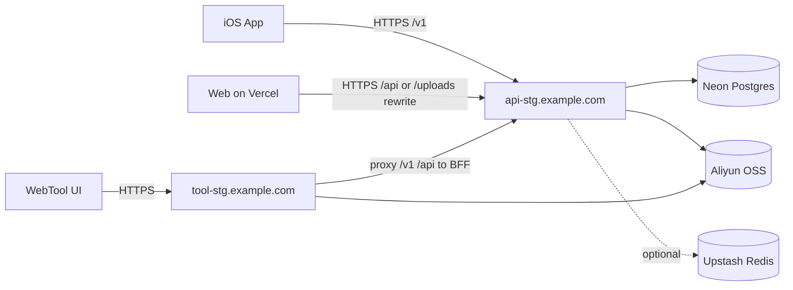

# Raver 测试环境低成本部署完整方案

> 版本：v1.0  
> 编写日期：2026-04-17（Asia/Shanghai）

## 1. 目标与范围

目标：在没有正式生产服务器的前提下，以**免费或低成本**方式把整套流程跑通，包括：

- `server`：Node/Express 后端（含 `/api` 与 `/v1` BFF 路由）
- `web`：Next.js Web 端
- `scrapRave/web_tool/server.py`：Festival Viewer/WebTool 后端
- `mobile/ios`：iOS App 接入联调
- 补齐的基础设施：PostgreSQL、对象存储、（可选）Redis、域名/HTTPS、监控与备份

## 2. 先说结论（推荐部署落位）

## 2.1 推荐方案 A（低成本 + 稳定，优先）

| 组件 | 部署位置 | 原因 | 预估成本 |
|---|---|---|---|
| App/Web 公共后端（`server`） | 1 台低价 VPS（推荐 Hetzner CX22） | 稳定、可长期跑、可同时托管 Node + Python | 约 €3.79/月起（按地区与税费浮动） |
| WebTool 后端（`scrapRave/web_tool/server.py`） | 与 `server` 同一台 VPS（不同端口） | 省成本、便于内网联通 BFF | 包含在 VPS 成本内 |
| PostgreSQL | Neon Free（先用免费） | 免运维，直接给 `DATABASE_URL`，适合测试 | $0 起（Free 有配额） |
| Redis（可选） | Upstash Redis Free | 当前代码基本未实际依赖 Redis，可先占位 | $0 |
| 对象存储（媒体上传） | 阿里云 OSS（推荐，代码零改造） | 当前 Node/Python 都已按 OSS 变量接入 | 按量计费，测试期通常很低 |
| Web（`web`） | Vercel Hobby | Next.js 一键部署，免费且快 | $0 |
| DNS + HTTPS | Cloudflare DNS + Caddy 自动证书 | 成本低，操作简单 | $0 |
| 健康检查 | UptimeRobot/Better Stack 任选 | 免费档够用 | $0 起 |

## 2.2 备选方案 B（极限低成本，接近 0）

- 把 `server + web_tool + Postgres + Redis` 全放 Oracle Cloud Always Free 资源。
- 优点：月成本可接近 0。
- 风险：可用区容量波动、空闲回收策略、初次开通门槛更高，稳定性通常弱于方案 A。

## 3. 为什么这样分配（结合你当前代码）

### 3.1 当前项目中的关键事实

- `server` 依赖 PostgreSQL（Prisma）。
- `web` 通过 `NEXT_PUBLIC_API_URL` 指向后端。
- iOS 通过 `RAVER_BFF_BASE_URL` 访问 `/v1/*`，默认是本地地址，线上联调必须改成测试域名。
- `web_tool/server.py` 需要单独运行，并通过 `RAVER_BFF_BASE` 反向代理到主后端。
- 多个上传接口依赖 OSS（尤其 `/v1` 里的图片/视频上传）；如果不配 OSS，部分上传接口会返回 503。
- `REDIS_URL` 虽在环境变量中，但当前 `server/src` 基本无 Redis 客户端实际调用，测试阶段可后置。

### 3.2 拓扑图（方案 A）



## 4. 从 0 到可用：实施步骤

## 4.1 资源与账号准备

1. 域名 1 个（例如 `example.com`）。
2. VPS 1 台（Ubuntu 22.04/24.04，2 vCPU / 4GB 内存足够测试）。
3. Neon 项目 1 个（拿到 `DATABASE_URL`）。
4. OSS bucket 1 个（拿到 AccessKey、Bucket、Endpoint、Region）。
5. Vercel 账号 1 个（部署 `web`）。
6. 可选：Upstash Redis 1 个。

## 4.2 DNS 规划

建议至少 3 个子域名：

- `api-stg.example.com` -> VPS
- `tool-stg.example.com` -> VPS
- `web-stg.example.com` -> Vercel（可选，自定义域）

## 4.3 VPS 初始化

```bash
sudo apt update && sudo apt -y upgrade
sudo apt -y install git curl build-essential python3 python3-venv python3-pip

# Node 20 + pnpm
curl -fsSL https://deb.nodesource.com/setup_20.x | sudo -E bash -
sudo apt -y install nodejs
sudo npm i -g pnpm pm2

# Caddy（反向代理 + 自动 HTTPS）
sudo apt -y install debian-keyring debian-archive-keyring apt-transport-https
curl -1sLf 'https://dl.cloudsmith.io/public/caddy/stable/gpg.key' | sudo gpg --dearmor -o /usr/share/keyrings/caddy-stable-archive-keyring.gpg
curl -1sLf 'https://dl.cloudsmith.io/public/caddy/stable/debian.deb.txt' | sudo tee /etc/apt/sources.list.d/caddy-stable.list
sudo apt update && sudo apt -y install caddy
```

## 4.4 拉代码并安装依赖

```bash
sudo mkdir -p /opt/raver && sudo chown -R $USER:$USER /opt/raver
cd /opt/raver
git clone <你的仓库地址> .

cd /opt/raver/server && pnpm install && pnpm build
cd /opt/raver/web && pnpm install
cd /opt/raver/scrapRave
```

## 4.5 配置后端环境变量（`server/.env`）

只列推荐测试必填项：

```dotenv
NODE_ENV=staging
PORT=3901
DATABASE_URL=postgresql://...
JWT_SECRET=请替换为高强度随机串
JWT_EXPIRES_IN=7d

# OSS（建议必配，保证上传链路可测）
OSS_REGION=...
OSS_ACCESS_KEY_ID=...
OSS_ACCESS_KEY_SECRET=...
OSS_BUCKET=...
OSS_ENDPOINT=...
OSS_POSTS_PREFIX=posts
OSS_EVENTS_PREFIX=wen-jasonlee/events
OSS_DJS_PREFIX=wen-jasonlee/djs
OSS_RATINGS_PREFIX=wen-jasonlee/ratings
OSS_WIKI_BRANDS_PREFIX=wiki/brands

# 可选三方增强（不用可先留空）
SPOTIFY_CLIENT_ID=
SPOTIFY_CLIENT_SECRET=
DISCOGS_TOKEN=
SoundCloud_CLIENT_ID=
SoundCloud_CLIENT_SECRET=
COZE_WORKFLOW_TOKEN=
COZE_WORKFLOW_RUN_URL=
```

## 4.6 配置 WebTool 环境变量（`scrapRave/.env.local`）

```dotenv
RAVER_BFF_BASE=http://127.0.0.1:3901

# 地图（按需）
AMAP_JS_API_KEY=
AMAP_SECURITY_JS_CODE=
MAPKIT_JS_TOKEN=
MAPBOX_ACCESS_TOKEN=
GEOAPIFY_API_KEY=

# 若 WebTool 需要直传 OSS（建议与 server 统一）
ALIYUN_OSS_ACCESS_KEY_ID=...
ALIYUN_OSS_ACCESS_KEY_SECRET=...
ALIYUN_OSS_BUCKET=...
ALIYUN_OSS_ENDPOINT=...
ALIYUN_OSS_PREFIX=temp/
```

## 4.7 数据库迁移与种子

```bash
cd /opt/raver/server
pnpm prisma:generate
pnpm prisma:migrate
# 首次需要数据时再执行
# pnpm prisma:seed
```

## 4.8 启动服务（推荐 PM2）

```bash
# API
cd /opt/raver/server
pm2 start "pnpm start" --name raver-api

# WebTool
cd /opt/raver/scrapRave
pm2 start "python3 web_tool/server.py" --name raver-webtool

pm2 save
pm2 startup
```

## 4.9 Caddy 反向代理

编辑 `/etc/caddy/Caddyfile`：

```caddy
api-stg.example.com {
    reverse_proxy 127.0.0.1:3901
}

tool-stg.example.com {
    reverse_proxy 127.0.0.1:8000
}
```

重载：

```bash
sudo caddy fmt --overwrite /etc/caddy/Caddyfile
sudo systemctl reload caddy
```

## 4.10 部署 Web 到 Vercel

Vercel 项目选择仓库中的 `web` 目录，环境变量配置：

```dotenv
NEXT_PUBLIC_API_URL=https://api-stg.example.com/api
```

说明：你的 `next.config.js` 已包含 `/api` 和 `/uploads` rewrite，设置上面这个值即可。

## 4.11 iOS App 联调配置

在 Xcode Scheme/Run Environment Variables 配置：

```text
RAVER_USE_MOCK=0
RAVER_BFF_BASE_URL=https://api-stg.example.com
```

说明：iOS 代码走 `/v1/*`，这里填域名根，不要带 `/api`。

## 5. 验收清单（建议按顺序）

1. API 健康：`curl https://api-stg.example.com/health` 返回 `status=ok`。
2. Web 首页可打开，并能读取活动/DJ 列表。
3. iOS 登录/注册 + 基础 feed 能拉通。
4. WebTool 打开 `https://tool-stg.example.com`，`/api/viewer/runtime-config` 返回正常。
5. 媒体上传链路：
   - Web 端上传一张图
   - iOS 端上传头像或媒体
   - 数据库 URL 指向 OSS，资源可访问
6. 关键数据库写入与查询（events / djs / posts / checkins）通过。

## 6. 运维与安全最低要求（测试环境）

- 服务器防火墙只放行 `22/80/443`。
- 禁止把真实密钥提交到 Git。
- `JWT_SECRET` 必须更换强随机值。
- 每日自动备份 DB（至少逻辑备份到对象存储）。
- 配 2 条监控：`/health` 与 `tool-stg` 首页可用性。

## 7. 成本估算（方案 A）

- VPS：约 €3.79/月起。
- DB：Neon Free 可先 0 成本（受配额限制）。
- Redis：Upstash Free 可先 0 成本。
- Web：Vercel Hobby 0 成本（受配额限制）。
- OSS：按量（测试流量通常低，通常远低于正式环境）。

保守估算：测试期常见为 **$5~$15/月（不含可选增值服务）**。

## 8. 方案 B（接近 0 成本）落位

如果你要极限省钱，可以这样放：

- Oracle Always Free VM：跑 `server + web_tool + (可选)本地 Postgres + (可选)本地 Redis`
- Vercel Hobby：跑 `web`
- OSS：继续使用低成本 OSS 按量

注意风险：

- Always Free 资源可能受容量/回收策略影响，不建议做长期稳定联调主环境。
- 一旦测试人多、上传多、并发高，建议切回方案 A 或提升到更稳妥规格。

## 9. 建议的迭代路径

1. 第 1 周：按方案 A 跑通全链路联调（登录、浏览、上传、webtool）。
2. 第 2 周：补自动化部署（GitHub Actions + SSH/PM2 reload）。
3. 第 3 周：把日志、备份、告警完善，再考虑生产环境迁移。

## 10. 参考链接（价格与配额，以官方页面最新信息为准）

- Neon Pricing: https://neon.com/pricing
- Upstash Redis Pricing: https://upstash.com/pricing/redis
- Cloudflare R2 Pricing: https://developers.cloudflare.com/r2/pricing/
- Oracle Cloud Always Free: https://docs.oracle.com/en-us/iaas/Content/FreeTier/freetier_topic-Always_Free_Resources.htm
- Render Free 限制说明: https://render.com/docs/free
- Vercel Pricing: https://vercel.com/pricing
- Hetzner Cloud CX 价格发布: https://www.hetzner.com/pressroom/new-cx-plans/
- Railway Pricing: https://railway.com/pricing
