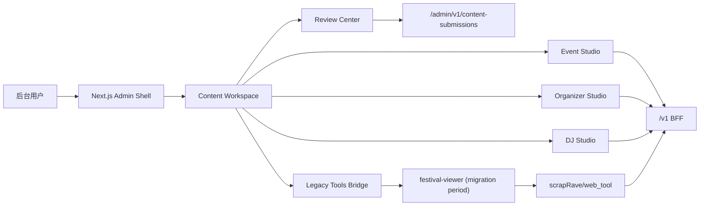

# Web 端统一后台与 iOS 内容流程对齐总改造方案

> Status: In Progress  
> Owner: Web / iOS / BFF / Content Platform  
> Last Updated: 2026-05-30  
> Scope: `web`, `server`, `mobile/ios/RaverMVP`, `scrapRave/festival-viewer`

## 0. 可追溯进度

### Phase 1：统一内容后台壳

- [x] 盘点现有 `admin`、`content-cms`、`festival-viewer` 桥接关系
- [x] 新建 `/admin/content` 原生内容工作区入口
- [x] 新建活动、主办方、DJ、审核中心、旧工具 5 个第一版工作区页面
- [x] 新建共享后台内容布局组件，统一侧边导航与迁移期说明
- [x] 升级统一后台为多级展开式侧栏导航，按总览台 / 内容生产 / 审核与治理 / 迁移与支持分区
- [x] 为审核中心与旧工具补二级工作台包装页，保持统一后台框架内导航连续性
- [x] 统一后台壳已切换到三栏 dashboard 风格，采用 DM Sans / DM Mono 与左侧多级展开目录
- [x] 统一后台壳已补左右侧栏独立滚动、左右栏展开收起与更贴近目标稿的黑底荧绿导航样式
- [x] 新建活动目录中心与 DJ 目录中心，统一承接全量目录型管理入口
- [x] 在统一后台目录层接入本地 TTL 快照、分页摘要与手动刷新第一版
- [x] 在 BFF 侧补活动 / DJ 目录 summary endpoint 与内存 TTL 缓存第一版
- [x] 将 `/admin/content-cms` 从“直接跳 Festival Viewer”改为“进入统一内容后台”
- [x] 将 `/admin` 首页内容入口改为指向 `/admin/content`
- [x] 新建 Event Studio 的 create/edit 路由骨架
- [x] 抽 Event Studio shared 基础层第一版：draft / validation / mapper / `/v1` create client
- [ ] 抽 shared draft / validation / mapper / media orchestration 基础层

### Phase 2：Event Studio

- [x] 抽 Event Studio draft 状态层第一版
- [x] 接入 `/v1/events`、`/v1/event-timezones/search`、`/v1/events/upload-image`
- [x] 搭建 `/admin/content/events/new`
- [x] 搭建 `/admin/content/events/[id]/edit`
- [x] 将 `/admin/content/events/new` 接成第一版可提交表单
- [x] 将 `/admin/content/events/[id]/edit` 接成第一版可加载回填表单
- [x] 补 Event Studio organizer 搜索绑定第一版
- [x] 将 Event 编辑页切换到真实 `PATCH /v1/events/:id` 提交链路
- [x] 逐步替换旧 `/events/publish` 与 `/events/my/[id]/edit`
- [x] 补 schedule mode / weeks / eventDays 结构化提交第一版
- [x] 补 lineup sync mode / stageOrder / timetable slots 第一版提交能力
- [x] 补 lineup-timetable alignment preview 第一版与建议阵容应用
- [x] 补 Event 编辑活跃 submission 冲突提示第一版
- [ ] 继续补 lineup-only slots 与更完整 revision conflict 语义

### Phase 3：Organizer Studio

- [x] 抽 Organizer Studio draft / mapper / validation
- [x] 接入 `/v1/learn/festivals` 与 brand image upload/delete
- [x] 搭建 `/admin/content/organizers/new`
- [x] 搭建 `/admin/content/organizers/[id]/edit`
- [x] 将 `/admin/content/organizers/new` 接成第一版可提交表单
- [x] 将 `/admin/content/organizers/[id]/edit` 接成第一版可加载回填并提交 PATCH
- [x] 搭建 `/admin/content/organizers/catalog`
- [x] 在 Event Studio 中补一跳式 organizer create 入口
- [x] 补 brand image delete 与更完整 media lifecycle
- [x] 搭建 `/admin/content/organizers/bindings` 活动绑定中心第一版

### Phase 4：DJ Studio

- [x] 抽 DJ Studio draft / mapper / validation
- [x] 接入 `/v1/djs/manual/import`、`PATCH /v1/djs/:id`、DJ image upload/delete
- [x] 搭建 `/admin/content/djs/new`
- [x] 搭建 `/admin/content/djs/catalog`
- [x] 搭建 `/admin/content/djs/[id]/edit`

### Phase 6：全量目录与 Festival Viewer 回迁

- [x] 新建 `/admin/content/events/catalog` 与 `/admin/content/djs/catalog`
- [x] 新建 `/admin/content/organizers/catalog`
- [x] 目录页采用分页摘要，不在页面打开时直接请求全量重数据
- [x] 目录页接入本地 TTL 快照与 stale-while-revalidate 风格的低频刷新体验
- [x] BFF 已补目录 summary 接口与服务端内存缓存，前端目录页默认优先读取摘要层
- [x] 在活动 / DJ 工作区与统一后台首页补全目录中心入口
- [x] 在主办方工作区与统一后台首页补全主办方目录中心入口
- [x] 先将 Event ↔ Brand 高频关系维护回迁为统一后台活动绑定中心第一版
- [x] 先将 Archive 年份式活动回看迁回统一后台第一版
- [x] 在活动绑定中心补批量绑定 / 批量清空第一版
- [x] 在活动绑定中心补未匹配活动聚类视图第一版
- [x] 在 BFF 摘要层补内存热缓存 + 持久快照兜底第一版，降低目录页和档案页重启后首屏打库压力
- [x] 在统一后台补目录缓存治理台，统一查看活动 / DJ / Archive 摘要缓存状态并支持手动预热
- [ ] 继续把 DJ 历史辅助面板与更深的 Archive 工具逐步迁回统一后台
- [ ] 在 BFF 侧补更成熟的 Redis / DB snapshot summary endpoint，替代纯前端本地快照第一版

### Phase 5：审核中心原生化

- [ ] 保持 Festival Viewer 审核桥接可用
- [x] 原生化 Event / Organizer / DJ submission list + detail preview 第一版
- [x] 补基础 approve / reject 第一版
- [x] 补版本 diff 摘要与结构化 review notes 面板第一版
- [x] 审核动作已补 reason code 模板与结构化 reviewDecision 写回第一版
- [x] 审核页已补 Event / Organizer / DJ 主线业务语义 diff 第一版
- [x] Event 语义 diff 已继续细化到活动日日期、艺人名单与舞台变化第一版
- [x] Event 语义 diff 已继续细化到活动日标签、slot 级时间/舞台/艺人变化与主办绑定语义第一版
- [ ] 继续细化 Event submission detail
- [x] Organizer submission detail 已补别名、素材、官方链接与 proof 变化语义第一版
- [x] DJ submission detail 已补别名、风格、平台链接与素材变化语义第一版
- [x] 统一后台已补目录缓存治理台，支持活动 / DJ / Archive 摘要缓存观察与手动预热第一版
- [x] 审核页已补活动自动审查提示、系统建议 reason code 与分组化拒绝 taxonomy 第一版
- [x] 审核页已补 Organizer / DJ 自动审查提示与系统建议 reason code 第一版
- [x] 统一后台已将 DJ 绑定审核与举报审核从说明页升级为原生工作台，不再依赖 festival-viewer 桥接
- [ ] 继续补更细的业务级 diff、note 模板 / reason taxonomy

## 1. 背景

## 0.1 最新推进记录

- [x] Event Studio 已补第一版 `stageOrder`、`lineupSyncMode`、`lineupArtists`、`lineupSlots` 提交映射
- [x] Event Studio 表单已补第一版 timetable slot 编辑区，可按 `eventDay` 选择演出日并录入舞台、演出人、时段
- [x] Event Studio 会在 schedule 结构变化时自动重映射 timetable slots，避免 `eventDayId` 因日期结构更新而失效
- [x] Event Studio 编辑态已支持从活动详情回填 canonical timetable slot 数据，并派生 stage / lineup 预览
- [x] `web` 执行 `npm run build` 已通过，本轮仅保留仓库已有 ESLint warnings，无新增构建错误
- [x] 统一后台壳已升级为简洁高端的多级侧栏导航，支持按板块展开不同管理页面
- [x] 审核中心与旧工具已扩展为多级子页面入口，不再只是平铺跳转链接
- [x] Event Studio 已接入 `/v1/events/lineup-timetable-alignment/preview`，可预览缺失/多余阵容艺人并应用建议阵容
- [x] Event Studio 编辑态已补活跃 submission 冲突提示，避免重复提交编辑任务
- [x] DJ Studio shared 层与 create 第一版已接入统一后台
- [x] DJ Studio 编辑态已补详情加载、draft 回填与真实 PATCH 提交第一版
- [x] DJ 目录中心已补一跳式编辑入口，统一后台可直接从全量目录进入编辑页
- [x] 统一后台已新增活动目录中心与 DJ 目录中心，支持分页摘要、本地 TTL 快照与手动刷新
- [x] BFF 已补第一版目录 summary endpoint 与服务端内存 TTL 缓存
- [x] BFF 摘要缓存已抽离为独立基础设施服务，现支持内存热缓存 + 持久快照兜底
- [x] 统一后台已补目录缓存治理台，可直接观察活动 / DJ / Archive 摘要缓存并手动预热
- [x] 活动 ↔ 主办方绑定中心第一版已原生接入统一后台
- [x] Archive 年份中心第一版已原生接入统一后台
- [x] 活动 ↔ 主办方绑定中心已补批量绑定 / 批量清空第一版
- [x] 活动 ↔ 主办方绑定中心已补未匹配活动聚类视图第一版
- [x] 主办方目录中心已支持一跳进入绑定中心并预选当前主办方
- [x] `web` 再次执行 `npm run build` 已通过，新增 `/admin/content/djs/[id]/edit` 路由产物正常
- [ ] 继续将活动 / 主办方 / DJ / 审核等子页内容层逐步收口到新的产品化 UI 框架
- [x] 统一后台内容贡献审核页已原生接入 submission 列表、详情预览与基础 approve / reject
- [x] 审核页第一版已支持按状态 / 实体类型筛选、版本历史展开与实体编辑页跳转
- [x] 审核页已补版本 diff 摘要与结构化 review notes 面板第一版
- [x] 审核页已补 reason code 模板与结构化审核决策写回第一版
- [x] 审核页已补 Event / Organizer / DJ 主线业务语义 diff 第一版
- [x] Event 语义 diff 已继续细化到活动日日期、艺人名单与舞台变化第一版
- [x] Event 语义 diff 已继续细化到活动日标签、slot 级时间/舞台/艺人变化与主办绑定语义第一版
- [x] Organizer submission detail 已补别名、素材、官方链接与 proof 变化语义第一版
- [x] DJ submission detail 已补别名、风格、平台链接与素材变化语义第一版
- [x] 统一后台已补目录缓存治理台，支持活动 / DJ / Archive 摘要缓存观察与手动预热第一版
- [x] 审核页已补活动自动审查提示、系统建议 reason code 与分组化拒绝 taxonomy 第一版
- [x] 审核页已补 Organizer / DJ 自动审查提示与系统建议 reason code 第一版
- [x] 统一后台已将 DJ 绑定审核与举报审核从说明页升级为原生工作台，不再依赖 festival-viewer 桥接
- [x] Event / Organizer / DJ 三类核心实体现已具备目录中心 + 新建 + 编辑的统一后台原生第一版闭环
- [x] 统一后台首页已开始去除迁移说明页风格，按产品态控制台结构重做
- [ ] 下一步补更深的 lineup-only / conflict 细节、服务端结构化 reviewNotes 扩展，以及 Redis / DB snapshot 级目录治理升级

你当前想解决的不是“再做一个后台页面”，而是一次 **内容生产与审核体系收口**：

- 后台入口要从“分散在 `web` 和 `festival-viewer`”变成“Web 端唯一入口”。
- 活动上传/编辑、主办方上传/编辑、DJ 上传/编辑要和 iOS 走 **同一套业务流程**。
- 审核链路要统一落在已有的 `content_submissions` 体系里，不再出现 Web 一套、iOS 一套、工具页一套的割裂。
- 旧的 `festival-viewer` 不应该再承担“唯一主工作台”角色，而应该逐步退为迁移期桥接工具或长尾能力承载层。

这份方案基于当前仓库现状编写，不是假设性方案。

## 2. 现状结论

### 2.1 现有入口现状

当前后台实际上已经有一个“壳”，但还没有真正完成统一：

- `web/src/app/admin/page.tsx`
  - 已经是统一后台首页。
- `web/src/app/admin/content-cms/page.tsx`
  - 现在只是把登录态同步到 `localStorage`，再跳转到 `/admin/festival-viewer.html`。
- `web/next.config.js`
  - 已经把 `festival-viewer` 的静态资源和专用 API 代理到 Python WebTool。

所以现在的统一只是“入口统一”，不是“产品与流程统一”。

### 2.2 旧内容工具现状

`festival-viewer` 仍然是一个巨型内容工具，承载了：

- Brand 管理
- Event ↔ Brand 绑定
- DJ 资料管理
- 内容审核工作台
- News / Ranking / AI 导入 / 图像资产等复杂能力

但它的问题也非常明确：

- 技术栈独立，挂在 `scrapRave/festival-viewer.html`
- 通过 Python WebTool 服务运行
- 与 Web Admin 是“桥接关系”，不是一个统一前端应用
- 与 iOS 上传/编辑链路的字段、校验、草稿、提交状态并不天然一致

### 2.3 iOS 流程现状

iOS 端已经明显走在前面，且已经形成了比较清晰的“新标准”：

- Event:
  - `EventUploadFlowView`
  - `EventUploadFlowViewModel`
  - `EventUploadDraft`
  - `EventUploadMappers`
- Organizer:
  - `OrganizerUploadFlowView`
  - `OrganizerUploadDraft`
  - `createLearnFestival / updateLearnFestival`
- DJ:
  - `DJUploadFlow`
  - `ImportManualDJInput`
  - `UpdateDJInput`

iOS 新流程已经具备这些关键能力：

- 多步骤编辑，而不是单页大表单
- 本地草稿恢复
- 媒体资产先上传、后提交
- 普通用户走审核，管理员可直接创建
- 活动时区、周结构、eventDays、lineup、timetable 已较完整
- Organizer 与 DJ 的 proof / 平台链接 / 图片归属 / 编辑审核逻辑已比较成熟

### 2.4 Web 公共上传页现状

Web 端还有一批旧页面仍在直接写老逻辑：

- `web/src/app/events/publish/page.tsx`
- `web/src/app/events/my/[id]/edit/page.tsx`

这些页面目前的特征是：

- `useState` 堆表单
- 直接调用 `web/src/lib/api/event.ts`
- 使用旧的 `POST /api/events` / `PUT /api/events/:id` 风格
- 只覆盖简单字段
- 没有对齐 iOS 的 draft、image zones、schedule/weeks/eventDays、审核返回态

这就是当前 Web 与 iOS 不对齐的核心原因之一。

### 2.5 后端现状

好消息是，后端并不是空白，很多统一能力已经存在：

- Event:
  - `POST /v1/events`
  - `PATCH /v1/events/:id`
  - `POST /v1/events/upload-image`
  - `POST /v1/events/delete-images`
  - `GET /v1/event-timezones/search`
- DJ:
  - `POST /v1/djs/manual/import`
  - `PATCH /v1/djs/:id`
  - `POST /v1/djs/upload-image`
  - `POST /v1/djs/delete-images`
- Organizer / Brand:
  - `POST /v1/learn/festivals`
  - `PATCH /v1/learn/festivals/:id`
  - `POST /v1/wiki/brands/upload-image`
  - `POST /v1/wiki/brands/delete-images`
- Review:
  - `content_submissions`
  - `content_submission_versions`
  - `content_submission_processing_jobs`

结论很明确：

**你现在最需要重做的不是后端主链路，而是 Web Admin 的内容工作台与编辑器层。**

## 3. 核心目标

## 3.1 产品目标

在 Web 端实现一个真正的大一统内容后台：

- 后台用户只从 `/admin` 进入
- 内容能力统一收口到一个新的 Web Content Admin
- Event / Organizer / DJ 的创建与编辑流程与 iOS 对齐
- 审核工作流统一使用已有 `content_submissions`
- `festival-viewer` 在迁移期保留，但逐步退场

## 3.2 技术目标

- Web 不再维护一套“独立于 iOS 的旧上传逻辑”
- Web 与 iOS 共享同一套后端 API 契约
- Web 的表单模型语义向 iOS draft 看齐
- 审核、图片资产、权限、编辑基线冲突检测统一

## 3.3 管理目标

- 统一工作台视觉和信息架构
- 审核、编辑、素材、关系绑定集中在一个后台区域
- 降低运营、内容编辑、审核同学在多页面来回切换的成本

## 4. 一句话架构决策

**把 Web Admin 变成唯一后台壳，把 iOS 已经成熟的 Event / Organizer / DJ 流程作为业务标准，在 Web 中重建对应的原生管理工作台，并在迁移期通过路由桥接继续接入 `festival-viewer` 的长尾能力。**

## 5. 统一原则

### 5.1 业务标准以 iOS V2/VNext 流程为准

不是把 iOS UI 照搬到 Web，而是以 iOS 已经落地的流程语义为准：

- 字段集合一致
- 校验规则一致
- 草稿策略一致
- 审核返回态一致
- 媒体资产分区一致
- 编辑冲突与提交策略一致

### 5.2 后端 API 以 `/v1/*` BFF 为准

Web 内容后台后续统一走：

- `/v1/events*`
- `/v1/djs*`
- `/v1/learn/festivals*`
- `/admin/v1/content-submissions*`

不再继续把新后台能力建立在旧 `web/src/lib/api/event.ts` 那套简化 CRUD 契约上。

### 5.3 Organizer 的实体统一为 Brand / WikiFestival

当前项目里“主办方”在数据层本质上就是 Brand / `wikiFestival`：

- Event 通过 `wikiFestivalId` 绑定正式主办方
- 未绑定前用 `organizerName` 作为手动名兜底
- Organizer 上传/编辑本质是 Brand 上传/编辑

后续后台 UI 可以叫：

- “主办方”
- 内部实现仍对应 `brand` / `wikiFestival`

### 5.4 审核不另起炉灶

Web 后台不新造审核系统，继续复用已有：

- `content_submissions`
- `content_submission_versions`
- worker processing
- review notes / reason / approval / rejection

## 6. 目标信息架构

建议把后台内容区重新定义为：

```text
/admin
  /content
    /overview
    /events
      /new
      /[id]/edit
      /submissions
    /organizers
      /new
      /[id]/edit
      /submissions
    /djs
      /new
      /[id]/edit
      /submissions
    /reviews
    /media
    /legacy-tools
```

### 6.1 导航层级

顶部一级导航：

- 概览
- 内容管理
- 审核中心
- 运营能力
- 旧工具

内容管理二级导航：

- 活动
- 主办方
- DJ
- 资讯
- 榜单
- Label / Set / ID / Rating

其中第一阶段先重点建设：

- 活动
- 主办方
- DJ
- 审核中心

## 7. 新后台总架构



## 8. 领域模型统一方案

## 8.1 Event 统一标准

Web Event Studio 必须对齐 iOS 的这些语义：

- Draft 模型对齐 `EventUploadDraft`
- 提交 payload 对齐 `CreateEventInput` / `UpdateEventInput`
- 媒体分区对齐 iOS `EventUploadImageZone`
- 时间结构对齐：
  - `schedule`
  - `weeks`
  - `eventDays`
  - `dayRolloverHour`
- 阵容与时间表对齐：
  - `lineupArtists`
  - `lineupSlots`
  - `stageOrder`
- 主办方绑定对齐：
  - `wikiFestivalId`
  - `organizerName`

### Event 图片分区统一

统一沿用 iOS 和后端现有的六分区语义：

- `poster`
- `lineup`
- `timetable`
- `cover`
- `map`
- `other`

注意当前 iOS 的 backend type 映射里存在历史兼容值：

- `lineup -> "luall"`
- `timetable -> "tt"`
- `map/other -> "other"`

这部分不要让 Web 自己重新定义，应该直接抽成同一份“前后端映射规则”。

### Event 创建/编辑返回态统一

Web 要完全接受两种返回结果：

- 直接创建成功
- 提交审核成功

不要再只写“创建成功后跳详情页”这一种单通路。

## 8.2 Organizer 统一标准

Web Organizer Studio 对齐 iOS `OrganizerUploadFlow`：

- 创建接口：`POST /v1/learn/festivals`
- 编辑接口：`PATCH /v1/learn/festivals/:id`
- 图片上传：`POST /v1/wiki/brands/upload-image`
- 图片删除：`POST /v1/wiki/brands/delete-images`
- 正式提交仍进入 `brand` 类型 `content_submission`

### Organizer 字段统一

建议统一为以下分组：

- 基础信息
  - `name`
  - `nameI18n`
  - `abbreviation`
  - `aliases`
  - `country / countryI18n`
  - `city / cityI18n`
  - `foundedYear`
  - `frequency / frequencyI18n`
  - `tagline`
- 介绍
  - `introduction`
  - `descriptionI18n`
- 链接
  - `officialWebsite`
  - `instagramUrl`
  - `facebookUrl`
  - `twitterUrl`
  - `youtubeUrl`
  - `tiktokUrl`
  - `links`
- 媒体
  - `avatarUrl`
  - `backgroundUrl`
  - `imageAssets`
  - `proofImageUrl` 或 proof asset
- 关系
  - `boundEventIDs`
- 审核声明
  - `rightsConfirmed`
  - `identityConfirmed`

### Organizer 校验统一

必须与后端当前品牌提交流程保持一致：

- 必须有主视觉
- 必须有官方链接或 proof 图
- 必须确认 rights / identity

Web 不能放宽，否则后台行为会和 iOS、BFF 冲突。

## 8.3 DJ 统一标准

Web DJ Studio 对齐 iOS `DJUploadFlow`：

- 创建：`POST /v1/djs/manual/import`
- 编辑：`PATCH /v1/djs/:id`
- 图片上传：`POST /v1/djs/upload-image`
- 图片删除：`POST /v1/djs/delete-images`

### DJ 创建规则统一

第一阶段建议完全复用 iOS 当前策略：

- 只支持手动创建 DJ
- 普通用户创建一律提交审核
- 管理员按当前后端能力可直接创建或进入 submission accepted 流
- `avatar` 必填
- 平台链接至少一个，或者必须有 proof 图

### DJ 字段统一

- 基础
  - `name`
  - `nameI18n`
  - `aliases`
  - `country / countryI18n`
  - `bio / bioI18n`
- 媒体
  - `avatarUrl`
  - `bannerUrl`
  - `proofImageUrl`
- 平台
  - `spotifyId`
  - `soundcloudId`
  - `instagramUrl`
  - `twitterUrl`
  - `soundcloudUrl`
  - `youtubeUrl`
  - `otherPlatformUrl`
- 扩展资料
  - `genres`
  - `trackCount`
  - `playlistCount`
  - `spotifyFollowers`
  - `soundCloudFollowers`
  - `soundCloudFavorites`

## 9. Web 前端实现方案

## 9.1 不建议继续沿用旧 `publish/edit` 页面

现有这些页面应该退出主流程：

- `web/src/app/events/publish/page.tsx`
- `web/src/app/events/my/[id]/edit/page.tsx`

处理方式建议：

### 第一阶段

- 页面保留但不再继续扩展
- 增加提示或直接跳转到新后台内容工作台

### 第二阶段

- 对有权限用户直接重定向：
  - `/events/publish` -> `/admin/content/events/new`
  - `/events/my/[id]/edit` -> `/admin/content/events/[id]/edit`

## 9.2 新建原生 Content Workspace

建议在 `web` 中新增专门的后台内容功能目录，例如：

```text
web/src/app/admin/content/
web/src/features/admin-content/
  event-studio/
  organizer-studio/
  dj-studio/
  review-center/
  shared/
```

### shared 层建议抽出

- `draft` store
- `validation`
- `payload mappers`
- `submission result handlers`
- `media upload orchestrators`
- `dirty guard`
- `restored draft prompt`
- `role / permission gate`

## 9.3 表单状态不要继续用散落 `useState`

推荐模式：

- 每个 Studio 一个统一 draft model
- 每个 Studio 一个 reducer/store
- 单独的 mapper 把 draft 转为 BFF payload
- 单独的 validator 负责前端校验

目标是让 Web 的结构接近 iOS：

```text
EventStudioDraft
EventStudioValidation
EventStudioMapper
EventStudioStore
```

而不是继续维护“几十个独立 state + 提交时现场拼 JSON”。

## 9.4 草稿策略

Web 建议直接复刻 iOS 的草稿语义，而不是另起一套：

- create draft key
  - `eventUploadDraft.create.<userId>`
  - `organizerUploadDraft.create.<userId>`
  - `djUploadDraft.create.<userId>`
- edit draft key
  - `eventUploadDraft.edit.<eventId>.<userId>`
  - `organizerUploadDraft.edit.<brandId>.<userId>`
  - `djUploadDraft.edit.<djId>.<userId>`

### Web 草稿实现建议

- 本地先使用 `localStorage` 或 `IndexedDB`
- 草稿 metadata 存：
  - `updatedAt`
  - `mode`
  - `entityId`
  - `userId`
- 媒体文件不直接存大 blob 到 JSON
- 媒体一律走“选中即上传 OSS / object storage，draft 只存远程 URL + ownership”

这点必须和 iOS 保持一致，否则 Web 和 iOS 的素材生命周期会再次分叉。

## 9.5 媒体资产策略

### Event

- 选图后立即走 `/v1/events/upload-image`
- 未提交 draft 支持走 `/v1/events/delete-images`
- 提交成功后远程 URL 直接进入正式 payload

### Organizer

- 选图后立即走 `/v1/wiki/brands/upload-image`
- 使用 `draftId` 或 `brandId`
- 重新开始草稿时删除未提交图片

### DJ

- 选图后立即走 `/v1/djs/upload-image`
- 删除未提交图片走 `/v1/djs/delete-images`

### 统一要求

- Web 不再用“提交时再把本地 File 一次性上传”的旧模式
- Web / iOS 统一为“媒体先归档，内容再提交”

## 10. 审核后台统一方案

## 10.1 不重做后端审核模型

继续用已有：

- `content_submissions`
- `content_submission_versions`
- `content_submission_processing_jobs`

## 10.2 前端审核中心分两阶段

### 阶段 A：继续桥接 `festival-viewer`

短期不要一上来重写所有审核 UI。

可以保留：

- `/admin/content/reviews` -> 桥接到 `festival-viewer.html#review`

因为当前 `festival-viewer` 已经能按真实内容结构渲染审核对象。

### 阶段 B：把结构化审核台迁入 Next

当 Event / Organizer / DJ 的新 Studio 建成后，再把审核中心迁入 Next：

- 列表页
- submission detail
- version diff
- inline review notes
- approve / reject

### 建议的审核顺序

1. 先迁 `event`
2. 再迁 `brand`
3. 再迁 `dj`
4. 最后迁 `news / ranking / label / set / id / rating`

## 11. `festival-viewer` 的定位调整

## 11.1 迁移期定位

在你完成 Web 原生后台前，`festival-viewer` 不应被立即删掉。

它应当暂时变成：

- 审核桥接工具
- 长尾复杂内容工具
- 历史能力兜底页

## 11.2 最终定位

最终它不应该再承载主线创建/编辑流程。

建议只保留这些高复杂长尾能力，直到后续单独拆迁：

- 排行榜编辑
- 资讯高级导入
- AI 抽取工具
- 批量绑定
- 少数历史资产整理能力

## 11.3 明确不建议的做法

不要继续在 `festival-viewer` 上叠更多主线业务：

- 不要再把新 Event 编辑主线写回 Python 工具页
- 不要再把新 Organizer 主线做成旧 modal
- 不要再把 Web 端新后台变成“只是一个跳转壳”

## 12. 分阶段实施方案

## Phase 0：冻结与基线整理

### 目标

先停止继续扩展旧 Web 上传页和 `festival-viewer` 主线编辑器，建立统一目标。

### 任务

- 标记以下页面为 legacy：
  - `web/src/app/events/publish/page.tsx`
  - `web/src/app/events/my/[id]/edit/page.tsx`
- 标记以下入口为迁移期桥接：
  - `web/src/app/admin/content-cms/page.tsx`
- 梳理 Event / Organizer / DJ 的 iOS payload、validation、media usage 对照表

### 产出

- 一份字段对照表
- 一份路由迁移清单
- 一份接口使用清单

## Phase 1：搭建新的 Web Content Admin 壳

### 目标

先把“统一后台”从跳转壳变成真正的内容工作区。

### 任务

- 新建 `/admin/content`
- 新建内容工作区布局、侧边导航、二级导航
- 增加三类主模块入口：
  - 活动
  - 主办方
  - DJ
- 增加 Legacy Tools 区域
- 保留 `festival-viewer` 桥接页，但不再作为默认首页

### 验收

- 用户从 `/admin` 进入后可以直接看到统一内容后台
- 不需要再通过“正在跳转中”才进入内容区

## Phase 2：抽统一 API Client 与 Shared Draft/Mapper 层

### 目标

把 Web 新后台的协议基线统一到 `/v1` BFF，并建立和 iOS 语义一致的 shared 层。

### 任务

- 新建后台专用 API client
- 不再复用旧 `web/src/lib/api/event.ts` 的简化提交模型
- 新建：
  - Event draft / validation / mapper
  - Organizer draft / validation / mapper
  - DJ draft / validation / mapper
- 新建统一媒体上传 orchestrator

### 验收

- Web 新后台创建 payload 与 iOS 对齐
- 能处理 created / submittedForReview 两种返回态

## Phase 3：先落 Event Studio

### 原因

活动编辑最复杂，也是与你当前目标最强相关的一条链路。

### 页面结构建议

1. 媒体
2. 基础信息
3. 时间与时区
4. 地点
5. 时间表
6. 仅阵容
7. 票务与提交

### 关键要求

- Organizer 搜索绑定复用 `/v1/learn/festivals`
- 支持 inline 创建 organizer
- 对齐 iOS 的 schedule / weeks / eventDays
- 对齐 iOS 的 day rollover 与跨天 slot 编辑
- 结果页展示：
  - 已创建
  - 已提交审核

### 验收

- 管理员可在 Web 新后台完成一个多日活动完整创建
- 普通用户能创建并进入 submission 队列
- 编辑已存在 event 时不丢 weeks/eventDays/timetable

## Phase 4：落 Organizer Studio

### 页面结构建议

1. 媒体与 proof
2. 基础资料
3. 介绍与多语言
4. 官方链接
5. 关联活动
6. 提交确认

### 关键要求

- 对齐 iOS 的 similar organizer 提示
- 对齐 iOS 的主视觉 / proof / 官方链接校验
- 对齐 iOS 的 event binding
- 支持 `baseBrandRevision`

### 验收

- Web 可创建主办方 submission
- Web 可编辑既有 brand 并触发 patch submission
- Event 编辑流里可创建 organizer 后回填绑定

## Phase 5：落 DJ Studio

### 页面结构建议

1. 身份与基础资料
2. 图片与 proof
3. 平台链接与外部 ID
4. 提交检查

### 关键要求

- 对齐 iOS `manual/import`
- `avatar` 必填
- 平台链接或 proof 二选一满足
- 支持编辑更新和审核返回态

### 验收

- Web 可创建 DJ submission
- Web 可编辑 DJ
- Web 与 iOS 提交字段一致

## Phase 6：审核中心原生化

### 目标

把核心审核 UI 从 `festival-viewer` 回迁到 Web Admin。

### 任务

- 先做 Event / Organizer / DJ 三类 submission detail
- 做版本 diff
- 做审核意见
- 做 approve / reject
- 保留 `festival-viewer` 作为长尾能力入口

### 验收

- 审核人员无需离开 Next Admin 即可完成主线审核

## Phase 7：旧入口下线与权限收口

### 任务

- `/events/publish` 重定向到新后台
- `/events/my/[id]/edit` 重定向到新后台
- `content-cms` 桥接页改为内容首页
- `festival-viewer` 从默认主路径降级到 legacy tools

### 验收

- 主线内容生产、编辑、审核全部在新后台完成

## 13. 关键技术改造点

## 13.1 统一事件接口，不再双轨

当前 Web 还有老 `eventAPI`，它是阻碍对齐的主要来源之一。

建议：

- 新后台全部切到 `/v1/events`
- 老 `eventAPI` 仅供旧页面过渡期使用
- 旧页面不再承接新需求

## 13.2 Event 更新策略

Event 编辑是最容易踩坑的地方，因为它涉及：

- full replace
- patch
- weeks / eventDays
- timetable slot remap
- lineup canonical tables

建议：

### 第一阶段

Web Event Studio 先尽量复用 iOS 当前 update payload 结构，不自己发明“更简单的 Web 更新模型”。

### 第二阶段

等 Web 端流程稳定后，再考虑是否引入与 iOS 一样的增量 patch 优化。

### 明确建议

不要先做一个“轻量 Web 版活动编辑器”，否则后面还要再重构一次。

## 13.3 统一时区与日期语义

必须完全对齐 iOS 和后端：

- date-only 字段按活动时区解释
- `dayRolloverHour` 统一
- `eventDays` 与 `lineupSlots` 一致
- 跨天 slot 的显示和保存一致

否则 Web 与 iOS 会再次出现：

- 同一活动在 Seoul / Tokyo / Shanghai 等时区日期偏移
- timetable 回填错天
- Day 1 / Day 2 错乱

## 13.4 统一编辑冲突检测

Organizer 已经有：

- `baseBrandRevision`

Event 编辑本身也有 revision / baseline 复杂性。

建议：

- Web 编辑器必须带 revision / baseline 概念
- 冲突时展示“内容已被别人更新，请刷新后重试”
- 不要静默覆盖

## 13.5 统一权限策略

当前第一阶段仍可继续使用现有策略：

- `admin`
- `operator`
- `organizer`
- `artist`
- `user`

但要注意：

- Web 壳层权限只做入口控制
- 真正写入权限仍由后端 owner / contributor / role 决定

短期不建议一上来新增 RBAC 表。

## 14. 数据与字段对齐清单

## 14.1 Event

Web 必须补齐或改造为与 iOS 对齐的字段：

- `nameI18n`
- `wikiFestivalId`
- `sourceEventUrl`
- `cityI18n`
- `countryI18n`
- `manualLocation`
- `locationPoint`
- `schedule`
- `weeks`
- `eventDays`
- `timeZoneCity`
- `timeZoneProvince`
- `timeZoneCountry`
- `timeZoneStateAnsi`
- `timeZoneLat`
- `timeZoneLng`
- `dayRolloverHour`
- `stageOrder`
- `imageAssets`
- `ticketTiers`
- `lineupArtists`
- `lineupSlots`
- `lineupSyncMode`

## 14.2 Organizer

Web 必须以 `learn festival` / `brand submission` 契约为准，至少统一：

- `nameI18n`
- `countryI18n`
- `cityI18n`
- `frequencyI18n`
- `descriptionI18n`
- `officialWebsite`
- 各社媒字段
- `links`
- `imageAssets`
- `boundEventIDs`
- `baseBrandRevision`
- `rightsConfirmed`
- `identityConfirmed`

## 14.3 DJ

Web 必须统一：

- `nameI18n`
- `bioI18n`
- `countryI18n`
- `avatarUrl`
- `bannerUrl`
- `proofImageUrl`
- `genres`
- `spotifyId`
- `soundcloudId`
- `trackCount`
- `playlistCount`
- `spotifyFollowers`
- `soundCloudFollowers`
- `soundCloudFavorites`

## 15. 风险与难点

## 15.1 最大风险：做成“新壳包旧逻辑”

如果只是把 `festival-viewer` 再包得更好看一些，问题不会真正解决：

- Web 与 iOS 仍不一致
- 旧工具仍继续扩展
- 后期迁移成本更高

## 15.2 Event 复杂结构最容易延期

原因：

- weeks/eventDays/timetable/stages/lineup 是联动结构
- 旧 Web 页面没有这些基础
- 需要完整继承 iOS 语义

所以一定要把 Event 作为单独大阶段推进，不要和 DJ/Organizer 混在一个 PR 里硬上。

## 15.3 Brand / Organizer 命名混用容易造成团队沟通成本

建议统一口径：

- 面向产品和运营叫“主办方”
- 面向代码和 API 保留 `brand` / `wikiFestival`

## 15.4 审核 UI 一次性全迁会过重

短期最好保留 `festival-viewer` 审核桥接，不要第一阶段就把所有 review UI 重写。

## 16. 推荐排期

如果按相对稳妥的节奏推进，建议：

### Sprint 1

- 完成 Content Admin 壳
- 完成 shared API / draft / mapper 基础层
- 完成旧入口迁移设计

### Sprint 2

- 完成 Event Studio create/edit 第一版
- 完成 Event 旧入口重定向

### Sprint 3

- 完成 Organizer Studio
- 完成 Event 中 inline organizer create/bind

### Sprint 4

- 完成 DJ Studio
- 完成三条主链路 QA

### Sprint 5

- 审核中心开始原生化
- `festival-viewer` 降级为 legacy tools

## 17. 最终验收标准

当以下条件都满足时，才算这次改造真正完成：

### 用户视角

- 所有内容管理从 `/admin` 进入
- 不需要再去单独的 `festival-viewer` 主页面处理主线工作
- 活动、主办方、DJ 的创建与编辑体验统一

### 业务视角

- Web 与 iOS 提交同一套 Event / Organizer / DJ 流程
- 草稿、媒体、审核、冲突处理逻辑一致
- 普通用户与管理员的结果态一致

### 技术视角

- Web 主线内容编辑全部走 `/v1` BFF
- 旧 `web events publish/edit` 页面退出主流程
- `festival-viewer` 不再承载主线内容生产

## 18. 我建议你现在立刻这样开工

如果你希望这件事尽快落地，我建议按下面顺序推进，不要并行乱开：

1. 先做 `Phase 1 + Phase 2`
2. 然后只做 `Event Studio`
3. Event 稳定后再接 `Organizer Studio`
4. 最后做 `DJ Studio`
5. 审核中心原生化放在主线编辑器之后

最重要的原因是：

- Event 是最复杂、也是最决定成败的一条链路
- Organizer 又是 Event 的依赖
- DJ 相对独立，适合后接

## 19. 明确的结论

这次改造的正确方向不是：

- 继续修旧 `web publish/edit`
- 继续把主线能力堆在 `festival-viewer`
- 为 Web 单独再造一套轻量流程

而是：

**以 iOS 已经成熟的 Event / Organizer / DJ 流程为业务标准，在 Web Admin 中重建原生内容工作台，后端继续复用现有 `/v1` 与 `content_submissions`，并让 `festival-viewer` 进入迁移期桥接和长尾工具定位。**

---

## Appendix A：当前仓库里可直接复用的现有能力

- Admin Shell
  - `web/src/app/admin/page.tsx`
  - `web/src/app/admin/content-cms/page.tsx`
- Event Flow 业务标准
  - `mobile/ios/RaverMVP/RaverMVP/Features/Discover/Events/UploadFlow/`
- Organizer Flow 业务标准
  - `mobile/ios/RaverMVP/RaverMVP/Features/Discover/Brands/UploadFlow/`
- DJ Flow 业务标准
  - `mobile/ios/RaverMVP/RaverMVP/Features/Discover/DJs/UploadFlow/`
- Event 审核/提交链路
  - `server/src/routes/content-submission.routes.ts`
  - `server/src/services/content-submission-event.service.ts`
- Brand 审核/提交链路
  - `server/src/services/content-submission-brand.service.ts`
- 旧工具桥接
  - `web/next.config.js`
  - `scrapRave/festival-viewer.html`

## Appendix B：建议废弃或冻结扩展的旧入口

- `web/src/app/events/publish/page.tsx`
- `web/src/app/events/my/[id]/edit/page.tsx`
- 任何继续绕开 `/v1` BFF 的新 Web 内容创建逻辑
